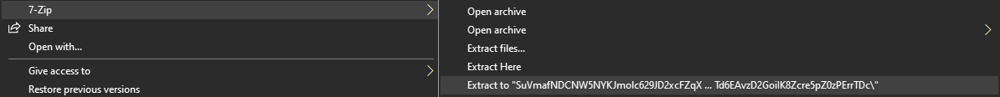
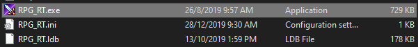

# Tải và chạy game

Tất cả các game Nobihaza đều sẽ hỗ trợ Windows, nên việc chạy game Nobihaza trên Windows sẽ dễ dàng nhất, và bạn sẽ không phải làm gì thêm nếu đã chuẩn bị trước ở phần [Điều kiện cơ bản](./prerequisities).

## Tải game xuống

Để tải xuống, bạn chỉ cần vào trang web và tải bản game xuống. Đó có thể là tệp tin nén (`.zip`, `.rar`, `.7z`) hoặc tệp tin `.exe`.

Nếu trang game có hỗ trợ nhiều phiên bản hệ điều hành, hãy lưu ý việc chọn cho phiên bản Windows của bạn (đặc biệt là `32-bit` và `64-bit`).

## Giải nén game

Khuyên dùng phần mềm giải nén bên ngoài như WinRAR hoặc 7-Zip (đã đề cập ở mục Điều kiện cơ bản) để giải nén game. Bạn nên giải nén bằng lệnh `Extract to` như ảnh bên dưới thay vì `Extract here`, vì có một số tệp tin nén không có thư mục lồng ghép nên khi giải nén bằng `Extract here` sẽ giải nén luôn các tệp tin vào chính thư mục đã tải xuống, làm khó khăn trong việc tìm kiếm.

{: .important }
> Tuyệt đối không chơi game trực tiếp trên tệp tin nén mà không giải nén ra, nếu không thì 99% khả năng là sẽ không lưu lại save khi đóng phần mềm giải nén!

## Bắt đầu chơi game

### RPG Maker 2000/2003

Đối với phần mềm làm game này thì sẽ có 2 cách chơi:

#### Chơi bằng `RPG_RT.exe`

* Mở thư mục game đã giải nén lên và nhấn đúp vào tệp tin `RPG_RT.exe` để chơi.

{: .note }
> Nếu thư mục game có các tệp tin khởi động `.exe` khác (như `start.exe` hay `play.exe`) thì bạn hãy thử khởi động game bằng các tệp tin đó trước. Hãy đọc tệp `README` của game (nếu có) để biết thêm thông tin về game và cách khởi động game đó.

* Nếu game đang ở chế độ toàn màn hình, bạn có thể nhấn `F4` để chuyển sang chế độ cửa sổ.

#### Chơi bằng phần mềm EasyRPG

* Mở lại thư mục chứa tệp tin `Player.exe` của EasyRPG đã tải từ mục Điều kiện cơ bản của hướng dẫn này.

* Sao chép tệp tin đó và dán vào thư mục game.
    * Nếu bạn đã sao chép tệp tin vào thư mục mẹ chứa thư mục của game thì bạn không cần phải làm bước này, thay vào đó hãy khởi động tệp `Player.exe` ở thư mục mẹ đó, và EasyRPG sẽ hiển thị một bảng chọn để bạn có thể chọn game.

* Cuối cùng là nhấn đúp vào tệp tin `Player.exe` để chơi.

{: .important }
> Bản dịch tiếng Việt của một số game Nobihaza sẽ không hỗ trợ EasyRPG, và bạn bắt buộc phải chơi bằng tệp `RPG_RT.exe`. Việc cố gắng chạy các bản dịch này có thể sẽ gây ra lỗi, tiêu biểu như là lỗi phông chữ và lỗi hiển thị hình ảnh.

### RPG Maker XP/VX/VX Ace

#### Chơi bằng tệp `Game.exe` (RGSS Player)

Bạn chỉ cần nhấn đúp vào tệp `Game.exe` (hoặc tệp khởi động khác đã được đề cập bởi mô tả của game hoặc tệp `README` nếu có).

#### Chơi bằng công cụ MKXP

* Một số game sẽ được tích hợp sẵn MKXP thay vì dùng RGSS Player. Nếu bạn khởi động tệp tin `Game.exe` mà thấy có biểu tượng hình bóng chứa Pokémon như hình bên dưới thì tức là game đang được chạy bằng MKXP.

* Nếu game không tích hợp sẵn nhưng bạn vẫn muốn chạy bằng MKXP, bạn có thể đọc [hướng dẫn này](./troubleshooting#ch%E1%BA%A1y-game-rpg-maker-xpvxvx-ace-b%E1%BA%B1ng-mkxp). Lưu ý là không phải game nào cũng sẽ tương thích.

### RPG Maker MV

Chỉ có một cách duy nhất là nhấn đúp vào tệp `Game.exe` (hoặc tệp khởi động khác đã được đề cập bởi mô tả của game hoặc tệp `README` nếu có).