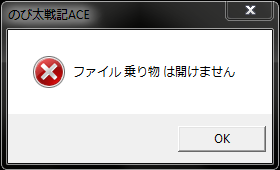
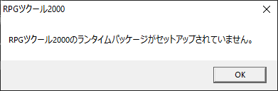
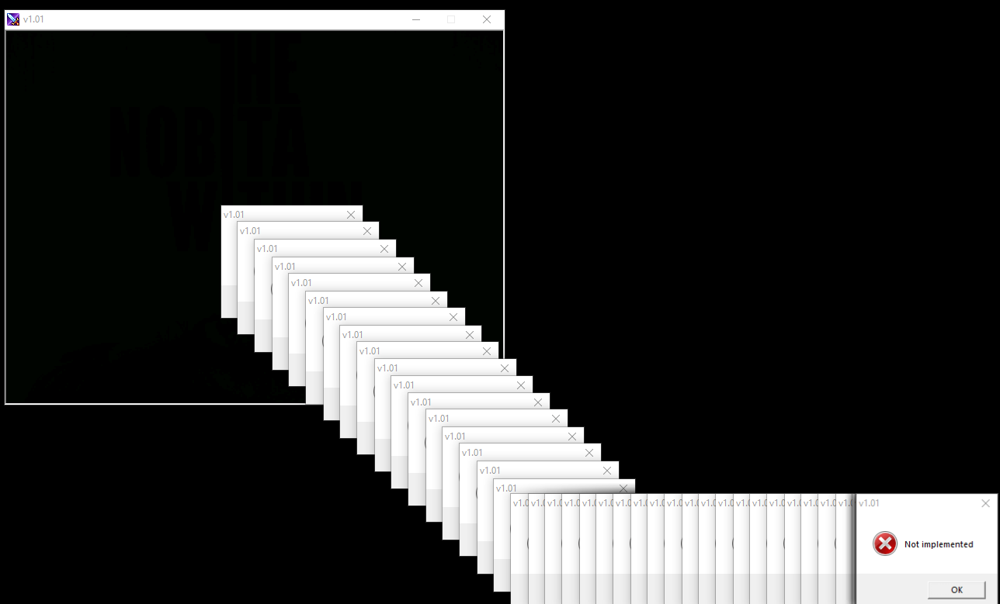
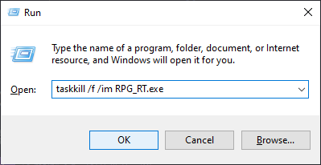
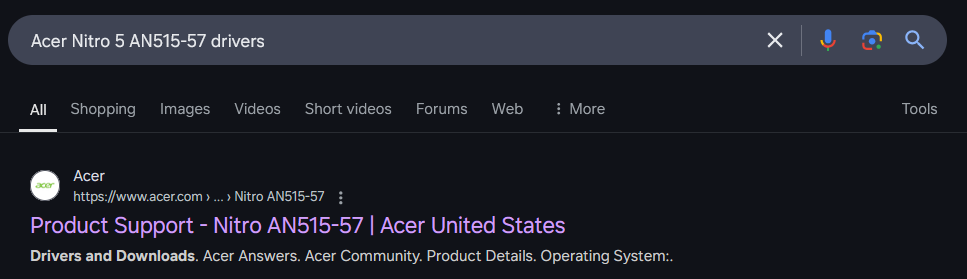
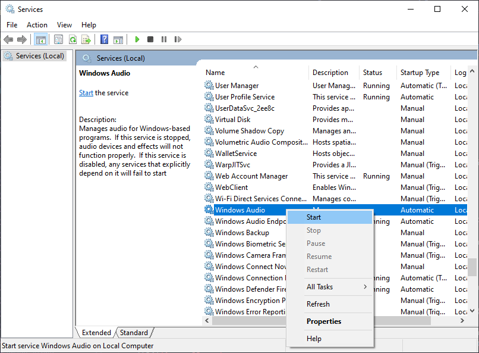
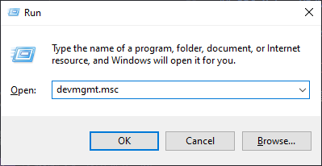
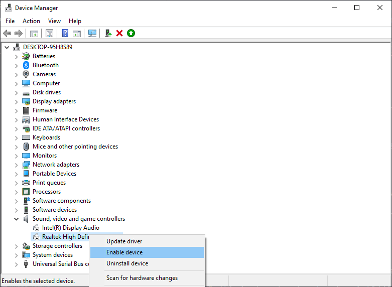
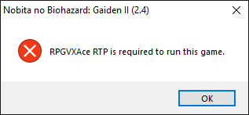

# Sửa lỗi và mẹo

Dưới đây là cách sửa những lỗi thường gặp khi chơi các game Nobihaza, và một số mẹo để có thể tối ưu hoá game trên Windows.

Phần này có sử dụng lại một số ảnh từ [hướng dẫn cũ năm 2018 của mình](https://gamerpgmakervn.blogspot.com/2018/07/huong-dan-fix-moi-loi-trong-game-rpg.html).

Chỉ nên báo cáo lỗi cho nhà phát triển của game nếu như đã làm hết tất cả hướng dẫn dưới đây mà vẫn chưa hết lỗi.

## RPG Maker 2000/2003 (`RPG_RT.exe`)

### `XXXX 乗り物 は開けません` (Không thể mở file XXXX) / `???????????????????` (một đống dấu hỏi chấm)



* Thường thì lỗi này là do bạn chưa chuyển vùng của máy thành Nhật Bản nên game sẽ không thể đọc được các tệp tin có tên tiếng Nhật.<br>Xem lại [Điều kiện cơ bản#Chuyển vùng của máy thành Nhật Bản](1.%20Điều%20kiện%20cơ%20bản.md#chuyển-vùng-của-máy-thành-nhật-bản).

* Cũng có thể là do tệp tin đó thực sự không có trong thư mục game. Thử giải nén lại tệp tin nén của game và kiểm tra xem có lỗi nào trong quá trình giải nén không.

### `RPGツクール2000/2003のランタイムパッケージがセットアップされていません。` (Gói khởi chạy của RPG Maker 2000/2003 chưa được cài đặt)



Xem lại [Điều kiện cơ bản#RPG Maker 2000/2003](1.%20Điều%20kiện%20cơ%20bản.md#rpg-maker-20002003).

### Một đống thông báo lỗi `Not implemented`



Lỗi này xảy ra nhiều nhất khi máy tính của bạn không có thiết bị âm thanh nào, và khi di chuột vào biểu tượng loa trên thanh Taskbar thì sẽ nhận được thông báo như thế này:


* Trước tiên thì bởi vì thông báo lỗi sẽ xuất hiện rất nhiều nên bạn cần tắt nóng `RPG_RT.exe` đi. Có thể dùng **Trình quản lý tác vụ** (Task Manager), hoặc nhấn tổ hợp `Windows + R` rồi nhập `taskkill /f /im RPG_RT.exe` và nhấn OK:



* Nếu bạn đang sử dụng máy tính để bàn (desktop), hãy cắm loa hoặc tai nghe bất kì vào trước. Nếu không còn dấu X màu đỏ ở biểu tượng loa dưới thanh Taskbar nữa thì tức là mọi thứ đã ổn.

* Kiểm tra lại trình điều khiển (driver) âm thanh trên máy tính của bạn. Cách nhanh nhất là tra tên máy tính (nếu dùng laptop hoặc máy tính đồng bộ) hoặc tên mainboard/soundcard (nếu là máy tính để bàn) để tải bản driver mới nhất.
    * Ví dụ như máy tính của mình là **Acer Nitro 5 AN515-57** thì mình sẽ tìm trên Google là **Acer Nitro 5 AN515-57 drivers**:<br>
    
    * Nhấn vào trang Support của hãng và nhấn vào tab **Drivers**. Lúc này danh sách các driver sẽ hiện ra:<br>
    
    * Chọn đúng hệ điều hành đang sử dụng, tìm đến driver Audio mới nhất (có ngày cập nhật gần nhất) và nhấn nút **Download**. Sau đó tiến hành cài đặt như các phần mềm khác.

* Có một số trường hợp hy hữu khác ít xảy ra hơn nhưng bạn cũng có thể kiểm tra:
    * Nhấn tổ hợp `Windows + R` để mở cửa sổ Run, nhập `services.msc` và nhấn OK.<br>
    
    * Kéo xuống đến phần **Windows Audio** và kiểm tra xem có chữ **Running** nào không. Nếu không thì nhấn chuột phải vào Windows Audio và nhấn **Start**:<br>
    
    * Lại nhấn tổ hợp `Windows + R`, nhập `devmgmt.msc` rồi nhấn OK.<br>
    
    * Kéo xuống và mở rộng phần **Sound, video and game controllers** lên. Nếu thấy thiết bị nào có dấu mũi tên ở biểu tượng thì bạn hãy nhấn chuột phải vào nó và chọn **Enable device**:<br>
    

* Sau khi đã làm xong tất cả những cách trên, hãy khởi động lại máy để xem đã sửa được lỗi chưa.

## RPG Maker 2000/2003 (EasyRPG)

Xem tại mục [EasyRPG](../6.%20EasyRPG.md).

```

## RPG Maker XP/VX/VX Ace

### `RPGVX/RPGVXAce RTP is required to run this game.` (Yêu cầu RPGVX/RPGVXAce RTP để chạy game này)



Xem lại [Điều kiện cơ bản#RPG Maker XP/VX/VX Ace](1.%20Điều%20kiện%20cơ%20bản.md#rpg-maker-xpvxvx-ace).

