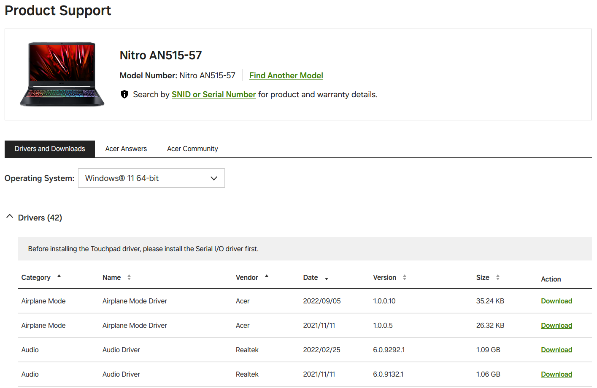
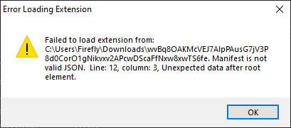
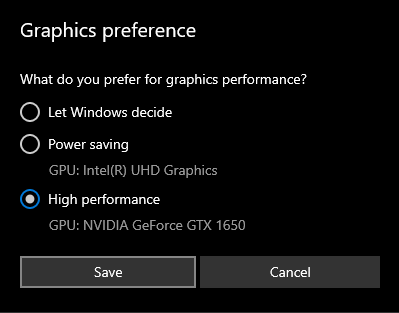

# Sửa lỗi và mẹo

Dưới đây là cách sửa những lỗi thường gặp khi chơi các game Nobihaza, và một số mẹo để có thể tối ưu hoá game trên Windows.

Phần này có sử dụng lại một số ảnh từ [hướng dẫn cũ năm 2018 của mình](https://gamerpgmakervn.blogspot.com/2018/07/huong-dan-fix-moi-loi-trong-game-rpg.html).

{: .important }
> Chỉ nên báo cáo lỗi cho nhà phát triển của game nếu như đã làm hết tất cả hướng dẫn dưới đây mà vẫn chưa hết lỗi.

## Chung

Phần này sẽ áp dụng cho tất cả các game mà không xét đến việc game đó được làm bằng phần mềm gì.

### Không thể lưu được tiến trình của game

Áp dụng cho cả 2 trường hợp: game báo lỗi khi lưu game và game không hiển thị tệp đã lưu khi khởi động lại game.

* Nếu bạn chưa giải nén game, hãy giải nén game ra một thư mục nào đó.

* Đảm bảo đường dẫn của game không chứa bất kì ký tự tiếng Việt có dấu nào (xem mục [`File corrupted! Please run a virus check / No game scripts specified`](#file-corrupted-please-run-a-virus-check--no-game-scripts-specified)).

* Đảm bảo bạn không để thư mục game trong một thư mục/ổ cứng không thể ghi tệp tin được (ví dụ như thẻ SD đang bị khoá ghi, hoặc ổ cứng/thư mục mà bạn không có quyền ghi, hoặc ổ cứng bị lỗi ghi tệp tin). Cách tốt nhất là bạn thử tạo một tệp bất kì trong thư mục game để kiểm tra thử khả năng ghi tệp tin, xem có thông báo lỗi hay yêu cầu cấp quyền gì không, nếu không thì thử di chuyển sang một ổ cứng khác.

* Game sẽ không hoạt động ổn định nếu như bạn để thư mục game trong một ổ cứng lưu trữ đám mây (một số phần mềm như TeraBox, Google Drive hay OneDrive sẽ hiển thị bộ nhớ đám mây của bạn như một ổ cứng).

Nếu các cách trên không thể sửa được lỗi của bạn, hãy báo cáo lỗi cho nhà phát triển.

### Game giật lag mặc dù đang sử dụng máy tính có cấu hình cao

* Nếu bạn đang sử dụng laptop, bạn nên cắm sạc vào trong quá trình chơi game.

* Tắt bớt các ứng dụng đang chạy, kể cả ứng dụng chạy ngầm. Nhấn vào nút mũi tên ở góc dưới bên phải Taskbar, nếu thấy phần mềm nào bạn không dùng nữa thì nhấn chuột phải vào biểu tượng của phần mềm đó và nhấn Exit/Thoát.


{: .caution }
> Không nên sử dụng **Task Manager** để tắt các ứng dụng nếu bạn không am hiểu về Windows, vì khả năng bạn tắt nhầm tiến trình của hệ thống sẽ rất cao!

* Hãy thử quét virus trên toàn bộ máy tính của bạn.

* [Hãy thử bật chế độ hiệu năng cao nhất](#b%E1%BA%ADt-ch%E1%BA%BF-%C4%91%E1%BB%99-hi%E1%BB%87u-n%C4%83ng-cao-nh%E1%BA%A5t-tr%C3%AAn-laptop).

* [Hãy thử nâng cấp driver GPU của bạn lên phiên bản mới nhất](#n%C3%A2ng-c%E1%BA%A5p-tr%C3%ACnh-%C4%91i%E1%BB%81u-khi%E1%BB%83n-card-%C4%91%E1%BB%93-ho%E1%BA%A1-driver-gpu).

* [Thử bắt buộc game sử dụng GPU rời của máy](#b%E1%BA%AFt-bu%E1%BB%99c-game-s%E1%BB%AD-d%E1%BB%A5ng-gpu-r%E1%BB%9Di-%E1%BB%9F-m%C3%A1y-c%C3%B3-2-gpu-card-%C4%91%E1%BB%93-ho%E1%BA%A1), nếu như máy bạn có cả GPU tích hợp và GPU rời.

Nếu game vẫn lag sau khi đã làm đủ cách trên:

* Game có thể vẫn chưa được tối ưu hoá tốt, bạn có thể liên hệ với nhà phát triển để sửa lỗi.

* Cũng có thể máy tính của bạn không có cấu hình cao như bạn nghĩ. Có một số trường hợp lừa đảo bán máy tính cấu hình thấp với giá cao, mình chỉ mong bạn sẽ không gặp phải trường hợp đó. Lúc này thì không còn cách nào khác, bạn bắt buộc phải nâng cấp hoặc đổi sang máy tính mới.

### Game bị lỗi hiển thị ô vuông/kí tự lạ

* Xem lại [Điều kiện cơ bản#Chuyển vùng của máy thành Nhật Bản](./prerequisities#chuyển-vùng-của-máy-thành-nhật-bản).

* Kiểm tra xem trong thư mục game có tệp tin font chữ (kết thúc bằng `.ttf`, `.otf` hay `.fon`) nào không, nếu có thì hãy cài đặt các font đó.

Nếu các cách trên không thể sửa được lỗi của bạn, hãy báo cáo lỗi cho nhà phát triển.

## RPG Maker 2000/2003 (`RPG_RT.exe`)

### `XXXX 乗り物 は開けません` (Không thể mở file XXXX) / `???????????????????` (một đống dấu hỏi chấm)


* Thường thì lỗi này là do bạn chưa chuyển vùng của máy thành Nhật Bản nên game sẽ không thể đọc được các tệp tin có tên tiếng Nhật.<br>Xem lại [Điều kiện cơ bản#Chuyển vùng của máy thành Nhật Bản](./prerequisities#chuyển-vùng-của-máy-thành-nhật-bản).

* Cũng có thể là do tệp tin đó thực sự không có trong thư mục game. Thử giải nén lại tệp tin nén của game và kiểm tra xem có lỗi nào trong quá trình giải nén không.

{: .note }
> Có một số trường hợp hiếm là do người dịch khi nén game bằng máy tính vẫn chưa để vùng là Nhật Bản, và sau khi nén thì tên của các tệp tin tài nguyên sẽ bị hỏng và chứa các kí tự vô nghĩa (hay còn được gọi là Mojibake).
>
> Lỗi này cũng sẽ khiến cho game không thể tìm được tệp tin tài nguyên. Bạn có thể xem chi tiết về lỗi này [ở đây](../../miscellaneous/mojibake).

### `RPGツクール2000/2003のランタイムパッケージがセットアップされていません。` (Gói khởi chạy của RPG Maker 2000/2003 chưa được cài đặt)


Xem lại [Điều kiện cơ bản#RPG Maker 2000/2003](./prerequisities#rpg-maker-20002003).

### Lỗi liên quan đến `RPG_RT.lmt`


Nếu đường dẫn trong thông báo có chứa dấu hỏi chấm (`?`), thì đường dẫn thư mục game của bạn đang chứa kí tự đặc biệt (kể cả tiếng Việt có dấu). Xem dấu `?` nằm ở (các) thư mục nào trong đường dẫn, và xoá **tất cả** kí tự đặc biệt trong thư mục đó.

### Một đống thông báo lỗi `Not implemented`


Lỗi này xảy ra nhiều nhất khi máy tính của bạn không có thiết bị âm thanh nào, và khi di chuột vào biểu tượng loa trên thanh Taskbar thì sẽ nhận được thông báo như thế này:


* Trước tiên thì bởi vì thông báo lỗi sẽ xuất hiện rất nhiều nên bạn cần tắt nóng `RPG_RT.exe` đi. Có thể dùng **Trình quản lý tác vụ** (Task Manager), hoặc nhấn tổ hợp `Windows + R` rồi nhập `taskkill /f /im RPG_RT.exe` và nhấn OK:


* Nếu bạn đang sử dụng máy tính để bàn (desktop), hãy cắm loa hoặc tai nghe bất kì vào trước. Nếu không còn dấu X màu đỏ ở biểu tượng loa dưới thanh Taskbar nữa thì tức là mọi thứ đã ổn.

* Kiểm tra lại trình điều khiển (driver) âm thanh trên máy tính của bạn. Cách nhanh nhất là tra tên máy tính (nếu dùng laptop hoặc máy tính đồng bộ) hoặc tên mainboard/soundcard (nếu là máy tính để bàn) để tải bản driver mới nhất.
    * Ví dụ như máy tính của mình là **Acer Nitro 5 AN515-57** thì mình sẽ tìm trên Google là **Acer Nitro 5 AN515-57 drivers**:<br>
    
    * Nhấn vào trang Support của hãng và nhấn vào tab **Drivers**. Lúc này danh sách các driver sẽ hiện ra:<br>
    
    * Chọn đúng hệ điều hành đang sử dụng, tìm đến driver Audio mới nhất (có ngày cập nhật gần nhất) và nhấn nút **Download**. Sau đó tiến hành cài đặt như các phần mềm khác.

* Có một số trường hợp hy hữu khác ít xảy ra hơn nhưng bạn cũng có thể kiểm tra:
    * Nhấn tổ hợp `Windows + R` để mở cửa sổ Run, nhập `services.msc` và nhấn OK.<br>
    
    * Kéo xuống đến phần **Windows Audio** và kiểm tra xem có chữ **Running** nào không. Nếu không thì nhấn chuột phải vào Windows Audio và nhấn **Start**:<br>
    
    * Lại nhấn tổ hợp `Windows + R`, nhập `devmgmt.msc` rồi nhấn OK.<br>
    
    * Kéo xuống và mở rộng phần **Sound, video and game controllers** lên. Nếu thấy thiết bị nào có dấu mũi tên ở biểu tượng thì bạn hãy nhấn chuột phải vào nó và chọn **Enable device**:<br>
    

* Sau khi đã làm xong tất cả những cách trên, hãy khởi động lại máy để xem đã sửa được lỗi chưa.

## RPG Maker 2000/2003 (EasyRPG)

Xem tại mục [EasyRPG](../../miscellaneous/easyrpg).

## RPG Maker XP/VX/VX Ace

### RPGVX/RPGVXAce RTP is required to run this game


Xem lại [Điều kiện cơ bản#RPG Maker XP/VX/VX Ace](./prerequisities#rpg-maker-xpvxvx-ace).

### RGSS202E.dll/RGSS202J.dll/RGSS300.dll/RGSS301.dll could not be found


* [Cài đặt lại toàn bộ gói khởi chạy (RTP) của RPG Maker VX Ace](./prerequisities#rpg-maker-xpvxvx-ace).

* Nếu cài đặt lại rồi nhưng vẫn không được, bạn cũng có thể [tải chay các tệp tin .dll đó](https://drive.google.com/file/d/1QTGjntOWisoUzk3NTfSBfk0bT2fNYBKc/view) và giải nén vào thư mục `System` của game.

### Failed to initialize DirectX audio


Cách sửa giống như lỗi [Not implemented của RPG Maker 2000/2003](#một-đống-thông-báo-lỗi-not-implemented).

### File corrupted! Please run a virus check / No game scripts specified


Trong thanh tiêu đề của thông báo lỗi sẽ ghi đường dẫn tệp tin bị lỗi.

* Nếu đường dẫn trong thông báo có chứa dấu hỏi chấm (`?`), thì đường dẫn thư mục game của bạn đang chứa kí tự đặc biệt (kể cả tiếng Việt có dấu). Xem dấu `?` nằm ở (các) thư mục nào trong đường dẫn, và xoá **tất cả** kí tự đặc biệt trong thư mục đó.

* Tệp tin đó cũng có thể bị lỗi trong quá trình giải nén, hãy thử giải nén lại tệp tin nén của game.

* Máy bạn đang thực sự bị nhiễm virus và làm lỗi tệp tin kể trên, hãy quét virus trên toàn bộ máy tính và tải lại game.

### Unable to find VL Gothic font.


Xem lại [Điều kiện cơ bản#Font VL Gothic](./prerequisities#font-vl-gothic).

### Script error


Không còn cách nào khác, bạn bắt buộc phải liên hệ với nhà phát triển để sửa lỗi này.

### Failed to load script


Bạn đã xoá nhầm tệp tin `Game.rgss3a` hoặc thư mục `Data` của game, hãy giải nén lại tệp tin nén của game và thử lại.

### Unable to find file / No such file or directory


Cách sửa giống như mục [`XXXX 乗り物 は開けません` (Không thể mở file XXXX) / `???????????????????` (một đống dấu hỏi chấm) của RPG Maker 2000/2003](#xxxx-乗り物-は開けません-không-thể-mở-file-xxxx---một-đống-dấu-hỏi-chấm).

### DirectDraw Error (`DDERR_UNSUPPORTED`)


* Xem lại [Điều kiện cơ bản#DirectX End-User Runtime](./prerequisities#directx-end-user-runtime).

* Phiên bản trình điều khiển (driver) của bạn đã quá cũ, xem mục [Nâng cấp trình điều khiển card đồ họa](#nâng-cấp-trình-điều-khiển-card-đồ-hoạ-driver-gpu).

* Card đồ họa của bạn đã quá cũ, hãy nâng cấp máy tính / thay card đồ họa mới (nếu đang sử dụng máy tính để bàn).

* Nếu vẫn chưa được, hãy thử các bước sau:
    * Nhấn chuột phải vào tệp tin `RPG_RT.exe` trong thư mục game, và nhấn vào mục **Properties**.
    * Nhấn vào tab **Compatibility**, sau đó tích vào tuỳ chọn **Run this program in compatibility mode**.
    * Chọn **Windows XP (Service Pack 3)** ở hộp tuỳ chọn bên dưới.
    
    

* Cũng có một số trường hợp hy hữu là do màn hình máy tính của bạn, hãy thử thay màn hình mới hoặc dây cáp kết nối / cổng kết nối.

### Có một đống ký tự linh tinh khi khởi động game


Cách sửa giống như lỗi [File corrupted! Please run a virus check / No game scripts specified](#file-corrupted-please-run-a-virus-check--no-game-scripts-specified).

### Error creating context/Failed to create GL context

{: .note }
> Lỗi này 100% sẽ xảy ra nếu bạn đang dùng máy đời cũ có cấu hình thấp (như Intel Celeron hoặc Intel Pentium). Tuy nhiên chỉ có một số ít game sử dụng MKXP là sẽ bị lỗi này.

* Phiên bản hệ điều hành của bạn đã quá cũ. Hãy đảm bảo bạn đã nâng cấp lên phiên bản mới nhất.

* Phiên bản trình điều khiển (driver) của bạn đã quá cũ, xem mục [Nâng cấp trình điều khiển card đồ họa](#nâng-cấp-trình-điều-khiển-card-đồ-họa-driver-gpu).

* Card đồ họa của bạn đã quá cũ, hãy nâng cấp máy tính / thay card đồ họa mới (nếu đang sử dụng máy tính để bàn).

### Màn hình game quá to so với màn hình máy tính


Lỗi này là do nhà phát triển đã chỉnh sửa độ phân giải game cao hơn so với độ phân giải máy tính của bạn (điển hình là các game được chạy bằng RGDirect, lớp tương thích này cũng sẽ không cho phép người chơi thay đổi kích cỡ của game).

* Tải phần mềm [ResizeEnable](http://www.digitallis.co.uk/pc/downloads/ResizeEnable.zip) và giải nén tệp tin vừa tải xuống. Sau đó chạy tệp `ResizeEnableRunner.exe`.


* Bạn sẽ thấy biểu tượng của ResizeEnable xuất hiện dưới thanh Taskbar.


* Khởi động lại game và bây giờ bạn đã có thể thoải mái thay đổi kích cỡ của game. Thu nhỏ màn hình game trước, sau đó nhấn vào cạnh của cửa sổ màn hình game để cho thanh tiêu đề của game xuống.

{: .important }
> Bạn sẽ cần phải làm các bước này mỗi lần khởi động game. Nếu bạn không thể thay đổi kích cỡ cửa sổ game, hãy nhấn vào biểu tượng của ResizeEnable ở dưới Taskbar rồi thay đổi lại một lần nữa.

* Để tắt ResizeEnable, nhấn chuột phải vào biểu tượng của ResizeEnable ở dưới Taskbar và nhấn **Quit**.


## RPG Maker MV/MZ

### Your browser does not support WebGL


* Phiên bản hệ điều hành của bạn đã quá cũ. Hãy đảm bảo bạn đã nâng cấp lên phiên bản mới nhất.

* Phiên bản trình điều khiển (driver) của bạn đã quá cũ, xem mục [Nâng cấp trình điều khiển card đồ họa](#nâng-cấp-trình-điều-khiển-card-đồ-họa-driver-gpu).

* Card đồ họa của bạn đã quá cũ, hãy nâng cấp máy tính / thay card đồ họa mới (nếu đang sử dụng máy tính để bàn).

### Loading Error (`Failed to load`)

Cách sửa giống như mục [`XXXX 乗り物 は開けません` (Không thể mở file XXXX) / `???????????????????` (một đống dấu hỏi chấm) của RPG Maker 2000/2003](#xxxx-乗り物-は開けません-không-thể-mở-file-xxxx---một-đống-dấu-hỏi-chấm).

Tuy nhiên có một số trường hợp hy hữu là do lỗi của NW.js, hãy tham khảo thêm cả mục [Nâng cấp phiên bản NW.js](#nâng-cấp-phiên-bản-nwjs-cho-rpg-maker-mv).

### (Script) Error


Bạn bắt buộc phải liên hệ với nhà phát triển về lỗi này.

### Failed to load: `data/Actors.json`


Bạn đang cố gắng chạy tệp tin `index.html` của game trên trình duyệt.

* Hãy chạy tệp tin `Game.exe` thay vào đó.

* Nếu bạn vẫn muốn chạy game trên trình duyệt, hãy sử dụng một máy chủ web nội bộ (local web server) và cho thư mục game có chứa tệp `index.html` vào đó. Sau đó, hãy nhập địa chỉ của tệp `index.html` **trong máy chủ web nội bộ** thay vì chạy thẳng tệp tin `index.html`. Xem mục [Chạy game RPG Maker MV trên trình duyệt](#chạy-game-rpg-maker-mv-trên-trình-duyệt) để tìm hiểu rõ hơn.

### Your profile can not be used because it is from a newer version of NW.js


Có một số game/ứng dụng đang dùng phiên bản NW.js mới hơn, và game bạn đang chạy sử dụng phiên bản NW.js cũ hơn nên mới xảy ra lỗi xung đột này.

Bạn có thể hoàn toàn bỏ qua lỗi này và tiếp tục chơi mà không ảnh hưởng gì thêm tới trải nghiệm, nhưng nếu bạn muốn sửa lỗi này triệt để thì:

* Nâng cấp **toàn bộ** game RPG Maker MV (và ứng dụng NW.js khác nếu có) trong máy bạn lên cùng một phiên bản NW.js. Xem mục [Nâng cấp phiên bản NW.js](#nâng-cấp-phiên-bản-nwjs-cho-rpg-maker-mv) để biết thêm chi tiết.

* Nhấn tổ hợp `Windows + R` để mở cửa sổ Run, sau đó nhập `%localappdata%` và nhấn OK.

* Xoá thư mục `nwjs` trong cửa sổ vừa mở.


* Cuối cùng là khởi động lại game.

### Your file was not found


Bạn đã xoá nhầm tệp tin `index.html` của game, hãy giải nén lại game từ tệp tin nén và thử lại.

### `Required value 'name' is missing or invalid`


Lỗi này thường xảy ra với một số game sử dụng phiên bản NW.js mới hơn.

* Mở tệp tin `package.json` trong thư mục game bằng bất kì trình soạn thảo văn bản nào.

* Thêm chữ `Game` vào trong dấu ngoặc kép sau từ `name` ở dòng 2 như ảnh bên dưới:


* Lưu lại tệp tin `package.json` và khởi động lại game.

### Failed to load extension from XXXX (lỗi khác với bên trên)



Tệp tin `package.json` của game đang bị lỗi, hãy thử:

* Giải nén lại game từ tệp tin nén và thử lại.

* Tự sửa lỗi trong tệp tin `package.json` nếu như bạn có am hiểu về ngôn ngữ JSON và Node.js.

* Báo cáo lỗi này cho nhà phát triển.

### Game sử dụng quá nhiều RAM (trên 4 GB) khi vừa mới khởi động game

Cái này có một cái tên thân thuộc hơn với dân công nghệ là **memory leak** (tràn bộ nhớ). Tuy trường hợp này hiếm gặp nhưng vẫn có máy gặp phải, kể cả máy của mình.

* Thử tải một phiên bản khác của NW.js về và làm theo mục [Nâng cấp phiên bản NW.js](#nâng-cấp-phiên-bản-nwjs-cho-rpg-maker-mv).

* Nếu đang sử dụng phiên bản `32-bit` trên máy `64-bit`, bạn cũng có thể tải bản `64-bit` của NW.js về và làm như mục trên.

### Game bị crash trong quá trình chơi

Có rất nhiều lý do khiến game bị crash do quá trình chơi:

* Lỗi thường gặp nhất là do game sử dụng quá nhiều RAM nên vượt quá giới hạn 4GB RAM của bản `32-bit`.
    * Nếu bạn đang sử dụng Windows phiên bản `64-bit`, bạn có thể tải bản `64-bit` của NW.js về để bỏ giới hạn 4GB RAM của bản `32-bit`.
    * Bạn cũng có thể dùng **Trình quản lý tác vụ** (Task Manager) để kiểm tra mức sử dụng RAM của máy tính. Nếu thấy máy tính đang tiêu tốn quá nhiều RAM khi chơi game, hãy xét tới việc tắt bớt phần mềm chạy ngầm, bật RAM ảo hoặc nâng cấp RAM cho máy tính.

* Game đang gặp trường hợp tương tự như mục **Game sử dụng quá nhiều RAM (trên 4 GB) khi vừa mới khởi động game** ở bên trên.

* Game cũng có thể đang gặp lỗi lập trình nghiêm trọng, bạn có thể báo cáo với nhà phát triển game về sự cố này.

### `require is not defined`


Lỗi này thường chỉ xảy ra khi bạn chơi game trên trình duyệt, còn lại thì rất hiếm khi xảy ra ở các trường hợp khác.

* Nếu bạn đang cố gắng chơi trên trình duyệt và gặp lỗi này thì không còn cách nào khác, bạn chỉ có thể quay lại chơi bằng tệp `Game.exe`.

* Còn nếu bạn đang chơi bằng tệp `Game.exe` mà vẫn gặp lỗi này (trường hợp cực hiếm) thì bạn có thể [nâng cấp phiên bản NW.js](#nâng-cấp-phiên-bản-nwjs-cho-rpg-maker-mv).

## Mẹo dành cho Windows

### Bật chế độ hiệu năng cao nhất trên laptop

**Lưu ý:** Cách này sẽ làm tăng một phần hiệu năng trên máy tính của bạn, nhưng đổi lại thì pin máy tính của bạn sẽ hết nhanh hơn và máy cũng sẽ nóng hơn.

* Mở `Dấu nhắc lệnh` (Command Prompt) dưới quyền quản trị. Bạn cũng có thể nhấn tổ hợp `Windows + S` và nhập chữ `Command Prompt`:


* Ở Windows 10 trở lên thì bạn sẽ thấy luôn nút **Run as administrator**, nhưng với Windows 7 trở xuống thì bạn cần nhấn chuột phải vào tên Command Prompt và chọn **Run as administrator**.

* Sao chép dòng chữ sau và dán vào cửa sổ Command Prompt mới mở:

```bat
powercfg -duplicatescheme e9a42b02-d5df-448d-aa00-03f14749eb61
```

* Nhấn nút Enter để chạy lệnh, thấy màn hình hiển thị như thế này là thành công.


* Tìm kiểm từ khoá `Choose a power plan` trên thanh tìm kiếm của Windows và nhấn vào nó.


* Cuối cùng là chọn **Ultimate Performance** trong danh sách là xong.


### Bắt buộc game sử dụng GPU rời ở máy có 2 GPU (card đồ hoạ)

Trường hợp này hay gặp nhất ở một số game cũ trên máy có 2 GPU (nhất là laptop). "2 GPU" ở đây tức là máy bạn có cả GPU tích hợp và GPU rời.

Các game cũ thường sẽ gặp lỗi sử dụng GPU tích hợp thay vì GPU rời, và thế là trải nghiệm chơi game bị giảm.

* Mở thanh tìm kiếm của Windows (`Windows + S`) và nhập `Graphics settings`. Nhấn luôn vào mục **Graphics settings** đó.


* Nhấn vào nút **Browse** trong mục **Graphics performance preference**.


* Trỏ tới thư mục của game và chọn tệp `Game.exe`.


* Một mục mới với đường dẫn game bạn đã chọn sẽ xuất hiện. Nhấn vào nút **Options** của mục đó.


* Chọn tuỳ chọn **High performance** và sau đó nhấn **Save**.



### Nâng cấp trình điều khiển card đồ hoạ (driver GPU)

#### Nhận diện GPU

* Nhấn tổ hợp `Windows + R` để mở cửa sổ Run, nhập `dxdiag` và nhấn OK.


* Cửa sổ **DirectX Diagnostic Tool** hiện lên, sau đó qua từng tab **Display** một (hoặc tab **Render** nếu có). Ghi lại **toàn bộ tên của các GPU** trong mục Name của từng tab.
    * Nếu ghi là **Intel(R) HD Graphics** hoặc **Intel(R) UHD Graphics**, thì máy đang sử dụng card đồ hoạ tích hợp theo CPU.
    * Nếu ghi là **NVIDIA** thì máy đang sử dụng card đồ hoạ rời của NVIDIA.
    * Nếu ghi là **AMD** thì máy đang sử dụng card đồ hoạ của AMD. Card của AMD có thể là card tích hợp, card rời hoặc cả hai, nhưng cách cài đặt cho cả hai loại card của AMD sẽ giống nhau.


**Máy có bao nhiêu card đồ hoạ thì phải cập nhật bấy nhiêu driver!**

#### Đối với GPU của Intel

* Đầu tiên là qua phần **System** của **DirectX Diagnostic Tool**. Phần **Processor** sẽ là mã CPU mà máy đang có, và hãy ghi nhớ lấy mã này (có thể rút gọn tên CPU thay vì phải ghi tất cả, ví dụ như ở bên dưới thì có thể rút gọn thành i5-11400H).


* Tìm kiếm CPU của mình ở trên Google, và nhấn vào kết quả tìm kiếm của trang **intel.com**.


* Chuyển qua mục **Downloads** ở website của Intel.


* Nhấn tải xuống mục driver có chữ **Graphics** dành cho Windows.


* Sau khi tải xong thì chạy file .exe đã tải xuống, và bắt đầu cập nhật driver.


* Trong mục **The installer will install the following components**, nhấn vào nút **Customize**.


* Bỏ hết tất cả mục trừ **Intel(R) Graphics Driver**, rồi nhấn **Start**.


* Đợi cho driver được cập nhật xong thì khởi động lại, và thế là đã cập nhật driver của Intel thành công.

#### Đối với GPU rời của NVIDIA

* Vào [trang tải xuống driver của NVIDIA](https://www.nvidia.com/download/index.aspx).

* Chọn loại driver phù hợp với card đồ hoạ của mình.
    * **Product Type** sẽ là loại card đồ hoạ. Nếu tên card có chữ **GeForce** thì chọn **GeForce**, còn nếu có chữ **RTX** thì chọn **NVIDIA RTX / Quadro**.
    * **Product Series** thì chọn theo tên của card đồ hoạ của mình (tên card có chữ nào thì chọn mục đó, và **nếu dùng laptop thì chọn mục có cả chữ Notebooks**). Ví dụ như của mình là GTX 1650 trên laptop thì chọn **GeForce GTX 16 Series (Notebooks)**.
    * **Product** thì chọn đúng theo tên card của máy.
    * **Operating System** thì chắc không cần phải giải thích rồi. Ở đây chọn **Windows 10 64-bit**, dùng Windows 11 cũng chọn mục **Windows 10**.
    * **Download Type** thì sẽ chọn tuỳ vào mục đích sử dụng của mình. Nếu thiên về các phần mềm edit và không chơi game quá nhiều thì chọn **Studio Driver**, còn thiên về chơi game thì chọn **Game Ready Driver (GRD)**. Một số card sẽ chỉ có mục **Game Ready Driver**, khi đó thì chọn mục này bất kể mục đích sử dụng có là gì.

* Sau khi chọn xong thì nhấn vào mục **Search**.


* Nhấn vào nút **Download** để tải xuống driver cho card đồ hoạ NVIDIA.


* Sau khi tải xong thì chạy file `.exe` đã tải để cài đặt. Chọn mục thứ 2 (`NVIDIA Graphics Driver`) để không cài GeForce Experience/NVIDIA App.


* Sau khi cài đặt xong thì khởi động lại máy, và driver card đồ hoạ của NVIDIA đã được cập nhật lên phiên bản mới nhất.

#### Đối với GPU của AMD

Do mình không sử dụng máy nào có GPU AMD nên mình sẽ không thể hướng dẫn kĩ được.

* Vào [trang tải xuống driver của AMD](https://www.amd.com/en/support/download/drivers.html).

* Nhấn vào nút **Download Windows Drivers** để tải xuống driver dành cho Windows:


* Sau khi tải xong thì chạy file `.exe` và tiến hành cài đặt như bình thường.


* Sau khi cài đặt xong và khởi động lại thì driver card đồ hoạ của AMD đã được cập nhật lên phiên bản mới nhất.

### Chạy game RPG Maker XP/VX/VX Ace bằng MKXP

{: .caution }
> - Không phải game nào cũng sẽ tương thích với MKXP. Hãy chuẩn bị cho việc game bạn muốn chơi có thể sẽ không chơi được bằng phần mềm này.
> - Chỉ hỗ trợ RPG Maker XP/VX/VX Ace. Các phần mềm làm game khác sẽ không được hỗ trợ.

#### Phiên bản mới nhất (sử dụng Ruby 3.1.0)

* Vào [trang này](https://nbhzvn.one/tools/MKXP/mkxp-z-windows.zip) để tải MKXP bản 3.1.0 cho Windows.

* Giải nén tệp tin `mkxp-z-windows.zip` vừa mới tải xuống.

* Copy **toàn bộ tệp tin** trong thư mục `mkxp-z-windows` vào thư mục game.


* Nhấn đúp vào tệp tin `mkxp-z.exe` để khởi động game thông qua MKXP. Làm tương tự với các game khác mà bạn muốn chơi.

#### Phiên bản cũ hơn (sử dụng Ruby 1.9.2)

Phiên bản này sẽ có ít tính năng hơn, nhưng sẽ tương thích hơn với các game cũ. Bạn cũng có thể thử phiên bản này nếu phiên bản trên kia không chơi được.

* Vào [trang này](https://nbhzvn.one/tools/MKXP/mkxp-z-zeta-1.3.0.zip) để tải MKXP bản 1.3.0 (sử dụng Ruby 1.9.2) cho Windows.

* Làm tương tự với phiên bản trên, và nhấn đúp vào tệp tin `Zeta.exe` để chạy.

### Nâng cấp phiên bản NW.js cho RPG Maker MV

#### Tải xuống cho Windows 10/11

* Truy cập [trang chủ chính thức của NW.js](https://nwjs.io).

* Nhấn vào nút **Normal** ở bên trái để tải NW.js bản thường.


#### Tải xuống cho Windows 8.1 trở xuống

Do bản mới nhất không còn hỗ trợ Windows 8.1 trở xuống nữa, nên bạn cần tải phiên bản cũ hơn cho các phiên bản hệ điều hành này.

Bạn có thể tải bản NW.js 0.72.0 dành cho [Windows 32-bit](https://dl.nwjs.io/v0.72.0/nwjs-v0.72.0-win-ia32.zip) và [Windows 64-bit](https://dl.nwjs.io/v0.72.0/nwjs-v0.72.0-win-x64.zip).

#### Cài đặt

* Giải nén tệp tin `.zip` mà bạn vừa tải xuống.

* Sao chép toàn bộ tệp tin (có cả tệp tin `nw.exe`) vào thư mục game có chứa tệp tin `Game.exe`. Nếu có hộp thoại **Replace and Skip Files**, bạn hãy nhấn **Replace the files in the destination** để thay thế các tệp tin NW.js cũ.


* Xoá tệp tin `Game.exe` cũ đi, và đổi tên tệp `nw.exe` thành `Game.exe`.


* Nếu bạn gặp lỗi `Required value 'name' is missing or invalid` khi chạy NW.js bản mới thì mình đã có đề cập [ở đây](#required-value-name-is-missing-or-invalid) rồi.

### Chạy game RPG Maker MV trên trình duyệt

Bạn có thể chạy game trên trình duyệt nếu như `Game.exe` của bạn không hoạt động hoặc có hiệu năng kém.

{: .caution }
> Không phải game nào cũng sẽ chạy được bằng cách này. Nếu bạn gặp lỗi khi chơi phiên bản trình duyệt, bạn bắt buộc phải quay lại chơi bằng tệp `Game.exe`.

* Vào trang GitHub để tải công cụ **Simple HTTP Server** [tại đây](https://github.com/TheWaWaR/simple-http-server/releases), sau đó chọn tệp `x86_64-pc-windows-msvc-simple-http-server.exe`.


* Sao chép tệp tin `x86_64-pc-windows-msvc-simple-http-server.exe` vừa mới tải xuống vào thư mục `www` của game (hoặc thư mục chính của game nếu không thấy thư mục `www`).

{: .note }
> Bạn có thể đổi tên tệp tin `.exe` kia thành tên dễ nhớ hơn.


* Chạy tệp tin vừa mới sao chép, cho đến khi nó hiện ra cửa sổ như thế này. Không tắt cửa sổ này trong quá trình chơi.


* Nếu có thông báo yêu cầu cho phép truy cập như ảnh bên dưới, hãy nhấn vào **Cho phép truy cập** (Allow access).


* Sao chép địa chỉ ở phần **Address** của cửa sổ đó, như ảnh bên trên là `http://0.0.0.0:8000` và dán vào trình duyệt. Giao diện như thế này sẽ xuất hiện thì bạn nhấn vào tệp tin `index.html`.


* Game sẽ được khởi động và giờ bạn chỉ cần cầu nguyện là màn hình chính của game sẽ hiện lên. Khi bạn không chơi game nữa thì có thể tắt cửa sổ đi.

{: .caution }
> Firefox có thể sẽ bị treo ở màn hình Now Loading khi chơi game trên trình duyệt này, bạn có thể cấp quyền tự động phát âm thanh (Autoplay Audio) và tắt tính năng chặn theo dõi (Tracking Prevention) để giảm thiểu tình trạng này (nhưng cũng không đảm bảo là sẽ có thể sửa được hoàn toàn).

### Thay đổi âm lượng cho từng ứng dụng

Bạn có thể thay đổi âm lượng cho toàn bộ ứng dụng đang chạy trên máy tính.

* Chạy game bạn muốn thay đổi âm lượng.

* Nhấn chuột phải vào biểu tượng loa ở thanh Taskbar và chọn **Open Volume mixer**.

{: .note }
> Một số máy (đặc biệt là Windows 11) sẽ không hiển thị tuỳ chọn Volume mixer, lúc đó bạn hãy tìm kiếm từ khoá **Volume mixer** trên thanh tìm kiếm của Windows.


* Chỉnh thanh âm lượng của game trong cửa sổ Volume mixer, và cài đặt âm lượng này sẽ được áp dụng ngay cả khi bạn đã khởi động lại game. Nếu bạn muốn thay đổi lại âm lượng, bạn chỉ cần chỉnh lại thanh âm lượng đó là được.

{: .note }
> Một số game sẽ hiển thị tên khác (ví dụ như `Game` hoặc `nwjs`), nhưng bạn vẫn có thể chỉnh âm lượng của các ứng dụng này để chỉnh âm lượng cho game.<br>Cũng sẽ có một số game nhất định mà bạn phải chỉnh 2 ứng dụng khác nhau.

{: .note }
> Nếu bạn thay đổi thiết bị nghe của Windows (từ loa ngoài sang tai nghe, hoặc kết nối tai nghe Bluetooth), bạn cần chỉnh lại tuỳ chọn này; vì cài đặt âm lượng của mỗi thiết bị sẽ khác nhau.

