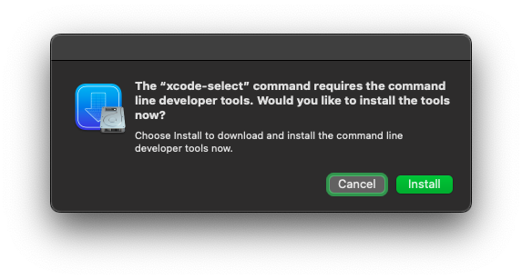

# Điều kiện cơ bản

Tính đến thời điểm hiện tại thì ngoại trừ [Nobihaza 2 Remake bản Tiếng Việt](https://nobi2.s1432.org) ra, thì **không có game nào khác** có thể chạy trực tiếp trên macOS mà không cần phải qua các bước rườm rà cả.

* Bạn **bắt buộc** phải làm hết tất cả các bước trong hướng dẫn này để đảm bảo quá trình chơi game sẽ ít trục trặc nhất có thể.

* Tuy nhiên, bạn cũng có thể cài đặt máy ảo chạy Windows, hoặc dùng BootCamp để cài Windows lên máy Mac của bạn; và sau đó [áp dụng các hướng dẫn dành cho Windows](../1.%20Windows). Tuy nhiên việc này vượt quá phạm vi hướng dẫn về Nobihaza của mình nên mình sẽ không hướng dẫn ở đây.<br>Hướng dẫn này chỉ dành cho những người muốn chạy game **trực tiếp** trên macOS thông qua các công cụ hỗ trợ.

## Cấu hình máy tính

Trước khi làm theo hướng dẫn này, hãy đảm bảo thiết bị của bạn đang ở **macOS 10.15** (Catalina) trở lên. Điều đó đồng nghĩa với việc máy Mac của bạn phải là một trong những máy sau:

* iMac đời 2012 hoặc cao hơn
* iMac Pro đời 2017
* MacBook đời 2015 hoặc cao hơn
* MacBook Air đời 2012 hoặc cao hơn
* MacBook Pro đời 2012 hoặc cao hơn
* Mac Mini đời 2012 hoặc cao hơn
* Mac Pro đời 2013 hoặc cao hơn

Máy bạn cũng cần có ít nhất 4GB RAM trở lên.

## Cài đặt ban đầu

### Vô hiệu hoá Gatekeeper

**Gatekeeper** là một tính năng của macOS giúp ngăn chặn các ứng dụng bên thứ ba mà không được xác minh bởi Apple (nói đúng hơn là chưa mua chứng chỉ giá 99$/năm của Apple). Tuy nhiên có một số game và công cụ hỗ trợ sẽ không thể chạy được nếu không tắt Gatekeeper đi.

Điều này cũng làm giảm độ bảo mật của macOS, nhưng không còn cách nào khác.

* Mở ứng dụng **Terminal** và nhập dòng lệnh sau:

```sh
sudo spctl --master-disable
```

* Nhập mật khẩu macOS của bạn nếu như được yêu cầu và nhấn Enter.


* Bạn có thể vào phần **System Preferences** -> **Security & Privacy** -> **General**, nếu như trong mục **Allow apps downloaded from** có thêm mục **Anywhere** thì tức là bạn đã tắt Gatekeeper thành công.

### Cài đặt Homebrew

**Homebrew** sẽ rất cần thiết để bạn có thể cài đặt các công cụ hỗ trợ chạy game Windows trên macOS.

* Vào [trang web chính thức của Homebrew](https://brew.sh).

* Nhấn vào nút sao chép ở bên phải dòng lệnh để sao chép dòng lệnh vào bộ nhớ đệm.



* Mở ứng dụng **Terminal** và dán dòng lệnh vừa sao chép vào Terminal. Nhập mật khẩu và nhấn Enter để xác nhận cài đặt Homebrew:


* Đợi cho quá trình cài đặt hoàn tất.

### The Unarchiver

Mặc dù trình giải nén mặc định của macOS thông minh hơn rất nhiều so với bên Windows, nhưng nó vẫn không thể giải nén được một số định dạng tệp tin nén, nên bạn vẫn nên tải phần mềm giải nén từ bên ngoài.

* [Tải xuống The Unarchiver](https://dl.devmate.com/com.macpaw.site.theunarchiver/TheUnarchiver.dmg), sau đó mở tệp tin `TheUnarchiver.dmg` đã tải xuống.

* Kéo mục `The Unarchiver.app` vào thư mục `Applications` của macOS.


* Mở ứng dụng **The Unarchiver** bằng Launchpad hoặc ở thư mục `Applications`.


* Nhấn vào nút **Select All** trong cửa sổ của The Unarchiver và tắt cửa sổ đi.


* Giờ đây, The Unarchiver sẽ thay thế trình giải nén mặc định của macOS để giải nén các tệp tin.

## Wine và Kegworks

*(Nếu bạn không có ý định chạy bất kì game nào được làm bằng RPG Maker VX Ace trở xuống trên macOS, bạn có thể bỏ qua bước này.)*

**Wine** (viết tắt của **Wine Is Not Emulator**) là một lớp tương thích để chạy ứng dụng Windows trên các hệ điều hành khác, còn **Kegworks** là ứng dụng để hỗ trợ chạy Wine được dễ dàng hơn trên macOS.

* Mở Terminal và nhập dòng lệnh sau để cài **Kegworks**.

```sh
brew upgrade
brew install --cask --no-quarantine Kegworks-App/kegworks/kegworks
```

Quá trình cài đặt có thể sẽ mất khá nhiều thời gian, bạn hãy kiên nhẫn đợi cho đến khi quá trình cài đặt hoàn tất.

