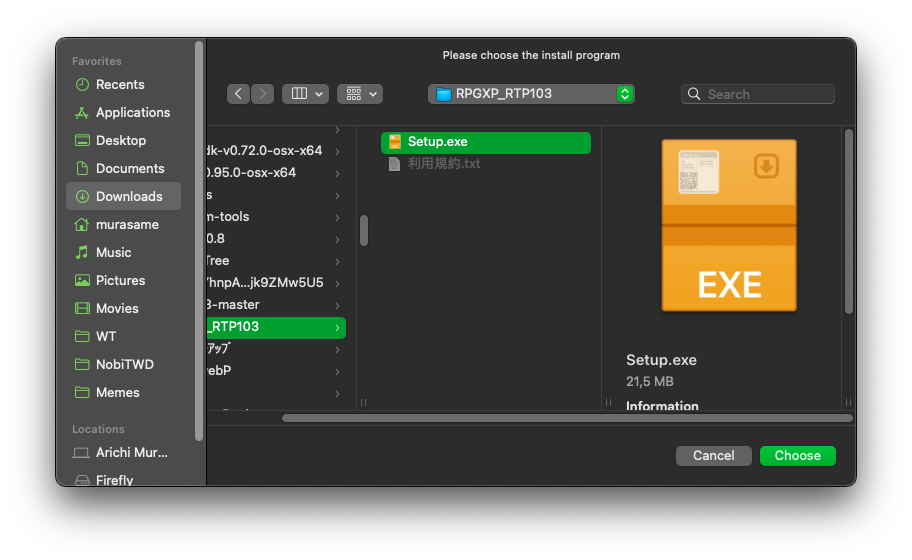

# Điều kiện cơ bản

> [!IMPORTANT]
> Hiện tại chỉ có [**Doraemon: Nobita's Resident Evil 2 (Việt Hoá)**](https://nobi2.s1432.org) là hỗ trợ chính thức cho macOS, bạn có thể tải và chơi luôn mà không cần phải qua những bước rườm rà này.
>
> Ngoài game đó ra thì bạn cần có công cụ hỗ trợ để có thể chơi game:
> * **RPG Maker 2000/2003:** Sử dụng Wine hoặc EasyRPG (hỗ trợ chính thức cho macOS).
> * **RPG Maker XP/VX/VX Ace:** Sử dụng Wine hoặc MKXP (hỗ trợ chính thức cho macOS, nhưng khả năng tương thích rất thấp).
> * **RPG Maker MV/MZ:** Sử dụng NW.js (đa số game đều sẽ hỗ trợ chạy trên macOS, ngoại trừ một số game sẽ được liệt kê ở bên dưới).

> [!IMPORTANT]
> Bạn **bắt buộc** phải đọc kĩ hướng dẫn này để đảm bảo quá trình chơi game sẽ ít trục trặc nhất có thể.

> [!IMPORTANT]
> **Không phải game Windows nào cũng sẽ có thể chạy được trên macOS**. Nếu bạn gặp lỗi khi chạy game thì không còn cách nào khác, bạn bắt buộc phải liên hệ với nhà phát triển để yêu cầu một bản chính thức cho macOS.

> [!CAUTION]
> Các cách này có thể không hoạt động đối với những máy Mac chạy CPU **Apple silicon** (M1 trở lên). Mình thì không có máy Mac dạng này nên mình không thể hướng dẫn chi tiết được.

> [!NOTE]
> Bạn cũng có thể cài đặt máy ảo chạy Windows, hoặc dùng BootCamp để cài Windows lên máy Mac của bạn; và sau đó [áp dụng các hướng dẫn dành cho Windows](../1.%20Windows).<br>Tuy nhiên việc này vượt quá phạm vi hướng dẫn về Nobihaza của mình nên mình sẽ không hướng dẫn ở đây.<br><br>Hướng dẫn này chỉ dành cho những người muốn chạy game **trực tiếp** trên macOS thông qua các công cụ hỗ trợ.

## Cấu hình máy tính

Trước khi làm theo hướng dẫn này, hãy đảm bảo thiết bị của bạn đang ở **macOS 10.15** (Catalina) trở lên. Điều đó đồng nghĩa với việc máy Mac của bạn phải là một trong những máy sau:

* iMac đời 2012 hoặc cao hơn
* iMac Pro đời 2017
* MacBook đời 2015 hoặc cao hơn
* MacBook Air đời 2012 hoặc cao hơn
* MacBook Pro đời 2012 hoặc cao hơn
* Mac Mini đời 2012 hoặc cao hơn
* Mac Pro đời 2013 hoặc cao hơn

Máy bạn cũng cần có ít nhất 4GB RAM trở lên.

## Cài đặt ban đầu

### Vô hiệu hoá Gatekeeper

**Gatekeeper** là một tính năng của macOS giúp ngăn chặn các ứng dụng bên thứ ba mà không được xác minh bởi Apple (nói đúng hơn là chưa mua chứng chỉ giá 99$/năm của Apple). Tuy nhiên có một số game và công cụ hỗ trợ sẽ không thể chạy được nếu không tắt Gatekeeper đi.

Điều này cũng làm giảm độ bảo mật của macOS, nhưng không còn cách nào khác.

* Mở ứng dụng **Terminal** và nhập dòng lệnh sau:

```sh
sudo spctl --master-disable
```

* Nhập mật khẩu macOS của bạn nếu như được yêu cầu và nhấn Enter.


* Bạn có thể vào phần **System Preferences** -> **Security & Privacy** -> **General**, nếu như trong mục **Allow apps downloaded from** có thêm mục **Anywhere** thì tức là bạn đã tắt Gatekeeper thành công.

### The Unarchiver

Mặc dù trình giải nén mặc định của macOS thông minh hơn rất nhiều so với bên Windows, nhưng nó vẫn không thể giải nén được một số định dạng tệp tin nén, nên bạn vẫn nên tải phần mềm giải nén từ bên ngoài.

* [Tải xuống The Unarchiver](https://dl.devmate.com/com.macpaw.site.theunarchiver/TheUnarchiver.dmg), sau đó mở tệp tin `TheUnarchiver.dmg` đã tải xuống.

* Kéo mục `The Unarchiver.app` vào thư mục `Applications` của macOS.


* Mở ứng dụng **The Unarchiver** bằng Launchpad hoặc ở thư mục `Applications`.


* Nhấn vào nút **Select All** trong cửa sổ của The Unarchiver và tắt cửa sổ đi.


* Giờ đây, The Unarchiver sẽ thay thế trình giải nén mặc định của macOS để giải nén các tệp tin.

### Xcode Command Line Tools

Công cụ này sẽ cài các thư viện cần thiết để cài MacPorts bên dưới và các công cụ hỗ trợ khác.

* Mở **Terminal** của macOS lên và nhập dòng lệnh sau:

```sh
xcode-select --install
```

* Một hộp thoại sẽ hiện lên, nhấn **Install** để tiếp tục. Bạn có thể sẽ được yêu cầu nhập mật khẩu macOS của máy.


* Nhấn vào nút **Agree** để đồng ý Điều khoản sử dụng của Xcode. Sau đó hãy đợi cho quá trình cài đặt hoàn tất như ảnh bên dưới.


### MacPorts

**MacPorts** sẽ cần thiết để cài đặt các công cụ hỗ trợ chơi game trên macOS.

* Truy cập vào [trang web chính thức của MacPorts](https://www.macports.org/install.php).

* Chọn phiên bản macOS bạn đang sử dụng ở danh sách. Nếu bạn đang sử dụng phiên bản cũ hơn, hãy nhấn vào **Older OS**.


* Chạy tệp tin `.pkg` đã tải xuống. Một cửa sổ cài đặt sẽ xuất hiện, hãy nhấn **Continue** liên tục và sau đó nhấn **Install** để bắt đầu cài đặt. Nhập mật khẩu macOS và đợi cho quá trình cài đặt hoàn tất.


### FluidSynth

Bạn sẽ cần thêm cả công cụ này để game có thể phát nhạc dưới dạng MIDI (đa số các game RPG Maker 2000/2003 và XP/VX/VX Ace đều sẽ dùng nhạc định dạng này!). Bạn có thể bỏ qua nếu như không cần nghe nhạc, hoặc chỉ chơi game dựa trên RPG Maker MV/MZ.

* Mở ứng dụng **Terminal** lên và nhập dòng lệnh sau, sau đó nhấn Enter và nhập mật khẩu macOS của bạn.

```sh
sudo port install fluidsynth
```

* Nhập `Y` và nhấn `Enter` khi cửa sổ Terminal hiện ra chữ Continue.


* Quá trình cài đặt sẽ mất khá nhiều thời gian nên bạn hãy cố gắng chờ đợi, cho đến khi hiện dòng chữ `No broken files found` như ảnh dưới.


* Bạn cần tải thêm cả [soundfont được sử dụng trên Windows](https://musical-artifacts.com/artifacts/713/gm.sf2) để có trải nghiệm nghe giống với Windows nhất. Lưu ý đường dẫn của tệp này sau khi tải xuống, và bạn sẽ cần sử dụng nó về sau này.

## Wine và Kegworks

> [!NOTE]
> Nếu bạn không có ý định chạy bất kì game nào được làm bằng RPG Maker VX Ace trở xuống trên macOS, bạn có thể bỏ qua bước này.

**Wine** (viết tắt của **Wine Is Not Emulator**) là một lớp tương thích để chạy ứng dụng Windows trên các hệ điều hành khác, còn **Kegworks** là ứng dụng để hỗ trợ chạy Wine được dễ dàng hơn trên macOS.

### Cài đặt Kegworks

* Mở ứng dụng **Terminal** và nhập dòng lệnh sau, sau đó nhấn Enter và nhập mật khẩu macOS của bạn.

```sh
sudo port install kegworks
```

* Đợi cho quá trình cài đặt hoàn tất như ảnh bên dưới.


* Bạn sẽ thấy ứng dụng **Kegworks Winery** trong Launchpad hoặc thư mục `Applications` của macOS.

### Cài đặt Wine dành cho macOS

* Mở ứng dụng **Kegworks Winery** vừa mới cài đặt. Nhấn vào dấu cộng ở góc dưới bên trái (bên trên chữ `Wrapper Version`) để thêm phiên bản Wine mới.


* Chọn phiên bản Wine mới nhất (thường sẽ ở mục đầu tiên trong danh sách) và nhấn vào nút **Download and Install**.


* Nhấn OK để bắt đầu tải xuống.


* Danh sách Installed Engines giờ đây đã có bản Wine bạn mới tải xuống. Tiếp theo là nhấn nút **Update Wrapper**.


* Nhấn OK để bắt đầu tải xuống.


* Nhấn vào nút **Create New Blank Wrapper**. Bạn có thể nhập bất kì tên nào bạn muốn, ở đây mình sẽ nhập tên `Nobihaza`.


* Đợi cho đến khi thông báo tạo thành công như ảnh dưới xuất hiện.


### Cài đặt thư viện cần thiết cho Wine

Một số game sẽ bị lỗi font/không thể hoạt động đúng được nếu như không cài đặt các thư viện cần thiết.

* Mở Launchpad lên và nhập tên ứng dụng bạn đã nhập ở bước trên.


* Cửa sổ **KegworksConfig** hiện lên thì bạn nhấn vào nút **Winetricks**. Trước tiên bạn hãy nhập `wmp11` vào thanh tìm kiếm, nhấn vào nút mũi tên bên cạnh trái chữ `dlls` và tích vào mục `wmp11`.


* Sau đó nhập `allfonts` vào thanh tìm kiếm, nhấn vào nút mũi tên bên cạnh trái chữ `fonts` và tích vào mục `allfonts`.


* Nhấn vào nút **Run** để bắt đầu cài đặt, sau đó nhấn **Yes** để xác nhận.


* Đợi cho quá trình cài đặt hoàn tất. Nhấn nút Close để tắt Winetricks.


* Cuối cùng là nhấn tích vào mục **DirectX to Vulkan translation layer**.


### Chuyển vùng thành Nhật Bản cho Wine

Giống như Windows, đa số các game Nobihaza là game tiếng Nhật nên bạn cần chuyển vùng thành Nhật Bản để tránh xảy ra lỗi liên quan đến ngôn ngữ.

* Trong cửa sổ **KegworksConfig**, bạn nhập dòng chữ sau vào ô **Unix Commands**:

```sh
export LANG=ja_JP.SJIS; export LC_MESSAGES=ja_JP.SJIS; export LC_ALL=ja_JP
```


* Qua tab **Tools** của KegworksConfig và nhấn vào **Config Utility (winecfg)**. Nếu ứng dụng cài đặt của Wine mà xuất hiện toàn chữ tiếng Nhật như ảnh dưới thì tức là bạn đã chuyển vùng thành công.


## RPG Maker 2000/2003

### Gói khởi chạy (RTP) tiếng Nhật

* Tải xuống [RTP 2000 tiếng Nhật](https://cdn.tkool.jp/updata/rtp/2000rtp.zip) và [RTP 2003 tiếng Nhật](https://cdn.tkool.jp/updata/rtp/2003rtp.zip).

* Giải nén cả hai tệp tin `2000rtp.zip` và `2003rtp.zip`.

> [!IMPORTANT]
> The Unarchiver có thể sẽ hỏi về định dạng mã hoá kí tự (encoding) của một số tệp tin khi bạn giải nén. Lúc đó bạn hãy chọn Filename Encoding là **Japanese (Shift JIS)** như ảnh dưới và nhấn **Continue**.
>
> 

* Mở lại ứng dụng `Nobihaza` (hoặc tên khác do bạn đã chọn). Ở cửa sổ **KegworksConfig**, hãy nhấn vào **Install Software**.

* Nhấn vào nút **Choose Setup Executable**.


* Chọn tệp tin `RPG2000RTP.exe` trong thư mục `RTPｾｯﾄｱｯﾌﾟ` bạn đã giải nén trước đó.


* Nhấn vào nút Next (có chữ N) liên tục và đợi cho đến khi quá trình cài đặt hoàn tất như ảnh bên dưới.


* Kegworks sẽ hỏi về "địa chỉ khởi động" của ứng dụng, nhưng do chúng ta đang cài RTP nên có thể nhấn OK luôn.


* Làm tương tự với tệp `RPG2003RTP.exe` trong thư mục `2003RTPｾｯﾄｱｯﾌﾟ`.

> [!NOTE]
> Kegworks có thể thông báo **Installation failed** mặc dù không có lỗi gì xảy ra trong quá trình cài đặt, tuy nhiên bạn có thể hoàn toàn bỏ qua lỗi này.

### Gói khởi chạy (RTP) tiếng Anh

Một số game Nobihaza tiếng Anh đặc thù cũng sẽ cần gói khởi chạy này.

* Tải xuống [RTP 2000 tiếng Anh](https://dl.komodo.jp/rpgmakerweb/run-time-packages/rpg2000_rtp_installer.exe) và [RTP 2003 tiếng Anh](https://dl.komodo.jp/rpgmakerweb/run-time-packages/rpg2003_rtp_installer.zip).

* RTP 2000 sẽ là tệp `.exe` nên bạn không cần giải nén, nhưng bạn sẽ cần giải nén RTP 2003. Sau đó, Ttiến hành cài giống như phiên bản tiếng Nhật.

### EasyRPG

EasyRPG hỗ trợ chính thức cho macOS nên bạn sẽ không cần phải dùng Wine để cài đặt.

* [Tải bản EasyRPG dành cho macOS](https://nbhzvn.one/tools/EasyRPG%20Ti%E1%BA%BFng%20Vi%E1%BB%87t%20%280.8%29/macOS%20%28Intel%29.zip).

* Giải nén tệp tin `.zip` đã tải, và bạn sẽ thấy một ứng dụng tên là `EasyRPG Player`.

* Bạn có thể:
    * Copy vào thư mục game và chạy chính ứng dụng này để chơi.
    * Copy vào thư mục mẹ chứa các game Nobihaza của bạn. Khi chạy ứng dụng `EasyRPG Player`, bạn sẽ có thể chọn game để chơi mỗi lần chạy.

## RPG Maker XP/VX/VX Ace

Gần như không có game Nobihaza nào chạy bằng RPG Maker XP, nhưng bạn vẫn nên cài nếu bạn gặp phải một game có sử dụng phần mềm làm game này. Còn VX với VX Ace thì sẽ có rất nhiều nên bạn hãy cài đầy đủ tất cả nhé.

### Gói khởi chạy (RTP) tiếng Nhật

* Tải RTP tiếng Nhật cho:
    * [RPG Maker XP](https://cdn.tkool.jp/updata/rtp/xp_rtp103.zip)
    * [RPG Maker VX](https://cdn.tkool.jp/updata/rtp/vx_rtp202.zip)
    * [RPG Maker VX Ace](https://cdn.tkool.jp/updata/rtp/vxace_rtp100.zip)

* Giải nén các tệp tin vừa tải xuống ra. Bạn sẽ nhận được 3 thư mục chứa tệp cài đặt RTP của 3 phần mềm làm game.

* Nhấn vào nút **Install Software** trong **KegworksConfig**, nhấn **Choose Setup Executable** và chọn tệp tin `Setup.exe` trong thư mục `RPGXP_RTP103`.



* Nhấn Next (nút đầu tiên có chữ N), cho đến khi có màn hình này thì tức là đã cài đặt thành công.


#### RPG Maker VX

Sau khi nhấn nút **Choose Setup Executable**, hãy chọn tệp `Setup.exe` trong thư mục `RPGVX_RTP202` và làm tương tự như RPG Maker XP.

#### RPG Maker VX Ace

Sau khi nhấn nút **Choose Setup Executable**, hãy chọn tệp `Setup.exe` trong thư mục `RPGVXAce_RTP100` và làm tương tự như 2 phần mềm trên.

### Gói khởi chạy (RTP) tiếng Anh

* Tải RTP tiếng Anh cho:
    * [RPG Maker XP](https://dl.komodo.jp/rpgmakerweb/run-time-packages/xp_rtp104e.exe)
    * [RPG Maker VX](https://dl.komodo.jp/rpgmakerweb/run-time-packages/vx_rtp102e.zip)
    * [RPG Maker VX Ace](https://dl.komodo.jp/rpgmakerweb/run-time-packages/RPGVXAce_RTP.zip)

* Sau đó giải nén và cài đặt tương tự như RTP tiếng Nhật.

## RPG Maker MV

> [!IMPORTANT]
> Một số game sẽ **không thể** chạy được trên macOS nếu như bạn không sửa dữ liệu của game (yêu cầu phải có kiến thức về lập trình JavaScript) do các game này có sử dụng thư viện chỉ dành cho Windows; tiêu biểu nhất là các game của Shion Kento.<br>
> Danh sách này chưa đầy đủ và chắc chắn sẽ còn cập nhật thêm về sau này.
>
> * Nobihaza No Hope MV Remake
> * Nobihaza Ero 1/2

Đối với macOS thì việc tải NW.js xuống là bắt buộc.

* Truy cập vào [trang web tải xuống của NW.js](https://nwjs.io/downloads).

* Chọn phiên bản **NORMAL** cho loại máy Mac của bạn.
    * Nếu bạn đang dùng máy Mac chạy CPU Intel, hãy chọn phiên bản **Mac OS X 64-bit**.
    * Nếu bạn đang dùng máy Mac chạy CPU Apple silicon, hãy chọn phiên bản **Mac OS X ARM64**.


# Sau khi đã hoàn tất, hãy tới phần [Tải và chạy game](2.%20Tải%20và%20chạy%20game.md)
