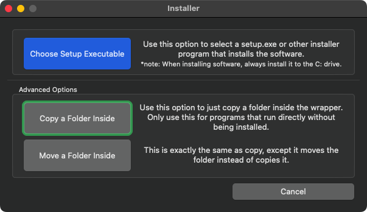
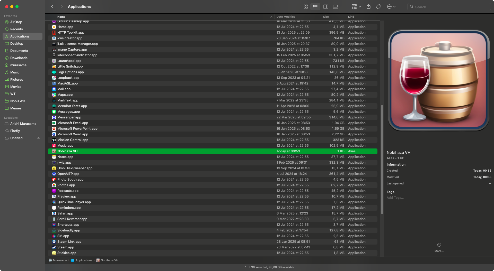
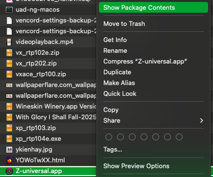
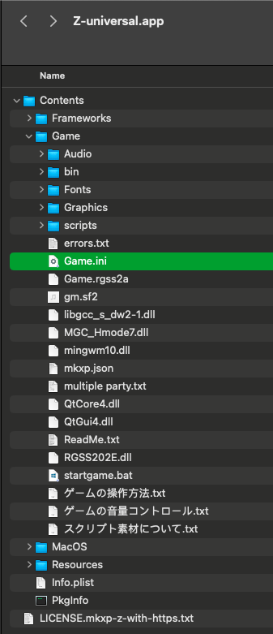
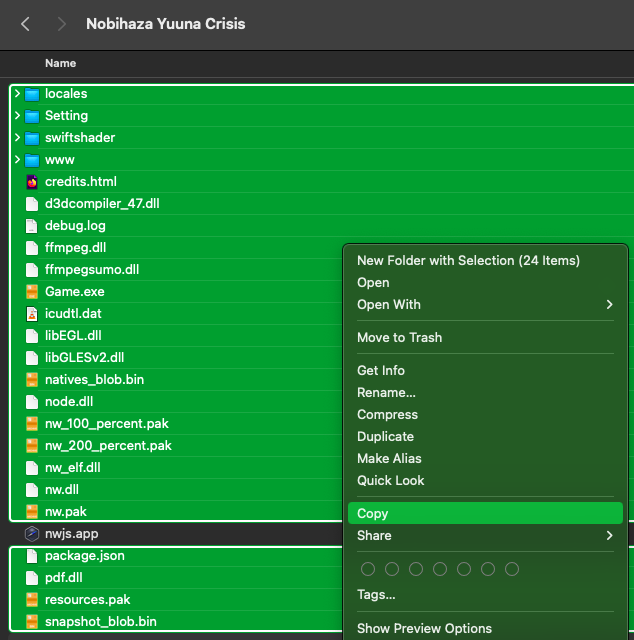
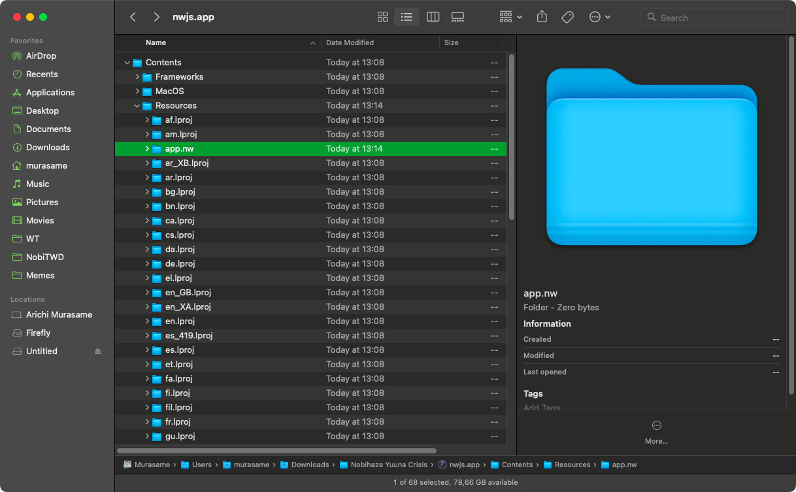

# Tải và chạy game

Việc cài đặt game trên macOS sẽ khá khó khăn do gần như không có game nào hỗ trợ chính thức cho macOS.

## Tải game xuống

> [!IMPORTANT]
> Nếu game không hỗ trợ cho macOS, bạn **bắt buộc** phải tải bản game dành cho hệ điều hành Windows 64-bit và cài đặt thông qua Kegworks (hoặc NW.js nếu là game RPG Maker MV).

Để tải xuống, bạn chỉ cần vào trang web và tải bản game xuống. Đó có thể là tệp tin nén (`.zip`, `.rar`, `.7z`) hoặc tệp tin `.exe` (nếu là bản dành cho Windows).

## Giải nén game

> [!NOTE]
> Khuyên dùng phần mềm **The Unarchiver** mà mình đã đề cập ở [mục 1](1.%20Điều%20kiện%20cơ%20bản.md#the-unarchiver) để có thể giải nén được tệp tin nén `.rar` và một số loại tệp khác.

Nháy đúp chuột vào tệp tin nén để giải nén tệp tin. Sau đó, một thư mục có cùng tên với tệp tin nén sẽ xuất hiện ở cùng thư mục đó.

## Mở ứng dụng Kegworks Config

Ngoại trừ game được làm bằng RPG Maker MV và các game hỗ trợ EasyRPG, tất cả các game còn lại đều sẽ phải cài đặt thông qua ứng dụng Kegworks Config.

* Mở **Finder** của macOS lên. Nhấn tổ hợp `Command + Shift + G` để mở cửa sổ điều hướng và nhập `/Users/tênngườidùng/Applications` (trong đó `tênngườidùng` là tên người dùng macOS của bạn).

* Nhấn chuột phải vào ứng dụng `Nobihaza` (hoặc tên khác mà bạn đã đặt ở [mục 1](1.%20Điều%20kiện%20cơ%20bản.md)) và nhấn **Show Package Contents**.

* Vào thư mục `Contents` và chạy ứng dụng `KegworksConfig`. Sau đó cửa sổ `KegworksConfig` sẽ hiện lên.

## RPG Maker 2000/2003

### Chạy bằng tệp `RPG_RT.exe`

* Mở ứng dụng **Kegworks Config** trước, sau đó nhấn vào nút **Install Software**.

* Nhấn nút **Copy a Folder Inside**.

* Chọn thư mục game bạn đã giải nén (trong đó có chứa tệp tin `RPG_RT.exe` hoặc các tệp tin `.exe` tương tự).

* Đợi cho quá trình sao chép hoàn tất, có thể sẽ mất khá nhiều thời gian tuỳ vào kích cỡ của game. Sau đó chuyển qua tab **Tools** của KegworksConfig và nhấn **Custom EXE Creator**.

* Nhấn nút **Browse** bên cạnh mục **Windows EXE** trong cửa sổ **Custom Executable Launcher Maker**. Cửa sổ chọn thư mục sẽ hiện ra và đang chọn thư mục `drive_c`, bạn nhấn vào mục **Program Files** bên cạnh phải và bạn sẽ thấy thư mục game đã sao chép. Hãy chọn tệp tin `RPG_RT.exe` của thư mục đó.

* Ở phần **Name to use**, bạn nhập tên của game (hoặc tên bất kì do bạn chọn).

> [!NOTE]
> Bạn cũng có thể thay đổi biểu tượng của game bằng cách nhấn **Browse** ở mục **Icon to use**. Mình sẽ hướng dẫn chi tiết cách thay đổi ở mục sau của hướng dẫn.

* Nhấn nút **Save**. Một bảng thông báo **Success** (Thành công) xuất hiện.

* Bạn quay trở lại cửa sổ **Finder** và vào thư mục `/Users/tênngườidùng/Applications/Nobihaza.app/Contents`. Bạn sẽ thấy game bạn vừa thêm ở trong thư mục đó.

* Nếu bạn muốn thêm game vào Launchpad, nhấn chuột phải vào tên game ở thư mục **Contents** và nhấn **Make Alias**. Một tệp tin mới có chữ `alias` sẽ xuất hiện thì bạn xoá chữ alias trong tên đó đi.

* Di chuyển lối tắt (alias) bạn vừa tạo vào thư mục `Applications` của macOS.

> [!IMPORTANT]
> **Đảm bảo là bạn đang di chuyển lối tắt** (ghi chữ Lối tắt/Alias ở cột Định dạng/Kind) chứ không phải di chuyển ứng dụng (ghi chữ Ứng dụng/Application thay vì Lối tắt/Alias).
>
> Di chuyển ứng dụng thay vì lối tắt có thể sẽ làm game không chạy được!

* Bạn sẽ thấy game Nobihaza bạn vừa thêm ở Launchpad của macOS. Bạn chỉ cần nhấn vào là sẽ chạy được.

### Chạy bằng EasyRPG

> [!IMPORTANT]
> Bản dịch tiếng Việt của một số game Nobihaza sẽ không hỗ trợ EasyRPG, và bạn bắt buộc phải chơi bằng tệp `RPG_RT.exe`. Việc cố gắng chạy các bản dịch này có thể sẽ gây ra lỗi, tiêu biểu như là lỗi phông chữ và lỗi hiển thị hình ảnh.

* Mở lại thư mục chứa ứng dụng **EasyRPG Player** đã tải từ mục Điều kiện cơ bản của hướng dẫn này.

* Sao chép tệp tin đó và dán vào thư mục game.
    * Nếu bạn đã sao chép tệp tin vào thư mục mẹ chứa thư mục của game thì bạn không cần phải làm bước này, thay vào đó hãy khởi động ứng dụng **EasyRPG Player** ở thư mục mẹ đó, và EasyRPG sẽ hiển thị một bảng chọn để bạn có thể chọn game.

> [!CAUTION]
> Một số thư mục quan trọng (như **Downloads** hay **Applications**) của macOS có thể sẽ chặn các ứng dụng ghi dữ liệu vào thư mục đó theo mặc định, và làm các game trong thư mục đó sẽ không thể lưu game được. Bạn có thể di chuyển sang thư mục khác, hoặc xem cách sửa lỗi ở phần [Sửa lỗi và mẹo](3.%20S%E1%BB%ADa%20l%E1%BB%97i%20v%C3%A0%20m%E1%BA%B9o.md#kh%C3%B4ng-th%E1%BB%83-l%C6%B0u-%C4%91%C6%B0%E1%BB%A3c-ti%E1%BA%BFn-tr%C3%ACnh-c%E1%BB%A7a-game).

* Cuối cùng là nhấn đúp vào ứng dụng **EasyRPG Player** để chơi.

## RPG Maker XP/VX/VX Ace

### Sử dụng tệp tin `Game.exe`

Làm tương tự với phần [**Chạy bằng tệp `RPG_RT.exe`**](#ch%E1%BA%A1y-b%E1%BA%B1ng-t%E1%BB%87p-rpg_rtexe) của RPG Maker 2000/2003. Tuy nhiên thay vì chọn `RPG_RT.exe`, bạn hãy chọn tệp tin `Game.exe` thay vào đó.

### Sử dụng MKXP

> [!IMPORTANT]
> Có rất ít game có thể tương thích với MKXP, đối với macOS thì độ tương thích lại càng thấp hơn. Nếu bạn không thể chạy được game sử dụng MKXP, bạn cần quay lại chơi game bằng tệp `Game.exe`.

* Tải [MKXP dành cho macOS](https://nbhzvn.one/tools/MKXP/mkxp-z-mac.zip) rồi giải nén tệp tin vừa tải xuống.

* Nhấn chuột phải vào ứng dụng `Z-universal` vừa giải nén và nhấn vào nút **Hiển thị Nội dung Gói** (Show Package Contents).

* Truy cập vào thư mục `Contents/Game` của ứng dụng và sao chép toàn bộ tệp tin trong thư mục game vào thư mục này.

* Bạn cũng có thể đổi tên ứng dụng `Z-universal` thành bất kì tên nào bạn muốn, sau đó kéo thả ứng dụng vào mục **Applications** của macOS rồi nhấn vào game để chạy.

> [!CAUTION]
> Một số thư mục quan trọng (như **Downloads** hay **Applications**) của macOS có thể sẽ chặn các ứng dụng ghi dữ liệu vào thư mục đó theo mặc định, và làm các game trong thư mục đó sẽ không thể lưu game được. Bạn có thể di chuyển sang thư mục khác, hoặc xem cách sửa lỗi ở phần [Sửa lỗi và mẹo](3.%20S%E1%BB%ADa%20l%E1%BB%97i%20v%C3%A0%20m%E1%BA%B9o.md#kh%C3%B4ng-th%E1%BB%83-l%C6%B0u-%C4%91%C6%B0%E1%BB%A3c-ti%E1%BA%BFn-tr%C3%ACnh-c%E1%BB%A7a-game).

## RPG Maker MV/MZ

* Truy cập thư mục `nwjs` mà bạn đã tải xuống và giải nén ở [mục 1](1.%20%C4%90i%E1%BB%81u%20ki%E1%BB%87n%20c%C6%A1%20b%E1%BA%A3n.md#rpg-maker-mv). Sao chép ứng dụng `nwjs` vào thư mục game.

* Nhấn nút sao chép toàn bộ các tệp tin còn lại trong thư mục game, ngoại trừ ứng dụng `nwjs`.

* Nhấn chuột phải vào ứng dụng `nwjs`, chọn **Hiển thị Nội dung Gói** (Show Package Contents). Di chuyển tới thư mục `Contents/Resources` và tạo một thư mục mới có tên là `app.nw`.

* Nhấn tổ hợp `Command + Option + V` để di chuyển toàn bộ tệp tin vừa sao chép ở thư mục game vào thư mục `app.nw`.

* Đổi tên ứng dụng `nwjs` thành bất kì tên nào bạn muốn, kéo thả ứng dụng đó vào mục **Applications** của macOS và chạy tệp tin đó.

> [!CAUTION]
> Một số thư mục quan trọng (như **Downloads** hay **Applications**) của macOS có thể sẽ chặn các ứng dụng ghi dữ liệu vào thư mục đó theo mặc định, và làm các game trong thư mục đó sẽ không thể lưu game được. Bạn có thể di chuyển sang thư mục khác, hoặc xem cách sửa lỗi ở phần [Sửa lỗi và mẹo](3.%20S%E1%BB%ADa%20l%E1%BB%97i%20v%C3%A0%20m%E1%BA%B9o.md#kh%C3%B4ng-th%E1%BB%83-l%C6%B0u-%C4%91%C6%B0%E1%BB%A3c-ti%E1%BA%BFn-tr%C3%ACnh-c%E1%BB%A7a-game).
