# Sửa lỗi và mẹo

Dưới đây sẽ là hướng dẫn sửa các lỗi khi chơi game Nobihaza, cùng với các mẹo để có thể chơi game tốt hơn trên macOS.

> [!IMPORTANT]
> Nếu như game vẫn còn lỗi sau khi bạn đã áp dụng những cách bên dưới thì khả năng cao là game sẽ không thể chơi (ổn định) trên macOS, và bạn không còn cách nào khác ngoài việc đợi nhà phát triển phát hành bản chính thức.

> [!IMPORTANT]
> "Thư mục game" được nhắc đến trong hướng dẫn này là thư mục game trong thư mục `Program Files` mà bạn đã làm khi [thêm game ở mục 2](2.%20T%E1%BA%A3i%20v%C3%A0%20ch%E1%BA%A1y%20game.md#ch%E1%BA%A1y-b%E1%BA%B1ng-t%E1%BB%87p-rpg_rtexe), thường có dạng là `/Users/tennguoidung/Applications/Nobihaza.app/Contents/drive_c/Program Files/tengame`.

## Chung

Phần này sẽ áp dụng cho tất cả các game mà không xét đến việc game đó được làm bằng phần mềm gì.

### Không thể lưu được tiến trình của game

Áp dụng cho cả 2 trường hợp cơ bản: game báo lỗi khi lưu game và game không hiển thị tệp đã lưu khi khởi động lại game. Riêng với macOS thì một số game sẽ không thể khởi động được nếu như không thể ghi được tệp tin vào thư mục game.

* macOS có thể sẽ chặn các ứng dụng ghi vào các thư mục quan trọng (như `Documents`, `Downloads` hoặc `Applications`). Bạn có thể chuyển game sang thư mục khác, hoặc cấp quyền ghi cho game bằng cách:
    * Mở cài đặt của máy (System Preferences/System Settings) và chọn mục **Security & Privacy**. Chuyển qua tab **Privacy** cho đến khi có danh sách các quyền như ở ảnh bên dưới.<br>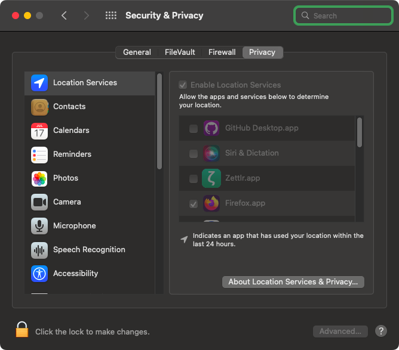
    * Nhấn vào biểu tượng khoá ở góc dưới bên trái để mở khoá cài đặt trước. Nhập mật khẩu macOS của bạn và nhấn OK.
    * Nhấn vào mục **Full Disk Access**, sau đó nhấn vào dấu + ở dưới danh sách ứng dụng để mở cửa sổ thêm ứng dụng.<br>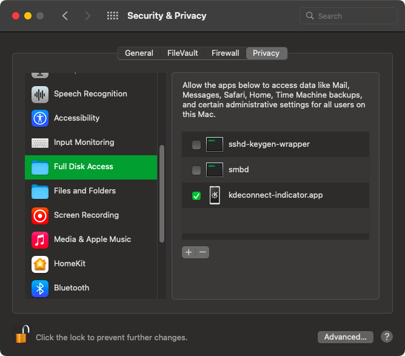
    * Chọn ứng dụng/game bạn muốn cấp quyền, ví dụ như ở ảnh dưới là **EasyRPG Player**.<br>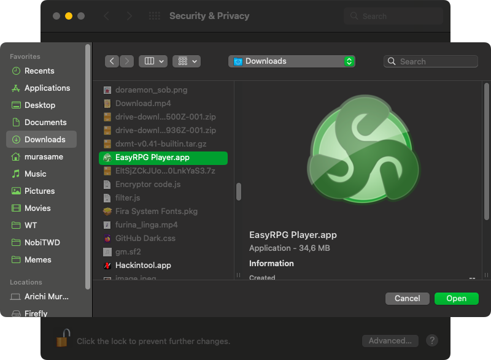
    * Đảm bảo ứng dụng bạn vừa thêm đã xuất hiện và có dấu tích ở danh sách.<br>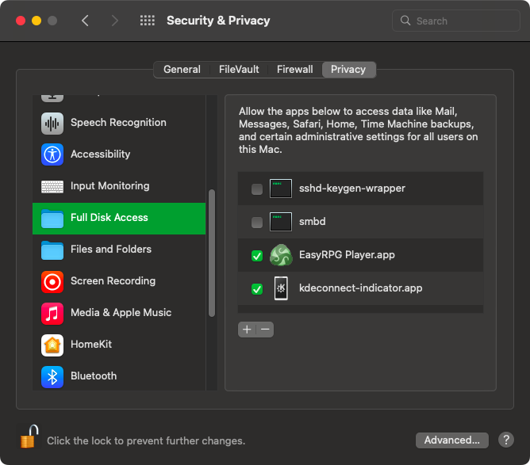

* Đảm bảo đường dẫn của game không chứa bất kì ký tự tiếng Việt có dấu nào (xem mục [`File corrupted! Please run a virus check / No game scripts specified`](#file-corrupted-please-run-a-virus-check--no-game-scripts-specified)).

* Đảm bảo bạn không để thư mục game trong một thư mục/ổ cứng không thể ghi tệp tin được (ví dụ như thẻ SD đang bị khoá ghi, hoặc ổ cứng/thư mục mà bạn không có quyền ghi, hoặc ổ cứng bị lỗi ghi tệp tin). Cách tốt nhất là bạn thử tạo một tệp bất kì trong thư mục game để kiểm tra thử khả năng ghi tệp tin, xem có thông báo lỗi hay yêu cầu cấp quyền gì không, nếu không thì thử di chuyển sang một ổ cứng khác.

* Game sẽ không hoạt động ổn định nếu như bạn để thư mục game trong một ổ cứng lưu trữ đám mây (một số phần mềm như TeraBox, Google Drive hay OneDrive sẽ hiển thị bộ nhớ đám mây của bạn như một ổ cứng).

### Game giật lag mặc dù đang sử dụng máy tính có cấu hình cao

#### Đối với Kegworks

Nếu bạn đang chơi game bằng Wine + Kegworks, bạn cần kiểm tra xem DXVK có hoạt động hay không.

> [!IMPORTANT]
> Đa số các game RPG Maker XP/VX/VX Ace sử dụng DirectX 9 (chứ không phải DirectX 10 hay 11), nên game sẽ chạy rất chậm do DXVK không thể hoạt động được trên DirectX 9 và phải dùng WineD3D để thay thế!
>
> Ngay cả CrossOver cũng không thể cứu được trường hợp này.

* Mở ứng dụng **KegworksConfig**, chuyển qua tab **Advanced** và tích chọn **Performance HUD** như ảnh dưới.

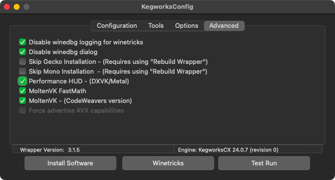

* Nhấn vào nút **Test Run** để chạy thử game được cài đặt gần nhất và kiểm tra xem có thông tin nào khác liên quan đến DXVK ở màn hình game không. Còn nếu chỉ có màn hình game không mà không có thêm chữ gì thì tức là DXVK đang không hoạt động, nên game sẽ rất là lag.

> [!NOTE]
> Nếu nhấn vào nút **Test Run** mà không có gì xảy ra thì bạn cũng có thể chạy một game mà bạn đã cài thông qua Kegworks.

* Tải phiên bản mới nhất của DXVK [ở đây](https://github.com/Gcenx/DXVK-macOS/releases/latest). Tải tệp tin `dxvk-macOS-*.tar.gz` xuống và giải nén tệp tin đó.

* Mở 2 thư mục này trong Finder của macOS:
    * Thư mục `dxvk-macOS-*` mà bạn vừa giải nén, như ở ảnh bên dưới.<br>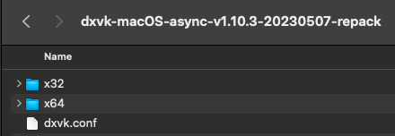
    * Thư mục `Contents` của ứng dụng `Nobihaza`, hoặc tên khác mà bạn đã đặt ở mục 1. Xem lại mục [2. Tải và chạy game#Mở ứng dụng Kegworks Config](2.%20T%E1%BA%A3i%20v%C3%A0%20ch%E1%BA%A1y%20game.md#m%E1%BB%9F-%E1%BB%A9ng-d%E1%BB%A5ng-kegworks-config) nếu bạn đã quên.

* Mở ứng dụng **Terminal** lên và nhập dòng chữ sau:

```sh
export NBHZ_PATH=
```

* Kéo thư mục `Contents` vào cửa sổ Terminal, và nó sẽ hiện đường dẫn đầy đủ của thư mục `Contents` như ở ảnh dưới:

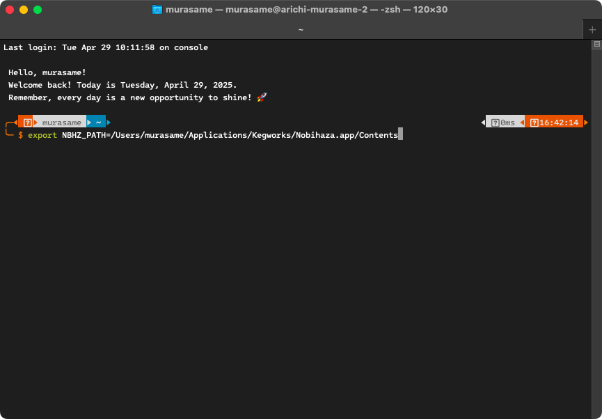

* Nhấn nút Enter rồi nhập tiếp:

```sh
export DXVK_PATH=
```

* Kéo thư mục `dxvk-macOS-*` vào cửa sổ Terminal:

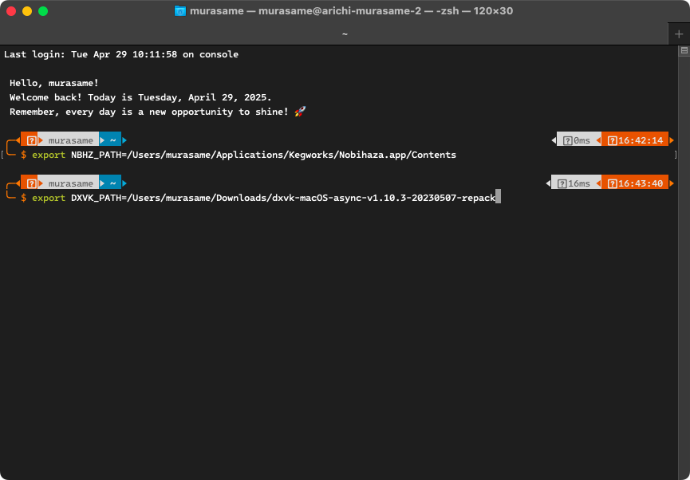

* Nhấn Enter tiếp, và cuối cùng là sao chép dòng chữ sau vào cửa sổ Terminal rồi nhấn Enter:

```
cd "$DXVK_PATH"
cp x64/*.dll "$NBHZ_PATH/drive_c/windows/system32"
cp x32/*.dll "$NBHZ_PATH/drive_c/windows/syswow64"
```

* Nếu cửa sổ Terminal không in thêm cái gì khác thì tức là đã thành công, lúc này mở ứng dụng **KegworksConfig** lên và thêm dòng chữ sau vào đầu ô **Unix Commands** (vẫn giữ nguyên đằng sau) như ảnh bên dưới:

```sh
export "d3d10core,d3d11=n,b";
```

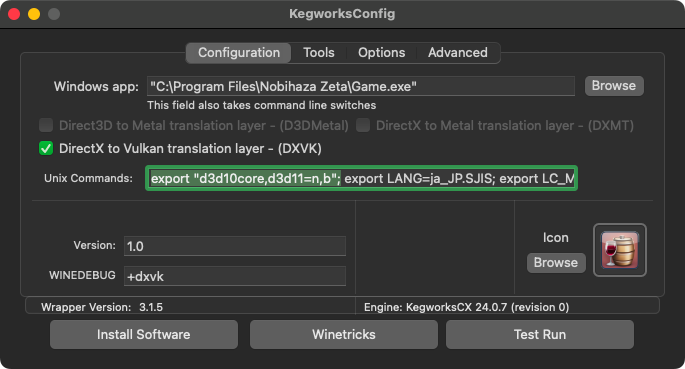

* Cuối cùng là tắt KegworksConfig và chạy lại game.

#### Khác

Nếu bạn đang chạy game không thông qua Kegworks, hoặc đã thử cài lại DXVK rồi mà không được thì:

* Nếu bạn đang sử dụng MacBook chạy CPU Intel, bạn nên cắm sạc vào trong quá trình chơi game.

* Tắt bớt các ứng dụng đang chạy, kể cả ứng dụng chạy ngầm. Ở trên thanh Menu của macOS sẽ có cả các ứng dụng đang chạy ngầm, hãy nhấn vào ứng dụng bạn không dùng nữa và nhấn Exit/Quit/Thoát.

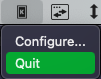

* Thử kiểm tra trên thanh Dock xem có ứng dụng nào có chấm trắng bên dưới (đang chạy ngầm) không. Nếu có thì bạn nhấn chuột phải và nhấn **Quit**/**Force Quit**.

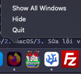

* Thử tắt chế độ tiết kiệm pin của macOS.

Nếu game vẫn lag sau khi đã làm đủ cách trên thì không có cách nào khác, game đó sẽ không thể chạy ổn định ở trên macOS.

### Game bị lỗi hiển thị ô vuông/kí tự lạ, hoặc font chữ hiển thị rất xấu

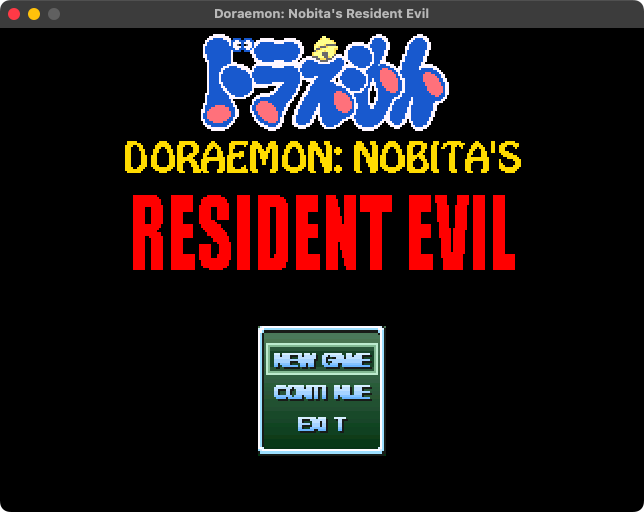

* Xem lại [Điều kiện cơ bản#Chuyển vùng thành Nhật Bản cho Wine](1.%20%C4%90i%E1%BB%81u%20ki%E1%BB%87n%20c%C6%A1%20b%E1%BA%A3n.md#chuy%E1%BB%83n-v%C3%B9ng-th%C3%A0nh-nh%E1%BA%ADt-b%E1%BA%A3n-cho-wine) và [Điều kiện cơ bản#Cài đặt thư viện cần thiết cho Wine](1.%20%C4%90i%E1%BB%81u%20ki%E1%BB%87n%20c%C6%A1%20b%E1%BA%A3n.md#c%C3%A0i-%C4%91%E1%BA%B7t-th%C6%B0-vi%E1%BB%87n-c%E1%BA%A7n-thi%E1%BA%BFt-cho-wine).

* Kiểm tra xem trong thư mục game có tệp tin font chữ (kết thúc bằng `.ttf`, `.otf` hay `.fon`) nào không, nếu có thì:

#### Đối với tệp có đuôi `.ttf` và `.otf`

Mở ứng dụng **Font Book** của macOS lên (có thể tìm trong Launchpad hoặc mục Applications), sau đó kéo các tệp tin `.otf` và `.ttf` vào cửa sổ của Font Book. macOS sẽ tự động cài đặt các font đó cho toàn bộ máy.

> [!NOTE]
> Tuyệt đối không chuyển đổi tệp tin `.fon` sang tệp `.ttf` hay `.otf` chỉ để cài được trên Font Book, vì nó có thể gây ra lỗi hiển thị, và phần lớn sẽ **vi phạm Điều khoản sử dụng** của chính font đó.

#### Đối với tệp có đuôi `.fon`

* Truy cập thư mục `Contents/drive_c/windows/Fonts` của ứng dụng `Nobihaza`, hoặc tên khác mà bạn đã đặt ở mục 1. Xem lại mục [2. Tải và chạy game#Mở ứng dụng Kegworks Config](2.%20T%E1%BA%A3i%20v%C3%A0%20ch%E1%BA%A1y%20game.md#m%E1%BB%9F-%E1%BB%A9ng-d%E1%BB%A5ng-kegworks-config) nếu bạn đã quên.

Thư mục Fonts sẽ như ảnh bên dưới:

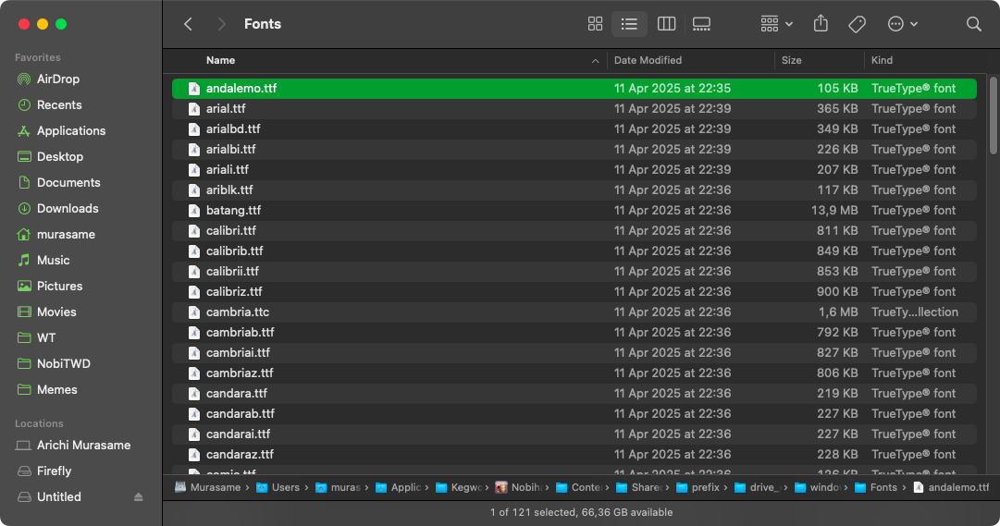

* Sao chép font bạn đã tìm được trong thư mục game vào thư mục `Fonts` này.

* Mở ứng dụng **KegworksConfig**, qua tab **Tools** và nhấn **Command Line (cmd)**. Nhập dòng chữ sau vào cửa sổ Command Prompt vừa mở, trong đó `RM2000` là tên của font (thường là tên tệp tin bỏ đuôi `.fon`), và `RM2000.fon` là tên tệp tin:

```bat
reg add "HKLM\Software\Microsoft\Windows NT\CurrentVersion\Fonts" /v "RM2000" /d "RM2000.fon"
```

* Nhấn Enter và bạn sẽ thấy dòng chữ `reg: 操作は正常に完了しました` (`reg: The operation completed successfully`).

### Không thể phát được nhạc MIDI

Đa số game Nobihaza được làm bằng RPG Maker VX Ace trở xuống sẽ sử dụng MIDI. Nếu bạn thấy trong quá trình chơi mà có một số bài nhạc không thể phát được, nó có thể là nhạc MIDI và máy bạn đang bị lỗi.

* Xem lại mục [Điều kiện cơ bản#Cài đặt thư viện cần thiết cho Wine](1.%20%C4%90i%E1%BB%81u%20ki%E1%BB%87n%20c%C6%A1%20b%E1%BA%A3n.md#c%C3%A0i-%C4%91%E1%BA%B7t-th%C6%B0-vi%E1%BB%87n-c%E1%BA%A7n-thi%E1%BA%BFt-cho-wine).

* Một số máy cũng có thể sẽ cần FluidSynth để có thể phát nhạc MIDI:

#### Cài đặt FluidSynth

* Mở ứng dụng **Terminal** lên và nhập dòng lệnh sau, sau đó nhấn Enter và nhập mật khẩu macOS của bạn.

```sh
sudo port install fluidsynth
```

* Nhập `Y` và nhấn `Enter` khi cửa sổ Terminal hiện ra chữ Continue.


* Quá trình cài đặt sẽ mất khá nhiều thời gian nên bạn hãy cố gắng chờ đợi, cho đến khi hiện dòng chữ `No broken files found` như ảnh dưới.

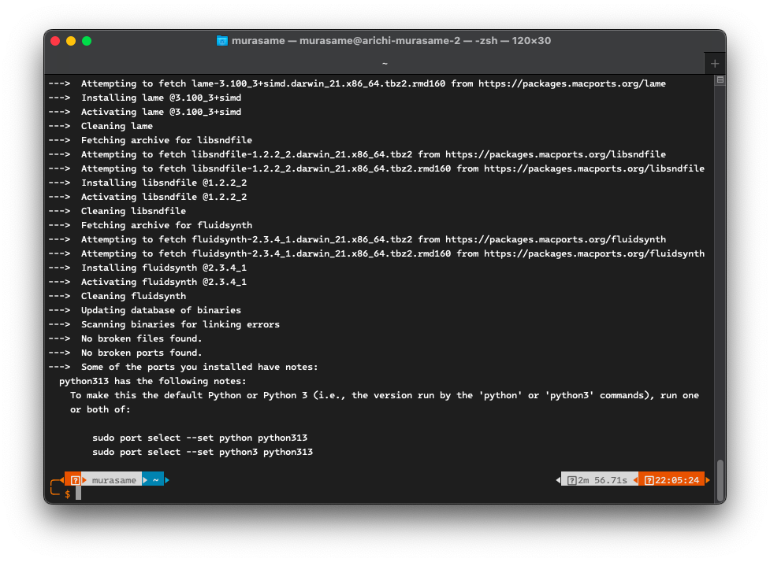

* Bạn cần tải thêm cả [soundfont được sử dụng trên Windows](https://musical-artifacts.com/artifacts/713/gm.sf2) để có trải nghiệm nghe giống với Windows nhất. Lưu ý đường dẫn của tệp này sau khi tải xuống, và bạn sẽ cần sử dụng nó về sau này.

#### Khởi động FluidSynth

* Nhập dòng lệnh sau trong cửa sổ Terminal:

```sh
fluidsynth -a coreaudio -m coremidi ~/Downloads/gm.sf2
```

Thay đường dẫn `~/Downloads/gm.sf2` của bạn thành đường dẫn tệp `gm.sf2` mà bạn đã tải xuống trước đó.

* Nhấn Enter để chạy dòng lệnh và khởi động lại game.

> [!IMPORTANT]
> Bạn cần để FluidSynth và cửa sổ Terminal chạy trong nền trong quá trình chơi game, và thực hiện lệnh trên mỗi lần muốn khởi động game.

### KegworksConfig không mở khi chạy ứng dụng `Nobihaza` trên Launchpad

Xem lại mục [Tải và chạy game#Mở ứng dụng Kegworks Config](2.%20T%E1%BA%A3i%20v%C3%A0%20ch%E1%BA%A1y%20game.md#m%E1%BB%9F-%E1%BB%A9ng-d%E1%BB%A5ng-kegworks-config).

## RPG Maker 2000/2003 (`RPG_RT.exe`)

### `XXXX 乗り物 は開けません` (Không thể mở file XXXX) / `???????????????????` (một đống dấu hỏi chấm)

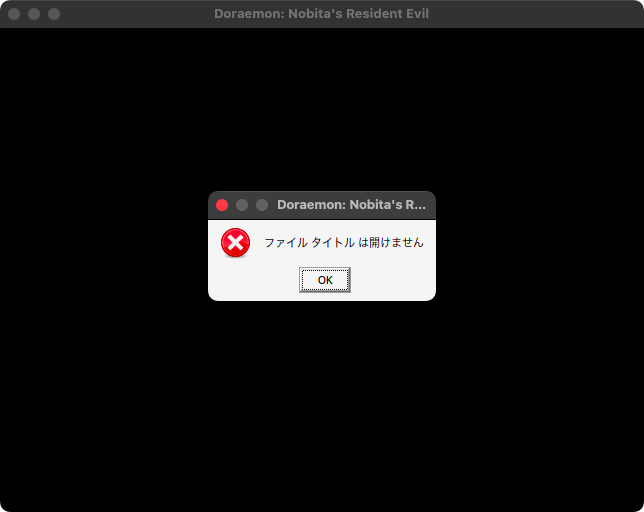

* Xem lại [1. Điều kiện cơ bản#Chuyển vùng thành Nhật Bản cho Wine](1.%20%C4%90i%E1%BB%81u%20ki%E1%BB%87n%20c%C6%A1%20b%E1%BA%A3n.md#chuy%E1%BB%83n-v%C3%B9ng-th%C3%A0nh-nh%E1%BA%ADt-b%E1%BA%A3n-cho-wine).

* Cũng có thể là do tệp tin đó thực sự không có trong thư mục game. Hãy giải nén lại vào thư mục game và thử lại.

> [!NOTE]
> Có một số trường hợp hiếm là do người dịch khi nén game bằng máy tính vẫn chưa để vùng là Nhật Bản, và sau khi nén thì tên của các tệp tin tài nguyên sẽ bị hỏng và chứa các kí tự vô nghĩa (hay còn được gọi là Mojibake).
>
> Lỗi này cũng sẽ khiến cho game không thể tìm được tệp tin tài nguyên. Bạn có thể xem chi tiết về lỗi này [ở đây](../6.%20Sửa%20lỗi%20chung/1.%20Sửa%20lỗi%20tệp%20tin%20mojibake.md).

### `RPGツクール2000/2003のランタイムパッケージがセットアップされていません。` (Gói khởi chạy của RPG Maker 2000/2003 chưa được cài đặt)

Xem lại [Điều kiện cơ bản#RPG Maker 2000/2003](1.%20Điều%20kiện%20cơ%20bản.md#rpg-maker-20002003).

## RPG Maker 2000/2003 (EasyRPG)

Xem tại mục [EasyRPG](../EasyRPG.md).

## RPG Maker XP/VX/VX Ace

### RPGVX/RPGVXAce RTP is required to run this game

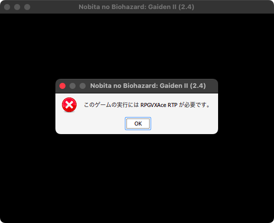

Xem lại [Điều kiện cơ bản#RPG Maker XP/VX/VX Ace](1.%20Điều%20kiện%20cơ%20bản.md#rpg-maker-xpvxvx-ace).

### RGSS202E.dll/RGSS202J.dll/RGSS300.dll/RGSS301.dll could not be found

* [Cài đặt lại toàn bộ gói khởi chạy (RTP) của RPG Maker VX Ace](1.%20Điều%20kiện%20cơ%20bản.md#rpg-maker-xpvxvx-ace).

* Nếu cài đặt lại rồi nhưng vẫn không được, bạn cũng có thể [tải chay các tệp tin .dll đó](https://drive.google.com/file/d/1QTGjntOWisoUzk3NTfSBfk0bT2fNYBKc/view) và giải nén vào thư mục `System` của game.

### File corrupted! Please run a virus check / No game scripts specified

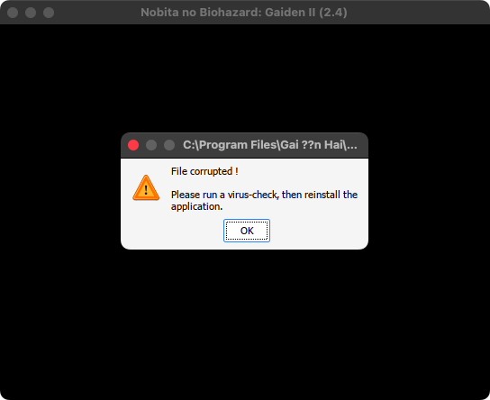

Trong thanh tiêu đề của thông báo lỗi sẽ ghi đường dẫn tệp tin bị lỗi.

* Nếu đường dẫn trong thông báo có chứa dấu hỏi chấm (`?`), thì đường dẫn thư mục game của bạn đang chứa kí tự đặc biệt (kể cả tiếng Việt có dấu). Xem dấu `?` nằm ở (các) thư mục nào trong đường dẫn, và xoá **tất cả** kí tự đặc biệt trong thư mục đó.

* Tệp tin đó cũng có thể bị lỗi trong quá trình giải nén, hãy thử giải nén lại tệp tin nén của game.

> [!IMPORTANT]
> Bạn cần tạo lại lối tắt chạy game ([**Custom EXE Creator**](2.%20T%E1%BA%A3i%20v%C3%A0%20ch%E1%BA%A1y%20game.md#ch%E1%BA%A1y-b%E1%BA%B1ng-t%E1%BB%87p-rpg_rtexe)) sau khi đã đổi tên thư mục game.

### Unable to find VL Gothic font

* Tải tệp tin font cho VL Gothic [tại đây](https://github.com/ovate/VL-Gothic-font/raw/refs/heads/main/fonts.zip).

* Giải nén tệp tin này và truy cập vào thư mục `fonts` đã giải nén. Bạn sẽ thấy 2 tệp tin là `VL-Gothic-Regular.ttf` và `VL-PGothic-Regular.ttf`.

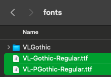

* Mở ứng dụng **Font Book** của macOS lên, và kéo 2 tệp tin đó vào cửa sổ của Font Book.

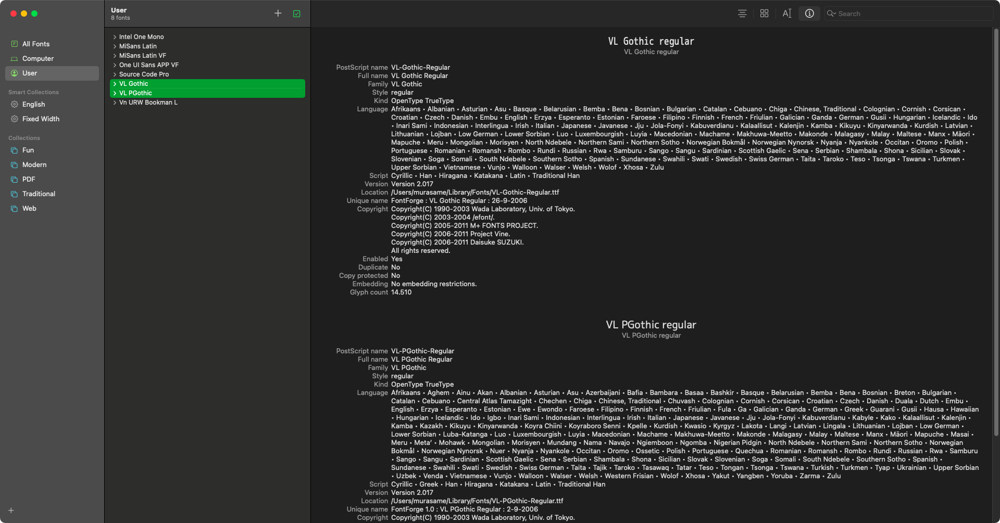

### Script error

Không còn cách nào khác, bạn bắt buộc phải liên hệ với nhà phát triển để sửa lỗi này.

### Failed to load script

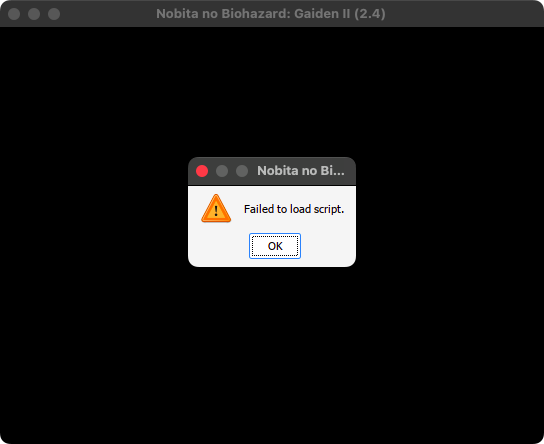

Bạn đã xoá nhầm tệp tin `Game.rgss3a` hoặc thư mục `Data` của game, hãy giải nén lại tệp tin nén của game và thử lại.

### Unable to find file

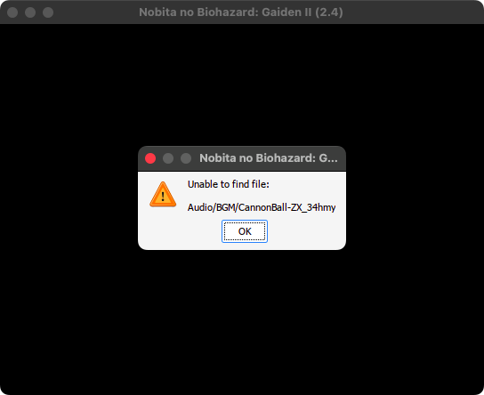

Cách sửa giống như mục [`XXXX 乗り物 は開けません` (Không thể mở file XXXX) / `???????????????????` (một đống dấu hỏi chấm) của RPG Maker 2000/2003](#xxxx-乗り物-は開けません-không-thể-mở-file-xxxx---một-đống-dấu-hỏi-chấm).

### Error creating context: Could not create GL context

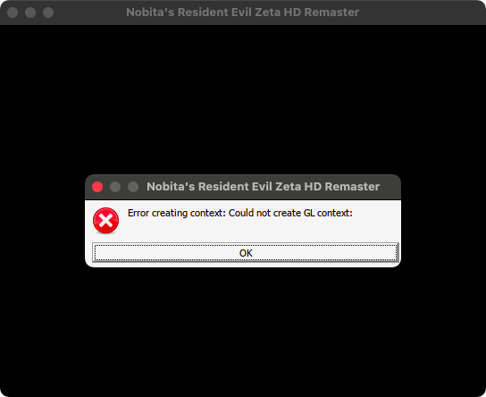

macOS không hỗ trợ OpenGL nên các game sử dụng OpenGL sẽ không thể chạy được (hoặc nó là do giới hạn của Wine, mình không rõ cái này lắm).

Hiện tại mình vẫn chưa tìm được cách nào để sửa lỗi này, nên có thể nói là hiện tại vẫn chưa thể chơi các game này được.

## RPG Maker MV

Do đều sử dụng NW.js nên cách sửa trên macOS cũng sẽ [giống như trên Windows](../1.%20Windows/3.%20S%E1%BB%ADa%20l%E1%BB%97i%20v%C3%A0%20m%E1%BA%B9o.md#rpg-maker-mvmz).

Chỉ cần nhớ một điều rằng thư mục game trên macOS sẽ là `Contents/Resources/app.nw` ở bên trong ứng dụng của game. Nếu lỗi của bạn không được liệt kê trong mục đó thì rất tiếc, game sẽ không thể chơi được ổn định trên macOS.

Còn lại thì sẽ chỉ có một lỗi khác dành riêng cho macOS:

### Lỗi hiển thị màn hình NW.js thay vì màn hình game

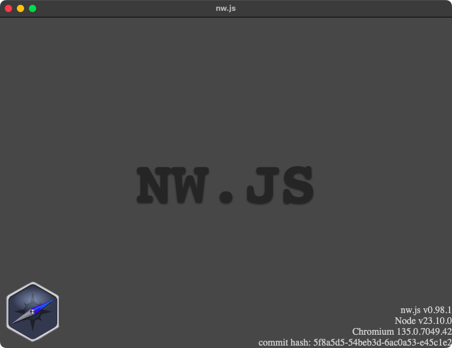

Bạn chưa cài đặt thư mục `Contents/Resources/app.nw` của NW.js, hãy xem lại [Tải và chạy game#RPG Maker MV/MZ](2.%20T%E1%BA%A3i%20v%C3%A0%20ch%E1%BA%A1y%20game.md#rpg-maker-mvmz).

## Mẹo dành cho macOS

### Nâng cấp phiên bản Wine và Kegworks

Thỉnh thoảng thì bạn vẫn nên cập nhật cả Wine và Kegworks, vì có thể một số lỗi liên quan đến việc chơi game Windows sẽ ổn định hơn.

* Mở ứng dụng **Kegworks Winery**, và nhấn vào dấu cộng (+) ở bên dưới danh sách.

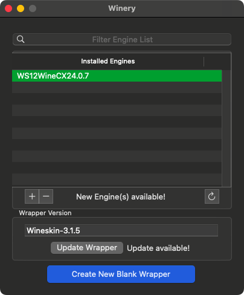

* Nếu bạn thấy phiên bản nào đó cao hơn phiên bản hiện tại, hãy chọn phiên bản đó và nhấn vào nút **Download and Install**.

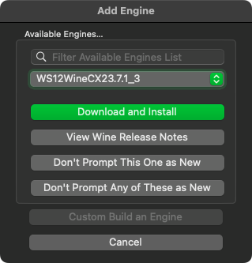

* Nhấn vào nút **OK**.

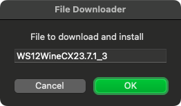

* Đợi cho quá trình cài đặt hoàn tất, và nó sẽ đưa về lại cửa sổ Kegworks Winery. Nhấn tiếp vào nút **Update Wrapper**.

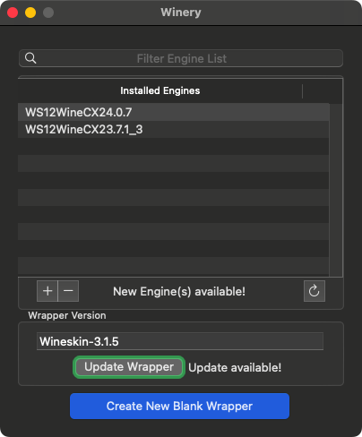

* Bạn sẽ thấy phiên bản mới nhất của Kegworks (Wineskin), hãy nhấn vào nút **OK**.

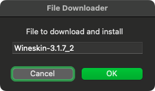

* Đợi cho quá trình cài đặt hoàn tất, và bạn sẽ thấy phiên bản mới được ghi ở phần **Wrapper Version**.

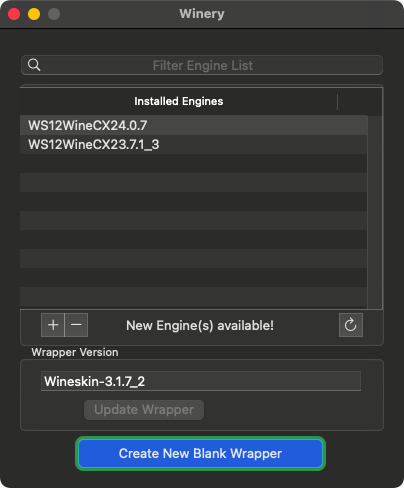

* Tắt cửa sổ Kegworks Winery đi, và mở ứng dụng **KegworksConfig** trong ứng dụng bạn đã tạo ở mục 1. Nhấn vào tab **Tools** và chọn **Update Wrapper**.

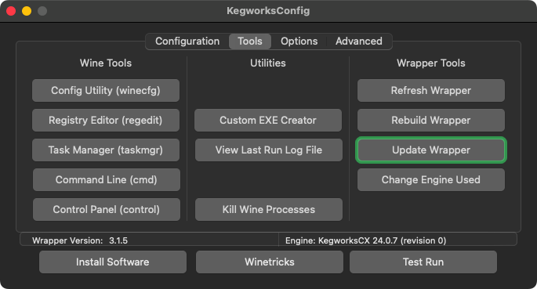

* Có một cảnh báo sẽ xuất hiện, nhấn **Yes** để tiếp tục.

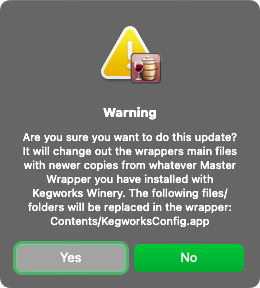

* Đợi cho quá trình nâng cấp hoàn tất, và bạn sẽ thấy phiên bản mới ở phần **Wrapper Version**.

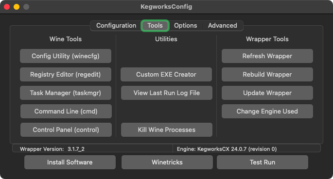

* Nhấn vào nút **Change Engine Used**. Chọn phiên bản mới nhất bạn vừa tải về ở trong danh sách và nhấn **OK**.

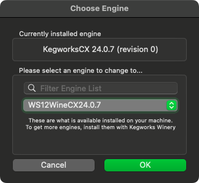

* Đợi cho quá trình nâng cấp hoàn tất và thế là xong.

### Sử dụng CrossOver thay cho Kegworks

CrossOver dễ sử dụng và có phần ổn định hơn Kegworks, nhưng vì nó là một phần mềm trả phí nên mình không lấy nó làm trọng tâm. Hướng dẫn bên dưới chỉ áp dụng cho những người đã mua CrossOver từ trước, và muốn sử dụng CrossOver thay cho Kegworks.

Mình sẽ **không bao giờ** khuyến khích sử dụng CrossOver, cũng như hướng dẫn cách để "bẻ khoá" phần mềm này.

#### Tải RTP

* Tải toàn bộ RTP của các phần mềm chơi game nếu bạn chưa tải:
    * **Tiếng Nhật:**
        * [RPG Maker 2000](https://cdn.tkool.jp/updata/rtp/2000rtp.zip)
        * [RPG Maker 2003](https://cdn.tkool.jp/updata/rtp/2000rtp.zip)
        * [RPG Maker XP](https://cdn.tkool.jp/updata/rtp/xp_rtp103.zip)
        * [RPG Maker VX](https://cdn.tkool.jp/updata/rtp/vx_rtp202.zip)
        * [RPG Maker VX Ace](https://cdn.tkool.jp/updata/rtp/vxace_rtp100.zip)
    * **Tiếng Anh:**
        * [RPG Maker 2000](https://dl.komodo.jp/rpgmakerweb/run-time-packages/rpg2000_rtp_installer.exe)
        * [RPG Maker 2003](https://dl.komodo.jp/rpgmakerweb/run-time-packages/rpg2003_rtp_installer.zip)
        * [RPG Maker XP](https://dl.komodo.jp/rpgmakerweb/run-time-packages/xp_rtp104e.exe)
        * [RPG Maker VX](https://dl.komodo.jp/rpgmakerweb/run-time-packages/vx_rtp102e.zip)
        * [RPG Maker VX Ace](https://dl.komodo.jp/rpgmakerweb/run-time-packages/RPGVXAce_RTP.zip)

#### Tạo bottle mới

* Nhấn vào nút **Install** trong cửa sổ CrossOver, và nhấn vào nút **Install an unlisted application** ở góc trên bên phải.

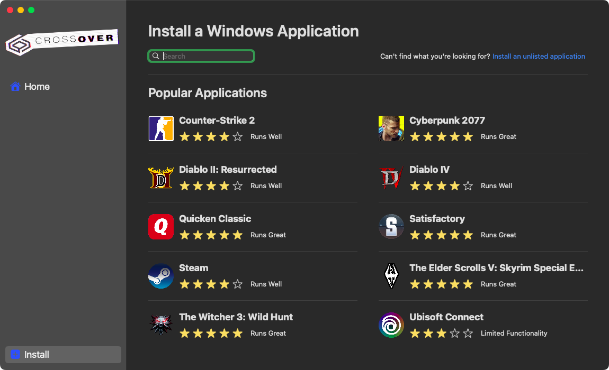

* Nhấn vào nút **Edit** bên trên (bên cạnh **You need to provide the installer file**) và chọn tệp tin cài đặt RTP tiếng Anh bất kì (vì tiếng Nhật sẽ có thể gây lỗi nếu chưa chuyển vùng).

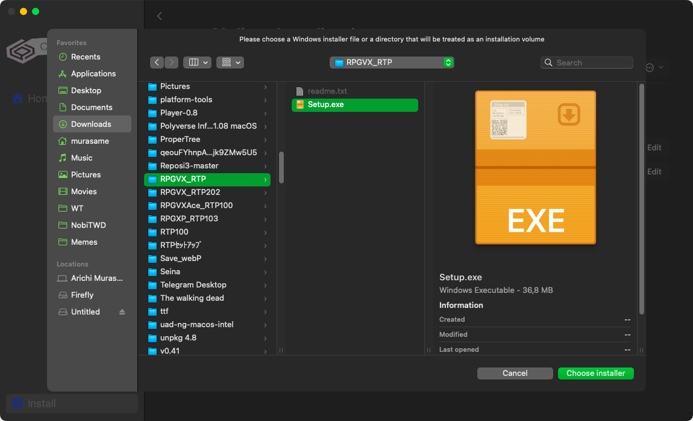

* Nhấn vào nút **Edit** bên dưới (bên cạnh **You need to select the bottle**). Nhập tên của bottle ở phần **New Bottle Name** và nhấn **Done**.

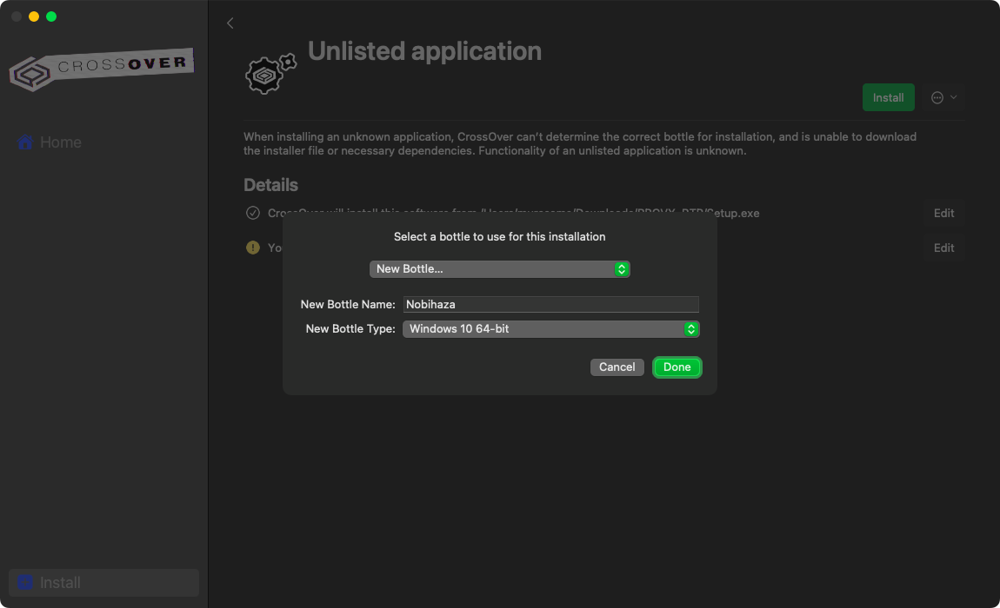

* Sau khi tất cả đã xong thì nhấn vào nút Install.

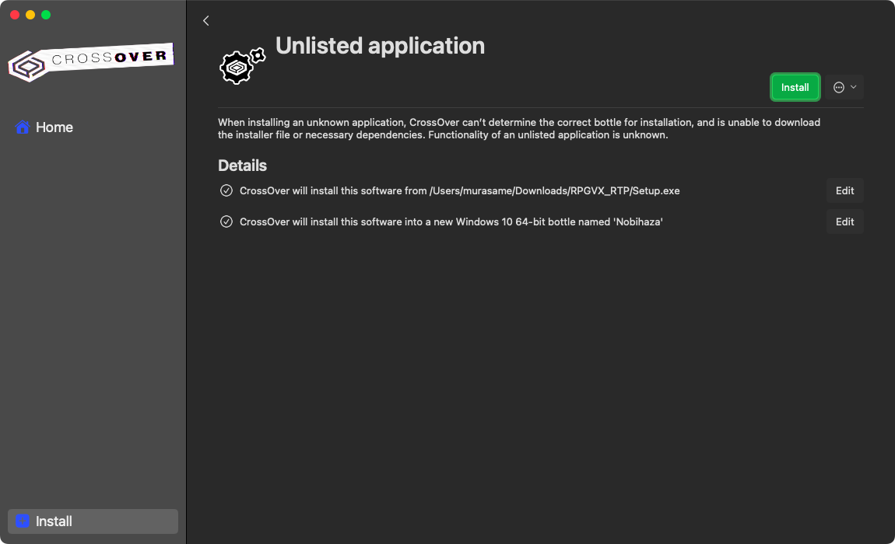

* Tiến hành cài đặt RTP như bình thường.

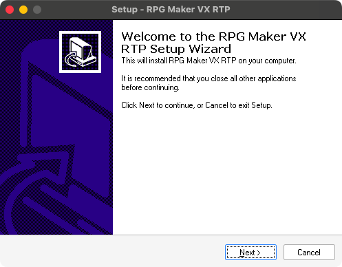

* Bottle mới đã được tạo và sẽ như hình ở bên dưới. Bật tuỳ chọn **DXVK** ở mục Advanced Settings lên trước.

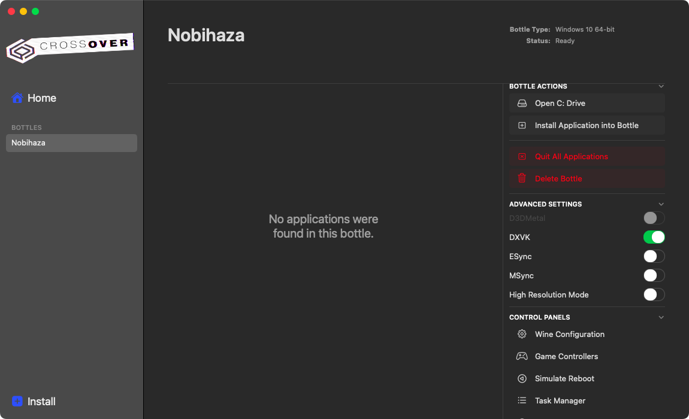

#### Chuyển vùng của CrossOver thành Nhật Bản

* Trong cửa sổ Finder của macOS, nhấn tổ hợp `Command + Shift + G` và nhập đường dẫn `/Users/tennguoidung/Library/Application Support/CrossOver/Bottles/Nobihaza`, trong đó `tennguoidung` là tên người dùng macOS của bạn, và `Nobihaza` là tên của bottle bạn đã đặt ở bên trên.

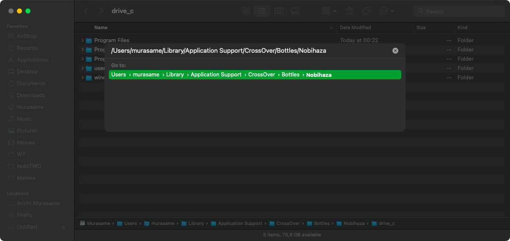

* Bạn sẽ thấy tệp tin `cxbottle.conf`. Nhấn chuột phải vào tệp tin đó và mở bằng TextEdit.

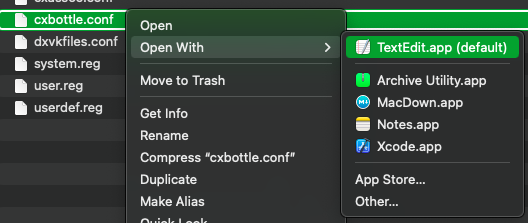

* Chuyển tới cuối tệp tin và bạn sẽ thấy mục `[EnvironmentVariables]`. Thêm các dòng sau ở cuối tệp tin:

```ini
"LANG" = "ja_JP.SJIS"
"LC_MESSAGES" = "ja_JP.SJIS"
"LC_ALL" = "ja_JP"
```

Sao cho cuối tệp tin sẽ như thế này:

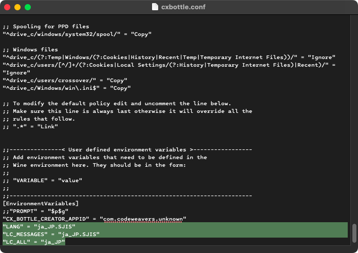

* Lưu lại tệp tin và thoát cửa sổ TextEdit.

#### Cài đặt RTP

* Trong cửa sổ CrossOver, nhấn vào nút **Install Application into Bottle** ở bên phải cửa sổ.

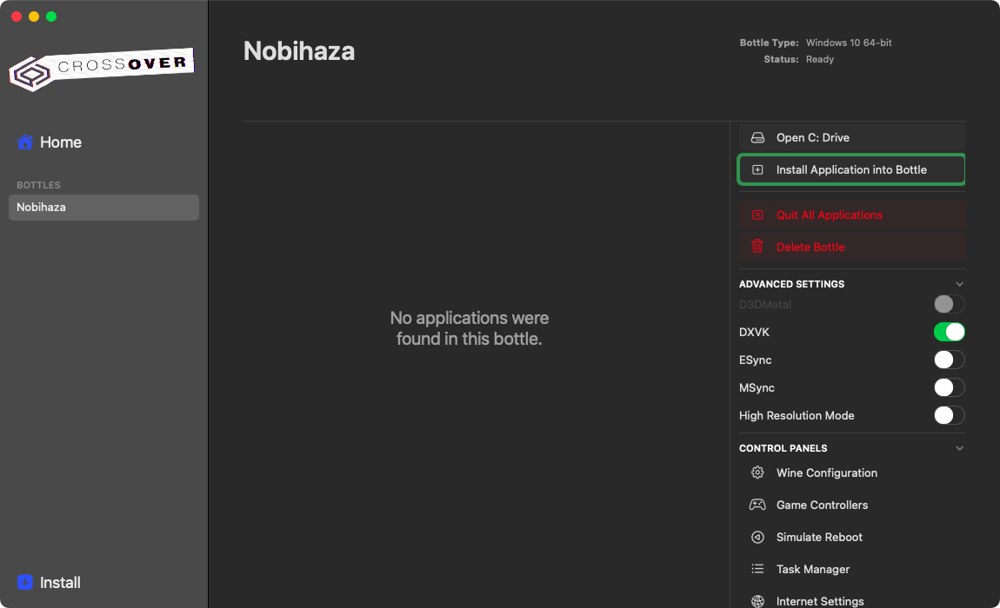

* Nhấn vào nút **Install an unlisted application** ở góc trên bên phải.

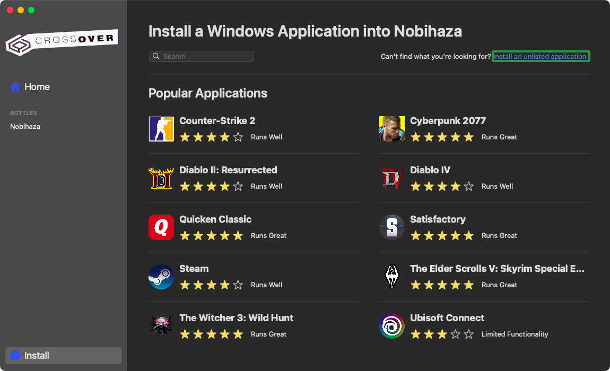

* Nhấn vào nút **Edit** ở bên trên.

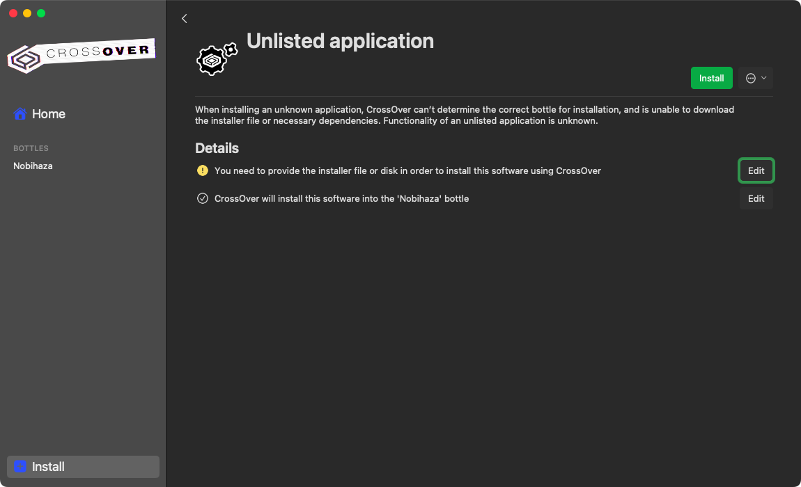

* Chọn tệp tin cài đặt của một RTP bất kì.

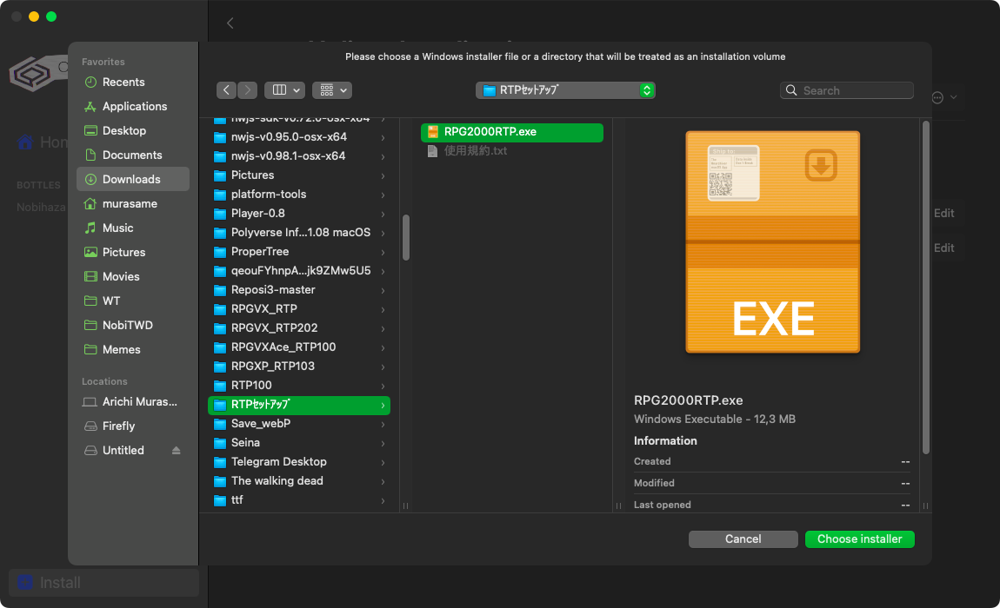

* Nhấn vào nút **Install** và tiến hành cài đặt như bình thường.

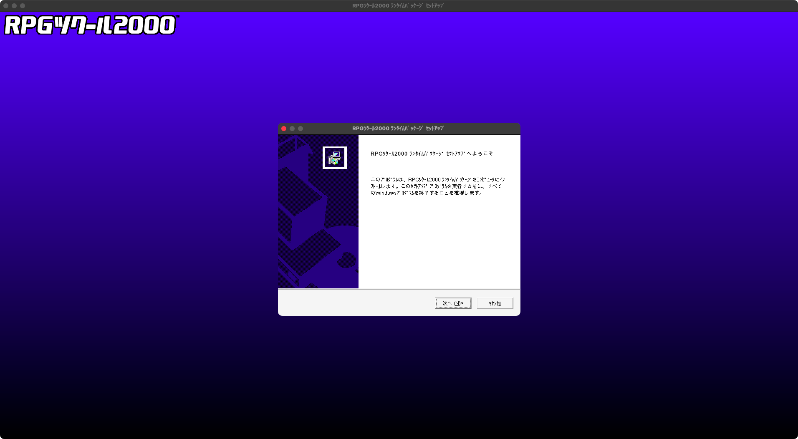

* Làm lại các bước trên với tất cả các RTP còn lại.

#### Chạy game trên CrossOver

* Trong cửa sổ CrossOver, nhấn vào nút **Run Command** ở bên phải cửa sổ.

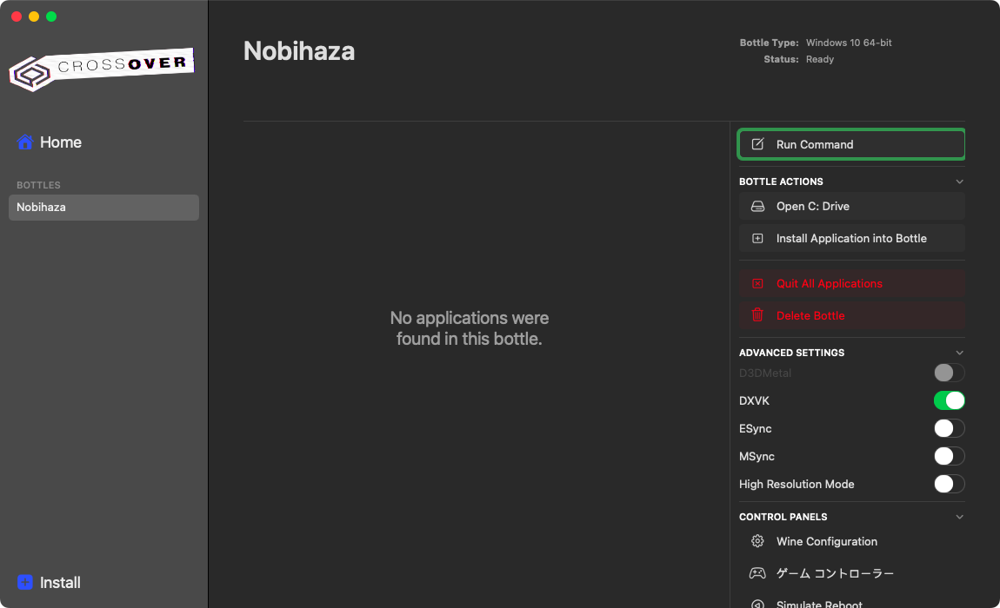

* Nhấn vào nút **Browse** ở cửa sổ **Run Command** và chọn tệp tin `.exe` của game trong thư mục game.

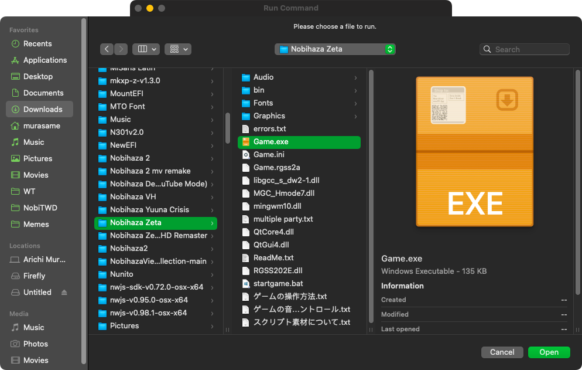

* Nhấn nút **Open** để khởi động game, và bạn có thể chơi như bình thường; hoặc nhấn nút **Save Command as a Launcher** để thêm game vào màn hình chính của CrossOver.

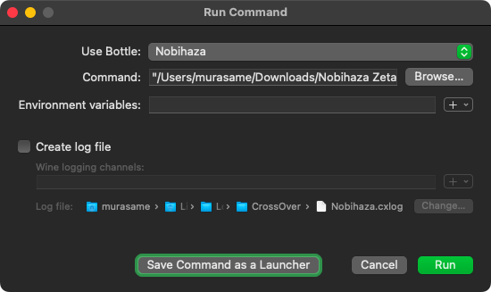

> [!NOTE]
> Nếu bạn thêm game ra ngoài màn hình chính của CrossOver, phần mềm sẽ ghi tên game bạn vừa thêm là `Game` (hoặc `RPG_RT` nếu là game RPG Maker 2000/2003) như ảnh dưới và không cho phép bạn đổi tên nên bạn hãy cẩn thận.
>
> 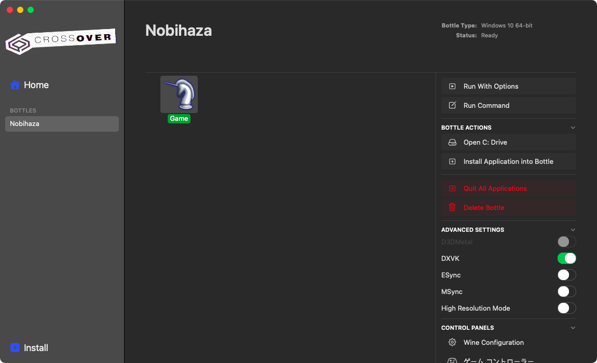

### Thay đổi biểu tượng cho game

#### Chuyển tệp biểu tượng sang `.icns`

* Vào [trang web để tải xuống icns creator](https://github.com/alptugan/icns-creator/releases/latest), và tải tệp tin `icns.creator.zip` xuống. Giải nén tệp tin đó và bạn sẽ thấy một ứng dụng có tên **icns creator**.

> [!NOTE]
> Ứng dụng **icns creator** yêu cầu macOS 11.0 trở lên. Nếu bạn đang sử dụng phiên bản macOS thấp hơn, bạn cũng có thể tìm công cụ chuyển đổi ảnh sang ICNS trên Internet.

* Kéo ảnh bạn muốn chuyển đổi vào cửa sổ của **icns creator**, hoặc bạn cũng có thể nhấn vào chữ **Browse** để chọn ảnh. Sau đó nhấn vào tab `.icns` để chuyển sang ICNS thay vì IconSet.

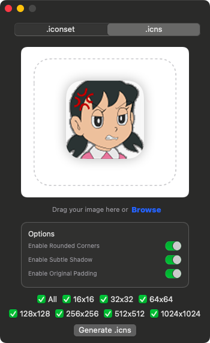

* Bỏ chọn hết tất cả, chỉ để lại tuỳ chọn **1024x1024**.

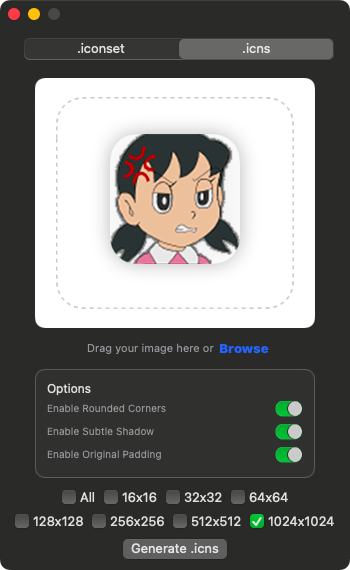

* Nhấn vào nút **Generate .icns** và chọn một thư mục để lưu tệp tin đã chuyển đổi. Truy cập vào thư mục vừa chọn và bạn sẽ thấy một tệp tin `.icns` mới có cùng tên với ảnh mà bạn đã chọn.

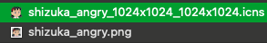

#### Đối với Kegworks

* Nếu bạn đang ở cửa sổ **Custom Executable Launcher Maker**, bạn có thể nhấn nút **Browse** ở mục **Icon to use** và chọn tệp tin `.icns` vừa mới tạo.

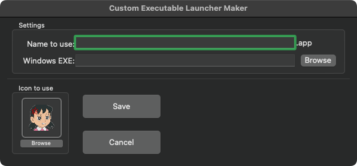

* Đối với game bạn đã tạo trước đó, hãy nhấn chuột phải vào tên game trong thư mục `Contents` và nhấn **Show Package Contents**.

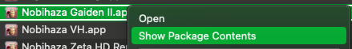

* Nhấn vào thư mục `Contents/Resources` và xoá tệp tin `Kegworks.icns` cũ đi.

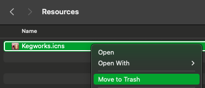

* Sao chép tệp tin `.icns` bạn đã tạo vào thư mục `Resources`, và đổi tên nó thành `Kegworks.icns`.

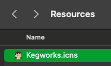

#### Đối với NW.js

* Nhấn chuột phải vào tên game và nhấn **Show Package Contents**.

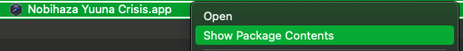

* Truy cập vào thư mục `Contents/Resources` của ứng dụng. Xoá 2 tệp `app.icns` và `document.icns`.

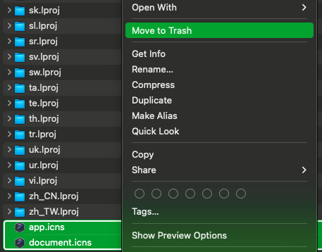

* Sao chép hai lần tệp tin `.icns` bạn đã tạo và đổi lần lượt thành `app.icns` và `document.icns`.

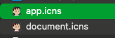

#### Xoá bộ nhớ đệm

macOS có lưu bộ nhớ đệm cho các biểu tượng, nên có thể biểu tượng của game vẫn chưa thay đổi ngay lập tức sau khi bạn đã thay đổi tệp `.icns`.

* Mở ứng dụng Terminal lên và nhập các dòng lệnh sau. Bạn sẽ được yêu cầu nhập mật khẩu của máy tính.

```sh
sudo rm -rfv /Library/Caches/com.apple.iconservices.store;
sudo find /private/var/folders/ \( -name com.apple.dock.iconcache -or -name com.apple.iconservices \) -exec rm -rfv {} \;;
sleep 3;
sudo touch /Applications/*;
killall Dock;
killall Finder
```

* Finder sẽ được khởi động lại, bạn có thể truy cập lại vào thư mục có chứa game và bạn sẽ thấy biểu tượng của game đã được đổi.

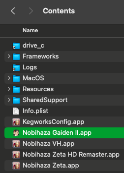

### Chạy game RPG Maker MV trên trình duyệt

Ở một số máy Mac thì việc sử dụng trình duyệt Chromium (trong đó có cả NW.js vì bản thân nó dựa trên Chromium) sẽ lag hơn so với sử dụng Firefox hoặc Safari, nên nếu máy bạn đang gặp phải vấn đề này thì bạn có thể thử chạy game trên các trình duyệt đó.

> [!CAUTION]
> Không phải game nào cũng sẽ chạy được bằng cách này. Nếu bạn gặp lỗi khi chơi phiên bản trình duyệt, bạn bắt buộc phải quay lại chơi bằng NW.js.

* Vào trang GitHub để tải công cụ **Simple HTTP Server** [tại đây](https://github.com/TheWaWaR/simple-http-server/releases), sau đó chọn tệp:
    * `x86_64-apple-darwin-simple-http-server` nếu bạn đang sử dụng máy Mac có CPU Intel;
    * `aarch64-apple-darwin-simple-http-server` nếu bạn đang sử dụng máy Mac có CPU Apple silicon (M1 trở lên).

> [!NOTE]
> Bạn có thể đổi tên tệp tin `*-apple-darwin-simple-http-server` thành tên dễ nhớ hơn.

* Mở ứng dụng Terminal lên và nhập dòng lệnh sau:

```sh
chmod +x ~/Downloads/*-apple-darwin-simple-http-server
~/Downloads/*-apple-darwin-simple-http-server --cors --index ~/game/www
```

Trong đó `~/Downloads/*-apple-darwin-simple-http-server` sẽ là đường dẫn tệp tin bạn mới tải xuống, và `~/game/www` là *thư mục `www` của thư mục game* (`Contents/Resources/app.nw` nếu bạn dùng NW.js, hoặc thư mục game sau khi bạn đã tải xuống và giải nén). Ví dụ như ảnh bên dưới:

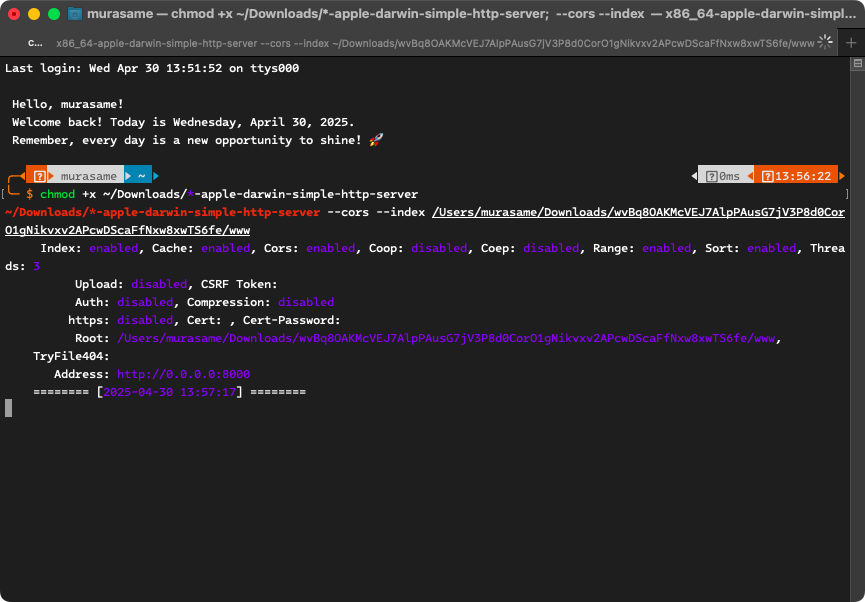

* Sao chép địa chỉ ở phần **Address** của cửa sổ đó, như ảnh bên trên là `http://0.0.0.0:8000` và dán vào trình duyệt. Game sẽ được khởi động và giờ bạn chỉ cần cầu nguyện là màn hình chính của game sẽ hiện lên.<br>Khi bạn không chơi game nữa thì có thể tắt cửa sổ Terminal đi.

> [!CAUTION]
> Firefox có thể sẽ bị treo ở màn hình Now Loading khi chơi game trên trình duyệt này, bạn có thể cấp quyền tự động phát âm thanh (Autoplay Audio) và tắt tính năng chặn theo dõi (Tracking Prevention) để giảm thiểu tình trạng này (nhưng cũng không đảm bảo là sẽ có thể sửa được hoàn toàn).

### Chuyển game Nobihaza sang máy Mac khác

Ứng dụng `Nobihaza` (hoặc tên khác mà bạn đã đặt ở mục **Điều kiện cơ bản**) đã chứa toàn bộ game và thư viện bạn đã cài đặt, nên bạn có thể chuyển ứng dụng này sang một máy Mac khác (cho người khác sử dụng hoặc là nếu bạn có một máy Mac khác).

* Đảm bảo là máy Mac đích cũng đã [cài đặt Kegworks Winery](1.%20%C4%90i%E1%BB%81u%20ki%E1%BB%87n%20c%C6%A1%20b%E1%BA%A3n.md#wine-v%C3%A0-kegworks) và đã có cùng **Wrapper Version** với **Engine** như bạn để tránh xảy ra lỗi nhiều nhất có thể. Bạn có thể xem ở mục **Wrapper Version** với **Engine** ở KegworksConfig.

* Sao chép ứng dụng `Nobihaza` (hoặc tên khác) trong thư mục `/Users/tennguoidung/Applications/Kegworks`, hoặc tạo một tệp tin nén nếu bạn đang muốn tải nó lên Internet.

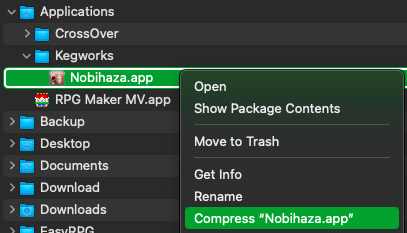

* Ở máy Mac đích, hãy cho ứng dụng vào cùng thư mục `/Users/tennguoidung/Applications/Kegworks`. Sau đó thì tất cả game từ máy Mac kia đã có thể chơi được trên máy Mac đích mà không cần cài đặt gì thêm.
