# Điều kiện cơ bản

Thật may mắn khi cài đặt Wine trên Linux sẽ dễ hơn macOS **rất nhiều**, nên khả năng hỗ trợ chơi game Nobihaza trên Linux cũng sẽ cao hơn so với macOS.

{: .important }
> Hiện tại chỉ có [**Doraemon: Nobita's Resident Evil 2 (Việt Hoá)**](https://nobi2.s1432.org) là hỗ trợ chính thức cho Linux, bạn có thể tải và chơi luôn mà không cần phải qua những bước rườm rà này.
>
> Ngoài game đó ra thì bạn cần có công cụ hỗ trợ để có thể chơi game:
> * **RPG Maker 2000/2003:** Sử dụng Wine hoặc EasyRPG (hỗ trợ chính thức cho Linux).
> * **RPG Maker XP/VX/VX Ace:** Sử dụng Wine hoặc MKXP (hỗ trợ chính thức cho Linux, nhưng khả năng tương thích rất thấp).
> * **RPG Maker MV/MZ:** Sử dụng NW.js (đa số game đều sẽ hỗ trợ chạy trên Linux, ngoại trừ một số game sẽ được liệt kê ở bên dưới).

{: .important }
> Bạn **bắt buộc** phải đọc kĩ hướng dẫn này để đảm bảo quá trình chơi game sẽ ít trục trặc nhất có thể.

{: .important }
> **Không phải game Windows nào cũng sẽ có thể chạy được trên Linux**. Nếu bạn gặp lỗi khi chạy game thì không còn cách nào khác, bạn bắt buộc phải liên hệ với nhà phát triển để yêu cầu một bản chính thức cho Linux (hoặc quay lại dùng Windows).

## Cài đặt ban đầu

### Phần mềm giải nén

{: .note }
> Bạn nên tìm hướng dẫn cài đặt cụ thể dành riêng cho distro của bạn. Ở đây mình sẽ chỉ hướng dẫn cơ bản và tập trung chủ yếu vào Ubuntu và Arch Linux.

Riêng Linux thì có một số trường hợp bạn sẽ cần cài đặt phần mềm giải nén thủ công. Nếu bạn không thể giải nén tệp nào thì hãy cài đặt thư viện của tệp đó.

#### Các thư viện

{: .caution }
> Các thư viện này là **BẮT BUỘC** phải cài đặt, cho dù bạn có dùng phần mềm giải nén có GUI hay không!

* Cài đặt các thư viện `zip` (dành cho tệp `.zip`), `unrar` (dành cho tệp `.rar`) và `p7zip-full` (dành cho tệp tin nén `.7z`):

##### Debian (hoặc là Ubuntu/Linux Mint)

```sh
sudo apt install zip unrar p7zip-full
```

##### Arch Linux (hoặc EndeavourOS)

```sh
sudo pacman -S zip unrar p7zip
```

##### Fedora

```sh
sudo dnf install https://download1.rpmfusion.org/free/fedora/rpmfusion-free-release-$(rpm -E %fedora).noarch.rpm
sudo dnf install zip unrar p7zip
```

##### openSUSE

```sh
sudo zypper install zip unrar p7zip
```

* Sau khi cài đặt xong, bạn đã có thể dùng các câu lệnh trên Terminal để giải nén các tệp tin. Tuy nhiên mình sẽ không hướng dẫn cụ thể ở đây, bạn có thể lên Google để tìm cách giải nén tệp tương ứng.

#### Phần mềm giải nén

Nếu bạn không thích sử dụng câu lệnh, bạn có thể cài đặt một phần mềm giải nén có giao diện người dùng (GUI). Mình khuyên dùng phần mềm Ark của KDE.

* Nếu bạn đang sử dụng các distro có sẵn KDE Plasma, thì khả năng cao là Ark cũng đã được cài đặt sẵn. Lúc này bạn không cần phải làm gì thêm.

* Tuy nhiên nếu chưa có Ark thì bạn có thể cài đặt nó dựa trên hướng dẫn dành cho distro của bạn, ví dụ như ở trên Arch Linux:

```sh
sudo pacman -S ark
```

* Giao diện của Ark khi mở một tệp tin nén sẽ như thế này. Lúc này bạn chỉ cần nhấn nút **Extract** để giải nén tệp tin đó ra.

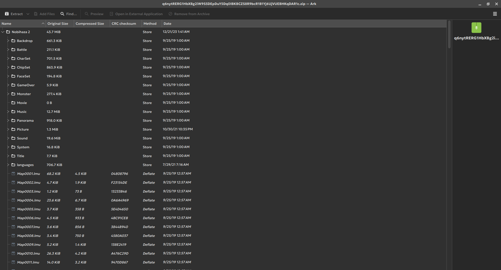

### Wine

**Wine** (viết tắt của **Wine Is Not Emulator**) là một lớp tương thích để chạy ứng dụng Windows trên các hệ điều hành khác. Chúng ta sẽ dùng Wine để chạy hầu hết các game Nobihaza trên Linux.

{: .note }
> Bạn nên tìm hướng dẫn cài đặt cụ thể dành riêng cho distro của bạn. Ở đây mình sẽ chỉ hướng dẫn cơ bản và tập trung chủ yếu vào Ubuntu và Arch Linux.

#### Debian (và các biến thể của nó như Ubuntu hoặc Linux Mint)

* Thêm khả năng hỗ trợ thư viện 32-bit:

```sh
sudo dpkg --add-architecture i386
```

* Thêm kho lưu trữ của WineHQ vào `apt`:

```sh
sudo mkdir -pm755 /etc/apt/keyrings
sudo wget -O /etc/apt/keyrings/winehq-archive.key https://dl.winehq.org/wine-builds/winehq.key
sudo wget -NP /etc/apt/sources.list.d/ https://dl.winehq.org/wine-builds/ubuntu/dists/$(lsb_release -sc)/winehq-$(lsb_release -sc).sources
```

* Cập nhật lại kho lưu trữ của `apt`:

```sh
sudo apt update
```

* Cuối cùng là cài đặt Wine bản ổn định:

```sh
sudo apt install --install-recommends winehq-stable
```

#### Arch Linux (và các biến thể của nó như EndeavourOS hoặc Manjaro Linux)

* Mở tệp tin `/etc/pacman.conf` dưới quyền root, rồi sau đó bỏ dấu `#` ở đầu 2 dòng sau:

```ini
#[multilib]
#Include = /etc/pacman.d/mirrorlist
```

thành:

```ini
[multilib]
Include = /etc/pacman.d/mirrorlist
```

như ảnh bên dưới:


* Lưu tệp tin lại và bắt đầu cài đặt Wine:

```sh
sudo pacman -Syu wine
```

#### Fedora

Fedora đã có sẵn Wine trên kho lưu trữ nên bạn chỉ cần cài đặt là được.

```sh
sudo dnf install wine
```

#### openSUSE

* Thêm kho lưu trữ của Wine vào Zypper:

```sh
sudo zypper addrepo https://download.opensuse.org/repositories/Emulators:/Wine/openSUSE_Tumbleweed/Emulators:Wine.repo
```

* Cập nhật lại kho lưu trữ:

```sh
sudo zypper refresh
```

* Tiến hành cài đặt Wine cho openSUSE:

```sh
sudo zypper install wine
```

### Flatpak

{: .tip }
> Nếu bạn có am hiểu về Linux và không muốn cài Flatpak với Bottles, bạn có thể qua phần [Cài đặt nâng cao](4.%20Cài%20đặt%20nâng%20cao.md) để cài đặt trực tiếp trên máy mà không thông qua phần mềm hỗ trợ.

Flatpak sẽ cần thiết để cài đặt Bottles và có thể là một số ứng dụng khác về sau này.

* Truy cập vào [trang web của Flatpak](https://flatpak.org/setup), và chọn distro bạn đang sử dụng.

* Tiến hành làm theo hướng dẫn của Flatpak dành cho distro của bạn, ví dụ như ở đây là dành cho Arch Linux:


### Bottles

**Bottles** sẽ là ứng dụng hỗ trợ bạn có thể chạy game trên Wine được dễ dàng hơn.

* Cài đặt Bottles thông qua Flatpak:

{: .tip }
> Nếu distro của bạn có tích hợp sẵn cửa hàng ứng dụng hỗ trợ Flatpak (như Discover của KDE), bạn có thể cài đặt Bottles thông qua cửa hàng đó thay vì sử dụng dòng lệnh.

```sh
flatpak install com.usebottles.bottles
```

* Nhập `Y` và nhấn Enter để đồng ý việc cài đặt Bottles. Bạn sẽ cần làm bước này 2 lần.


* Sau khi cài đặt xong, chạy phần mềm Bottles từ danh sách ứng dụng của bạn.

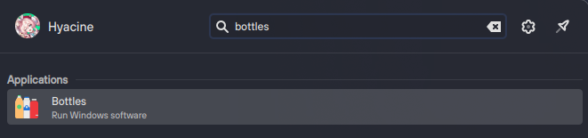

* Đợi cho quá trình cài đặt ban đầu được hoàn tất. Sau đó nhấn vào dấu cộng ở góc trên bên trái để tạo một Bottle mới.

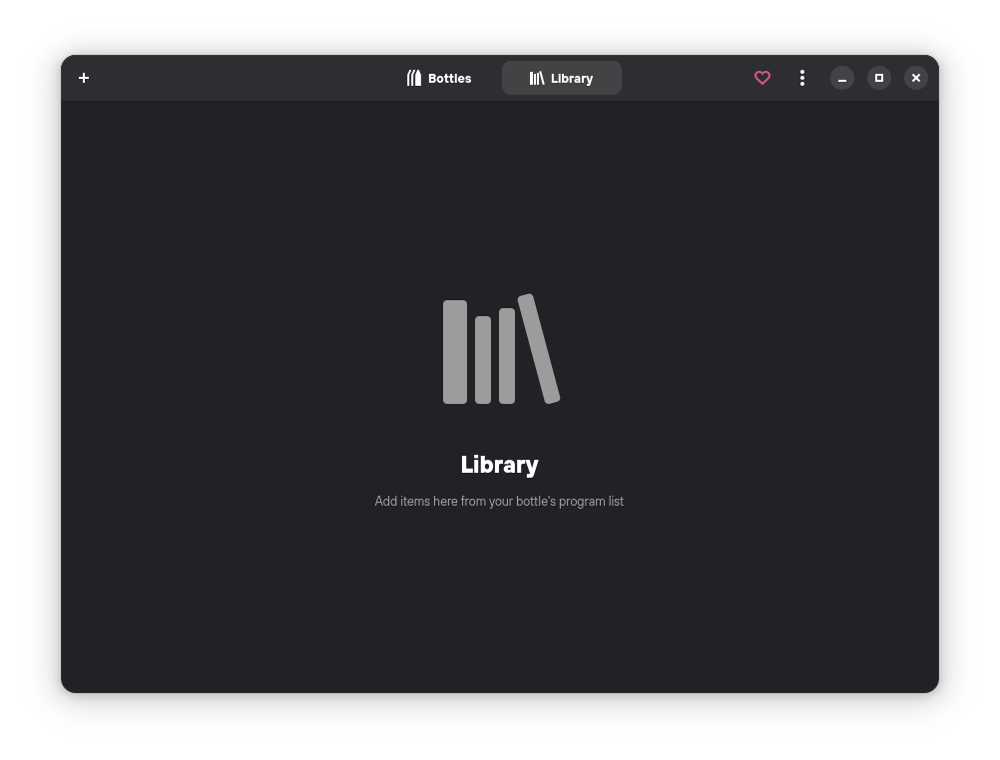

* Nhập tên của Bottle (Name) là tên theo ý thích của bạn (ở đây là **Nobihaza**) và chọn mục **Gaming** để bottle sẽ được tối ưu cho game. Thông tin còn lại chúng ta giữ nguyên. Nhấn nút **Create** để tiến hành tạo.

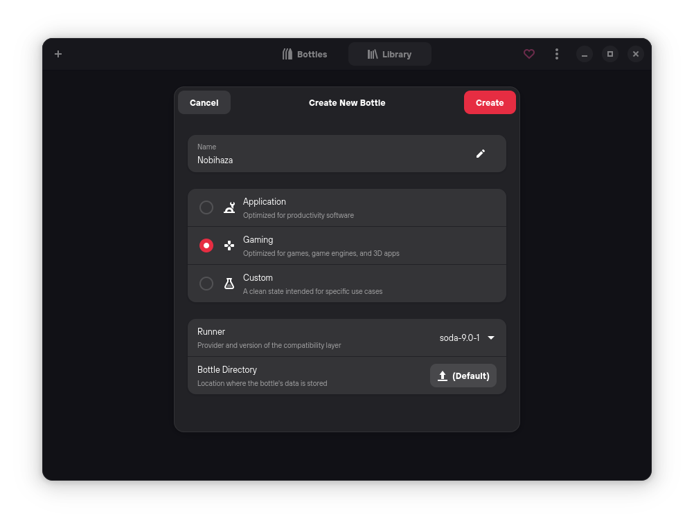

* Đợi cho Bottles cài đặt các thư viện cần thiết cho bottle mới.

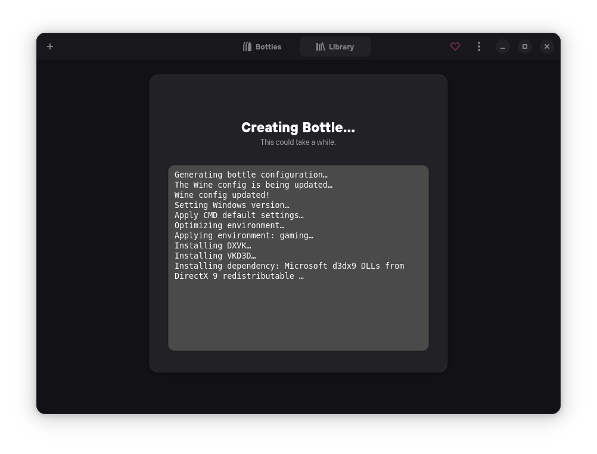

* Nhấn **Close** khi thông báo **Bottles Created** hiện ra. Sau đó chuyển qua tab **Bottles** và chọn tên của Bottle bạn vừa tạo.

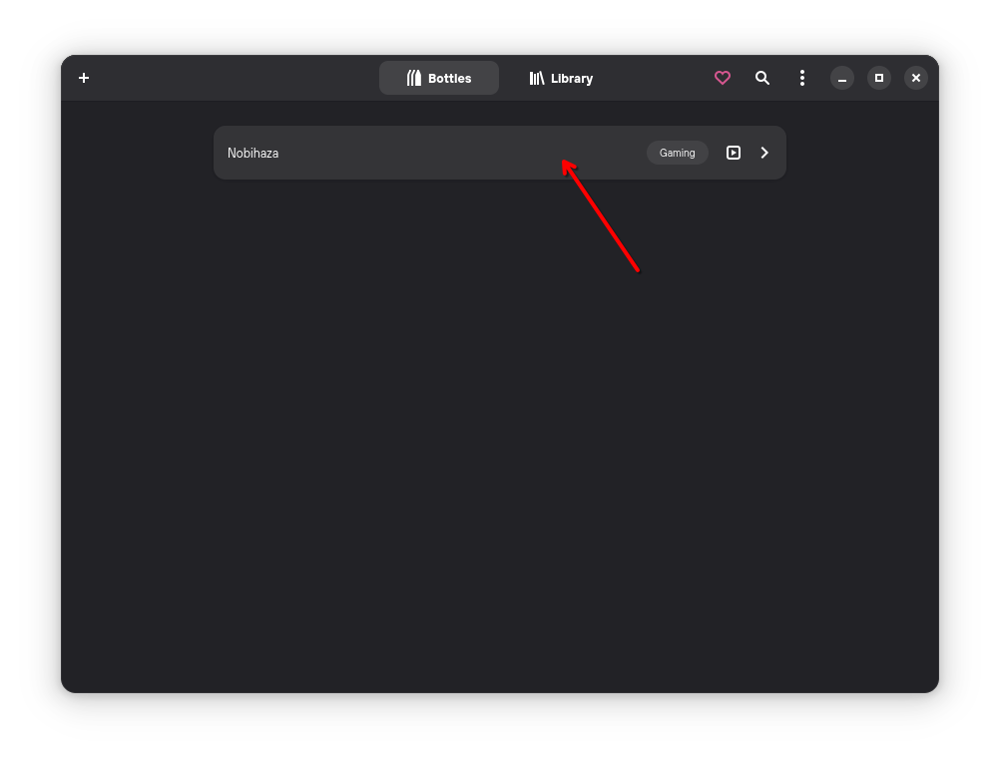

### Các thư viện cần thiết

Có rất nhiều game sẽ cần các thư viện này, nên bạn hãy cài đặt hết nếu có thể nhé.

* Chọn Bottle bạn đã tạo trong phần **Bottles** của ứng dụng Bottles.

* Nhấn vào mục **Dependencies**.

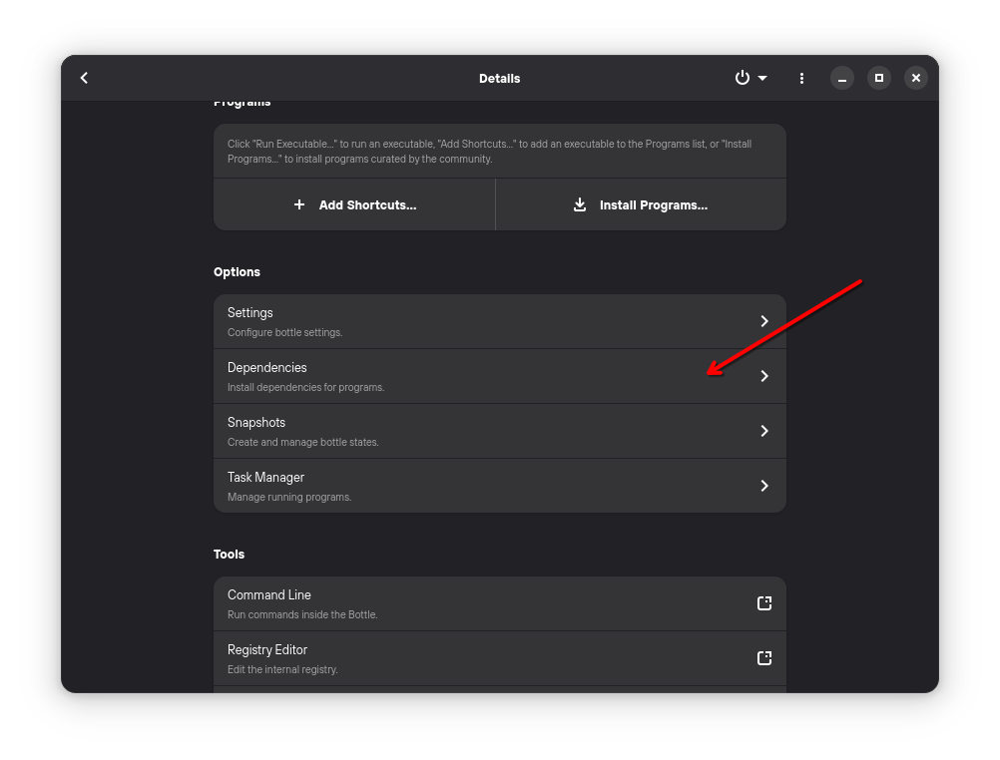

* Nhấn vào nút tìm kiếm và tìm kiếm chữ `vcredist`. Sau đó cài đặt các thư viện sau trong danh sách kết quả tìm kiếm ở bên dưới: `vcredist2005`, `vcredist2008`, `vcredist2010`, `vcredist2012`, `vcredist2013`, `vcredist2019`.

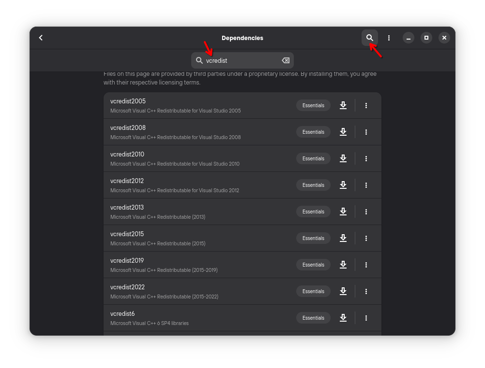

* Tìm kiếm chữ `dsound` và cài đặt giống như thư viện trước.

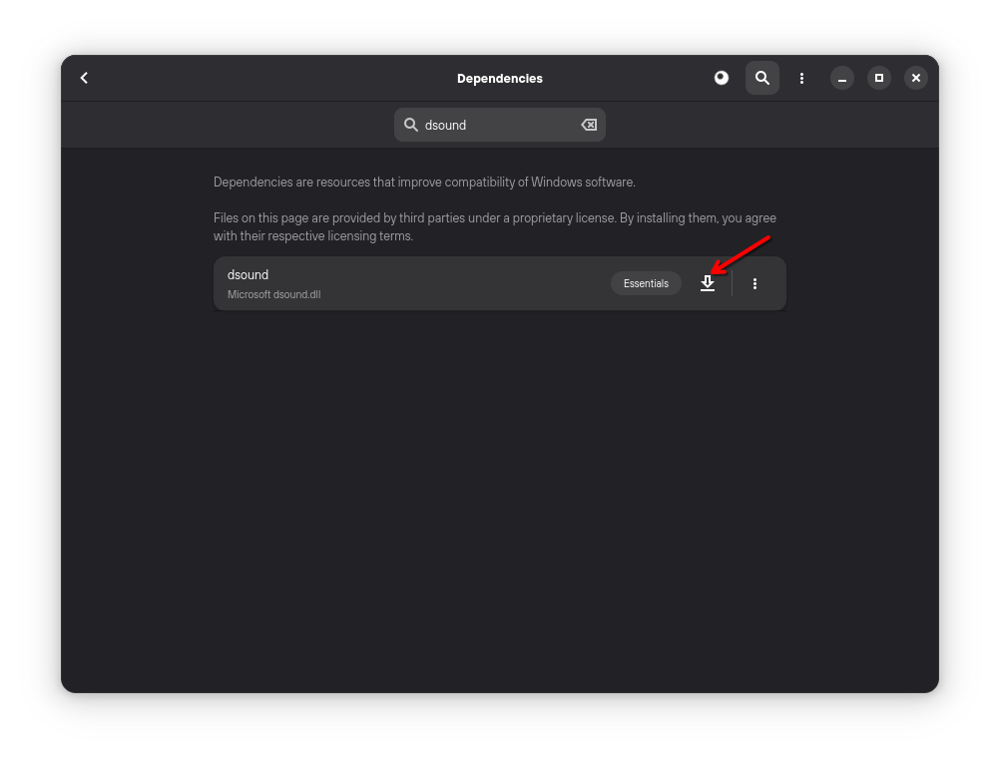

* Làm tương tự với `cjkfonts`, `directmusic`, `dmsynth`, `gmdls` và `dsdmo`.

### Chuyển vùng của Bottle thành Nhật Bản

Đa số game Nobihaza sẽ là game Nhật (hoặc là được dịch từ tiếng Nhật) nên bạn cần để vùng của Bottle là Nhật Bản để tránh xảy ra lỗi nhất có thể.

* Chọn Bottle bạn đã tạo trong phần **Bottles** của ứng dụng Bottles.

* Nhấn vào mục **Settings**.

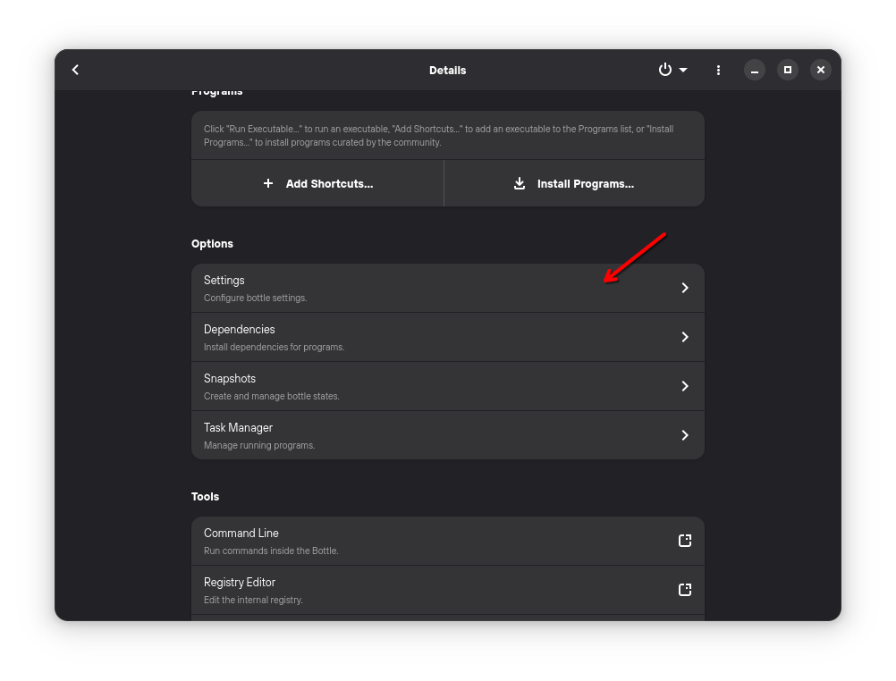

* Kéo xuống phần **Language** và chọn **Japanese**.

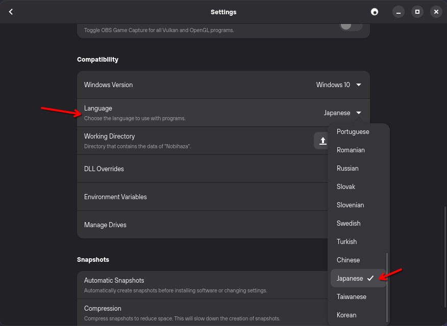

### Cấp quyền truy cập tệp tin cho Bottles

Do Bottles đang chạy thông qua Flatpak, nên ban đầu Flatpak sẽ ngăn không cho Bottles truy cập vào các dữ liệu và thư mục khác của người dùng. Lúc này thì bạn có 2 lựa chọn:

#### Cấp quyền truy cập vào thư mục cụ thể chứa game Nobihaza

{: .important }
> Game và các thư viện chỉ có thể chạy ở các thư mục đã được cấp quyền bằng lệnh bên dưới.

Đây là cách tốt nhất để đảm bảo tính bảo mật mà không động đến các thư mục khác.

* Tạo một thư mục riêng bất kì trên máy tính, và bạn sẽ cho toàn bộ game Nobihaza vào trong thư mục này. Ví dụ như của mình là `/home/hyacine/Nobihaza`.

* Mở **Terminal** lên và gõ dòng lệnh sau:

```sh
sudo flatpak override com.usebottles.bottles --filesystem="/home/hyacine/Nobihaza"
```

* Nếu không có bất kì lỗi nào được in ra thì quá trình cấp quyền đã thành công.

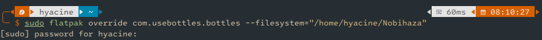

#### Cấp quyền truy cập vào toàn bộ thư mục của người dùng

Làm việc này thì Bottles và các ứng dụng được chạy thông qua nó sẽ có quyền truy cập vào toàn bộ thư mục người dùng của bạn.

* Mở **Terminal** lên và gõ dòng lệnh sau:

```sh
sudo flatpak override com.usebottles.bottles --filesystem="/home/$USER"
```

* Bằng cách này thì Bottles sẽ có toàn quyền truy cập tất cả thư mục trong `/home/$USER`. Ví dụ như tên người dùng của bạn là `hyacine` thì sẽ là `/home/hyacine`, và lúc đó bạn có thể tải game vào bất kì thư mục nào trong `/home/hyacine`.

{: .tip }
> Nếu bạn muốn cấp quyền cho các game được cài đặt vào phân vùng riêng chứa dữ liệu, bạn có thể thay thế `/home/$USER` bằng địa chỉ của phân vùng đó.

## RPG Maker 2000/2003

### Gói khởi chạy (RTP) tiếng Nhật

* Tải xuống [RTP 2000 tiếng Nhật](https://cdn.tkool.jp/updata/rtp/2000rtp.zip) và [RTP 2003 tiếng Nhật](https://cdn.tkool.jp/updata/rtp/2003rtp.zip).

* Giải nén cả hai tệp tin `2000rtp.zip` và `2003rtp.zip`.

* Chọn Bottle bạn đã tạo trong phần **Bottles** của ứng dụng Bottles. Sau đó nhấn nút **Run Executable** ở trên cùng của cửa sổ Bottles.

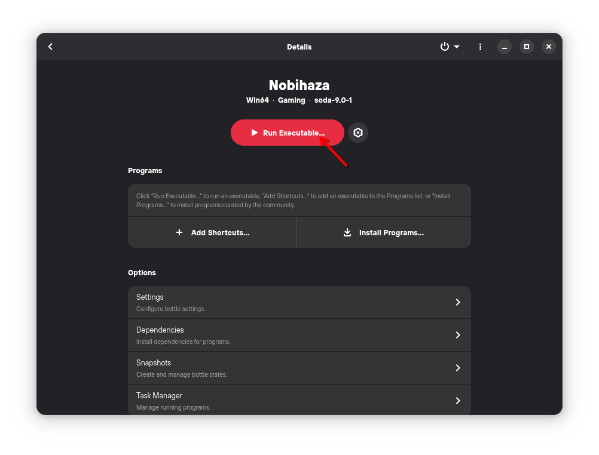

* Chọn tệp tin `RPG2000RTP.exe` trong thư mục `RTPｾｯﾄｱｯﾌﾟ` bạn đã giải nén trước đó.

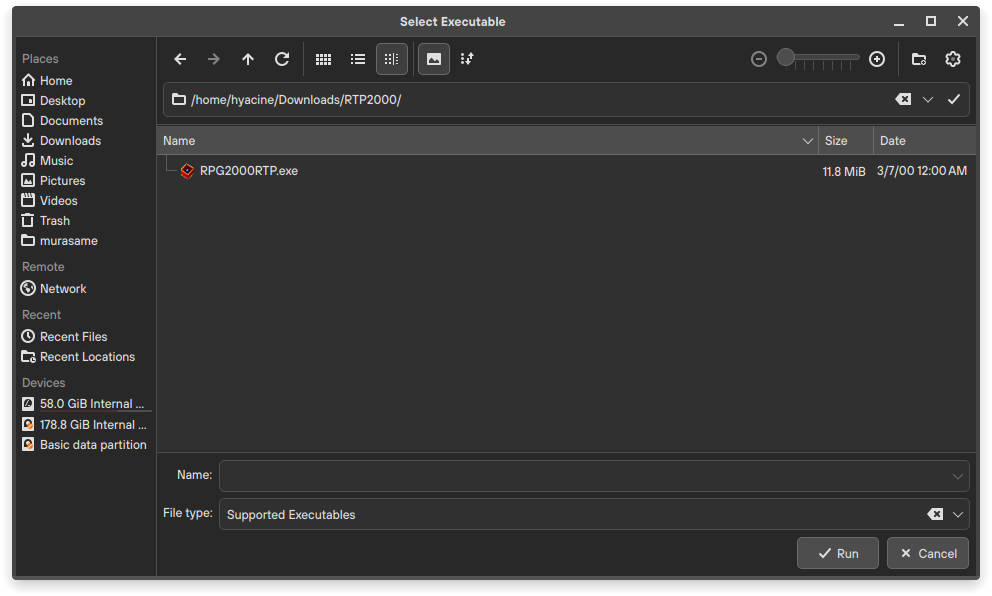

{: .tip }
> Nếu bạn gặp lỗi **Invalid name** khi chạy tệp `RPG2000RTP.exe`, hãy thử di chuyển tệp tin đó sang một thư mục khác không có kí tự đặc biệt.

* Nhấn vào nút Next (có chữ N) liên tục và đợi cho đến khi quá trình cài đặt hoàn tất như ảnh bên dưới.

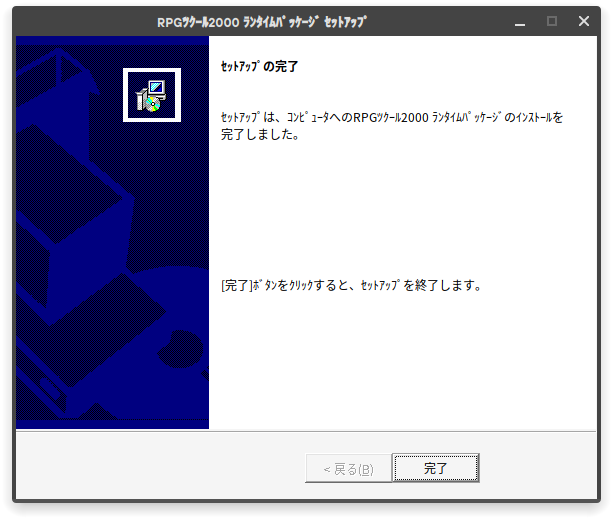

* Làm tương tự với tệp `RPG2003RTP.exe` trong thư mục `2003RTPｾｯﾄｱｯﾌﾟ`.

### Gói khởi chạy (RTP) tiếng Anh

Một số game Nobihaza tiếng Anh đặc thù cũng sẽ cần gói khởi chạy này.

* Tải xuống [RTP 2000 tiếng Anh](https://dl.komodo.jp/rpgmakerweb/run-time-packages/rpg2000_rtp_installer.exe) và [RTP 2003 tiếng Anh](https://dl.komodo.jp/rpgmakerweb/run-time-packages/rpg2003_rtp_installer.zip).

* RTP 2000 sẽ là tệp `.exe` nên bạn không cần giải nén, nhưng bạn sẽ cần giải nén RTP 2003. Sau đó, tiến hành cài giống như phiên bản tiếng Nhật.

### EasyRPG

EasyRPG hỗ trợ chính thức cho Linux nên bạn sẽ không cần phải dùng Wine để cài đặt.

* [Tải bản EasyRPG dành cho Linux](https://github.com/The-Firefly-Project/EasyRPGPlayer-Vietnamese/releases/download/0.8.1.1/linux.tar.gz).

* Giải nén tệp tin `.tar.gz` đã tải, và bạn sẽ thấy một tệp tin tên là `easyrpg-player`.

* Bạn có thể:
    * Copy vào thư mục game và chạy chính ứng dụng này để chơi.
    * Copy vào thư mục mẹ chứa các game Nobihaza của bạn. Khi chạy ứng dụng `easyrpg-player`, bạn sẽ có thể chọn game để chơi mỗi lần chạy.

{: .tip }
> Nếu bạn không thể chạy tệp tin `easyrpg-player`, hãy cấp quyền khởi chạy (Execute) cho tệp tin này, hoặc chạy nó thông qua Terminal.

## RPG Maker XP/VX/VX Ace

Gần như không có game Nobihaza nào chạy bằng RPG Maker XP, nhưng bạn vẫn nên cài nếu bạn gặp phải một game có sử dụng phần mềm làm game này. Còn VX với VX Ace thì sẽ có rất nhiều nên bạn hãy cài đầy đủ tất cả nhé.

### Gói khởi chạy (RTP) tiếng Nhật

* Tải RTP tiếng Nhật cho:
    * [RPG Maker XP](https://cdn.tkool.jp/updata/rtp/xp_rtp103.zip)
    * [RPG Maker VX](https://cdn.tkool.jp/updata/rtp/vx_rtp202.zip)
    * [RPG Maker VX Ace](https://cdn.tkool.jp/updata/rtp/vxace_rtp100.zip)

* Giải nén các tệp tin vừa tải xuống ra. Bạn sẽ nhận được 3 thư mục chứa tệp cài đặt RTP của 3 phần mềm làm game.

* Nhấn vào nút **Run Executable** và chọn tệp tin `Setup.exe` trong thư mục `RPGXP_RTP103`.

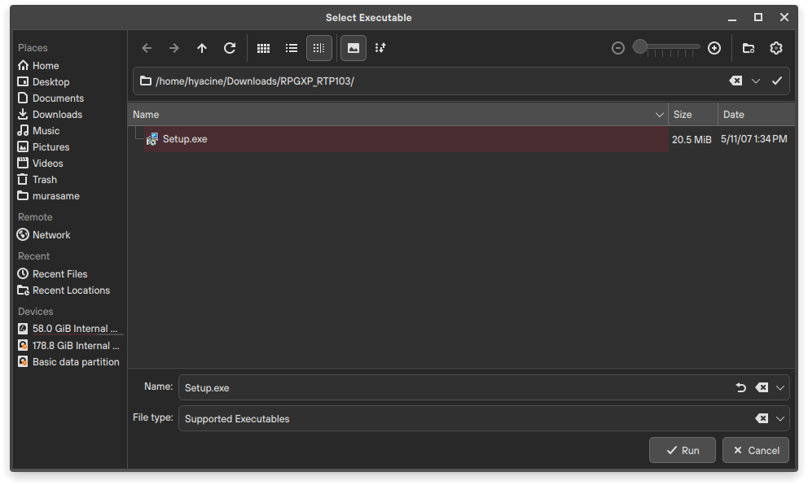

* Nhấn Next (nút đầu tiên có chữ N), cho đến khi có màn hình này thì tức là đã cài đặt thành công.

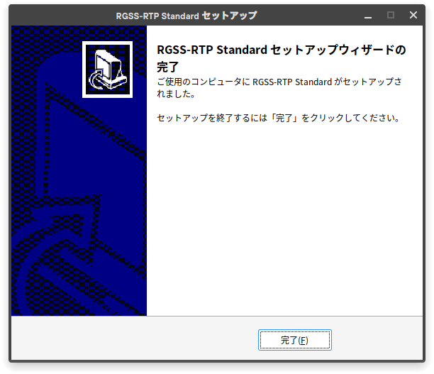

#### RPG Maker VX

Sau khi nhấn nút **Run Executable**, hãy chọn tệp `Setup.exe` trong thư mục `RPGVX_RTP202` và làm tương tự như RPG Maker XP.

#### RPG Maker VX Ace

Sau khi nhấn nút **Run Executable**, hãy chọn tệp `Setup.exe` trong thư mục `RPGVXAce_RTP100` và làm tương tự như 2 phần mềm trên.

### Gói khởi chạy (RTP) tiếng Anh

* Tải RTP tiếng Anh cho:
    * [RPG Maker XP](https://dl.komodo.jp/rpgmakerweb/run-time-packages/xp_rtp104e.exe)
    * [RPG Maker VX](https://dl.komodo.jp/rpgmakerweb/run-time-packages/vx_rtp102e.zip)
    * [RPG Maker VX Ace](https://dl.komodo.jp/rpgmakerweb/run-time-packages/RPGVXAce_RTP.zip)

* Sau đó giải nén và cài đặt tương tự như RTP tiếng Nhật.

## RPG Maker MV

{: .important }
> Một số game sẽ **không thể** chạy được trên macOS nếu như bạn không sửa dữ liệu của game (yêu cầu phải có kiến thức về lập trình JavaScript) do các game này có sử dụng thư viện chỉ dành cho Windows. Xem thêm tại mục [Tình trạng hỗ trợ](../Tình%20trạng%20hỗ%20trợ.md).

Đối với macOS thì việc tải NW.js xuống là bắt buộc.

* Truy cập vào [trang web tải xuống của NW.js](https://nwjs.io/downloads).

* Chọn phiên bản **NORMAL** cho phiên bản Linux của bạn (32-bit hoặc 64-bit).

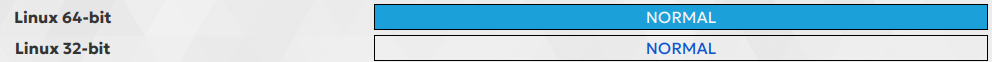

# Sau khi đã hoàn tất, hãy tới phần [Tải và chạy game](./installing)