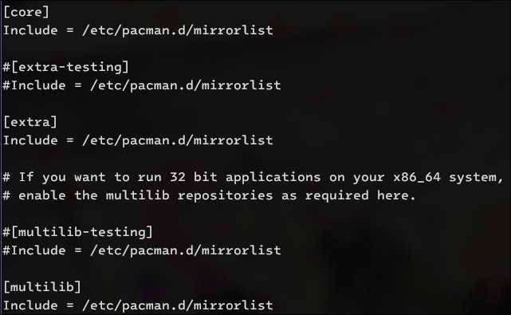
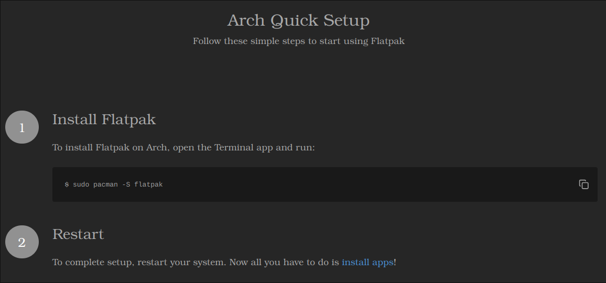
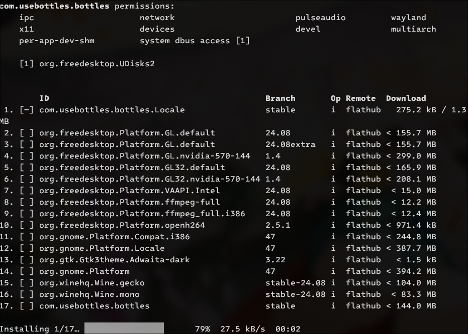

# Điều kiện cơ bản

Thật may mắn khi cài đặt Wine trên Linux sẽ dễ hơn macOS **rất nhiều**, nên khả năng hỗ trợ chơi game Nobihaza trên Linux cũng sẽ cao hơn so với macOS.

> [!IMPORTANT]
> Hiện tại chỉ có [**Doraemon: Nobita's Resident Evil 2 (Việt Hoá)**](https://nobi2.s1432.org) là hỗ trợ chính thức cho Linux, bạn có thể tải và chơi luôn mà không cần phải qua những bước rườm rà này.
>
> Ngoài game đó ra thì bạn cần có công cụ hỗ trợ để có thể chơi game:
> * **RPG Maker 2000/2003:** Sử dụng Wine hoặc EasyRPG (hỗ trợ chính thức cho Linux).
> * **RPG Maker XP/VX/VX Ace:** Sử dụng Wine hoặc MKXP (hỗ trợ chính thức cho Linux, nhưng khả năng tương thích rất thấp).
> * **RPG Maker MV/MZ:** Sử dụng NW.js (đa số game đều sẽ hỗ trợ chạy trên Linux, ngoại trừ một số game sẽ được liệt kê ở bên dưới).

> [!IMPORTANT]
> Bạn **bắt buộc** phải đọc kĩ hướng dẫn này để đảm bảo quá trình chơi game sẽ ít trục trặc nhất có thể.

> [!IMPORTANT]
> **Không phải game Windows nào cũng sẽ có thể chạy được trên Linux**. Nếu bạn gặp lỗi khi chạy game thì không còn cách nào khác, bạn bắt buộc phải liên hệ với nhà phát triển để yêu cầu một bản chính thức cho Linux.

## Cài đặt ban đầu

### Wine

**Wine** (viết tắt của **Wine Is Not Emulator**) là một lớp tương thích để chạy ứng dụng Windows trên các hệ điều hành khác. Chúng ta sẽ dùng Wine để chạy hầu hết các game Nobihaza trên Linux.

> [!NOTE]
> Bạn nên tìm hướng dẫn cài đặt cụ thể dành riêng cho distro của bạn. Ở đây mình sẽ chỉ hướng dẫn cơ bản và tập trung chủ yếu vào Ubuntu và Arch Linux.

#### Debian (và các biến thể của nó như Ubuntu hoặc Linux Mint)

* Thêm khả năng hỗ trợ thư viện 32-bit:

```sh
sudo dpkg --add-architecture i386
```

* Thêm kho lưu trữ của WineHQ vào `apt`:

```sh
sudo mkdir -pm755 /etc/apt/keyrings
sudo wget -O /etc/apt/keyrings/winehq-archive.key https://dl.winehq.org/wine-builds/winehq.key
sudo wget -NP /etc/apt/sources.list.d/ https://dl.winehq.org/wine-builds/ubuntu/dists/$(lsb_release -sc)/winehq-$(lsb_release -sc).sources
```

* Cập nhật lại kho lưu trữ của `apt`:

```sh
sudo apt update
```

* Cuối cùng là cài đặt Wine bản ổn định:

```sh
sudo apt install --install-recommends winehq-stable
```

#### Arch Linux (và các biến thể của nó như EndeavourOS hoặc Manjaro Linux)

* Mở tệp tin `/etc/pacman.conf` dưới quyền root, rồi sau đó bỏ dấu `#` ở đầu 2 dòng sau:

```ini
#[multilib]
#Include = /etc/pacman.d/mirrorlist
```

thành:

```ini
[multilib]
Include = /etc/pacman.d/mirrorlist
```

như ảnh bên dưới:



* Lưu tệp tin lại và bắt đầu cài đặt Wine:

```sh
sudo pacman -Syu wine
```

#### Fedora

Fedora đã có sẵn Wine trên kho lưu trữ nên bạn chỉ cần cài đặt là được.

```sh
sudo dnf install wine
```

#### openSUSE

* Thêm kho lưu trữ của Wine vào Zypper:

```sh
sudo zypper addrepo https://download.opensuse.org/repositories/Emulators:/Wine/openSUSE_Tumbleweed/Emulators:Wine.repo
```

* Cập nhật lại kho lưu trữ:

```sh
sudo zypper refresh
```

* Tiến hành cài đặt Wine cho openSUSE:

```sh
sudo zypper install wine
```

### Flatpak

Flatpak sẽ cần thiết để cài đặt Bottles và có thể là một số ứng dụng khác về sau này.

* Truy cập vào [trang web của Flatpak](https://flatpak.org/setup), và chọn distro bạn đang sử dụng.

* Tiến hành làm theo hướng dẫn của Flatpak dành cho distro của bạn, ví dụ như ở đây là dành cho Arch Linux:



### Bottles

**Bottles** sẽ là ứng dụng hỗ trợ bạn có thể chạy game trên Wine được dễ dàng hơn.

* Cài đặt Bottles thông qua Flatpak:

```sh
flatpak install com.usebottles.bottles
```

* Nhập `Y` và nhấn Enter để đồng ý việc cài đặt Bottles. Bạn sẽ cần làm bước này 2 lần.


