# Tải và chạy game

Gần như không có game nào hỗ trợ chính thức trên Linux cả (trường hợp ngoại lệ duy nhất là **Doraemon: Nobita's Resident Evil 2 (Việt Hóa)**).

## Tải game xuống

> [!IMPORTANT]
> Nếu game không hỗ trợ cho Linux, bạn **bắt buộc** phải tải bản game dành cho hệ điều hành Windows 64-bit và cài đặt thông qua Bottles (hoặc NW.js nếu là game RPG Maker MV).

Để tải xuống, bạn chỉ cần vào trang web và tải bản game xuống. Đó có thể là tệp tin nén (`.zip`, `.rar`, `.7z`) hoặc tệp tin `.exe` (nếu là bản dành cho Windows).

## Giải nén game

* Mở tệp tin nén của bạn bằng phần mềm giải nén bạn tự chọn, ở đây mình sẽ chọn **Ark** của KDE. Nhấn vào nút **Extract** ở góc trên bên trái màn hình.

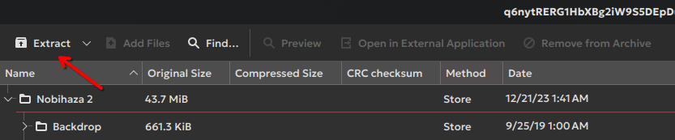

* Một bảng chọn sẽ xuất hiện, hãy chọn thư mục bạn muốn giải nén rồi nhấn **Extract**.

> [!TIP]
> Nếu bạn đã chọn thư mục nhưng không thể nhấn được nút Extract, hãy nhập dấu chấm (.) vào mục **Name** rồi nhấn nút **Extract** để giải nén vào thư mục đã chọn.

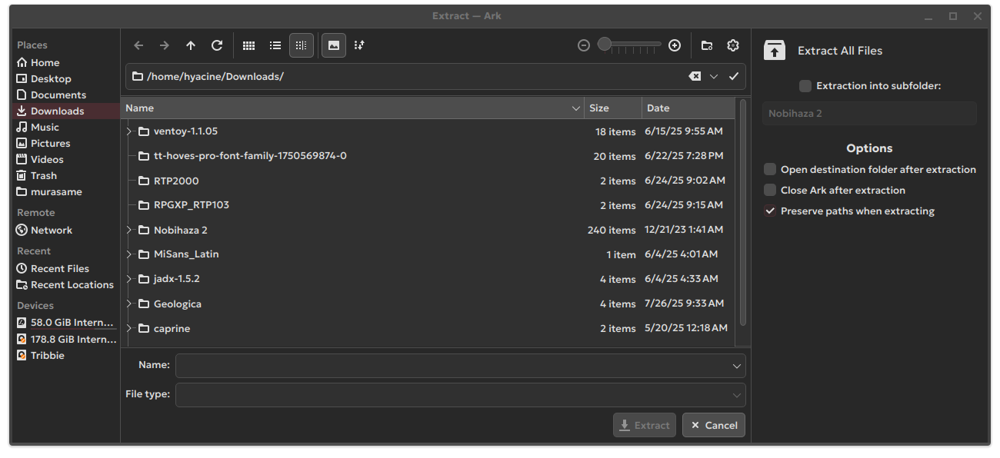

## RPG Maker 2000/2003

### Chạy bằng tệp `RPG_RT.exe`

* Mở ứng dụng **Bottles** lên và chọn Bottle mà bạn đã cài ở mục Điều kiện cơ bản.

* Nhấn vào mục **Add Shortcuts**.

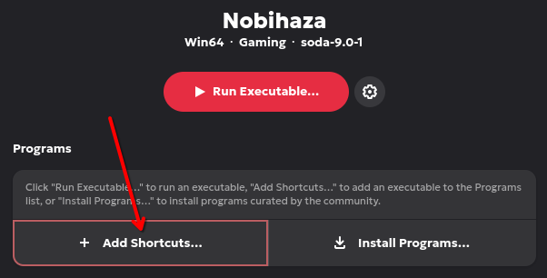

* Chọn tệp tin `RPG_RT.exe` trong thư mục bạn đã giải nén.

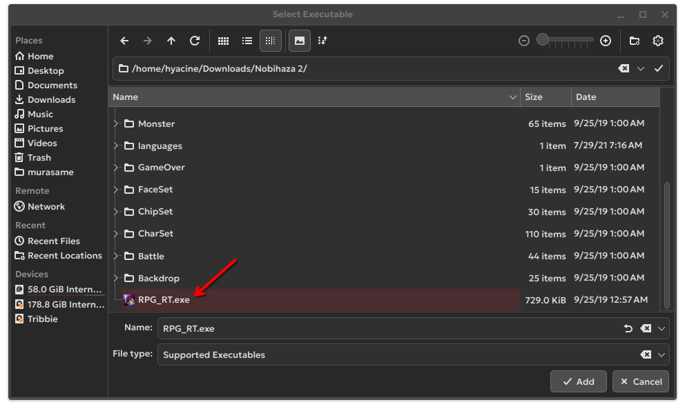

* Một mục mới có tên `RPG_RT` sẽ xuất hiện. Nhấn vào dấu ba chấm ở bên phải mục đó và chọn **Rename**.

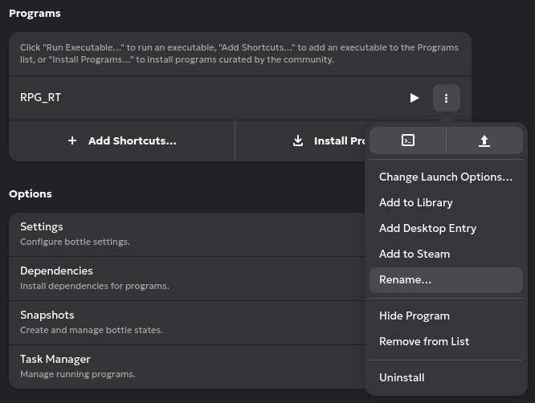

* Đổi tên `RPG_RT` thành tên của game hoặc tên bất kì bạn chọn rồi nhấn **Save**.

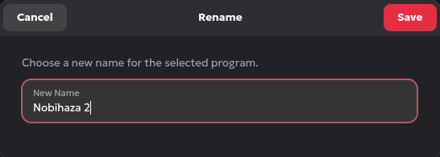

* Cuối cùng là nhấn nút như hình bên dưới để chạy game.

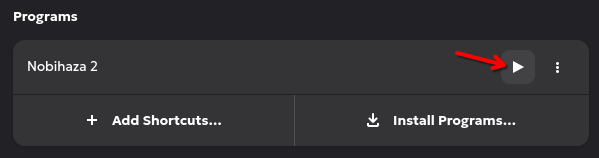

### Chạy bằng EasyRPG

> [!IMPORTANT]
> Bản dịch tiếng Việt của một số game Nobihaza sẽ không hỗ trợ EasyRPG, và bạn bắt buộc phải chơi bằng tệp `RPG_RT.exe`. Việc cố gắng chạy các bản dịch này có thể sẽ gây ra lỗi, tiêu biểu như là lỗi phông chữ và lỗi hiển thị hình ảnh.

* Mở lại thư mục đã giải nén chứa tệp tin `easyrpg-player` bạn đã làm ở mục Điều kiện cơ bản.

* Sao chép tệp tin đó và dán vào thư mục game, hoặc thư mục mẹ chứa các game Nobihaza của bạn, sau đó nhấn đúp vào tệp tin `easyrpg-player` rồi nhấn **Execute** để chạy tệp tin này.

## RPG Maker VX/VX Ace

### Sử dụng tệp tin `Game.exe`

Làm tương tự với phần [**Chạy bằng tệp `RPG_RT.exe`**](#ch%E1%BA%A1y-b%E1%BA%B1ng-t%E1%BB%87p-rpg_rtexe) của RPG Maker 2000/2003. Tuy nhiên thay vì chọn `RPG_RT.exe`, bạn hãy chọn tệp tin `Game.exe` thay vào đó.

### Sử dụng MKXP

> [!IMPORTANT]
> Có rất ít game có thể tương thích với MKXP, đối với Linux thì độ tương thích lại càng thấp hơn. Nếu bạn không thể chạy được game sử dụng MKXP, bạn cần quay lại chơi game bằng tệp `Game.exe`.

* Tải [MKXP dành cho Linux](https://nbhzvn.one/tools/MKXP/mkxp-z-linux.zip) rồi giải nén tệp tin vừa tải xuống.

* Sao chép toàn bộ tệp tin trong thư mục vừa giải nén (bao gồm cả tệp `mkxp-z.x86_64`).

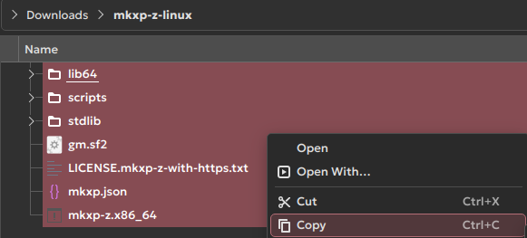

* Dán các tệp tin đó vào thư mục game và chạy tệp tin `mkxp-z.x86-64`.

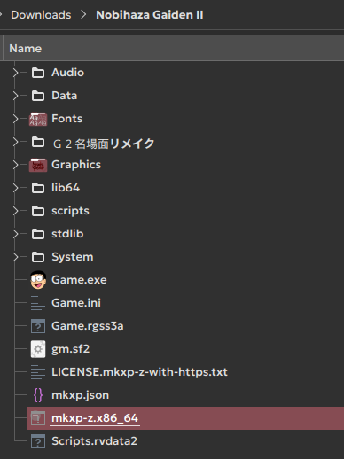

## RPG Maker MV/MZ

* Truy cập vào thư mục `nwjs` bạn đã tải xuống ở mục Điều kiện cơ bản và sao chép toàn bộ tệp tin trong thư mục đó.

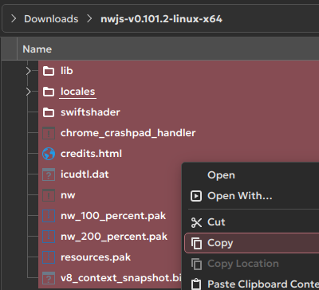

* Dán các tệp tin đã sao chép vào thư mục game và chạy tệp tin `nw`.

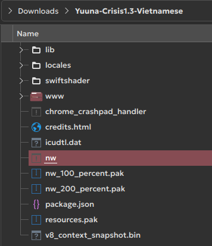

> [!TIP]
> Bạn có thể xóa toàn bộ các tệp tin và thư mục trong đó, ngoại trừ thư mục `www` (hoặc `audio`, `data`, `fonts`, `icon`, `img`, `js`, `movies` và `save` nếu là RPG Maker MZ), `index.html` và `package.json` trước khi dán các tệp tin từ bản Linux vào thư mục game.
>
> Các tệp tin kể trên sẽ không thể sử dụng bên Linux nên bạn có thể xóa để giải phóng dung lượng.
>
> 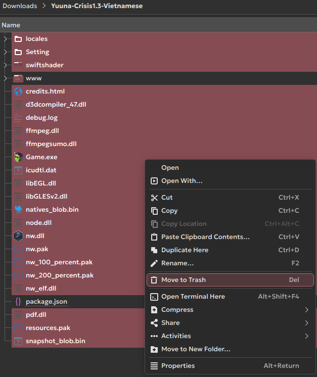

## Cho game ra ngoài màn hình chính và danh sách ứng dụng

* Đầu tiên thì bạn hãy cấp quyền tạo lối tắt cho Bottles bằng câu lệnh:

```sh
flatpak override com.usebottles.bottles --user --filesystem=xdg-data/applications
```

* Nhấn vào nút Menu bên cạnh phải tên game bạn muốn, và nhấn **Add Desktop Entry**:

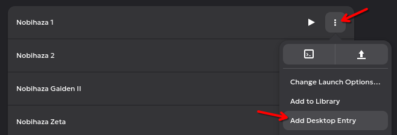

* Game sẽ xuất hiện ở danh sách ứng dụng. Để cho nó ra ngoài màn hình chính, bạn chỉ cần nhấn chuột phải và chọn **Add to Desktop**:

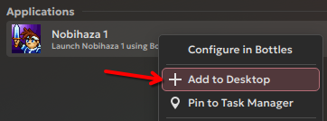

* Bạn sẽ thấy game xuất hiện ở màn hình chính.

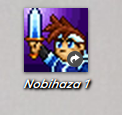