# Sửa lỗi và mẹo

Dưới đây sẽ là hướng dẫn sửa các lỗi khi chơi game Nobihaza, cùng với các mẹo để có thể chơi game tốt hơn trên Linux.

> [!IMPORTANT]
> Nếu như game vẫn còn lỗi sau khi bạn đã áp dụng những cách bên dưới thì khả năng cao là game sẽ không thể chơi (ổn định) trên Linux, và bạn không còn cách nào khác ngoài việc đợi nhà phát triển phát hành bản chính thức.

## Chung

Phần này sẽ áp dụng cho tất cả các game mà không xét đến việc game đó được làm bằng phần mềm gì.

### Không có thông báo gì khi chạy game hoặc cài đặt RTP

Lỗi này là lỗi dễ gặp nhất khi chạy thông qua Flatpak. Đầu tiên là hãy tắt toàn bộ cửa sổ của Bottles, sau đó dùng lệnh sau để chạy Bottles thông qua cửa sổ dòng lệnh:

```sh
flatpak run com.usebottles.bottles
```

Sau đó chạy lại game và quay lại cửa sổ dòng lệnh, lúc này sẽ hiện ra thông tin lỗi. Mình đã biết được 3 trường hợp dưới đây:

#### Lỗi `c0000135` kèm theo `Permission denied`

Bạn chưa cấp quyền truy cập thư mục game cho Bottles, và bạn có thể dùng lệnh sau để cấp quyền:

```sh
sudo flatpak override com.usebottles.bottles --filesystem="/path/to/game" # Thay /path/to/game thành thư mục game
```

Hoặc bạn cũng có thể cấp quyền cho một thư mục chung chứa tất cả các game Nobihaza, ví dụ:

```sh
sudo flatpak override com.usebottles.bottles --filesystem="/home/hyacine/Nobihaza" # Thay /home/hyacine/Nobihaza thành thư mục của bạn
```

#### Lỗi `Failed to open fsync shared memory file`

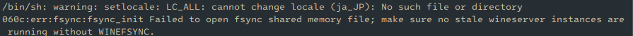

Trong cửa sổ quản lý Bottle của ứng dụng Bottles, nhấn vào nút nguồn ở góc trên bên phải cửa sổ như trong hình và nhấn vào nút **Shutdown**:

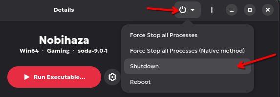

> [!NOTE]
> Nút **Shutdown** này chỉ tắt hoàn toàn môi trường Wine đang chạy chứ không tắt máy tính nên bạn cứ yên tâm.

Sau đó khởi động lại game là được.

### Không thể lưu được tiến trình của game

Áp dụng cho cả 2 trường hợp cơ bản: game báo lỗi khi lưu game và game không hiển thị tệp đã lưu khi khởi động lại game.

* Đảm bảo bạn đã [cấp quyền truy cập tệp tin cho Bottles](1.%20Điều%20kiện%20cơ%20bản.md#cấp-quyền-truy-cập-tệp-tin-cho-bottles).

* Đảm bảo đường dẫn của game không chứa bất kì ký tự tiếng Việt có dấu nào (xem mục [`File corrupted! Please run a virus check / No game scripts specified`](#file-corrupted-please-run-a-virus-check--no-game-scripts-specified)).

* Đảm bảo bạn không để thư mục game trong một thư mục/ổ cứng không thể ghi tệp tin được (ví dụ như thẻ SD đang bị khoá ghi, hoặc ổ cứng/thư mục mà bạn không có quyền ghi, hoặc ổ cứng bị lỗi ghi tệp tin). Cách tốt nhất là bạn thử tạo một tệp bất kì trong thư mục game để kiểm tra thử khả năng ghi tệp tin, xem có thông báo lỗi hay yêu cầu cấp quyền gì không, nếu không thì thử di chuyển sang một ổ cứng khác.

* Game sẽ không hoạt động ổn định nếu như bạn để thư mục game trong một ổ cứng lưu trữ đám mây (một số phần mềm như TeraBox, Google Drive hay OneDrive sẽ hiển thị bộ nhớ đám mây của bạn như một ổ cứng).

### Game giật lag mặc dù đang sử dụng máy tính có cấu hình cao

#### Đối với Bottles

Bottles đã cài DXVK từ lúc mới tạo Bottle ở mục Điều kiện cơ bản nên trường hợp này sẽ ít xảy ra. Tuy nhiên nếu Bottle vẫn chưa có DXVK thì:

* Vào màn hình chính của Bottles (phần chọn các Bottle, trong đó có cả Bottle bạn mới tạo ở mục Điều kiện cơ bản). Sau đó nhấn dấu ba chấm ở góc trên bên phải và chọn **Preferences** (hoặc nhấn nút `Ctrl + ,` (dấu phẩy)).


* Cửa sổ mới hiện ra, bạn nhấn vào tab **DLL Components**. Mục DXVK sẽ xuất hiện đầu tiên thì bạn hãy tải bản mới nhất (thường là ngay mục đầu tiên) bằng cách nhấn nút như hình bên dưới.


* Sau khi tải xong thì ở mục DXVK bạn vừa chọn sẽ hiển thị biểu tượng xóa và biểu tượng thư mục như hình bên dưới. Đóng cửa sổ Preferences lại.


* Chọn lại Bottle bạn đã tạo ở mục Điều kiện cơ bản, rồi nhấn vào mục **Settings**.


* Nhấn vào mục DXVK và chọn mục DXVK đầu tiên trong bảng chọn. Lúc này thì Bottles sẽ sử dụng DXVK bản mới nhất cho các game Nobihaza.


##### Đối với máy tính có 2 card đồ họa (nhất là laptop)

Với máy tính có 2 card đồ họa, bạn cần cho các game ưu tiên sử dụng card đồ họa rời (NVIDIA/AMD/Intel ARC).

* Trong phần **Settings** của Bottle trên ứng dụng Bottles, bạn hãy bật tùy chọn **Discrete Graphics** lên.


* Sau đó chạy game và chạy lệnh `nvidia-smi` (đối với GPU NVIDIA) hoặc `amdgpu_top` (đối với GPU AMD). Nếu bạn thấy game ở trong danh sách tiến trình thì tức là game đang chạy bằng card đồ họa rời.


#### Khác

Nếu bạn đang chạy game không thông qua Bottles, hoặc đã thử cài lại DXVK rồi mà không được thì:

* Bạn nên cắm sạc vào trong quá trình chơi game.

* Tắt bớt các ứng dụng đang chạy, kể cả ứng dụng chạy ngầm. Đa số các Desktop Environment sẽ có thanh taskbar/menu bar, và các ứng dụng chạy ngầm sẽ được hiển thị trên đó.

* Bạn cũng nên cập nhật cả driver lẫn phiên bản hệ điều hành của bạn. Hãy tham khảo hướng dẫn dành riêng cho distro của bạn để biết thêm thông tin.

Nếu game vẫn lag sau khi đã làm đủ cách trên thì không có cách nào khác, game đó sẽ không thể chạy ổn định ở trên Linux.

### Game bị lỗi hiển thị ô vuông/kí tự lạ, hoặc font chữ hiển thị rất xấu

* Xem lại [Điều kiện cơ bản#Chuyển vùng của Bottle thành Nhật Bản](1.%20Điều%20kiện%20cơ%20bản.md#chuyển-vùng-của-bottle-thành-nhật-bản) và [Điều kiện cơ bản#Các thư viện cần thiết](1.%20Điều%20kiện%20cơ%20bản.md#các-thư-viện-cần-thiết).

#### Đối với tệp tin .ttf và .otf

* Kiểm tra xem trong thư mục game có tệp tin font chữ (kết thúc bằng `.ttf`, `.otf`) nào không, nếu có thì sao chép toàn bộ tệp tin font chữ đó vào thư mục `~/.local/share/fonts`:

```sh
# Thay ~/thumucgame thành đường dẫn thư mục game của bạn
find ~/thumucgame -type f \( -iname "*.ttf" -o -iname "*.otf" \) -exec cp {} ~/.local/share/fonts/ \;
fc-cache -f ~/.local/share/fonts
```

Hoặc bạn cũng có thể tự mở thư mục `/home/$USER/.local/share/fonts` ở trình quản lý tệp và sao chép thủ công các tệp `.ttf` và `.otf` vào thư mục đó.

> [!NOTE]
> Tuyệt đối không chuyển đổi tệp tin `.fon` sang tệp `.ttf` hay `.otf`, vì nó có thể gây ra lỗi hiển thị, và phần lớn sẽ **vi phạm Điều khoản sử dụng** của chính font đó.

#### Đối với tệp tin .fon

* Trong giao diện Bottle của ứng dụng Bottles, nhấn vào nút Menu ở góc trên bên phải và chọn **Browse Files**.

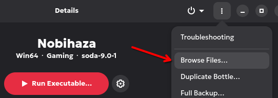

* Thư mục prefix của Bottles sẽ được mở, đi tới thư mục `windows/Fonts` và sao chép tất cả tệp tin `.fon` từ thư mục game vào thư mục `Fonts` này.

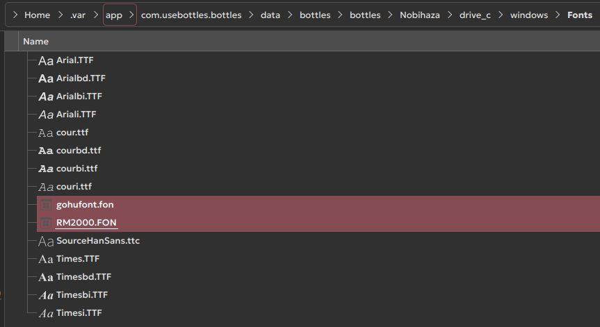

* Quay trở lại ứng dụng Bottles, kéo xuống dưới và nhấn **Command Line**.

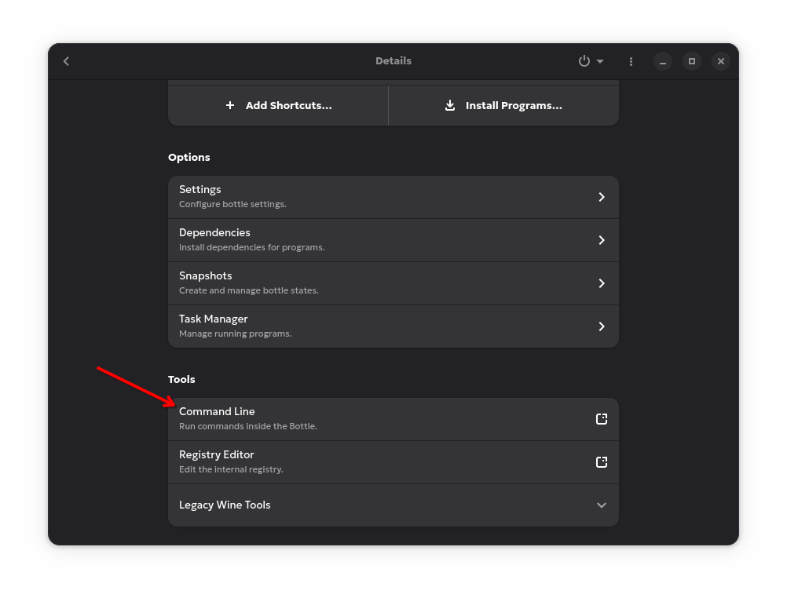

* Nhập dòng chữ sau vào cửa sổ Command Prompt vừa mở, trong đó `RM2000` là tên của font (thường là tên tệp tin bỏ đuôi `.fon`), và `RM2000.fon` là tên tệp tin:

```bat
reg add "HKLM\Software\Microsoft\Windows NT\CurrentVersion\Fonts" /v "RM2000" /d "RM2000.fon"
```

* Nhấn Enter và bạn sẽ thấy dòng chữ `reg: 操作は正常に完了しました` (`reg: The operation completed successfully`).

> [!TIP]
> Một số máy sẽ không thể dùng được Command Line, lúc này thì bạn có thể nhấn vào **Explorer** trong cửa sổ Bottles, sau đó di chuyển đến đường dẫn `C:\Windows\System32` và chạy tệp tin `cmd.exe` để mở Command Prompt.
>
> 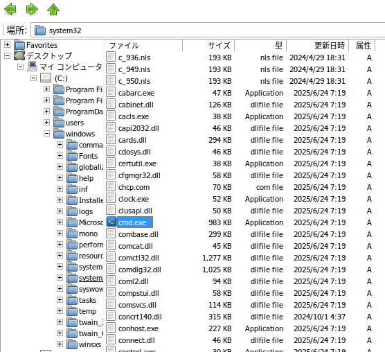

## Lỗi "No remote refs found" khi cài đặt Bottles thông qua Flatpak

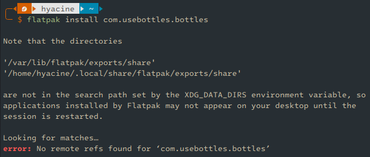

Lỗi này xảy ra là do bạn chưa thêm kho ứng dụng nào vào trong Flatpak, thường xảy ra sau khi cài đặt.

Sử dụng lệnh sau để thêm kho ứng dụng Flathub vào Flatpak:

```sh
flatpak remote-add --if-not-exists flathub https://dl.flathub.org/repo/flathub.flatpakrepo
```

## Lỗi `IKernel.exe 0x1200` khi cài đặt RTP của RPG Maker 2000/2003

Lỗi này xảy ra là do xung đột thư viện khi bạn cài **Visual C++ Redistributable** (vcredist). Trong 3 thư viện dưới đây thì bạn chỉ được chọn một trong ba, nhưng nếu bạn vô tình cài đặt cả 3 thư viện thì sẽ xảy ra xung đột (do bạn cài 3 bản 2015).

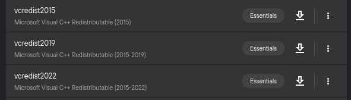

Lúc này thì bạn hãy thử gỡ 2 cái còn lại, chỉ giữ bản 2019 giống như mình đã hướng dẫn ở phần Điều kiện cơ bản. Tuy nhiên nếu vẫn không được thì bạn cần xóa Bottle đó đi và tạo lại cái mới, sau đó cài lại từ đầu.

## RPG Maker 2000/2003 (`RPG_RT.exe`)

### `XXXX 乗り物 は開けません` (Không thể mở file XXXX) / `???????????????????` (một đống dấu hỏi chấm)

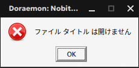

* Xem lại [Điều kiện cơ bản#Chuyển vùng của Bottles thành Nhật Bản](1.%20%C4%90i%E1%BB%81u%20ki%E1%BB%87n%20c%C6%A1%20b%E1%BA%A3n.md#chuy%E1%BB%83n-v%C3%B9ng-c%E1%BB%A7a-bottle-th%C3%A0nh-nh%E1%BA%ADt-b%E1%BA%A3n).

* Cũng có thể là do tệp tin đó thực sự không có trong thư mục game. Hãy giải nén lại vào thư mục game và thử lại.

> [!NOTE]
> Có một số trường hợp hiếm là do người dịch khi nén game bằng máy tính vẫn chưa để vùng là Nhật Bản, và sau khi nén thì tên của các tệp tin tài nguyên sẽ bị hỏng và chứa các kí tự vô nghĩa (hay còn được gọi là Mojibake).
>
> Lỗi này cũng sẽ khiến cho game không thể tìm được tệp tin tài nguyên. Bạn có thể xem chi tiết về lỗi này [ở đây](../6.%20Sửa%20lỗi%20chung/1.%20Sửa%20lỗi%20tệp%20tin%20mojibake.md).

### `RPGツクール2000/2003のランタイムパッケージがセットアップされていません。` (Gói khởi chạy của RPG Maker 2000/2003 chưa được cài đặt)

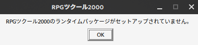

Xem lại [Điều kiện cơ bản#RPG Maker 2000/2003](1.%20Điều%20kiện%20cơ%20bản.md#rpg-maker-20002003).

### Lỗi liên quan đến `RPG_RT.lmt`

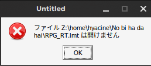

Nếu đường dẫn trong thông báo có chứa dấu hỏi chấm (`?`), thì đường dẫn thư mục game của bạn đang chứa kí tự đặc biệt (kể cả tiếng Việt có dấu). Xem dấu `?` nằm ở (các) thư mục nào trong đường dẫn, và xoá **tất cả** kí tự đặc biệt trong thư mục đó.

## RPG Maker 2000/2003 (EasyRPG)

Xem tại mục [EasyRPG](../EasyRPG.md).

## RPG Maker XP/VX/VX Ace

### RPGVX/RPGVXAce RTP is required to run this game

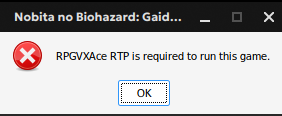

Xem lại [Điều kiện cơ bản#RPG Maker XP/VX/VX Ace](1.%20Điều%20kiện%20cơ%20bản.md#rpg-maker-xpvxvx-ace).

### RGSS202E.dll/RGSS202J.dll/RGSS300.dll/RGSS301.dll could not be found

* [Cài đặt lại toàn bộ gói khởi chạy (RTP) của RPG Maker VX Ace](1.%20Điều%20kiện%20cơ%20bản.md#rpg-maker-xpvxvx-ace).

* Nếu cài đặt lại rồi nhưng vẫn không được, bạn cũng có thể [tải chay các tệp tin .dll đó](https://drive.google.com/file/d/1QTGjntOWisoUzk3NTfSBfk0bT2fNYBKc/view) và giải nén vào thư mục `System` của game.

### File corrupted! Please run a virus check / No game scripts specified

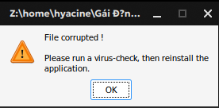

Trong thanh tiêu đề của thông báo lỗi sẽ ghi đường dẫn tệp tin bị lỗi.

* Nếu đường dẫn trong thông báo có chứa dấu hỏi chấm (`?`), thì đường dẫn thư mục game của bạn đang chứa kí tự đặc biệt (kể cả tiếng Việt có dấu). Xem dấu `?` nằm ở (các) thư mục nào trong đường dẫn, và xoá **tất cả** kí tự đặc biệt trong thư mục đó.

* Tệp tin đó cũng có thể bị lỗi trong quá trình giải nén, hãy thử giải nén lại tệp tin nén của game.

### Unable to find VL Gothic font

* Tải tệp tin font cho VL Gothic [tại đây](https://github.com/ovate/VL-Gothic-font/raw/refs/heads/main/fonts.zip).

* Giải nén tệp tin này và truy cập vào thư mục `fonts` đã giải nén. Bạn sẽ thấy 2 tệp tin là `VL-Gothic-Regular.ttf` và `VL-PGothic-Regular.ttf`.

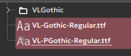

* Sao chép hai tệp tin này vào thư mục `/home/$USER/.local/share/fonts` (thay `$USER` thành tên người dùng của bạn).

### Script error

Không còn cách nào khác, bạn bắt buộc phải liên hệ với nhà phát triển để sửa lỗi này.

### Failed to load script

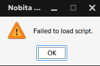

Bạn đã xoá nhầm tệp tin `Game.rgss3a` hoặc thư mục `Data` của game, hãy giải nén lại tệp tin nén của game và thử lại.

### Unable to find file / No such file or directory

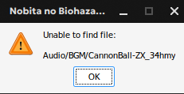

Cách sửa giống như mục [`XXXX 乗り物 は開けません` (Không thể mở file XXXX) / `???????????????????` (một đống dấu hỏi chấm) của RPG Maker 2000/2003](#xxxx-乗り物-は開けません-không-thể-mở-file-xxxx---một-đống-dấu-hỏi-chấm).

### Error creating context: Could not create GL context

Nếu lỗi này xảy ra ở trên Linux thì 100% là bạn đang sử dụng card đồ họa quá cũ, chỉ còn cách là mua máy tính mới (hoặc mua card đồ họa mới nếu bạn đang dùng máy tính để bàn).

### DirectX 8.0 or higher not installed

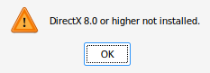

Bạn đang chọn DXVK phiên bản quá thấp. Hãy [đọc lại phần này](#đối-với-bottles) để cài đặt DXVK phiên bản mới nhất.

## RPG Maker MV/MZ

### Your browser does not support WebGL

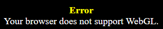

Giống như trên, chỉ còn cách là mua máy tính mới (hoặc mua card đồ họa mới nếu bạn đang dùng máy tính để bàn).

### Loading Error (`Failed to load`)

* Đa phần sẽ giống như mục [`XXXX 乗り物 は開けません` (Không thể mở file XXXX) / `???????????????????` (một đống dấu hỏi chấm) của RPG Maker 2000/2003](#xxxx-乗り物-は開けません-không-thể-mở-file-xxxx---một-đống-dấu-hỏi-chấm).

* Tuy nhiên đối với Linux thì còn một trường hợp nữa là do Nw.js không thể tải tệp tin tiếng Nhật khi chưa để vùng của máy là Nhật Bản.
    * Mở cửa sổ Terminal và gõ dòng lệnh sau:
    ```sh
    export LANG=ja_JP.SJIS; export LC_MESSAGES=ja_JP.SJIS; export LC_ALL=ja_JP
    ```
    * Sau đó `cd` đến thư mục game:
    ```sh
    cd "/path/to/game/folder" # Thay thành đường dẫn thư mục game
    ```
    * Rồi cuối cùng là chạy Nw.js bằng cửa sổ dòng lệnh:
    ```sh
    ./nw .
    ```
    * Nếu việc đó đã sửa được lỗi **Failed to load** thì bạn có thể lưu lại tùy chọn export này vào một tệp tin `.sh` ở thư mục game, ví dụ như `start.sh` với nội dung sau:
    ```sh
    #!/bin/bash
    export LANG=ja_JP.SJIS; export LC_MESSAGES=ja_JP.SJIS; export LC_ALL=ja_JP
    ./nw .
    ```

### (Script) Error

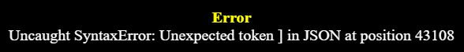

Bạn bắt buộc phải liên hệ với nhà phát triển về lỗi này.

### Failed to load: `data/Actors.json`

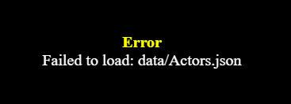

Bạn đang cố gắng chạy tệp tin `index.html` của game trên trình duyệt.

* Hãy chạy tệp tin `Game.exe` thay vào đó.

* Nếu bạn vẫn muốn chạy game trên trình duyệt, hãy sử dụng một máy chủ web nội bộ (local web server) và cho thư mục game có chứa tệp `index.html` vào đó. Sau đó, hãy nhập địa chỉ của tệp `index.html` **trong máy chủ web nội bộ** thay vì chạy thẳng tệp tin `index.html`. Xem mục [Chạy game RPG Maker MV trên trình duyệt](#chạy-game-rpg-maker-mv-trên-trình-duyệt) để tìm hiểu rõ hơn.

### Your file was not found

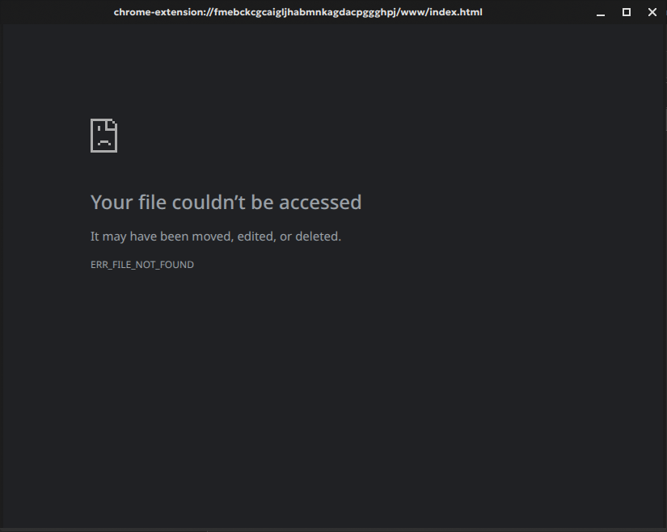

Bạn đã xoá nhầm tệp tin `index.html` của game, hãy giải nén lại game từ tệp tin nén và thử lại.

### `Required value 'name' is missing or invalid`

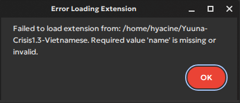

* Mở tệp tin `package.json` trong thư mục game bằng bất kì trình soạn thảo văn bản nào.

* Thêm chữ `Game` vào trong dấu ngoặc kép sau từ `name` ở dòng 2 như ảnh bên dưới:

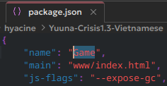

* Lưu lại tệp tin `package.json` và khởi động lại game.

### Failed to load extension from XXXX (lỗi khác với bên trên)

Tệp tin `package.json` của game đang bị lỗi, hãy thử:

* Giải nén lại game từ tệp tin nén và thử lại.

* Tự sửa lỗi trong tệp tin `package.json` nếu như bạn có am hiểu về ngôn ngữ JSON và Node.js.

* Báo cáo lỗi này cho nhà phát triển.

### Game bị crash trong quá trình chơi

Có rất nhiều lý do khiến game bị crash do quá trình chơi:

* Lỗi thường gặp nhất là do game sử dụng quá nhiều RAM nên vượt quá giới hạn 4GB RAM của bản `32-bit`.
    * Nếu bạn đang sử dụng hệ điều hành phiên bản `64-bit`, bạn có thể tải bản `64-bit` của NW.js về để bỏ giới hạn 4GB RAM của bản `32-bit`.
    * Bạn cũng có thể kiểm tra mức sử dụng RAM của máy tính. Nếu thấy máy tính đang tiêu tốn quá nhiều RAM khi chơi game, hãy xét tới việc tắt bớt phần mềm chạy ngầm, bật RAM ảo hoặc nâng cấp RAM cho máy tính.

* Game cũng có thể đang gặp lỗi lập trình nghiêm trọng, bạn có thể báo cáo với nhà phát triển game về sự cố này.

### `require is not defined`


Nếu bạn đang cố gắng chơi trên trình duyệt và gặp lỗi này thì không còn cách nào khác, bạn chỉ có thể quay lại chơi bằng tệp `Game.exe`.

### Lỗi hiển thị màn hình NW.js khi chạy game

Khi chạy game, thay vì màn hình game thì nó lại ra màn hình này:

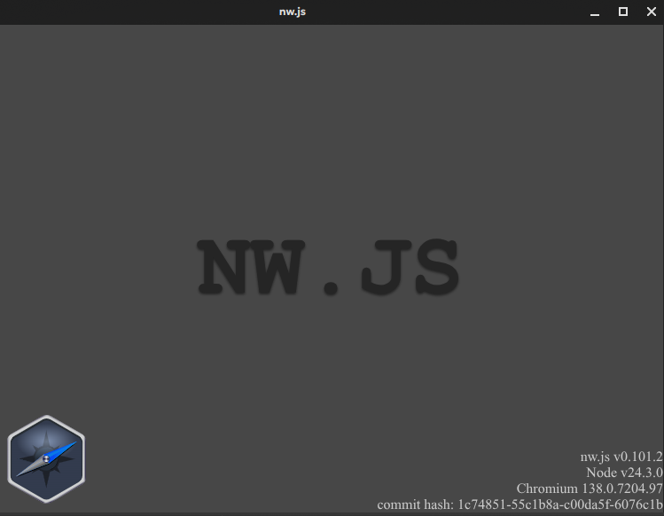

* Bạn đã để NW.js không đúng thư mục. Hãy quay lại phần Tải và chạy game để làm lại bước này.

* Nếu bạn đang để NW.js ở đúng thư mục game, thử kiểm tra xem thư mục đó còn tệp `package.json` không. Nếu không thì bạn cần giải nén lại game, hoặc báo cáo lỗi cho nhà phát triển.

### Game không mở khi chạy tệp tin `nw`

* Thử tải lại cả thư mục game lẫn NW.js và làm lại hướng dẫn ở phần Tải và chạy game.

* Nếu vẫn không được, hãy thử tải bản NW.js khác (cũ hơn hoặc mới hơn). Tốt nhất là hãy tải bản mới nhất nếu được.

* Đảm bảo bạn đã sao chép **toàn bộ tệp tin** trong thư mục `nwjs` bạn đã giải nén vào thư mục game.

* Đảm bảo tệp tin `package.json` không bị lỗi. Một số bản NW.js thay vì báo lỗi `Failed to load extension` thì sẽ không thể chạy được game. Bạn có thể lên Google tìm kiếm **JSON Validator** và cho nội dung của tệp `package.json` lên đấy để xác nhận xem lỗi có phải từ tệp này không.

* Bản NW.js bạn tải có thể không tương thích với phiên bản Linux của bạn (bản Linux của bạn và bản NW.js quá xa nhau về mặt thời gian). Hãy thử nâng cấp Linux của bạn lên phiên bản mới nhất theo hướng dẫn dành cho distro của bạn.

## Mẹo dành cho Linux

### Sử dụng MangoHud để xem thông tin FPS

Đa số các engine RPG Maker đều sẽ có thể nhấn nút F2 để hiển thị FPS. Tuy nhiên nếu bạn muốn thông tin chuyên sâu hơn thì bạn cũng có thể sử dụng MangoHud.

Đây cũng là cách đơn giản nhất để xem DXVK có hoạt động hay không.

> [!IMPORTANT]
> MangoHud sẽ chỉ hoạt động khi chạy game RPG Maker từ 2000 đến VX Ace.

* Đầu tiên là cài đặt MangoHud thông qua Flatpak:

```sh
flatpak install org.freedesktop.Platform.VulkanLayer.MangoHud 
```

* Flatpak sẽ yêu cầu bạn chọn phiên bản, hãy chọn phiên bản cuối cùng (ở đây là số 4):

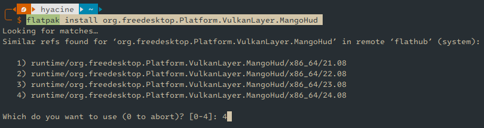

* Mở phần quản lý Bottle trên ứng dụng Bottles. Nhấn vào mục **Settings** và bật tùy chọn **Monitor Performance** trong phần **Performance** của cài đặt.

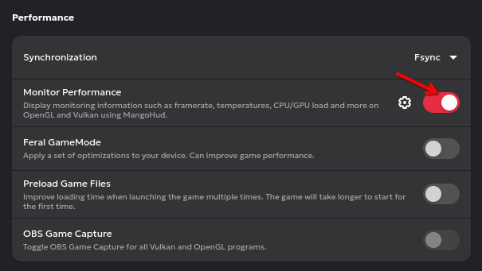

* Khởi động lại game. Bạn sẽ thấy thông tin FPS, mức sử dụng GPU và quan trọng hơn là game đang chạy thông qua DXVK hay là WineD3D.

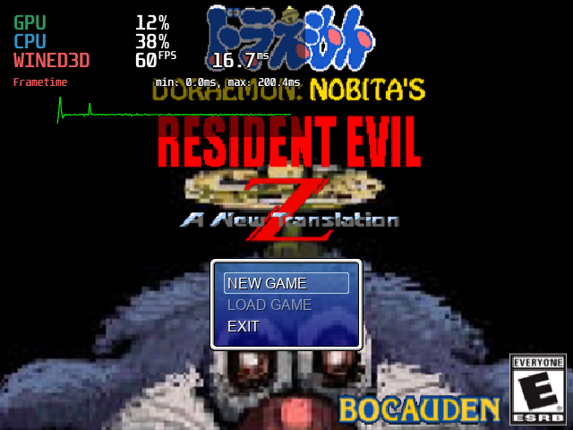

### Thay đổi phiên bản Wine

Bạn có thể thay đổi phiên bản Wine thành một phiên bản mới hơn nếu bạn muốn. Tuy nhiên, mức độ tương thích và khả năng chơi cũng có thể sẽ khác.

* Ở màn hình chính (danh sách Bottles) của ứng dụng Bottles, nhấn nút Menu ở góc trên bên phải và chọn **Preferences**.

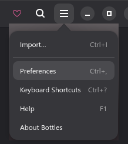

* Nhấn vào tab **Runners** và chọn phiên bản bạn muốn ở danh sách bên dưới. Mỗi phiên bản sẽ có cách tối ưu hóa khác nhau, trong đó bản của Kron4ek sẽ có các phiên bản mới nhất.

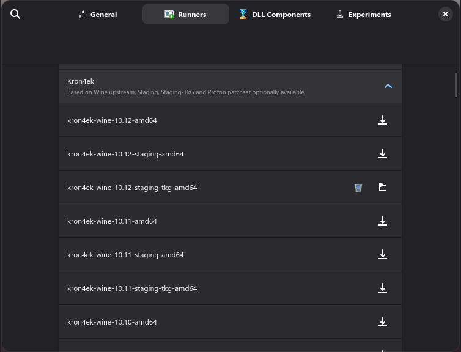

* Nhấn nút tải xuống bên cạnh phải của một phiên bản. Đợi quá trình tải hoàn tất thì tắt cửa sổ cài đặt, và chọn Bottle bạn muốn thay đổi phiên bản. Nhấn nút **Settings** để mở cài đặt Bottles.

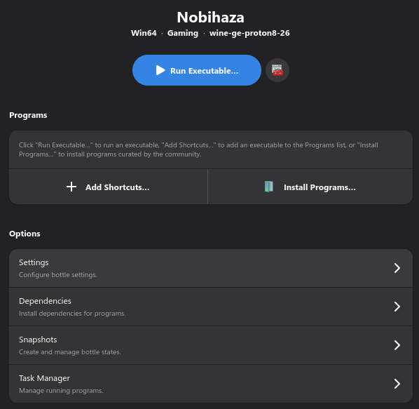

* Chọn phiên bản thay đổi trong phần Runner.

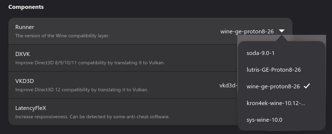

* Đợi quá trình cài đặt hoàn tất và chạy lại game. Game của bạn sẽ được chạy bằng phiên bản Wine bạn đã chọn.

### Bật chế độ hiệu năng cao trên Linux

Mặc dù bên Linux nó không quá cần thiết, nhưng nếu bạn muốn thì bạn vẫn có thể để chế độ hiệu năng cao trên Linux.

Mở ứng dụng Terminal của bạn và nhập dòng lệnh sau:

```sh
echo performance | sudo tee /sys/devices/system/cpu/cpu*/cpufreq/scaling_governor
```

Nếu cửa sổ in ra chữ `performance` mà không có thêm thông báo lỗi nào thì tức là quá trình đã hoàn tất.

### Chạy game RPG Maker MV trên trình duyệt

> [!CAUTION]
> Không phải game nào cũng sẽ chạy được bằng cách này. Nếu bạn gặp lỗi khi chơi phiên bản trình duyệt, bạn bắt buộc phải quay lại chơi bằng NW.js.

* Vào trang GitHub để tải công cụ **Simple HTTP Server** [tại đây](https://github.com/TheWaWaR/simple-http-server/releases), sau đó chọn tệp `x86_64-unknown-linux-musl-simple-http-server`.

> [!NOTE]
> Bạn có thể đổi tên tệp tin `x86_64-unknown-linux-musl-simple-http-server` thành tên dễ nhớ hơn.

* Mở ứng dụng Terminal lên và nhập dòng lệnh sau:

```sh
chmod +x ~/Downloads/x86_64-unknown-linux-musl-simple-http-server
~/Downloads/x86_64-unknown-linux-musl-simple-http-server --cors --index ~/game/www
```

Trong đó `~/Downloads/x86_64-unknown-linux-musl-simple-http-server` sẽ là đường dẫn tệp tin bạn mới tải xuống, và `~/game/www` là *thư mục `www` của thư mục game*. Ví dụ như ảnh bên dưới:

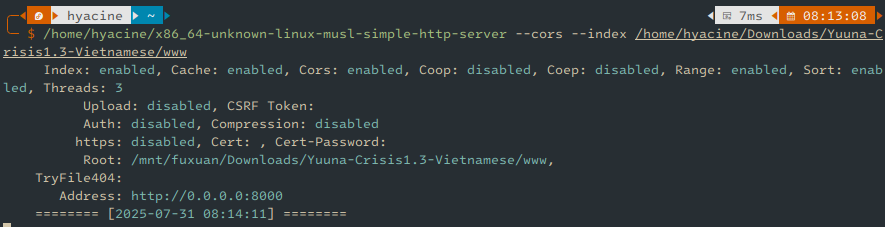

* Sao chép địa chỉ ở phần **Address** của cửa sổ đó, như ảnh bên trên là `http://0.0.0.0:8000` và dán vào trình duyệt. Game sẽ được khởi động và giờ bạn chỉ cần cầu nguyện là màn hình chính của game sẽ hiện lên.<br>Khi bạn không chơi game nữa thì có thể tắt cửa sổ Terminal đi.

> [!CAUTION]
> Firefox có thể sẽ bị treo ở màn hình Now Loading khi chơi game trên trình duyệt này, bạn có thể cấp quyền tự động phát âm thanh (Autoplay Audio) và tắt tính năng chặn theo dõi (Tracking Prevention) để giảm thiểu tình trạng này (nhưng cũng không đảm bảo là sẽ có thể sửa được hoàn toàn).