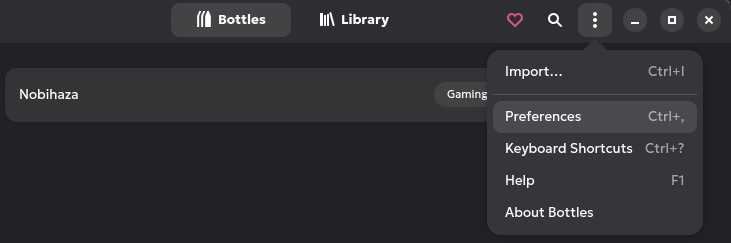
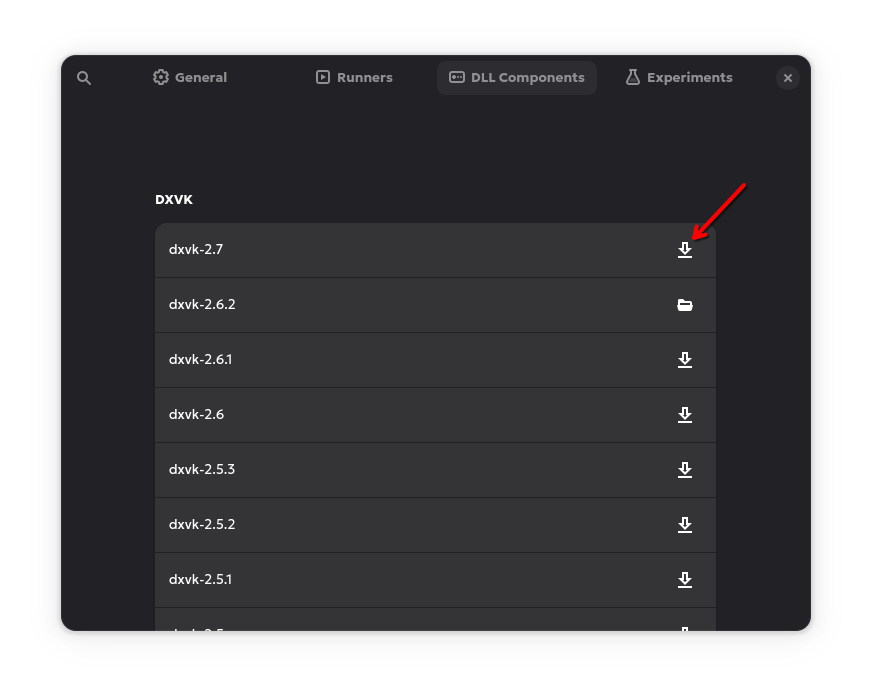
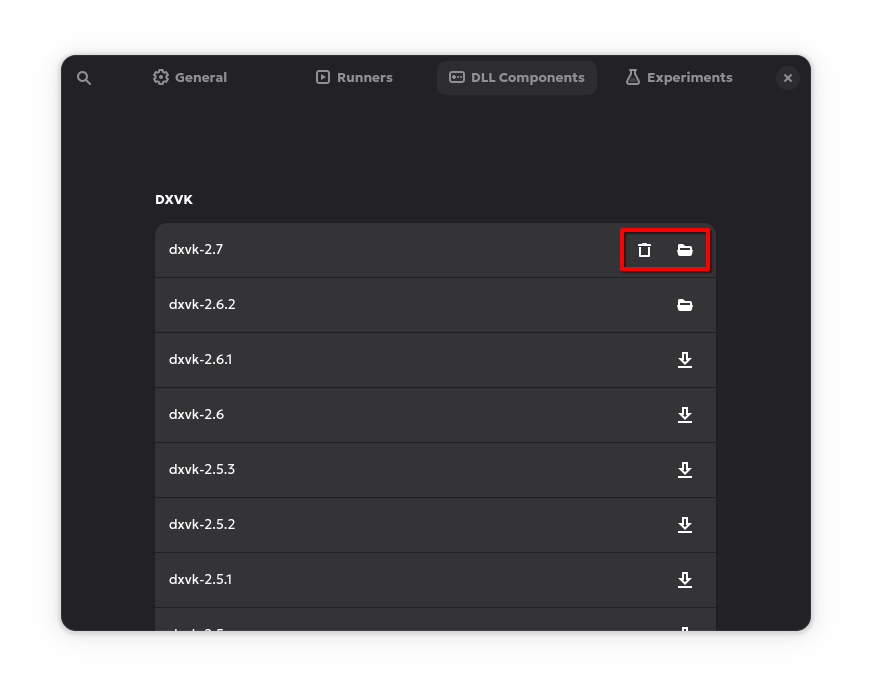
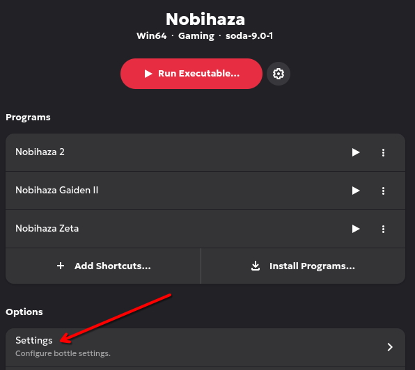
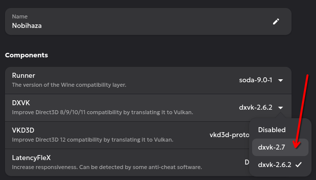
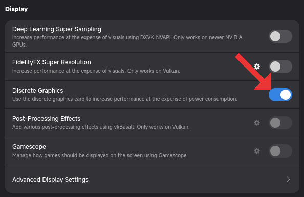
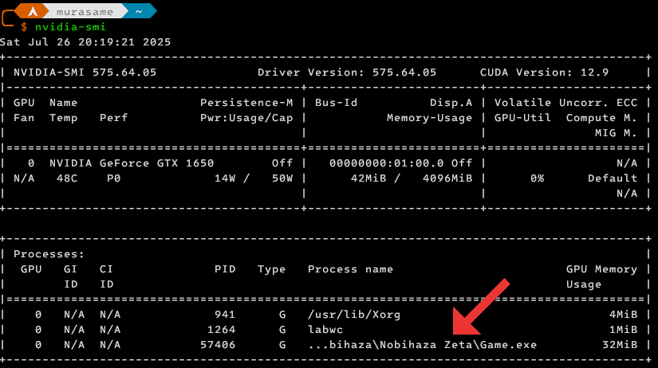

# Sửa lỗi và mẹo

Dưới đây sẽ là hướng dẫn sửa các lỗi khi chơi game Nobihaza, cùng với các mẹo để có thể chơi game tốt hơn trên Linux.

> [!IMPORTANT]
> Nếu như game vẫn còn lỗi sau khi bạn đã áp dụng những cách bên dưới thì khả năng cao là game sẽ không thể chơi (ổn định) trên Linux, và bạn không còn cách nào khác ngoài việc đợi nhà phát triển phát hành bản chính thức.

## Chung

Phần này sẽ áp dụng cho tất cả các game mà không xét đến việc game đó được làm bằng phần mềm gì.

### Không có thông báo gì khi chạy game hoặc cài đặt RTP

Lỗi này là lỗi dễ gặp nhất khi chạy thông qua Flatpak, do bạn chưa cấp quyền cho Bottles truy cập vào thư mục game.

Bạn có thể dùng lệnh sau để cấp quyền:

```sh
sudo flatpak override com.usebottles.bottles --filesystem="/path/to/game" # Thay /path/to/game thành thư mục game
```

Hoặc bạn cũng có thể cấp quyền cho một thư mục chung chứa tất cả các game Nobihaza, ví dụ:

```sh
sudo flatpak override com.usebottles.bottles --filesystem="/home/hyacine/Nobihaza"
```

### Không thể lưu được tiến trình của game

Áp dụng cho cả 2 trường hợp cơ bản: game báo lỗi khi lưu game và game không hiển thị tệp đã lưu khi khởi động lại game. Riêng với macOS thì một số game sẽ không thể khởi động được nếu như không thể ghi được tệp tin vào thư mục game.

* Đảm bảo bạn đã [cấp quyền truy cập tệp tin cho Bottles](1.%20Điều%20kiện%20cơ%20bản.md#cấp-quyền-truy-cập-tệp-tin-cho-bottles).

* Đảm bảo đường dẫn của game không chứa bất kì ký tự tiếng Việt có dấu nào (xem mục [`File corrupted! Please run a virus check / No game scripts specified`](#file-corrupted-please-run-a-virus-check--no-game-scripts-specified)).

* Đảm bảo bạn không để thư mục game trong một thư mục/ổ cứng không thể ghi tệp tin được (ví dụ như thẻ SD đang bị khoá ghi, hoặc ổ cứng/thư mục mà bạn không có quyền ghi, hoặc ổ cứng bị lỗi ghi tệp tin). Cách tốt nhất là bạn thử tạo một tệp bất kì trong thư mục game để kiểm tra thử khả năng ghi tệp tin, xem có thông báo lỗi hay yêu cầu cấp quyền gì không, nếu không thì thử di chuyển sang một ổ cứng khác.

* Game sẽ không hoạt động ổn định nếu như bạn để thư mục game trong một ổ cứng lưu trữ đám mây (một số phần mềm như TeraBox, Google Drive hay OneDrive sẽ hiển thị bộ nhớ đám mây của bạn như một ổ cứng).

### Game giật lag mặc dù đang sử dụng máy tính có cấu hình cao

#### Đối với Bottles

Bottles đã cài DXVK từ lúc mới tạo Bottle ở mục Điều kiện cơ bản nên trường hợp này sẽ ít xảy ra. Tuy nhiên nếu Bottle vẫn chưa có DXVK thì:

* Vào màn hình chính của Bottles (phần chọn các Bottle, trong đó có cả Bottle bạn mới tạo ở mục Điều kiện cơ bản). Sau đó nhấn dấu ba chấm ở góc trên bên phải và chọn **Preferences** (hoặc nhấn nút `Ctrl + ,` (dấu phẩy)).



* Cửa sổ mới hiện ra, bạn nhấn vào tab **DLL Components**. Mục DXVK sẽ xuất hiện đầu tiên thì bạn hãy tải bản mới nhất (thường là ngay mục đầu tiên) bằng cách nhấn nút như hình bên dưới.



* Sau khi tải xong thì ở mục DXVK bạn vừa chọn sẽ hiển thị biểu tượng xóa và biểu tượng thư mục như hình bên dưới. Đóng cửa sổ Preferences lại.



* Chọn lại Bottle bạn đã tạo ở mục Điều kiện cơ bản, rồi nhấn vào mục **Settings**.



* Nhấn vào mục DXVK và chọn mục DXVK đầu tiên trong bảng chọn. Lúc này thì Bottles sẽ sử dụng DXVK bản mới nhất cho các game Nobihaza.



##### Đối với máy tính có 2 card đồ họa (nhất là laptop)

Với máy tính có 2 card đồ họa, bạn cần cho các game ưu tiên sử dụng card đồ họa rời (NVIDIA/AMD/Intel ARC).

* Trong phần **Settings** của Bottle trên ứng dụng Bottles, bạn hãy bật tùy chọn **Discrete Graphics** lên.



* Sau đó chạy game và chạy lệnh `nvidia-smi` (đối với GPU NVIDIA) hoặc `amdgpu_top` (đối với GPU AMD). Nếu bạn thấy game ở trong danh sách tiến trình thì tức là game đang chạy bằng card đồ họa rời.



#### Khác

Nếu bạn đang chạy game không thông qua Bottles, hoặc đã thử cài lại DXVK rồi mà không được thì:

* Bạn nên cắm sạc vào trong quá trình chơi game.

* Tắt bớt các ứng dụng đang chạy, kể cả ứng dụng chạy ngầm. Đa số các Desktop Environment sẽ có thanh taskbar/menu bar, và các ứng dụng chạy ngầm sẽ được hiển thị trên đó.

* Bạn cũng nên cập nhật cả driver lẫn phiên bản hệ điều hành của bạn. Hãy tham khảo hướng dẫn dành riêng cho distro của bạn để biết thêm thông tin.

Nếu game vẫn lag sau khi đã làm đủ cách trên thì không có cách nào khác, game đó sẽ không thể chạy ổn định ở trên Linux.

### Game bị lỗi hiển thị ô vuông/kí tự lạ, hoặc font chữ hiển thị rất xấu

* Xem lại [Điều kiện cơ bản#Chuyển vùng của Bottle thành Nhật Bản](1.%20Điều%20kiện%20cơ%20bản.md#chuyển-vùng-của-bottle-thành-nhật-bản) và [Điều kiện cơ bản#Các thư viện cần thiết](1.%20Điều%20kiện%20cơ%20bản.md#các-thư-viện-cần-thiết).

#### Đối với tệp tin .ttf và .otf

* Kiểm tra xem trong thư mục game có tệp tin font chữ (kết thúc bằng `.ttf`, `.otf`) nào không, nếu có thì sao chép toàn bộ tệp tin font chữ đó vào thư mục `~/.local/share/fonts`:

```sh
# Thay ~/thumucgame thành đường dẫn thư mục game của bạn
find ~/thumucgame -type f \( -iname "*.ttf" -o -iname "*.otf" \) -exec cp {} ~/.local/share/fonts/ \;
fc-cache -f ~/.local/share/fonts
```

> [!NOTE]
> Tuyệt đối không chuyển đổi tệp tin `.fon` sang tệp `.ttf` hay `.otf`, vì nó có thể gây ra lỗi hiển thị, và phần lớn sẽ **vi phạm Điều khoản sử dụng** của chính font đó.

#### Đối với tệp tin .fon


