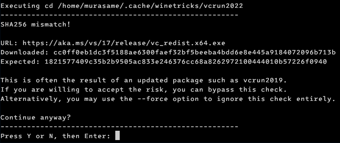

# Cài đặt nâng cao

Nếu bạn không thích cài Flatpak và Bottles (giống mình, vì Flatpak và Bottles tốn quá nhiều dung lượng của máy), thì bạn cũng có thể cài đặt game trực tiếp bằng Wine của hệ điều hành thay vì sử dụng phần mềm hỗ trợ.

Hướng dẫn này sẽ dành cho các bạn đã có một chút am hiểu về Linux và đã quen với việc sử dụng dòng lệnh. Đây cũng là cách mình sử dụng khi chơi game Nobihaza.

> [!IMPORTANT]
> Trước khi bắt đầu hướng dẫn này, đảm bảo bạn đã cài đặt Wine ở mục [Điều kiện cơ bản#Wine](1.%20Điều%20kiện%20cơ%20bản.md#wine).
>
> Ngay cả khi bạn sử dụng phiên bản Wine tùy chỉnh, thì các phiên bản đó vẫn cần một số thư viện của Wine trên hệ thống. Nếu bạn bỏ qua thì có thể sẽ gây ra lỗi.

> [!NOTE]
> Để tiện lợi thì bạn nên chạy tất cả câu lệnh trên một cửa sổ dòng lệnh, và không nên tắt cửa sổ đó trước khi cài đặt xong.
>
> Khi bạn khởi động lại cửa sổ, bạn sẽ phải chạy lại các lệnh `export`.

## Cài đặt ban đầu

### Chọn phiên bản Wine

#### wine-ge-proton bản 8.26 của GloriousEggroll

Mình khuyến khích sử dụng phiên bản Wine này vì nó ổn định hơn khi chơi game trên Linux.

> [!TIP]
> Bạn cũng có thể bỏ qua mục này và sử dụng phiên bản Wine của hệ điều hành để tiết kiệm dung lượng.

* Đầu tiên là tải bản wine-ge-proton 8.26 trước:

```sh
curl -L -OJ https://github.com/GloriousEggroll/wine-ge-custom/releases/download/GE-Proton8-26/wine-lutris-GE-Proton8-26-x86_64.tar.xz
```

* Giải nén tệp tin đã tải xuống:

```sh
tar -xf wine-lutris-GE-Proton8-26-x86_64.tar.xz
```

* Thay đổi tạm thời phiên bản Wine cho tới khi tắt cửa sổ dòng lệnh. Nếu bạn tắt cửa sổ dòng lệnh, bạn phải chạy lại lệnh này khi mở lại:

```sh
export PATH="/home/$USER/lutris-GE-Proton8-26-x86_64/bin:$PATH"
```

#### Phiên bản mặc định của hệ thống

Bạn không cần phải làm gì cả. Mặc định thì nó sẽ sử dụng Wine của hệ thống (trừ khi bạn chủ động đổi PATH sang một phiên bản Wine khác).

#### Phiên bản Wine khác

Nếu bạn muốn chọn phiên bản Wine khác theo ý của bạn, bạn có thể lên trang của phiên bản đó và tải về. Sau đó hãy chỉnh biến PATH tới thư mục `bin` của phiên bản Wine bạn đã tải về.

### Thay đổi Wine prefix

Prefix mặc định khi bạn không thay đổi gì sẽ là `/home/$USER/.wine`. Tuy nhiên nếu bạn muốn thay đổi prefix riêng để cài game Nobihaza thì bạn có thể thay đổi prefix bằng lệnh sau cho tới khi tắt cửa sổ dòng lệnh. Nếu bạn tắt cửa sổ dòng lệnh, bạn phải chạy lại lệnh này khi mở lại:

> [!IMPORTANT]
> Không nên cho WINEPREFIX vào một phân vùng có định dạng khác ext4 (ví dụ NTFS) vì sẽ có thể xảy ra lỗi!

```sh
export WINEPREFIX="/home/$USER/nobihaza" # Hoặc bất kì thư mục nào bạn muốn
```

### Cài đặt các thư viện bằng Winetricks

* Đầu tiên là hãy cài Winetricks theo hướng dẫn cho distro của bạn, ví dụ như trên Arch Linux:

```sh
sudo pacman -S winetricks
```

* Sau đó, cài tất cả thư viện cần thiết vào WINEPREFIX:

```sh
winetricks corefonts dxvk vcrun2005 vcrun2008 vcrun2010 vcrun2012 vcrun2013 vcrun2022 dsound cjkfonts directmusic dmsynth gmdls dsdmo
```

Bạn sẽ cần phải tương tác thủ công với các cửa sổ cài đặt.

> [!NOTE]
> Nếu bạn gặp lỗi **SHA256 mismatch** khi cài đặt, bạn có thể bỏ qua nó bằng cách nhấn Y rồi nhấn Enter.
>
> Lỗi này xảy ra là do Microsoft thay đổi tệp tin cài đặt, nhưng bên Winetricks vẫn chưa cập nhật mã checksum của tệp tin đó nên nó báo lỗi mã không khớp.
>
> 

### Tạm thời thay đổi vùng của cửa sổ dòng lệnh thành Nhật Bản

Bạn sẽ phải chạy lệnh này để tạm thời thay đổi vùng của cửa sổ dòng lệnh (cũng như Wine) thành Nhật Bản mỗi lần khởi động lại cửa sổ dòng lệnh.

```sh
export LANG=ja_JP.SJIS; export LC_MESSAGES=ja_JP.SJIS; export LC_ALL=ja_JP
```

## Cài đặt RTP

* Tải xuống [RTP 2000 tiếng Nhật](https://cdn.tkool.jp/updata/rtp/2000rtp.zip) và [RTP 2003 tiếng Nhật](https://cdn.tkool.jp/updata/rtp/2003rtp.zip), sau đó giải nén ra theo cách bạn muốn.

* Cài đặt RTP của RPG Maker 2000/2003 trước:

```sh
wine /path/to/RPG2000RTP.exe # Thay thành đường dẫn tới tệp tin RPG2000RTP.exe
```

* Nhấn nút Next (có chữ N) liên tục cho đến khi có thông báo cài đặt hoàn tất.

* Làm tương tự với RPG Maker 2003:

```sh
wine /path/to/RPG2003RTP.exe # Thay thành đường dẫn tới tệp tin RPG2003RTP.exe
```

* Tải RTP tiếng Nhật cho:
    * [RPG Maker XP](https://cdn.tkool.jp/updata/rtp/xp_rtp103.zip)
    * [RPG Maker VX](https://cdn.tkool.jp/updata/rtp/vx_rtp202.zip)
    * [RPG Maker VX Ace](https://cdn.tkool.jp/updata/rtp/vxace_rtp100.zip)

* Tải RTP tiếng Anh cho:
    * [RPG Maker XP](https://dl.komodo.jp/rpgmakerweb/run-time-packages/xp_rtp104e.exe)
    * [RPG Maker VX](https://dl.komodo.jp/rpgmakerweb/run-time-packages/vx_rtp102e.zip)
    * [RPG Maker VX Ace](https://dl.komodo.jp/rpgmakerweb/run-time-packages/RPGVXAce_RTP.zip)

* Sau đó giải nén và chạy các tệp tin `.exe` thông qua lệnh `wine` như hai tệp tin trên.

> [!NOTE]
> Đối với RPG Maker MV thì sẽ không chạy qua Wine, nên sẽ không có khác biệt so với mục Điều kiện cơ bản.

## Tải và chạy game

> [!NOTE]
> Đối với RPG Maker MV, hãy quay lại mục [Tải và chạy game#RPG Maker MV/MZ](2.%20Tải%20và%20chạy%20game.md#rpg-maker-mvmz).

* Để tải xuống, bạn chỉ cần vào trang web và tải bản game xuống. Đó có thể là tệp tin nén (`.zip`, `.rar`, `.7z`) hoặc tệp tin `.exe` (nếu là bản dành cho Windows). Sau đó giải nén tệp tin bằng cách bạn tự chọn.

* Dùng lệnh `cd` để truy cập vào thư mục game:

```sh
cd /path/to/game # Thay đổi thành thư mục game Nobihaza bạn muốn chơi
```

* Sau đó chạy game với tệp tin `.exe` (ví dụ như `RPG_RT.exe` cho game RPG Maker 2000/2003, hoặc `Game.exe` cho game RPG Maker XP/VX/VX Ace).

```sh
wine RPG_RT.exe # Hoặc Game.exe hoặc bất kì tệp tin .exe nào khác
```

Tất cả game đểu sẽ làm như thế này.

## Tạo tệp tin `.sh` để có thể nhanh chóng chuyển đổi prefix

Nếu bạn không muốn sử dụng lệnh `export` mỗi lần chuyển prefix, bạn có thể tạo một script để có thể nhanh chóng chuyển sang cài đặt chơi game Nobihaza:

* Mở phần mềm chỉnh sửa văn bản do bạn tự chọn và copy các dòng sau:

```sh
#!/bin/bash
export PATH="/home/$USER/lutris-GE-Proton8-26-x86_64/bin:$PATH" # Bỏ dòng này nếu sử dụng bản Wine của hệ thống
export WINEPREFIX="/home/$USER/nobihaza" # Thay đổi thành WINEPREFIX bạn đã đặt khi cài đặt. Có thể bỏ nếu sử dụng prefix mặc định
export LANG=ja_JP.SJIS; export LC_MESSAGES=ja_JP.SJIS; export LC_ALL=ja_JP  # Bắt buộc khi chơi game Nobihaza tiếng Nhật
```

* Lưu lại thành một tệp tin bất kì, ví dụ như `/home/$USER/nobihaza.sh`.

* Thay đổi thuộc tính cho `nobihaza.sh` để có thể chạy được:

```sh
chmod +x /home/$USER/nobihaza.sh
```

* Bây giờ mỗi lần bạn muốn chạy môi trường để chơi game Nobihaza, bạn có thể sử dụng lệnh sau:

```sh
source /home/$USER/nobihaza.sh
```

## Tạo lối tắt (shortcut) để chạy game từ màn hình chính (hoặc danh sách ứng dụng)

* Mở một phần mềm chỉnh sửa văn bản do bạn tự chọn, sau đó copy dòng lệnh sau:

```sh
#!/bin/bash
export PATH="/home/$USER/lutris-GE-Proton8-26-x86_64/bin:$PATH" # Bỏ dòng này nếu sử dụng bản Wine của hệ thống
export WINEPREFIX="/home/$USER/nobihaza" # Thay đổi thành WINEPREFIX bạn đã đặt khi cài đặt. Có thể bỏ nếu sử dụng prefix mặc định
export LANG=ja_JP.SJIS; export LC_MESSAGES=ja_JP.SJIS; export LC_ALL=ja_JP

cd "/path/to/game" # Thay đổi thành thư mục game của bạn
wine "RPG_RT.exe" # Thay đổi RPG_RT.exe thành tên của tệp .exe
```

* Lưu tệp tin này dưới dạng một tệp tin `.sh`, ví dụ như `/home/$USER/games/nobihaza2.sh`.

* Mở một cửa sổ mới (`Ctrl + N`) trên phần mềm chỉnh sửa văn bản, sau đó copy dòng lệnh sau rồi chỉnh sửa theo mẫu:

```ini
[Desktop Entry]
Name=Nobihaza 2
Exec=/home/$USER/games/nobihaza2.sh
Icon=/path/to/icon.png
Terminal=false
Type=Application
Categories=Gaming;
Path=
StartupNotify=false
```

| Phần tử | Mô tả |
| --- |  --- |
| Name | Tên sẽ hiển thị trong danh sách (hoặc ở ngoài màn hình chính) |
| Exec | Đường dẫn của tệp tin `.sh` bạn vừa lưu |
| Icon | Đường dẫn của tệp tin ảnh chứa biểu tượng game nếu bạn muốn |

Các phần còn lại sẽ giữ nguyên nhưng không được xóa đi.

* Lưu tệp tin này dưới dạng một tệp tin `.desktop`, ví dụ như `/home/$USER/nobihaza2.desktop`.

* Chỉnh thuộc tính của 2 tệp tin vừa lưu để có thể chạy được:

```sh
chmod +x /home/$USER/games/nobihaza2.sh
chmod +x /home/$USER/nobihaza2.desktop
```

* Sao chép tệp tin `.desktop` vừa tạo vào:
    * Thư mục `/home/$USER/.local/share/applications` để hiển thị game trên danh sách ứng dụng.
    * Thư mục `/home/$USER/Desktop` để hiển thị game trên màn hình Desktop.

## Chạy game bằng tệp `.exe` giống như trên Windows

> [!IMPORTANT]
> Cách này yêu cầu bạn phải:
>
> * Dùng WINEPREFIX mặc định của hệ thống (`/home/$USER/.wine`).
> * Đã cài đặt vùng của thiết bị thành Nhật Bản thông qua phần cài đặt theo hướng dẫn dành cho distro của bạn (không phải thông qua lệnh `export` ví nó chỉ mang tính chất tạm thời). Nếu bạn không cài đặt thì bạn sẽ không thể chơi đa số game Nobihaza bằng cách này.

* Mở trình soạn văn bản do bạn tự chọn và lưu tệp dưới đây với đuôi `.desktop` vào thư mục `/home/$USER/.local/share/applications`, ví dụ như ở đây là `/home/$USER/.local/share/applications/wine.desktop`:

```ini
[Desktop Entry]
Name=Wine
Exec=/full/path/to/your/wine "%f"
Type=Application
MimeType=application/x-ms-dos-executable;
NoDisplay=true
```

* Thay `/full/path/to/your/wine` thành đường dẫn đầy đủ tới tệp tin `wine` trong thư mục `bin` của phiên bản Wine do bạn tự chọn.
    * Nếu bạn chọn Wine mặc định của hệ thống, nó thường sẽ là `/usr/bin/wine`.

* Thay đổi thuộc tính cho `wine.desktop` để có thể chạy được:

```sh
chmod +x /home/$USER/.local/share/applications/wine.desktop
```

* Thay đổi phần mềm mặc định của tệp `.exe` thành Wine:

```sh
xdg-mime default wine.desktop application/x-ms-dos-executable
```

* Dùng lệnh `xdg-mime query default application/x-ms-dos-executable` để kiểm tra lại. Nếu nó cho ra là `wine.desktop` thì bạn đã có thể chạy tệp tin `.exe` thông qua phiên bản Wine bạn tự chọn, y như chạy trên Windows.