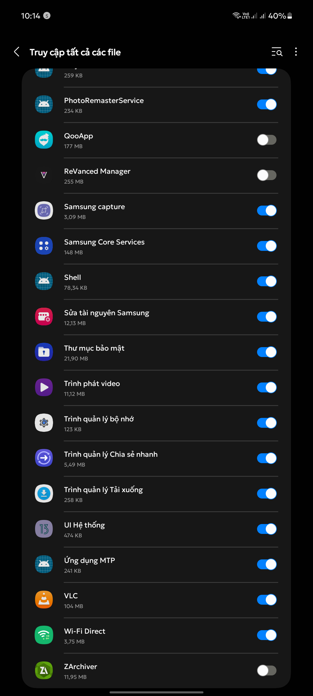
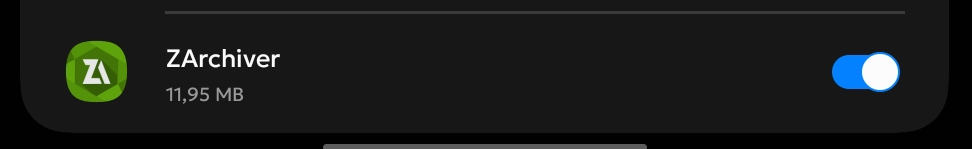
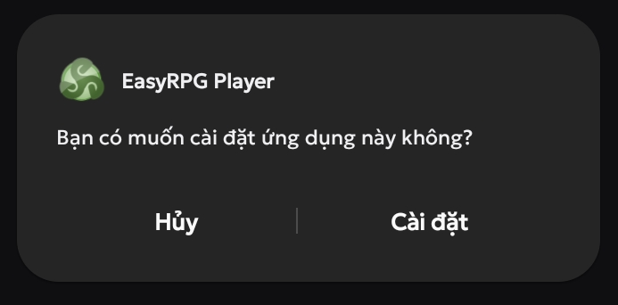
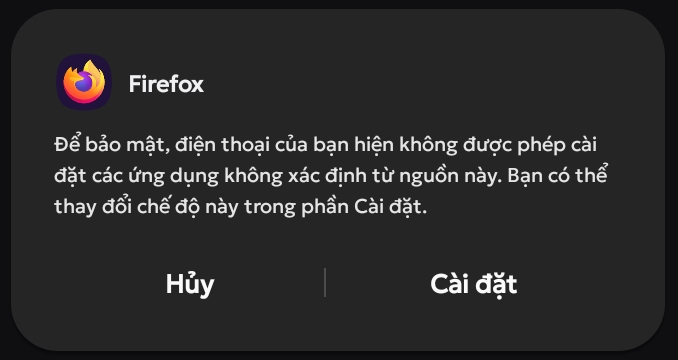
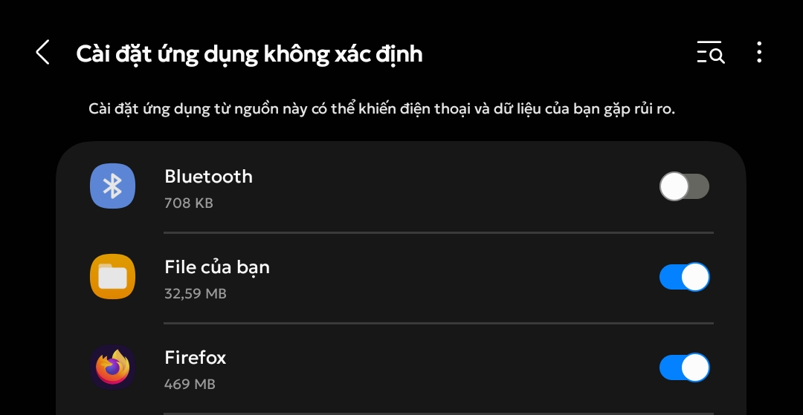
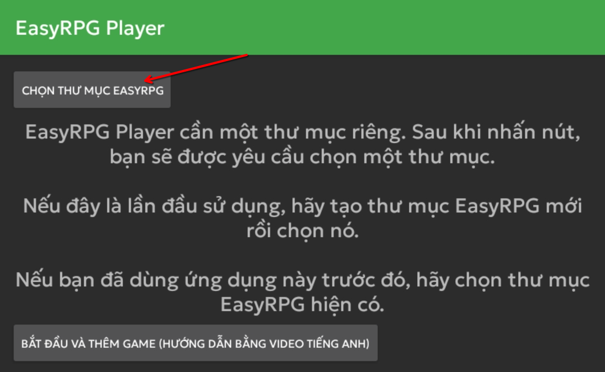

# Điều kiện cơ bản

Dưới đây sẽ là những thứ bạn cần chuẩn bị để chơi game Nobihaza trên điện thoại Android.

Mình sẽ sử dụng máy Samsung Galaxy A71 với One UI 5.1 (Android 13). Tuy nhiên những điện thoại khác cũng sẽ có cách làm tương tự.

## Phần mềm giải nén

Tất cả điện thoại đều sẽ phải cài phần mềm giải nén bên ngoài. Mình không tin tưởng phần mềm mặc định của máy một tí nào.

> [!NOTE]
> Bạn có thể cài bất kì phần mềm giải nén nào cũng được, tuy nhiên ở đây mình sẽ chỉ hướng dẫn ứng dụng ZArchiver.

* Truy cập vào Cửa hàng Play và tìm kiếm ứng dụng **ZArchiver**. Nhấn nút **Cài đặt** để bắt đầu cài đặt ứng dụng đó.

* Mở ứng dụng ZArchiver lần đầu tiên. Một thông báo yêu cầu cấp quyền sẽ xuất hiện thì nhấn OK, và một bảng cấp quyền sẽ được mở như hình bên dưới.

* Nhấn vào nút Bật ở ứng dụng ZArchiver để cấp quyền truy cập tất cả tệp tin cho ứng dụng này.

## RPG Maker 2000/2003

> [!IMPORTANT]
> Đối với người chơi Việt Nam, bạn nên tải bản EasyRPG đã chỉnh sửa để hỗ trợ ngôn ngữ tiếng Việt.
> Sử dụng bản EasyRPG trên Cửa hàng Play sẽ bị lỗi hiển thị.

* Tải bản [EasyRPG Tiếng Việt dành cho Android](https://github.com/The-Firefly-Project/EasyRPGPlayer-Vietnamese/releases/download/0.8.1.1/android.apk).

* Nhấn vào tệp tin đã tải xuống để bắt đầu cài đặt.

> [!NOTE]
> Nếu bạn chưa từng cho phép cài đặt ứng dụng từ trình duyệt, một thông báo yêu cầu cho phép sẽ xuất hiện.
>
> 
>
> Nhấn vào nút **Cài đặt**. Một bảng cấp quyền sẽ hiện ra, hãy cho phép trình duyệt cài đặt ứng dụng. Một số máy cũng có thể mở luôn bảng cấp quyền của trình duyệt và nhấn vào nút **Cho phép cài đặt từ nguồn này**.
>
> 
>
> Sau đó tiến hành mở lại tệp vừa tải xuống và cài đặt như bình thường.

* Thông báo cài đặt thành công sẽ xuất hiện, hãy mở EasyRPG lần đầu tiên. Nhấn nút **Chọn thư mục EasyRPG**.

