# Tự đóng gói tệp APK

Trang này sẽ hướng dẫn nâng cao cho những người đã am hiểu một chút về RPG Maker, máy tính cũng như Android, để xây dựng một bản `.apk` có thể cài đặt trực tiếp mà không cần phần mềm hỗ trợ.

Hiện tại hướng dẫn này chỉ hỗ trợ RPG Maker MV/MZ. Các engine khác sẽ có thể có trong tương lai.

> [!IMPORTANT]
> Hãy làm toàn bộ hướng dẫn theo thứ tự.

## Chuẩn bị ban đầu

> [!NOTE]
> Bạn sẽ chỉ cần làm các bước này ở lần đầu tiên.

### Cài đặt Java JDK

> [!IMPORTANT]
> Mình khuyến khích cài đặt OpenJDK thay cho Oracle JDK! Oracle JDK sẽ có những hạn chế nhất định về mặt giấy phép, và có thể làm cho ứng dụng của bạn gặp nhiều rắc rối trong tương lai.

#### Lựa chọn phiên bản

* Vào trang [hướng dẫn Cordova dành cho Android](https://cordova.apache.org/docs/en/12.x-2025.01/guide/platforms/android/index.html#android-api-level-support) để xem danh sách phiên bản `cordova-android`.

* Hãy lựa chọn phiên bản `cordova-android` bạn muốn cài đặt. Mình khuyên dùng bản mới nhất (`13.0.x` tính đến ngày 1/8/2025) nếu bạn không quan tâm đến việc hỗ trợ bản Android thấp, hoặc bản `11.0.x` nếu bạn muốn game hỗ trợ cho cả Android 5.1.

* Sau khi đã chọn phiên bản Android, hãy chuyển qua cột **Library & Tooling Version**. Bạn sẽ thấy phiên bản JDK cần cài đặt cho phiên bản `cordova-android` bạn đã chọn.


#### Tải xuống và cài đặt

<details>
<summary>Windows và macOS</summary>

* Truy cập vào [trang web tải xuống OpenJDK](https://www.openlogic.com/openjdk-downloads).

* Chọn phiên bản OpenJDK bạn muốn tải:
    * Chọn **Java Version** là phiên bản JDK mà bạn đã chọn ở phần Lựa chọn phiên bản. Đối với `cordova-android` bản mới nhất, chúng ta sẽ dùng bản 17.
    * Chọn **Operating System** là phiên bản hệ điều hành bạn đang sử dụng.
    * Chọn **Architecture** là kiến trúc CPU máy tính của bạn (x86 hoặc ARM).
    * Chọn **Java Package** là JDK.

Sau khi đã lựa chọn xong, danh sách các phiên bản sẽ giống như thế này:


* Nhấn vào chữ `.msi` (hoặc `.pkg` đối với macOS) đầu tiên trong danh sách (ở ảnh trên sẽ là phiên bản `17.0.16+8`). Nếu có phiên bản mới hơn trong tương lai thì bạn sẽ chọn phiên bản mới hơn đó.

* Sau khi tải xong, nhấn đúp vào tệp tin `.msi` hoặc `.pkg` đã tải xuống và tiến hành cài đặt.

</details>

<details>
<summary>Linux</summary>

Hãy tham khảo hướng dẫn cài đặt OpenJDK dành riêng cho distro của bạn. Mỗi distro sẽ có cách cài đặt khác nhau.
</details>

### Cài đặt Android Studio và Android SDK

* Truy cập vào [trang web chính thức của Android Studio](https://developer.android.com/studio). Nhấn vào nút Download ở ngay đầu website, đồng ý điều khoản sử dụng và website sẽ tự động tải xuống phiên bản dành cho hệ điều hành của bạn.

* Sau khi tải xuống, hãy tiến hành cài đặt như bình thường.

* Mở ứng dụng Android Studio lên. Nhấn vào chữ **More Actions** ở giữa cửa sổ và chọn **SDK Manager**.


* Ở tab **SDK Platforms**, hãy chọn phiên bản Android SDK theo phiên bản `cordova-android` bạn đã chọn ở mục Lựa chọn phiên bản. Chú ý đến phần **Android API Levels**, đối với phiên bản `cordova-android` mới nhất thì sẽ chọn phiên bản Android SDK từ 24 (Android 7.0) đến 34 (Android 14.0).


Ở đây mình sẽ chọn phiên bản Android SDK cao nhất có thể hỗ trợ là **Android 14** (API Level 34).

* Nhấn vào tab **SDK Tools**, và chọn tùy chọn **Show Package Details**. Sau đó ở mục **Android SDK Build Tools**, hãy chọn phiên bản trùng với API Level mà bạn vừa mới chọn.


* Ở mục **Android Command Line Tools**, chọn phiên bản mới nhất.


* Tích chọn **Android SDK Platform-Tools**.


* Nhấn **OK** để tiến hành cài đặt tất cả thư viện đã chọn. Nhấn **OK** lần nữa để xác nhận các thư viện sẽ được cài đặt.


* Đợi cho quá trình cài đặt được hoàn tất (hiển thị chữ **Done** và xuất hiện nút **Finish**). Nhấn nút **Finish** để hoàn thành cài đặt.

### Cài đặt Gradle

* Truy cập [trang web tải xuống Gradle](https://gradle.org/releases/).

* Nhấn vào chữ **binary-only** ở phiên bản mới nhất.


* Giải nén tệp tin `.zip` vừa tải ra một thư mục bất kì.

### Cài đặt FFmpeg

<details>
<summary>Windows và macOS</summary>

* Truy cập [trang web tải xuống ffmpeg](https://ffmpeg.org/download.html).

* Tải xuống FFmpeg cho hệ điều hành của bạn. Sau đó nhấp đúp vào tệp đã tải xuống để chạy và tiến hành cài đặt.
</details>

<details>
<summary>Linux</summary>

FFmpeg thường sẽ có sẵn trên kho phần mềm của distro bạn đang dùng. Hãy cài đặt theo hướng đẫn dành riêng cho distro của bạn.
</details>

### Kiểm tra biến môi trường

#### Lấy thông tin đường dẫn của các thư viện

<details>
<summary>Android SDK</summary>

* Vào ứng dụng **Android Studio** chọn **More Actions**, sau đó chọn **SDK Manager**.

* Đường dẫn của Android SDK sẽ nằm ở ô Android SDK Location. Đối với mình sẽ là `/home/murasame/Android/Sdk`.


</details>

<details>
<summary>Java JDK</summary>

* Đối với Windows và macOS, đường dẫn của JDK sẽ được ghi ở trong quá trình cài đặt, ví dụ như `C:\Program Files\OpenJDK\17`.

* Đối với Linux, sử dụng lệnh `where javac`, sau đó lấy đường dẫn không phải `/usr/bin` (của mình là dòng thứ 2) và bỏ chữ `/bin/javac` đi. Đối với mình sẽ là `/usr/lib/jvm/default`.


</details>

<details>
<summary>Gradle</summary>

Nó chính là đường dẫn của thư mục bạn đã giải nén từ tệp `gradle-*.zip`.
</details>

#### Cài đặt biến môi trường

<details>
<summary>Windows</summary>

* Nhấn tổ hợp `Windows + S` để mở công cụ tìm kiếm và tìm `environment variables`. Nhấn vào mục **Edit the system environment variables** đầu tiên.

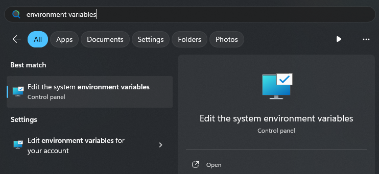

* Nhấn vào nút **Environment Variables**.

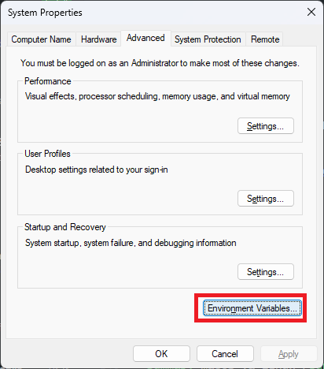

* Chọn mục **Path** ở trong phần **User variables** và nhấn nút **Edit**.

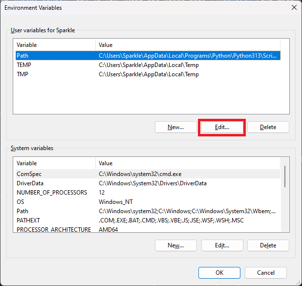

* Thay những từ sau đây trong các đường dẫn bên dưới thành các đường dẫn mà bạn đã tìm được:
    * `sdkPath`: Đường dẫn của Android SDK
    * `jdkPath`: Đường dẫn của Java JDK
    * `gradlePath`: Đường dẫn của thư mục Gradle đã giải nén

* Nhấn nút **New** và lần lượt thêm các đường dẫn sau (mỗi đường dẫn là 1 nút New):

    ```
    sdkPath\tools
    sdkPath\cmdline-tools\latest\bin
    sdkPath\platform-tools
    sdkPath\emulator
    sdkPath\build-tools
    jdkPath\bin
    gradlePath\bin
    ```

    Ví dụ như ảnh bên dưới:

    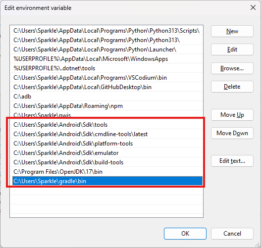

* Nhấn **OK** để lưu lại.

* Nhấn nút **New** bên cạnh trái nút **Edit** vừa nãy.

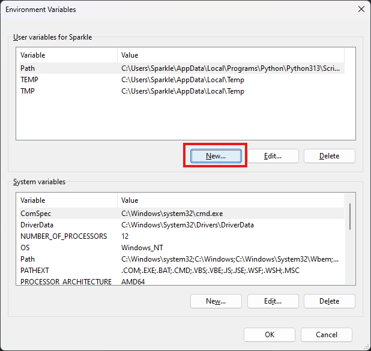

* Nhập Variable name là `JAVA_HOME` và Variable value là đường dẫn của Java JDK.

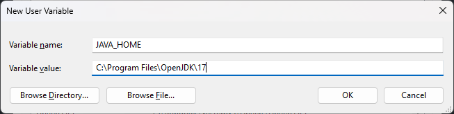

* Nhấn **OK** để lưu lại. Tiếp tục nhấn nút **New** để tạo thêm hai biến mới là `ANDROID_HOME` và `ANDROID_SDK_ROOT` với cùng một giá trị là đường dẫn của Android SDK.

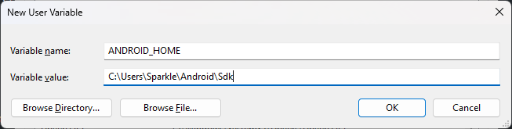

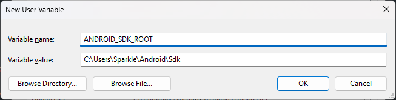

* Cuối cùng nhấn **OK** hai lần để lưu lại cài đặt.
</details>

<details>
<summary>macOS và Linux</summary>

* Mở tệp `/Users/$USER/.profile` (hoặc `/home/$USER/.profile` đối với Linux) bằng bất kì trình soạn thảo văn bản nào.

* Thêm các dòng sau vào cuối tệp tin đó:

```sh
export ANDROID_HOME="/home/murasame/Android/Sdk" # Thay đổi thành đường dẫn Android SDK bạn vừa tìm được
export ANDROID_SDK_ROOT="$ANDROID_HOME"
export JAVA_HOME="/usr/lib/jvm/default" # Thay đổi thành đường dẫn Java JDK bạn vừa tìm được
export GRADLE_PATH="/home/murasame/gradle" # Thay đổi thành đường dẫn Gradle bạn vừa tìm được
export PATH="$ANDROID_HOME/tools:$ANDROID_HOME/cmdline-tools/latest/bin:$ANDROID_HOME/platform-tools:$ANDROID_HOME/emulator:$ANDROID_HOME/build-tools:$JAVA_HOME/bin:$GRADLE_PATH/bin:$PATH"
```

* Đăng xuất (logoff) tài khoản của máy tính ra sau đó đăng nhập lại để áp dụng thay đổi.
</details>

#### Kiểm tra thư viện

Mở cửa sổ dòng lệnh lên và kiểm tra các thư viện bên dưới:

<details>
<summary>Android SDK</summary>

```sh
echo $ANDROID_HOME
```

Nếu nó in ra đường dẫn bạn đã lấy trước đó thì bạn đã thành công.
</details>

<details>
<summary>Java JDK</summary>

```sh
java --version
```
    
Nếu nó in ra `openjdk 17` thì bạn đã thành công.
</details>

<details>
<summary>Gradle</summary>

```sh
gradle --version
```

Nếu nó in ra câu **Welcome to Gradle** thì bạn đã thành công.
</details>

Nếu có một thư viện vẫn báo lỗi, hãy thử lại các bước bên trên.

### Cài đặt KeyStore Explorer

Ứng dụng này sẽ được sử dụng để tạo khóa và ký (sign) ứng dụng Android của bạn.

* Truy cập vào [trang web tải xuống của KeyStore Explorer](https://keystore-explorer.org/downloads.html).

* Chọn tệp để tải xuống dựa trên hệ điều hành bạn đang sử dụng, cũng như là đọc kĩ ghi chú ở mục **Details**.

* Nhấn đúp vào tệp tin đã tải xuống để cài đặt KeyStore Explorer.

> [!IMPORTANT]
> Đối với các Linux distro không hỗ trợ tệp tin `.deb` và `.rpm` (Arch Linux, Gentoo, v.v.), hãy tham khảo hướng dẫn cài đặt dành riêng cho distro của bạn.

## Tạo một keystore mới để ký tệp tin APK

> [!NOTE]
> Nếu bạn đã từng tạo một keystore trước đây, bạn có thể sử dụng lại nó thay vì tạo một keystore mới.

Để tránh bị Android cảnh báo ứng dụng không an toàn, chúng ta cần ký (sign) tệp tin APK của mình bằng một tệp tin keystore.

* Mở ứng dụng **KeyStore Explorer**.

* Nhấn **File** -> **New** hoặc tổ hợp `Ctrl + N` để tạo một keystore mới. Chọn **PKCS #12** và nhấn **OK**.

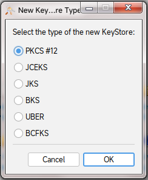

* Nhấn **Tools** -> **Generate Key Pair** hoặc tổ hợp `Ctrl + G`. Một hộp thoại **Generate Key Pair** sẽ xuất hiện, hãy để mặc định và nhấn **OK**.

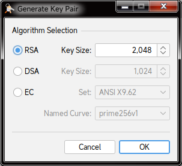

* Chỉnh **Validity Period** thành số thời gian mà bạn muốn chứng chỉ của bạn tồn tại. Khi chứng chỉ hết hạn, bạn bắt buộc phải tạo lại khóa mới bằng các bước này. Sau đó nhấn nút **Apply**.

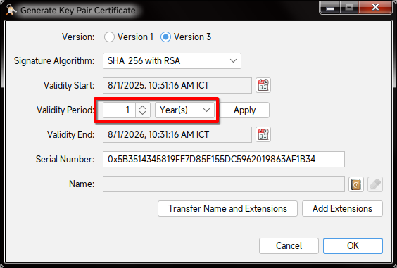

* Nhấn vào biểu tượng danh bạ bên cạnh phải mục **Name**.

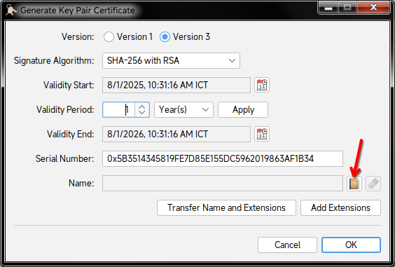

* Một bảng nhập tên sẽ xuất hiện, hãy nhập theo mẫu dưới đây:

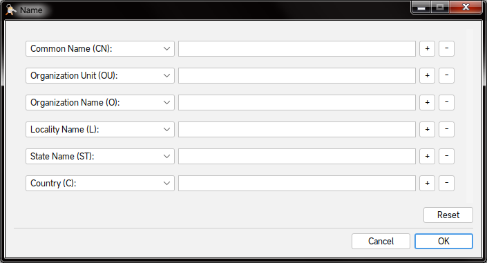

| Thông tin | Mô tả |
| --- | --- |
| Common Name (CN) | Tên cá nhân hoặc tổ chức thường gọi của bạn, có thể là tên thật hoặc biệt danh tùy ý |
| Organization Unit (OU) | Tên tổ chức con, hoặc có thể là một tên khác tùy ý |
| Organization Name (O) | Tên tổ chức của bạn |
| Locality Name (L) | Tỉnh/thành phố của tổ chức |
| State Name (ST) | Tỉnh/thành phố bạn đang sống |
| Country (C) | Quốc gia của bạn, ghi bằng mã ISO có 2 kí tự (ví dụ như Việt Nam thì sẽ là `VN`) |

Nếu bạn không có tổ chức, bạn có thể ghi thông tin cá nhân (hoặc thông tin bất kì) thay vào tên tổ chức.

* Nhấn **OK** để xác nhận. Xem lại thông tin và nhấn **OK** một lần nữa để tạo chứng chỉ.

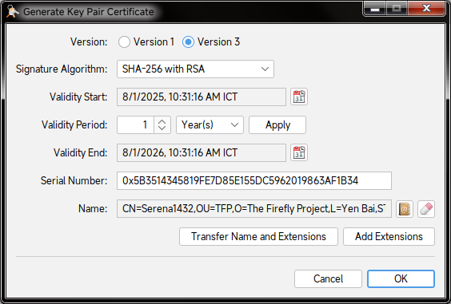

* Nhập tên gọi cho khóa vừa tạo. Có thể để mặc định và nhấn **OK**.

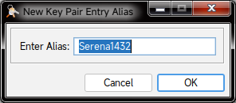

* Nhập mật khẩu bạn muốn cho keystore của bạn, sau đó nhấn **OK**.

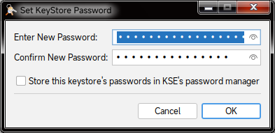

* Nhấn chuột phải vào tên Key Pair ở trên màn hình **KeyStore Explorer** và chọn **Set Password**. Nhập mật khẩu mới cho Key Pair và nhấn **OK**.<br>Mật khẩu keystore và mật khẩu Key Pair có thể khác nhau.

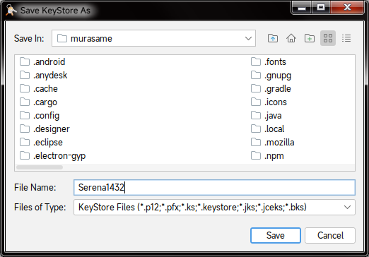

* Cuối cùng là nhấn **File** -> **Save** hoặc tổ hợp `Ctrl + S` để lưu khóa thành một tệp tin có định dạng `.p12`.

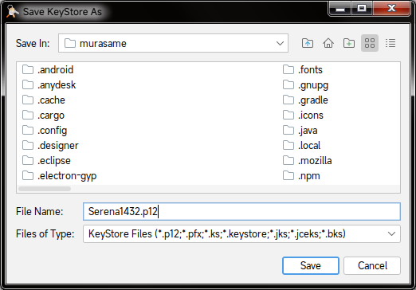

> [!IMPORTANT]
> Sau khi đã tạo xong, hãy nhớ:
>
> * Đường dẫn của tệp tin khóa vừa tạo
> * Tên gọi (Alias) của khóa
> * Mật khẩu của Key Pair và mật khẩu của keystore (hai mật khẩu có thể khác nhau)
>
> Bạn sẽ cần sử dụng các thông tin này về sau.

## RPG Maker MV/MZ

### Thử nghiệm game trên web

Do bản `.apk` trên Android sẽ sử dụng Android WebView (một trình duyệt nhúng vào ứng dụng), nên bạn nên thử nghiệm trên trình duyệt để kiểm tra lỗi trước khi tiến hành đóng gói cho điện thoại.

Bạn có thể xem lại mục **Chạy game RPG Maker MV trên trình duyệt** ở phần Sửa lỗi và mẹo trên hướng dẫn này cho hệ điều hành của bạn.

Nếu có lỗi xảy ra khi chơi trên web, bạn cần phải tự sửa cho đến khi chạy được.

### Chuẩn bị

> [!NOTE]
> Bạn sẽ chỉ cần làm các bước này ở lần đầu tiên.

#### Cài đặt Node.js

<details>
<summary>Windows và macOS</summary>

* Truy cập vào [trang tải xuống của Node.js](https://nodejs.org/en/download).

* Ở mục **Or get a prebuilt Node.js® for**, hãy chọn hệ điều hành và loại hệ điều hành (x86, x64 hay ARM64) mà máy bạn đang sử dụng. Ví dụ như dưới đây sẽ là dành cho Windows 64-bit (x64):


* Nhấn đúp để chạy tệp tin vừa mới tải xuống (Windows sẽ là `.exe`, còn macOS sẽ là `.pkg`). Sau đó tiến hành làm theo hướng dẫn để cài đặt Node.js.
</details>

<details>
<summary>Linux</summary>

* Đầu tiên là cài đặt `nvm` (Node Version Manager) cho Linux:

```sh
curl -o- https://raw.githubusercontent.com/nvm-sh/nvm/v0.40.3/install.sh | bash
```

> [!NOTE]
> Nếu sau này nvm có phiên bản mới hơn, bạn hãy thay đổi `0.40.3` thành phiên bản đó, hoặc bạn có thể đọc hướng dẫn trên [trang GitHub chính thức của nvm](https://github.com/nvm-sh/nvm).

* Sau khi cài đặt thành công thì tiếp tục cài đặt Node.js:

```sh
nvm install node
```
</details>

#### Cài đặt Git

<details>
<summary>Windows</summary>

* Truy cập vào [trang tải Git dành cho Windows](https://git-scm.com/downloads/win).

* Chọn bản dành cho kiến trúc hệ điều hành của bạn (x64 hoặc ARM64) ở mục Standalone Installer. Ví dụ như nếu bạn đang dùng Windows 64-bit, hãy chọn **Git for Windows/x64 Setup**.

* Sau khi tải xuống xong, nhấn đúp để chạy tệp tin `.exe` vừa tải xuống và làm theo hướng dẫn để hoàn tất cài đặt.
</details>

<details>
<summary>macOS</summary>

Nếu bạn đã cài Xcode thì nó đã kèm sẵn Git theo mặc định. Còn nếu bạn chưa có thì bạn có thể cài Git thông qua MacPorts:

```sh
sudo port install git
```
</details>

<details>
<summary>Linux</summary>

Git có thể được cài đặt trên toàn bộ distro. Hãy cài đặt gói `git` theo câu lệnh cho Package Manager của bạn, ví dụ như Pacman ở trên Linux thì sẽ là `pacman -S git`.
</details>

#### Cài đặt Cordova

* Chạy dòng lệnh sau để cài Cordova:

```sh
npm install -g cordova
```

* Sau khi cài đặt xong thì kiểm tra phiên bản Cordova:

```sh
cordova --version
```

Nó sẽ ra thông tin phiên bản Cordova (ví dụ như `12.0.0 (cordova-lib@12.0.2)`).

### Tạo dự án Cordova mới

* Mở cửa sổ dòng lệnh và dùng lệnh `cd` để di chuyển tới thư mục bạn cần tạo dự án, ví dụ như:

```sh
cd /home/$USER/Documents/Output/android
```

* Dùng lệnh sau để tạo dự án mới:

```sh
cordova create "folder" "identifier" "name"
```

| Thay thế | Thành |
| --- | --- |
| `folder` | Thư mục của dự án, ví dụ như `IDRemake` |
| `identifier` | Mã nhận diện gói Android của dự án, thường có dạng `xxxx.xxxx.xxxx`. Ví dụ như `vn.serena1432.idremake` |
| `name` | Tên dự án, và cũng là tên của ứng dụng; ví dụ như `Nobihaza ID Remake` |

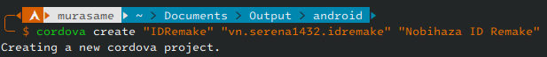

* `cd` tới thư mục của dự án bạn vừa tạo:

```sh
cd "IDRemake" # Thay IDRemake thành thư mục của dự án bạn vừa tạo
```

* Thêm Android vào danh sách các nền tảng của dự án:

```sh
cordova platform add android@^13.0.0
```

> [!NOTE]
> Nếu bạn chọn phiên bản Cordova cũ hơn (để hỗ trợ cho các phiên bản Android cũ hơn) khi cài đặt các thư viện, hãy thay bằng lệnh `cordova platform add android@^11.0.0` (hoặc thay 11.0.0 thành phiên bản bạn đã chọn).

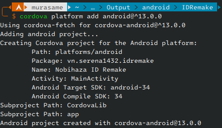

* Sử dụng lệnh `cordova requirements` để kiểm tra lại các thư viện:

```sh
cordova requirements
```

Nếu không còn bất kì dòng chữ màu vàng nào như hình bên dưới thì bạn đã có thể tiếp tục. Nếu không, bạn cần phải kiểm tra lại các thư viện ở phần **Cài đặt ban đầu**.

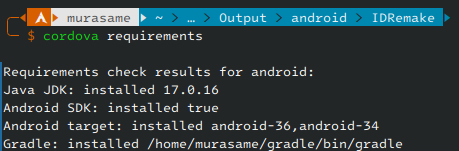

### Thêm bàn phím ảo vào game

Mặc định thì bản `.apk` sẽ không hỗ trợ bàn phím ảo, nên bạn cần chủ động thêm bàn phím ảo vào dự án game trước khi đóng gói.

> [!NOTE]
> Bạn có thể sử dụng bất kì plugin nào có sẵn trên mạng. Tuy nhiên ở hướng dẫn này thì mình sẽ sử dụng plugin `Kiyoko_JoystickHandler` của mình để cài đặt bàn phím ảo.
>
> Đây cũng là plugin mình đã sử dụng để tạo bàn phím ảo cho **Doraemon: Nobita's Resident Evil 2 (Việt Hóa)**.

> [!NOTE]
> Hướng dẫn đầy đủ cho plugin này sẽ có trong tương lai. Tuy nhiên mình vẫn ghi lời giải thích ngắn của mỗi cài đặt trong phần cài đặt của plugin.

* Tải tệp tin plugin [**Kiyoko_JoystickHandler**](https://github.com/Serena1432/Kiyoko_JoystickHandler/blob/main/Kiyoko_JoystickHandler.js).

* Thêm hình ảnh chứa các phím bạn muốn thêm vào trong thư mục `img/JoyStick` với định dạng `.png`. Nếu bạn muốn sử dụng các phím mặc định do mình tạo thay thế vào đó, bạn có thể tải [tệp tin này](https://github.com/Serena1432/Kiyoko_JoystickHandler/raw/refs/heads/main/JoyStick.zip) và giải nén vào thư mục `img/JoyStick`.

* Thêm plugin vừa tải xuống vào thư mục `js/plugins` của dự án, và mở **Plugin Manager** của dự án trên RPG Maker MV/MZ. Thêm plugin **Kiyoko_JoystickHandler** vào danh sách plugin.

* Bên phải plugin (Parameters) sẽ là danh sách các cài đặt. Nhấn đúp vào từng cài đặt để xem thông tin và chỉnh sửa nó.

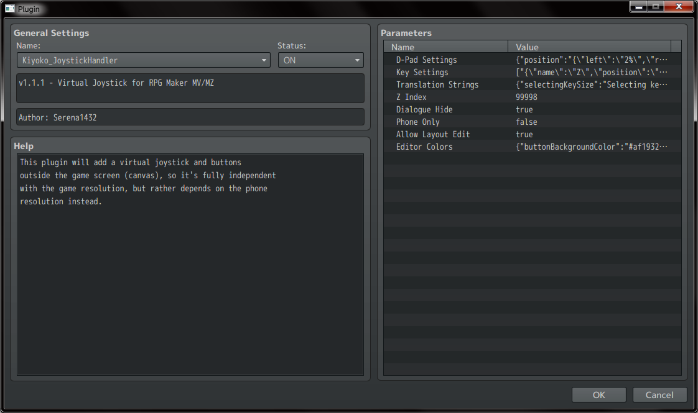

* Cài đặt của từng mục đã được mở, bạn hãy nhấn đúp để chỉnh sửa theo ý của bạn.

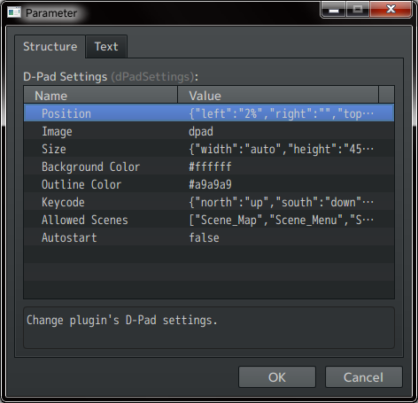

* Khi đang chỉnh sửa một thông tin, plugin cũng sẽ giải thích sơ qua về cài đặt này ở hộp thoại nhỏ bên dưới.

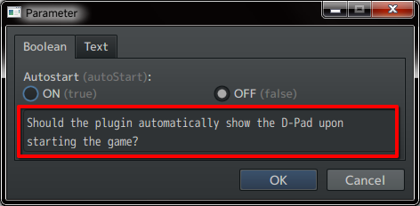

* Bắt đầu chỉnh sửa tất cả cài đặt cho đến khi bạn thấy ổn. Sau đó hãy nhấn **OK** liên tục cho đến khi cửa sổ Plugin Manager được đóng lại, và lưu lại dự án.

> [!TIP]
> Nên tắt tùy chọn **Phone Only** để có thể thử bàn phím ảo khi ở trên máy tính. Sau khi đã thử xong, hãy bật lại tùy chọn này để ẩn bàn phím ảo khi người chơi đang chơi game trên máy tính.

### Thêm dữ liệu game vào dự án

* Truy cập vào thư mục game và sao chép toàn bộ tệp tin trong thư mục `www` của game.

> [!NOTE]
> Một số game sẽ không có thư mục `www`, lúc này bạn hãy copy các thư mục `audio`, `data`, `fonts`, `icon`, `img`, `js`, `movies` và tệp tin `index.html` trong thư mục game.

* Dán các tệp tin đã sao chép vào thư mục `www` của dự án.

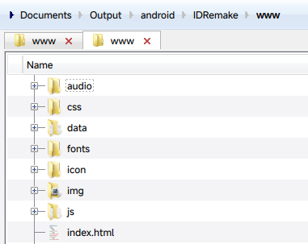

### Chuyển đổi âm thanh từ `.ogg` sang `.m4a`

Đối với điện thoại thì game sẽ sử dụng tệp tin âm thanh `.m4a` thay vì `.ogg` như trên máy tính, nên bạn cần chuyển đổi tất cả tệp tin âm thanh:

> [!NOTE]
> Dòng lệnh này sẽ chuyển đổi tất cả các tệp tin `.ogg` sang `.m4a` trước, sau đó xóa tệp tin `.ogg` gốc đi để tiết kiệm dung lượng.

<details>
<summary>Windows</summary>

Mở **PowerShell** lên, dùng lệnh `cd` trỏ tới thư mục `www` của dự án và dùng lệnh sau:

```powershell
Get-ChildItem -Recurse -Filter *.ogg | ForEach-Object { ffmpeg -i $_.FullName -c:a aac -b:a 96k -ar 44100 -map_metadata 0 ($_.FullName -replace '\.ogg$', '.m4a'); if ($?) { Remove-Item $_.FullName } }
```
</details>

<details>
<summary>macOS và Linux</summary>

Mở **Terminal** lên, dùng lệnh `cd` trỏ tới thư mục `www` của dự án và dùng lệnh sau:

```sh
find . -type f -name "*.ogg" -exec sh -c 'ffmpeg -i "$0" -c:a aac -b:a 96k -ar 44100 -map_metadata 0 "${0%.ogg}.m4a" && rm "$0"' {} \;
```
</details>

Đợi cho đến khi quá trình chuyển đổi hoàn tất (không còn in thêm dòng nào nữa).

### Chỉnh sửa tệp tin `config.xml`

#### Chỉnh sửa ban đầu

* Mở tệp tin `config.xml` trên thư mục của dự án bằng bất kì trình chỉnh sửa văn bản nào.

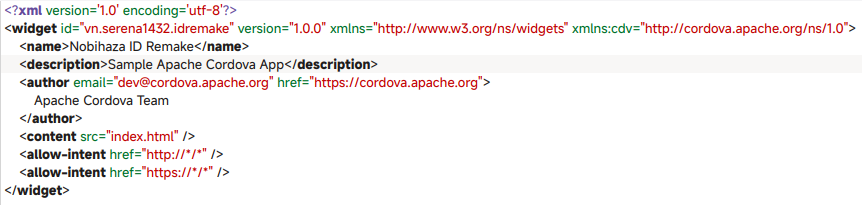

* Thay `Sample Apache Cordova App` trong phần `description` thành mô tả game mà bạn muốn.

* Thay email `dev@cordova.apache.org` và website `https://cordova.apache.org` trong phần `author` thành email và website của bạn. Thay `Apache Cordova Team` thành tên của bạn.

#### Ẩn thanh thông báo và nút điều hướng khi chơi game

Thêm một dòng mới trước `</widget>` và dán dòng chữ sau vào dòng đó:

```xml
<preference name="Fullscreen" value="true" />
```

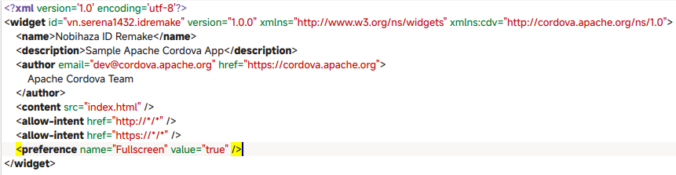

#### Thay đổi biểu tượng của tệp APK

Thêm một dòng mới trước `</widget>` và dán dòng chữ sau vào dòng đó:

```xml
<icon src="www/icon/icon.png" />
```

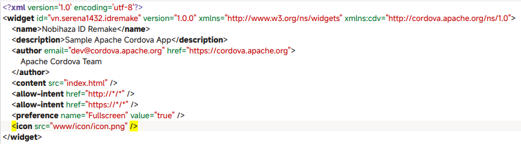

Lúc này biểu tượng của tệp APK sẽ giống với biểu tượng game trên RPG Maker MV. Nếu bạn muốn thay đổi biểu tượng của game, hãy thay đổi tệp tin `www/icon/icon.png` thành một tệp tin khác (nhưng vẫn giữ nguyên tên).

#### Thay đổi phiên bản của game

Thay đổi `1.0.0` (hoặc phiên bản đang có trên mục `<widget ... version="">` của `config.xml`) thành phiên bản game bạn muốn, ví dụ như từ `1.0.0` thành `1.0.1`:

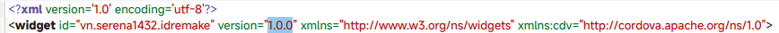

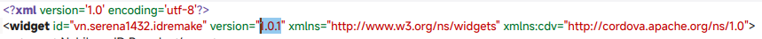

Sau đó lưu lại tệp tin.

#### Bắt buộc xoay ngang màn hình game

Nếu không thực hiện, game mặc định sẽ khởi động ở màn hình dọc.

Thêm một dòng mới trước `</widget>` và dán dòng chữ sau vào dòng đó:

```xml
<preference name="orientation" value="landscape" />
```

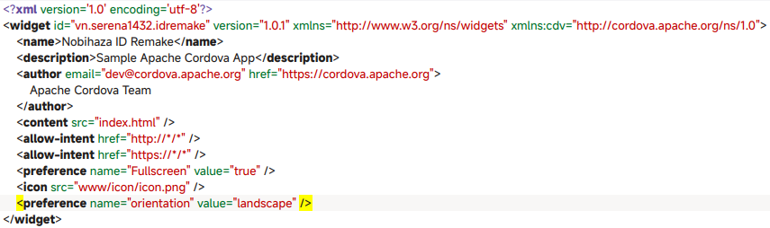

Sau đó lưu lại tệp tin.

### Cài đặt ký tệp tin APK

Để tránh bị Android cảnh báo ứng dụng không an toàn, chúng ta cần ký (sign) tệp tin APK của mình bằng một tệp tin keystore

* Mở một trình soạn thảo văn bản bất kì mà bạn muốn, và sao chép đoạn văn bản sau:

```json
{
    "android": {
        "debug": {
            "keystore": "android_debug.p12",
            "storePassword": "storepassword",
            "alias": "android",
            "password" : "keypairpassword",
            "keystoreType": "pkcs12",
            "packageType": "apk"
        },
        "release": {
            "keystore": "android_release.p12",
            "storePassword": "storepassword",
            "alias": "android",
            "password" : "keypairpassword",
            "keystoreType": "pkcs12",
            "packageType": "apk"
        }
    }
}
```

* Thay đổi thông tin trong mục `debug` và `release` thành thông tin của 2 keystore (hoặc có thể dùng 1 keystore cho cả 2 mục):

| Thông tin | Mô tả |
| `keystore` | Đường dẫn của tệp tin keystore (có định dạng là `.p12`) |
| `storePassword` | Mật khẩu của keystore bạn đã đặt trong quá trình tạo |
| `alias` | Tên gọi của Key Pair trong keystore |
| `password` | Mật khẩu của Key Pair trong keystore |
| `keystoreType` | Ghi là `pkcs12`. Có thể để trống và hệ thống sẽ tự phát hiện qua đuôi tệp tin |
| `packageType` | Ghi là `apk` để tạo tệp tin `.apk` |

* Lưu lại đoạn văn bản đã sửa thành tệp tin `build.json` và đặt nó vào thư mục của dự án.

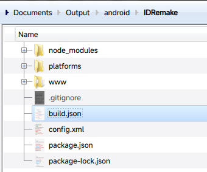

### Đóng gói ứng dụng

Giờ đã đến phần quan trọng nhất đó là đóng gói ứng dụng!

* Mở cửa sổ dòng lệnh và `cd` tới thư mục dự án nếu bạn chưa làm.

* Bắt đầu đóng gói ứng dụng:

```sh
cordova build --release android
```

Thay `--release` thành `--debug` nếu bạn muốn tệp `.apk` của bạn hỗ trợ các công cụ gỡ lỗi.

* Hãy đợi cho đến khi có thông báo **BUILD SUCCEEDED** như hình bên dưới. Nếu có lỗi, hãy thử kiểm tra lỗi và tiến hành build lại.

> [!NOTE]
> Lần đóng gói đầu tiên có thể sẽ rất lâu, nhưng đó là điều bình thường. Các lần đóng gói sau sẽ nhanh hơn.

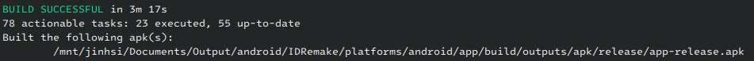

Tệp tin `.apk` sẽ ở 1 trong 2 đường dẫn sau:

* `thumucduan/platforms/android/app/build/outputs/apk/debug/app-debug.apk` nếu build dưới dạng `debug`.
* `thumucduan/platforms/android/app/build/outputs/apk/release/app-release.apk` nếu build dưới dạng `release`.

### Cập nhật ứng dụng

> [!IMPORTANT]
> Hãy đảm bảo là bạn đang dùng một keystore cho tất cả các bản cập nhật. Nếu khác keystore thì người chơi sẽ không thể cập nhật được ứng dụng của bạn!

Bạn hãy làm tuần tự các bước sau khi cập nhật bản mới cho game:

* [Sao chép dữ liệu từ thư mục game sang thư mục `www` của dự án](#thêm-dữ-liệu-game-vào-dự-án).
* [Chuyển đổi tệp tin `.ogg` sang `.m4a`](#chuyển-đổi-âm-thanh-từ-ogg-sang-m4a).
* [Thay đổi phiên bản của ứng dụng](#thay-đổi-phiên-bản-của-game).
* [Đóng gói ứng dụng](#đóng-gói-ứng-dụng).