# Tự đóng gói tệp APK

Trang này sẽ hướng dẫn nâng cao cho những người đã am hiểu một chút về RPG Maker, máy tính cũng như Android, để xây dựng một bản `.apk` có thể cài đặt trực tiếp mà không cần phần mềm hỗ trợ.

Hiện tại hướng dẫn này chỉ hỗ trợ RPG Maker MV/MZ. Các engine khác sẽ có thể có trong tương lai.

> [!IMPORTANT]
> Hãy làm toàn bộ hướng dẫn theo thứ tự.

## RPG Maker MV/MZ

### Thử nghiệm game trên web

Do bản `.apk` trên Android sẽ sử dụng Android WebView (một trình duyệt nhúng vào ứng dụng), nên bạn nên thử nghiệm trên trình duyệt để kiểm tra lỗi trước khi tiến hành đóng gói cho điện thoại.

Bạn có thể xem lại mục **Chạy game RPG Maker MV trên trình duyệt** ở phần Sửa lỗi và mẹo trên hướng dẫn này cho hệ điều hành của bạn.

Nếu có lỗi xảy ra khi chơi trên web, bạn cần phải tự sửa cho đến khi chạy được.

### Chuẩn bị

> [!NOTE]
> Bạn sẽ chỉ cần làm các bước này ở lần đầu tiên.

#### Cài đặt Node.js

<details>
<summary>Windows và macOS</summary>

* Truy cập vào [trang tải xuống của Node.js](https://nodejs.org/en/download).

* Ở mục **Or get a prebuilt Node.js® for**, hãy chọn hệ điều hành và loại hệ điều hành (x86, x64 hay ARM64) mà máy bạn đang sử dụng. Ví dụ như dưới đây sẽ là dành cho Windows 64-bit (x64):

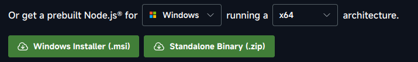

* Nhấn đúp để chạy tệp tin vừa mới tải xuống (Windows sẽ là `.exe`, còn macOS sẽ là `.pkg`). Sau đó tiến hành làm theo hướng dẫn để cài đặt Node.js.
</details>

<details>
<summary>Linux</summary>

* Đầu tiên là cài đặt `nvm` (Node Version Manager) cho Linux:

```sh
curl -o- https://raw.githubusercontent.com/nvm-sh/nvm/v0.40.3/install.sh | bash
```

> [!NOTE]
> Nếu sau này nvm có phiên bản mới hơn, bạn hãy thay đổi `0.40.3` thành phiên bản đó, hoặc bạn có thể đọc hướng dẫn trên [trang GitHub chính thức của nvm](https://github.com/nvm-sh/nvm).

* Sau khi cài đặt thành công thì tiếp tục cài đặt Node.js:

```sh
nvm install node
```
</details>

#### Cài đặt Git

<details>
<summary>Windows</summary>

* Truy cập vào [trang tải Git dành cho Windows](https://git-scm.com/downloads/win).

* Chọn bản dành cho kiến trúc hệ điều hành của bạn (x64 hoặc ARM64) ở mục Standalone Installer. Ví dụ như nếu bạn đang dùng Windows 64-bit, hãy chọn **Git for Windows/x64 Setup**.

* Sau khi tải xuống xong, nhấn đúp để chạy tệp tin `.exe` vừa tải xuống và làm theo hướng dẫn để hoàn tất cài đặt.
</details>

<details>
<summary>macOS</summary>

Nếu bạn đã cài Xcode thì nó đã kèm sẵn Git theo mặc định. Còn nếu bạn chưa có thì bạn có thể cài Git thông qua MacPorts:

```sh
sudo port install git
```
</details>

<details>
<summary>Linux</summary>

Git có thể được cài đặt trên toàn bộ distro. Hãy cài đặt gói `git` theo câu lệnh cho Package Manager của bạn, ví dụ như Pacman ở trên Linux thì sẽ là `pacman -S git`.
</details>

#### Cài đặt Cordova

* Chạy dòng lệnh sau để cài Cordova:

```sh
npm install -g cordova
```

* Sau khi cài đặt xong thì kiểm tra phiên bản Cordova:

```sh
cordova --version
```

Nó sẽ ra thông tin phiên bản Cordova (ví dụ như `12.0.0 (cordova-lib@12.0.2)`).

#### Cài đặt Java JDK

> [!IMPORTANT]
> Mình khuyến khích cài đặt OpenJDK thay cho Oracle JDK! Oracle JDK sẽ có những hạn chế nhất định về mặt giấy phép, và có thể làm cho ứng dụng của bạn gặp nhiều rắc rối trong tương lai.

##### Lựa chọn phiên bản

* Vào trang [hướng dẫn Cordova dành cho Android](https://cordova.apache.org/docs/en/12.x-2025.01/guide/platforms/android/index.html#android-api-level-support) để xem danh sách phiên bản `cordova-android`.

* Hãy lựa chọn phiên bản `cordova-android` bạn muốn cài đặt. Mình khuyên dùng bản mới nhất (`13.0.x` tính đến ngày 1/8/2025) nếu bạn không quan tâm đến việc hỗ trợ bản Android thấp, hoặc bản `11.0.x` nếu bạn muốn game hỗ trợ cho cả Android 5.1.

* Sau khi đã chọn phiên bản Android, hãy chuyển qua cột **Library & Tooling Version**. Bạn sẽ thấy phiên bản JDK cần cài đặt cho phiên bản `cordova-android` bạn đã chọn.

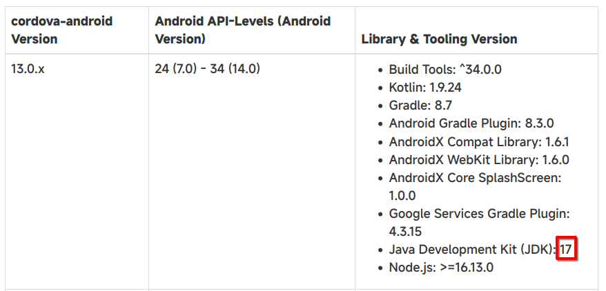

##### Tải xuống và cài đặt

<details>
<summary>Windows và macOS</summary>

* Truy cập vào [trang web tải xuống OpenJDK](https://www.openlogic.com/openjdk-downloads).

* Chọn phiên bản OpenJDK bạn muốn tải:
    * Chọn **Java Version** là phiên bản JDK mà bạn đã chọn ở phần Lựa chọn phiên bản. Đối với `cordova-android` bản mới nhất, chúng ta sẽ dùng bản 17.
    * Chọn **Operating System** là phiên bản hệ điều hành bạn đang sử dụng.
    * Chọn **Architecture** là kiến trúc CPU máy tính của bạn (x86 hoặc ARM).
    * Chọn **Java Package** là JDK.

Sau khi đã lựa chọn xong, danh sách các phiên bản sẽ giống như thế này:

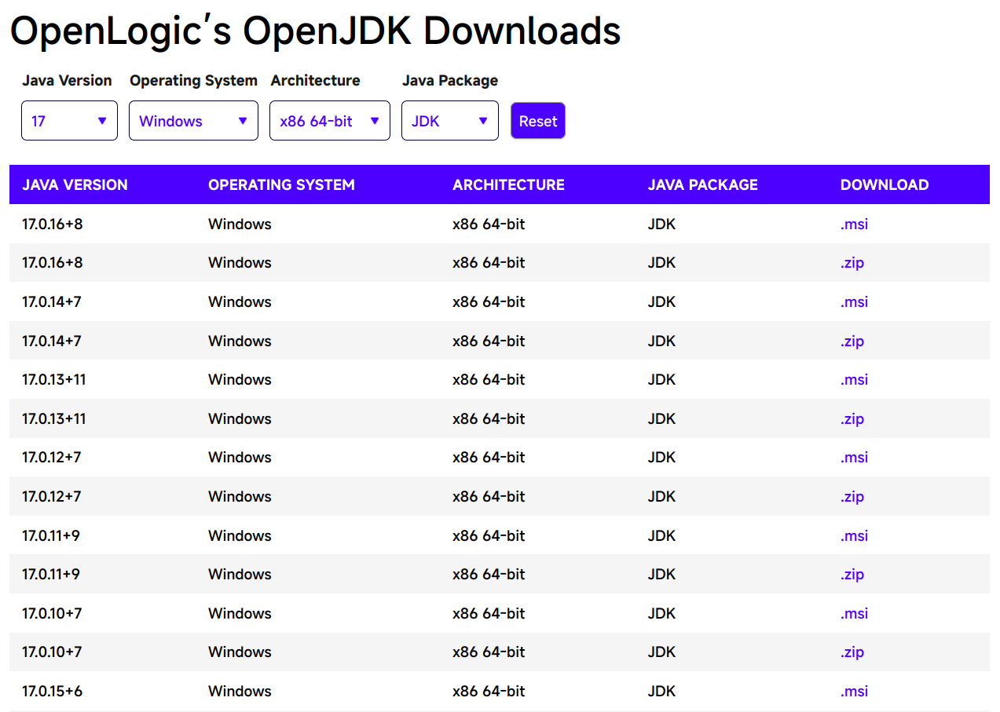

* Nhấn vào chữ `.msi` (hoặc `.pkg` đối với macOS) đầu tiên trong danh sách (ở ảnh trên sẽ là phiên bản `17.0.16+8`). Nếu có phiên bản mới hơn trong tương lai thì bạn sẽ chọn phiên bản mới hơn đó.

* Sau khi tải xong, nhấn đúp vào tệp tin `.msi` hoặc `.pkg` đã tải xuống và tiến hành cài đặt.

> [!IMPORTANT]
> Hãy ghi nhớ kĩ đường dẫn JDK của bạn trong phần Select Install Location. Bạn sẽ cần sử dụng nó về sau này.
</details>

<details>
<summary>Linux</summary>

Hãy tham khảo hướng dẫn cài đặt OpenJDK dành riêng cho distro của bạn. Mỗi distro sẽ có cách cài đặt khác nhau.
</details>

#### Cài đặt Android Studio và Android SDK

* Truy cập vào [trang web chính thức của Android Studio](https://developer.android.com/studio). Nhấn vào nút Download ở ngay đầu website, đồng ý điều khoản sử dụng và website sẽ tự động tải xuống phiên bản dành cho hệ điều hành của bạn.

* Sau khi tải xuống, hãy tiến hành cài đặt như bình thường.

* Mở ứng dụng Android Studio lên. Nhấn vào chữ **More Actions** ở giữa cửa sổ và chọn **SDK Manager**.

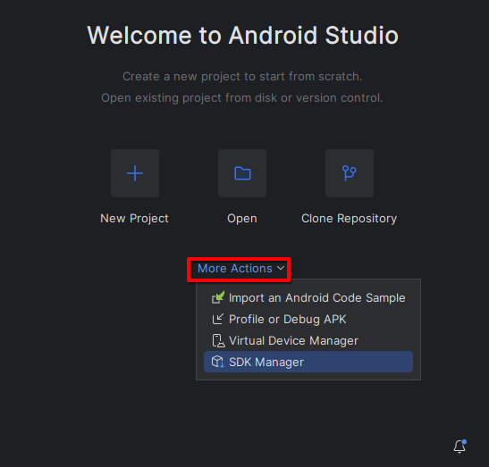

* Ở tab **SDK Platforms**, hãy chọn phiên bản Android SDK theo phiên bản `cordova-android` bạn đã chọn ở mục Lựa chọn phiên bản. Chú ý đến phần **Android API Levels**, đối với phiên bản `cordova-android` mới nhất thì sẽ chọn phiên bản Android SDK từ 24 (Android 7.0) đến 34 (Android 14.0).

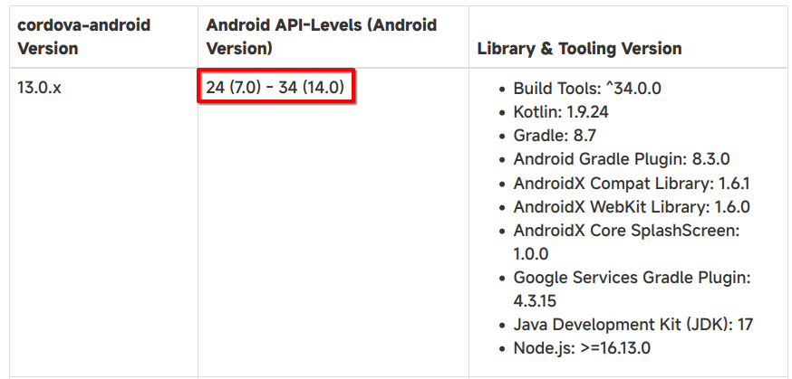

Ở đây mình sẽ chọn phiên bản Android SDK cao nhất có thể hỗ trợ là **Android 14** (API Level 34).

* Nhấn vào tab **SDK Tools**, và chọn tùy chọn **Show Package Details**. Sau đó ở mục **Android SDK Build Tools**, hãy chọn phiên bản trùng với API Level mà bạn vừa mới chọn.

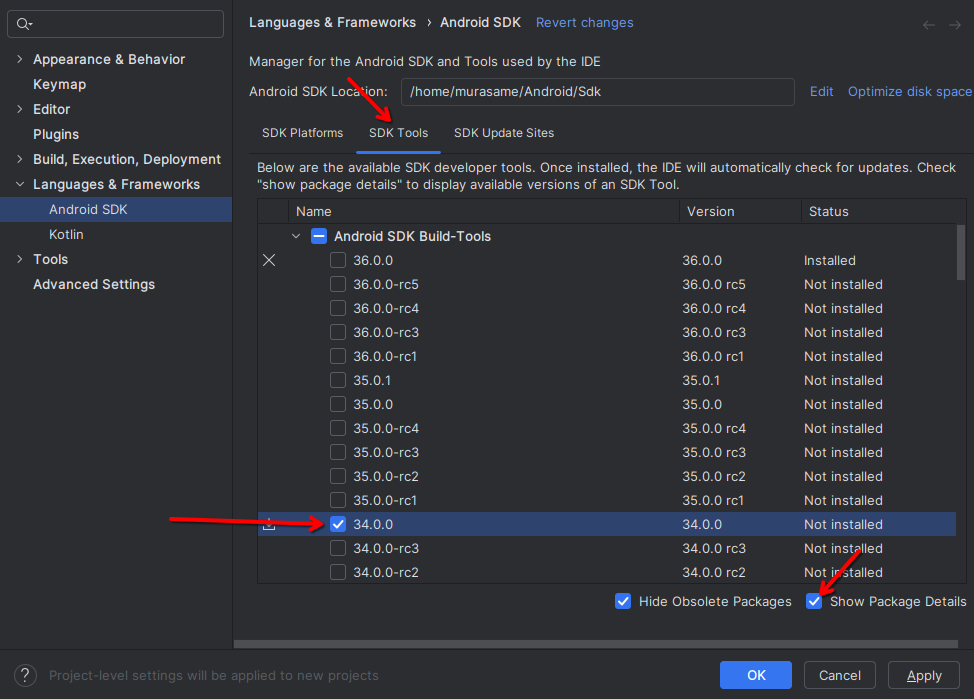

* Ở mục **Android Command Line Tools**, chọn phiên bản mới nhất.

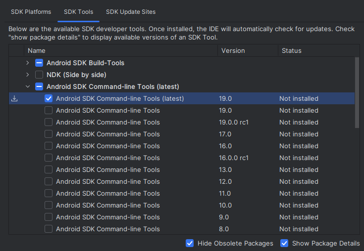

* Tích chọn **Android SDK Platform-Tools**.

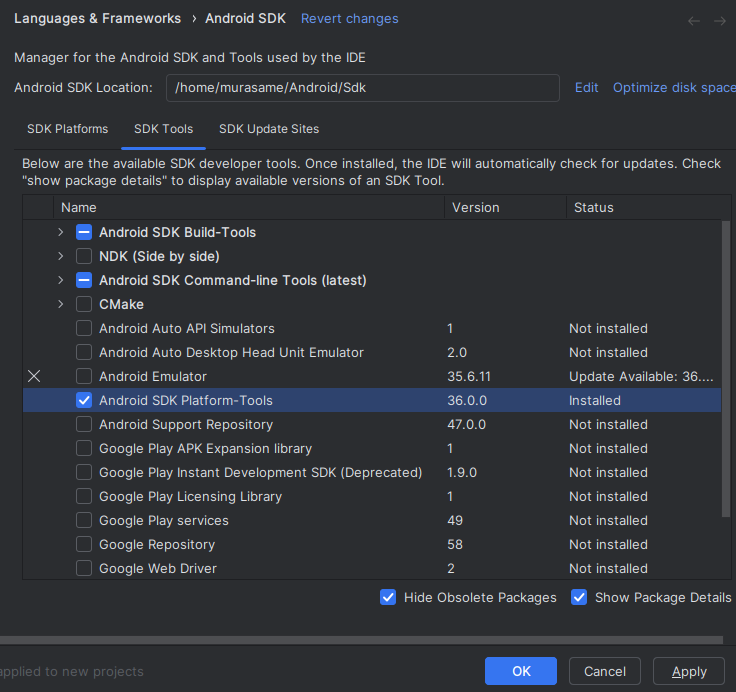

* Nhấn **OK** để tiến hành cài đặt tất cả thư viện đã chọn. Nhấn **OK** lần nữa để xác nhận các thư viện sẽ được cài đặt.

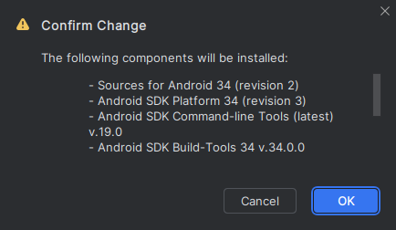

* Đợi cho quá trình cài đặt được hoàn tất (hiển thị chữ **Done** và xuất hiện nút **Finish**). Nhấn nút **Finish** để hoàn thành cài đặt.

#### Cài đặt Gradle

* Truy cập [trang web tải xuống Gradle](https://gradle.org/releases/).

* Nhấn vào chữ **binary-only** ở phiên bản mới nhất.

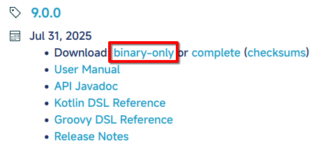

* Giải nén tệp tin `.zip` vừa tải ra một thư mục bất kì.

#### Kiểm tra biến môi trường

##### Lấy thông tin đường dẫn của các thư viện

###### Android SDK

* Vào ứng dụng **Android Studio** chọn **More Actions**, sau đó chọn **SDK Manager**.

* Đường dẫn của Android SDK sẽ nằm ở ô Android SDK Location. Đối với mình sẽ là `/home/murasame/Android/Sdk`.

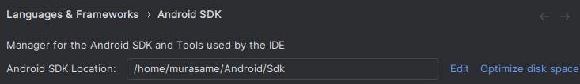

###### Java JDK

* Đối với Windows và macOS, đường dẫn của JDK sẽ được ghi ở trong quá trình cài đặt, ví dụ như `C:\Program Files\OpenJDK\17`.

* Đối với Linux, sử dụng lệnh `where javac`, sau đó lấy đường dẫn không phải `/usr/bin` (của mình là dòng thứ 2) và bỏ chữ `/bin/javac` đi. Đối với mình sẽ là `/usr/lib/jvm/default`.

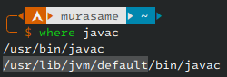

###### Gradle

Nó chính là đường dẫn của thư mục bạn đã giải nén từ tệp `gradle-*.zip`.

##### Cài đặt biến môi trường

<details>
<summary>macOS và Linux</summary>

* Mở tệp `/Users/$USER/.profile` (hoặc `/home/$USER/.profile` đối với Linux) bằng bất kì trình soạn thảo văn bản bất kì.

* Thêm các dòng sau vào cuối tệp tin đó:

```sh
export ANDROID_HOME="/home/murasame/Android/Sdk" # Thay đổi thành đường dẫn Android SDK bạn vừa tìm được
export ANDROID_SDK_ROOT="$ANDROID_HOME"
export JAVA_HOME="/usr/lib/jvm/default" # Thay đổi thành đường dẫn Java JDK bạn vừa tìm được
export GRADLE_PATH="/home/murasame/gradle" # Thay đổi thành đường dẫn Gradle bạn vừa tìm được
export PATH="$ANDROID_HOME/tools:$ANDROID_HOME/cmdline-tools/latest/bin:$ANDROID_HOME/platform-tools:$ANDROID_HOME/emulator:$ANDROID_HOME/build-tools:$JAVA_HOME/bin:$GRADLE_PATH/bin:$PATH"
```

* Đăng xuất (logoff) tài khoản của máy tính ra sau đó đăng nhập lại để áp dụng thay đổi.
</details>

##### Kiểm tra thư viện

Mở cửa sổ dòng lệnh lên và kiểm tra các thư viện bên dưới:

<details>
<summary>Java JDK</summary>

```sh
java --version
```
    
Nếu nó in ra `openjdk 17` thì bạn đã thành công.
</details>

<details>
<summary>Android SDK</summary>

```sh
echo $ANDROID_HOME
```

Nếu nó in ra đường dẫn bạn đã lấy trước đó thì bạn đã thành công.
</details>

<details>
<summary>Gradle</summary>

```sh
gradle --version
```

Nếu nó in ra câu **Welcome to Gradle** thì bạn đã thành công.
</details>

Nếu có một thư viện vẫn báo lỗi, hãy thử lại các bước bên trên.
