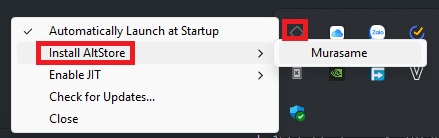
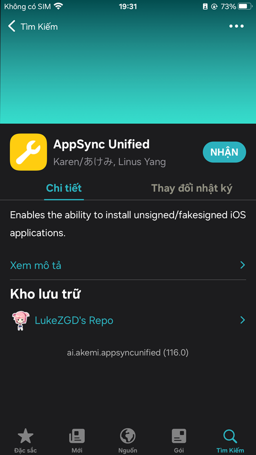
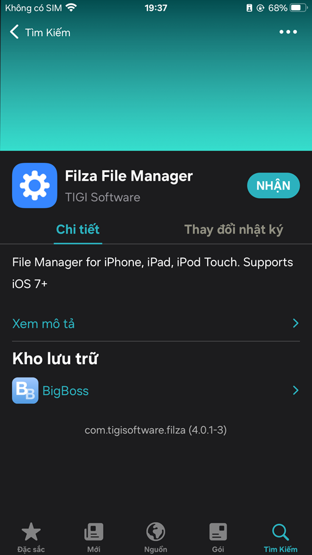
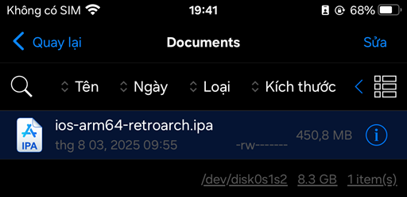
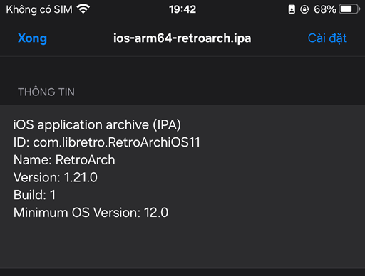

# Điều kiện cơ bản

Cảm ơn Apple vì đã biến iOS thành hệ điều hành khó cài game, cũng như là chơi được ít game Nobihaza nhất trong tất cả các hệ điều hành.

> [!IMPORTANT]
> Hiện tại thì chỉ có game **RPG Maker 2000/2003** được hỗ trợ. Các game khác sẽ hoàn toàn không thể chạy được. 

Mình sẽ sử dụng iPhone 6s Plus với iOS 15.8.4 để làm hướng dẫn này.

> [!NOTE]
> RetroArch với EasyRPG bản gốc đã có sẵn trên App Store, và bạn có thể tải nó từ App Store mà bỏ qua **tất cả** các bước bên dưới.
>
> Tuy nhiên, bản EasyRPG gốc sẽ bị lỗi hiển thị chữ tiếng Việt. Nếu bạn muốn hiển thị tải bản EasyRPG có thể hiển thị chữ tiếng Việt, hãy đọc kĩ hướng dẫn bên dưới.

## Tải RetroArch EasyRPG bản tiếng Việt

Đối với người chơi Việt Nam, bạn cần tải bản RetroArch riêng có sẵn EasyRPG bản tiếng Việt, hỗ trợ các bản dịch tiếng Việt với các kí tự tiếng Việt.

Hãy tải xuống [tệp tin này](https://github.com/The-Firefly-Project/EasyRPGPlayer-Vietnamese/releases/download/0.8.1.1/ios-arm64-retroarch.ipa) trên cả điện thoại và máy tính (nếu có) để chuẩn bị cho các phương thức bên dưới.

## Cho phép cài đặt ứng dụng bên thứ ba

Do iOS rất hạn chế việc cho phép cài đặt các ứng dụng bên thứ ba, nên bạn sẽ cần rất nhiều bước để có thể cho phép cài đặt.

> [!IMPORTANT]
> Ngoại trừ TrollStore và Jailbreak máy, các phương thức khác đều sẽ có giới hạn thời gian sử dụng đến khi chứng chỉ hết hạn (thường là 7 ngày), và ứng dụng sẽ không thể chạy được sau đó.
>
> Nếu ứng dụng không thể chạy được, hãy quay lại đây và làm lại từ đầu.

Có rất nhiều phương thức khác nhau, và bạn hãy chọn một trong các phương thức bên dưới:

* Không yêu cầu máy tính:
    * [Sử dụng ESign](#sử-dụng-esign)
* Yêu cầu máy tính:
    * [Sử dụng AltStore](#sử-dụng-altstore)
* Bổ sung:
    * [Sử dụng TrollStore](#sử-dụng-trollstore)
* NGUY HIỂM!
    * [Dành cho máy đã Jailbreak](#dành-cho-máy-đã-jailbreak)

### Sử dụng ESign

#### Tải tệp tin chứng chỉ

> [!IMPORTANT]
> Cách này yêu cầu bạn đã cài đặt Telegram và có tài khoản Telegram.

* Truy cập vào [kênh Telegram của AppleP12](https://t.me/AppleP12). Cho phép trình duyệt mở ứng dụng Telegram nếu được yêu cầu.

* Kéo xuống tin nhắn cuối cùng của kênh, và nhấn tải tệp tin `.zip` của chứng chỉ vẫn đang ở trạng thái Good màu xanh.

> [!NOTE]
> Nếu không còn chứng chỉ nào có trạng thái **Good** (tất cả đều là Revoked) thì bạn cần đợi cho đến khi có chứng chỉ mới, hoặc thử các cách cài đặt khác bên dưới.

* Nhấn nút chia sẻ ở góc trên bên phải màn hình và chọn **Lưu vào Tệp** (Save to Files).

* Chọn vị trí lưu là **Trên iPhone** và nhấn vào nút **Lưu**.

* Quay trở lại màn hình chính và vào ứng dụng **Tệp**. Nhấn vào mục **Trên iPhone** và bạn sẽ thấy tệp tin `.zip` bạn vừa tải xuống.

* Nhấn vào tệp tin `.zip` đó để giải nén tệp tin, và bạn sẽ thấy một thư mục mới cùng tên với tệp tin `.zip`.

* Bạn đã có thể xóa tệp tin `.zip` đi và chuẩn bị đến bước tiếp theo.

#### Tải ứng dụng ESign

* [Tải tệp tin `.ipa` của ứng dụng ESign](https://nbhzvn.one/tools/ESign/ESign_5.0.2.ipa).

* Sau khi tải xuống thành công, hãy truy cập vào [trang web ký app online của AppTester](https://signer.apptesters.org). Do website này có giới hạn 200 MB, nên chúng ta sẽ ký ứng dụng ESign để có thể cài đặt ứng dụng có dung lượng lớn hơn.

* Nhấn nút **Choose** ở mục IPA, nhấn mục **Chọn Tệp** và chọn tệp tin `ESign_5.0.2.ipa` bạn đã tải xuống trước đó.

* Nhấn nút **Choose** ở mục MobileProvision, nhấn mục **Chọn Tệp** và chọn tệp tin có đuôi `.mobileprovision` trong thư mục mà bạn đã giải nén trước đó.

* Nhấn nút **Choose** ở mục P12, nhấn mục **Chọn Tệp** và chọn tệp tin có đuôi `.p12` trong thư mục mà bạn đã giải nén trước đó.

* Ở phần **Password**, nhập mật khẩu là mục **Pass** trong tin nhắn ở kênh Telegram trước đó, thường là `AppleP12.com`.

* Nhấn nút **Upload and Sign** và đợi website xử lý xong. Khi có thông báo **Signing Complete**, nhấn nút **Install** để cài đặt ESign.

* Nhấn nút **Cài đặt** ở thông báo cài đặt. Quay trở lại màn hình chính và bạn sẽ thấy ứng dụng **ESign**.

* Vào **Cài đặt** của iOS, nhấn **Cài đặt chung** -> **Quản lý VPN & Thiết bị**. Nhấn vào mục ở phần **Ứng dụng doanh nghiệp**.

* Nhấn vào nút **Tin cậy (một tên bất kì)**.

> [!NOTE]
> Đối với iOS 18 trở lên, bạn cần phải khởi động lại máy sau khi đã nhấn Tin cậy.

#### Thêm chứng chỉ vào ESign

* Vào phần **Cài đặt** của ESign và chọn **Nhập Nguồn**. Chọn tệp `.p12` và `.mobileprovision` bạn đã tải trước đó.

* Qua mục **File** ở góc dưới bên trái và bạn sẽ thấy tệp `.p12` và `.mobileprovision` bạn đã nhập.

* Nhấn vào tệp `.p12` và chọn **Nhập kho chứng chỉ** (mục đầu tiên).

* Bạn sẽ được yêu cầu nhập mật khẩu của tệp tin `.p12`, là mật khẩu mà bạn đã nhập khi cài đặt ESign ở bước trên.

* Làm tương tự với tệp `.mobileprovision`.

#### Cài đặt ứng dụng

* Vào phần **Cài đặt** của ESign và chọn **Nhập Nguồn**. Chọn tệp `.ipa` mà bạn đã tải trước đó. Đối với RetroArch có EasyRPG bản tiếng Việt thì nó sẽ là `ios-arm64-retroarch.ipa`.

* Qua mục **Apps** ở góc dưới bên trái và bạn sẽ thấy ứng dụng bạn đã nhập.

* Nhấn vào ứng dụng đó và nhấn vào mục **Ký** (mục đầu tiên).

* Nhấn chọn mục **Cài đặt sau khi ký**. Sau đó vào mục **Chọn chứng chỉ**, nhấn vào chứng chỉ có trạng thái **Good** màu xanh và nhấn OK.

* Nhấn vào nút **Chữ ký** ở dưới cùng và đợi quá trình ký ứng dụng hoàn tất.

* Sau đó, một hộp thoại yêu cầu cài đặt sẽ xuất hiện. Nhấn nút **Cài đặt** và đợi quá trình cài đặt hoàn tất.

* Quay trở lại màn hình chính. Sẽ có hai trường hợp xảy ra:
    * Ứng dụng sẽ được hiển thị với biểu tượng của ứng dụng đó. Lúc này là bạn đã thành công.
    * Ứng dụng sẽ không có biểu tượng và có nút tải xuống bên cạnh tên. Khi nhấn vào sẽ có thông báo "Không thể xác minh tính toàn vẹn của ứng dụng". Lúc này bạn cần cài đặt lại ứng dụng từ đầu.

### Sử dụng AltStore

Mình khuyên dùng AltStore hơn Sideloadly vì Sideloadly sẽ bị lỗi cài đặt nếu tệp `.ipa` có chứa đường dẫn quá dài.

> [!IMPORTANT]
> * Cách này yêu cầu bạn cần có máy tính.
> * Đối với Windows, bạn cần cài đặt [iTunes](https://www.apple.com/itunes/download/win64) và [iCloud](https://secure-appldnld.apple.com/windows/061-91601-20200323-974a39d0-41fc-4761-b571-318b7d9205ed/iCloudSetup.exe) trước khi tiếp tục.

#### Cài đặt AltStore

* Truy cập [trang web tải ứng dụng AltStore](https://altstore.io/#Downloads). Tải xuống ứng dụng cho hệ điều hành của bạn.

* Giải nén tệp tin `.zip` đã tải xuống và:
    * Đối với Windows, hãy chạy tệp tin `setup.exe` trong thư mục giải nén.
    * Đối với macOS, sẽ có một ứng dụng tên **AltServer** xuất hiện cùng thư mục với tệp tin nén. Kéo thả nó vào mục **Ứng dụng** (Applications) của Finder và chạy ứng dụng đó thông qua danh sách ứng dụng (Launchpad).

* Kết nối điện thoại vào máy tính thông qua cáp USB. Nếu có yêu cầu tin cậy máy tính ở điện thoại, hãy nhấn vào nút **Tin cậy**.

* Nhấn vào biểu tượng **AltServer** ở Taskbar (hoặc Menu Bar nếu đang dùng macOS) trên máy tính của bạn. Nhấn vào **Install AltStore** và chọn tên điện thoại của bạn.

* Nhập tên tài khoản và mật khẩu **Apple ID** của bạn. Có thể sử dụng bất kì Apple ID nào. Sau đó nhấn nút **Install**.

* Đợi đến khi trên điện thoại xuất hiện ứng dụng **AltStore**. Nhấn vào ứng dụng đó.

> [!IMPORTANT]
> Nếu hiển thị thông báo **Nhà phát triển không được tin cậy**:
>
> * Vào **Cài đặt** của iOS, nhấn **Cài đặt chung** -> **Quản lý VPN & Thiết bị**. Nhấn vào mục ở phần **Ứng dụng nhà phát triển**.
> * Nhấn vào nút **Tin cậy (một tên bất kì)**.

* Nhấn **Cho phép** khi AltStore yêu cầu truy cập mạng nội bộ.

> [!IMPORTANT]
> Không tắt ứng dụng AltServer trên máy tính trong quá trình cài đặt ứng dụng bên dưới!

#### Cài đặt ứng dụng

* Truy cập vào ứng dụng **AltStore** và chọn mục **My Apps** ở bên dưới. Nhấn vào dấu cộng ở góc trên bên phải ứng dụng.

* Chọn tệp tin `.ipa` của ứng dụng bạn muốn cài đặt. Đối với RetroArch có EasyRPG bản tiếng Việt thì nó sẽ là `ios-arm64-retroarch.ipa`.

* Nhập ID Apple và mật khẩu nếu được yêu cầu, và đợi cho quá trình cài đặt hoàn tất.

### Sử dụng TrollStore

Bạn có thể sử dụng TrollStore nếu muốn ứng dụng của bạn không bị ảnh hưởng bởi chứng chỉ (không bị vô hiệu hoá sau 7 ngày khi chứng chỉ hết hạn).

> [!IMPORTANT]
> * Trước khi bắt đầu, hãy làm một trong các cách bên trên để cho phép iOS cài đặt tệp tin `.ipa` trước. Khi được yêu cầu chọn tệp tin `.ipa`, hãy chọn tệp tin TrollStore bạn đã tải.
> * **Cách này chỉ hỗ trợ cho iOS từ 14.0 beta 1 đến 16.6.1.**
> * Một số ứng dụng yêu cầu bảo mật cao (như ứng dụng ngân hàng) có thể sẽ không hoạt động khi TrollStore được cài đặt.

Bạn có thể [truy cập hướng dẫn bằng tiếng Anh của iOS CFW](https://ios.cfw.guide/installing-trollstore) để được hướng dẫn cụ thể nhất. Dùng trình dịch sang tiếng Việt của trình duyệt nếu bạn không am hiểu tiếng Anh.

Nếu có thời gian, mình sẽ cập nhật hướng dẫn bằng tiếng Việt ở trên này sau.

### Dành cho máy đã Jailbreak

> [!CAUTION]
> Jailbreak tuy có thể cài đặt bất kì ứng dụng nào mà không có giới hạn, nhưng:
> * Bạn sẽ bị mất bảo hành của điện thoại **vĩnh viễn**.
> * Phần mềm của điện thoại có thể sẽ không hoạt động (ổn định) nếu bạn làm không đúng hướng dẫn.
> * Đa số các ứng dụng yêu cầu bảo mật cao (như ứng dụng ngân hàng) sẽ không thể chạy được.
>
> Hướng dẫn này sẽ chỉ áp dụng cho những máy đã Jailbreak từ trước. Mình sẽ không hướng dẫn (bạn phải tự đi tìm hướng dẫn), cũng như không khuyến khích Jailbreak trừ khi các cách trên không có tác dụng.
>
> Mình sẽ **KHÔNG** chịu trách nhiệm với điện thoại của bạn nếu nó gặp sự cố trong quá trình Jailbreak máy.

#### Cài đặt AppSync Unified

Thư viện này sẽ giúp bạn cài đặt các ứng dụng bên thứ ba thông qua tệp tin `.ipa`.

* Vào Package Manager bạn đang sử dụng, và thêm nguồn `https://lukezgd.github.io/repo`.

* Tìm kiếm **AppSync Unified** của Karen/Akemi và cài đặt nó.

* Đợi quá trình cài đặt được hoàn tất, sau đó khởi động lại điện thoại và tiếp tục.

#### Cài đặt Filza File Manager

Bạn cũng có thể cài đặt bất kì trình quản lý tệp tin nào, nhưng ở đây mình sẽ dùng **Filza File Manager**.

* Thêm kho lưu trữ của BigBoss thông qua nguồn `https://apt.thebigboss.org/repofiles/cydia`.

* Tìm kiếm **Filza File Manager** của TIGI Software và cài đặt nó.

* Đợi quá trình cài đặt được hoàn tất.

#### Cài đặt ứng dụng

* Vào ứng dụng **Tệp** của điện thoại, sau đó nhấn giữ vào tệp tin `.ipa` bạn đã tải và nhấn vào nút **Chia sẻ**.

* Kéo xuống và chọn mục **Lưu vào Filza**. Sau đó nhấn nút **Lưu** ở góc trên bên phải.

* Quay lại màn hình chính và vào ứng dụng **Filza**. Ứng dụng sẽ mặc định chỉ luôn đến tệp tin `.ipa` bạn đã chuyển từ ứng dụng **Tệp**.

* Nhấn vào tệp tin `.ipa` đó và nhấn vào nút **Cài đặt**.

* Đợi cho quá trình cài đặt được hoàn tất. Nếu có thông báo cài đặt thất bại, hãy kiểm tra lại AppSync Unified và hệ thống Jailbreak của bạn.

# Sau khi đã hoàn tất, hãy tới phần [Tải và chạy game](2.%20Tải%20và%20chạy%20game.md)