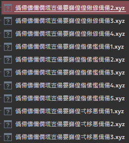
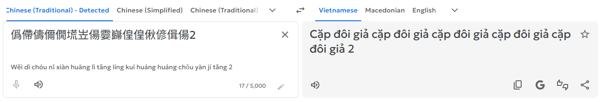
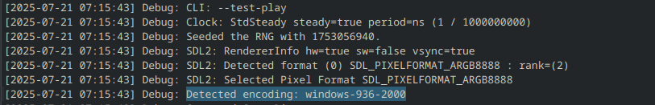
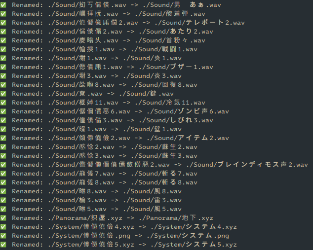

# Sửa lỗi tệp tin Mojibake

## Mô tả lỗi

Có một số trường hợp khi người dịch hay nhà phát triển nén và giải nén game bằng máy tính vẫn chưa để vùng là Nhật Bản, và sau khi nén/giải nén thì tên của các tệp tin tài nguyên sẽ bị hỏng và chứa các kí tự vô nghĩa như hình ở bên dưới:



Khi bạn sao chép tên của tệp tin và đưa lên Google Dịch thì nó không hề có nghĩa gì cả:



Nếu bạn bắt gặp quá nhiều tệp tin như thế này thì game đó đã bị lỗi tệp tin Mojibake.

## Ví dụ tiêu biểu

* Một nhà phát triển tạo ra một game bằng tiếng Nhật, và chứa các tệp tin với ngôn ngữ là Nhật Bản. Nhà phát triển đó nén tệp tin lại và tải lên web.<br>Lúc này tên của các tệp tin trong tệp tin nén vẫn bình thường vì máy của người đó đã để vùng là Nhật Bản.

* Một dịch giả muốn dịch game sang tiếng Việt, và để vùng của máy tính là Hoa Kỳ (US) hoặc Việt Nam.<br>Dịch giả này tải bản game gốc và giải nén ra máy tính, lúc này tên của các tệp tin đã giải nén trong máy sẽ bị hỏng do cách mã hóa của hai vùng khác nhau.

* Dịch giả dịch xong game, nén lại thư mục đã dịch và tải lên web. Lúc này tệp tin nén đã được tạo với tên các tệp tin đã bị hỏng.<br>Cho dù người chơi bản dịch có để ở vùng nào đi nữa thì tên của các tệp tin kia sẽ không thể khôi phục lại được như trước, và lỗi không tìm thấy tệp tin sẽ có thể xảy ra.

## Sửa lỗi

### Đối với bản dịch thông qua EasyRPG ("bản dịch kiểu mới")

Lỗi này hay xảy ra nhất đối với các bản dịch thông qua EasyRPG, vì EasyRPG vẫn có thể chơi được game mà không cần để vùng là Nhật Bản; nên các dịch giả cũng không để vùng là Nhật Bản trước khi nén thư mục game.

Lúc này dù có sửa được hay không thì bạn vẫn bắt buộc phải chơi trên EasyRPG, nên cách tốt nhất là hãy chạy nó trên EasyRPG nếu game vẫn chạy được qua phần mềm đó.

### Đối với các game khác

#### Phát hiện định dạng mã hóa của mojibake

> [!NOTE]
> Những dữ liệu này là do mình tự nghiên cứu được và có thể không đúng hoặc không đầy đủ. Nếu bạn có dữ liệu tốt hơn, cứ thoải mái đóng góp cho hướng dẫn này với dữ liệu của bạn.

##### Thông qua EasyRPG

Nếu game bạn đang chơi được dựa trên RPG Maker 2000/2003, bạn có thể thử chạy game thông qua EasyRPG. Phần mềm này sẽ tự động phát hiện định dạng mã hóa của các tệp tin.

* Chạy game thông qua EasyRPG như mình đã hướng dẫn ở phần **Tải và chạy game** cho hệ điều hành của bạn.

* Khi chạy game và xác định game đã chạy được, hãy mở tệp tin `easyrpg-log.txt` trong thư mục game. Tìm đến dòng có chữ **Detected encoding** và mã đằng sau nó sẽ là định dạng mã hóa của các tệp tin trong game. Ở đây sẽ là `windows-936-2000`.



* Sau đó xét theo bảng này, bạn cần chuyển định dạng encoding mà EasyRPG in ra thành giá trị dưới đây để chuẩn bị cho script đổi tên tệp tin:

| Giá trị EasyRPG in ra  | Giá trị trên Python |
| ---------------------- | ------------------- |
| `ibm-943_P15A-2003`    | `cp932`             |
| `windows-949-2000`     | `cp949`             |
| `windows-936-2000`     | `gbk`               |
| `ibm-5348_P100-1997`   | `cp1252`            |
| `ibm-5346_P100-1998`   | `cp1250`            |
| `ibm-5347_P100-1998`   | `cp1251`            |
| `ibm-9448_X100-2005`   | `cp1256`            |
| `ibm-5349_P100-1998`   | `cp1253`            |
| `ibm-9447_P100-2002`   | `cp1255`            |

##### Thủ công

*Sẽ được cập nhật...*

#### Bắt đầu đổi tên

* Sao chép đoạn script sau đây và lưu nó với tên `rename.py`:

> [!NOTE]
> Trong trường hợp tên tệp tin gốc trước khi bị hỏng có ngôn ngữ khác tiếng Nhật, bạn cần thay đổi `shift-jis` ở dòng 9 thành định dạng mã hóa của ngôn ngữ đó, ví dụ như `gbk` với tệp tin tiếng Trung Quốc.

```python
import os
import sys

def decode_filename(name: str, source_encoding: str) -> str | None:
    try:
        # Encode with source encoding (e.g. 'gbk')
        source_bytes = name.encode(source_encoding, errors="replace")
        # Decode back to Shift_JIS to recover the Japanese name
        return source_bytes.decode("shift_jis")
    except Exception:
        return None

def bulk_rename_files(root_folder: str, source_encoding: str):
    for dirpath, _, filenames in os.walk(root_folder):
        for name in filenames:
            new_name = decode_filename(name, source_encoding)
            if new_name and new_name != name:
                old_path = os.path.join(dirpath, name)
                new_path = os.path.join(dirpath, new_name)
                try:
                    os.rename(old_path, new_path)
                    print(f"✅ Renamed: {old_path} -> {new_path}")
                except Exception as e:
                    print(f"❌ Failed to rename: {old_path} ({e})")

if __name__ == "__main__":
    if len(sys.argv) != 3:
        print("Usage: python rename.py <root_folder> <source_encoding>")
        sys.exit(1)

    root = sys.argv[1]
    encoding = sys.argv[2]
    bulk_rename_files(root, encoding)
```

* Sau đó chạy script bằng lệnh sau, chú ý:
    * Thay `/path/to/rename.py` thành đường dẫn của tệp tin `rename.py` bạn vừa lưu.
    * Thay `/path/to/game/folder` thành đường dẫn của thư mục game.
    * Thay `encoding` thành **giá trị trên Python** mà bạn đã tìm được sau khi đối chiếu với giá trị gốc.

```sh
python "/path/to/rename.py" "/path/to/game/folder" encoding
```

Ví dụ như:

```sh
python "/home/hyacine/rename.py" "/home/hyacine/Nobihaza/MudaiNiKaizouban" gbk
```

* Nếu script in ra dòng chữ **Renamed** với tên gốc thì tức là bạn đã tìm đúng định dạng mã hóa, và script đã đổi được tên về lại tiếng Nhật bình thường.



* Lúc này nếu bạn quay trở lại thư mục game, bạn cũng sẽ thấy tên các tệp tin tài nguyên đã được khôi phục như bình thường.


