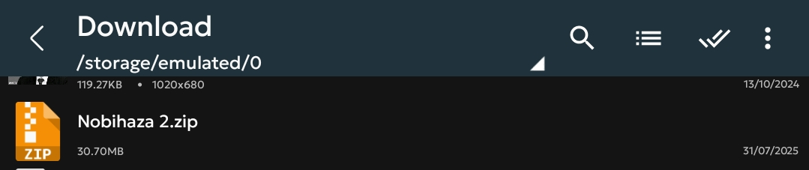
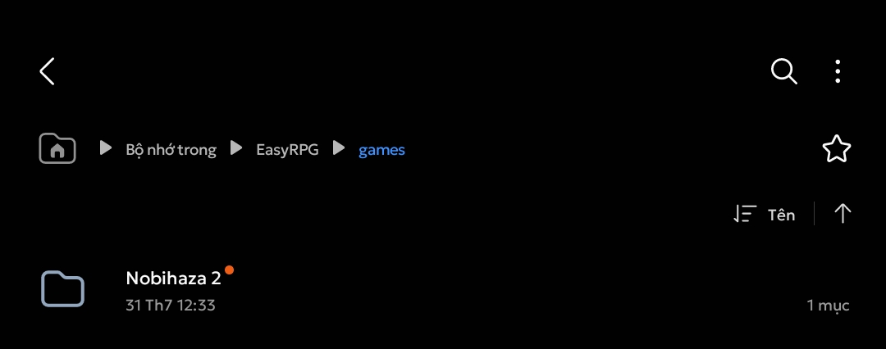

# Downloading and Running Games
{: .no_toc }

## Table of Contents
{: .no_toc }

1. TOC
{:toc}

## Downloading and Extracting

* First, download the game version for Android (labeled with the word Android or in `.apk` format). If there is no version for Android, download the game version for Windows.

* Open ZArchiver and tap on the newly downloaded file (usually in the `Download` folder).

* Tap on **Extract to ./<Archive name>/** (the 3rd option).

* Enter the password for the compressed file if required. Wait for the extraction process to complete and continue.

## RPG Maker 2000/2003

You must use EasyRPG if you are playing games on a mobile phone.

* Move the newly extracted game folder into the **EasyRPG/games** folder of your phone's storage.

* Open the EasyRPG application and you will see the game you just downloaded in the list.

## RPG Maker XP/VX/VX Ace/MV/MZ

### APK Files

If the game you downloaded is an `.apk` file, install it like any other application and then play as usual.

### Using JoiPlay

* Open the JoiPlay application, tap the plus sign in the top right corner and select **Add Game**.

* Tap the **Choose** button and navigate to the game folder that you extracted earlier. Select the `Game.exe` file in the game folder and then tap the Choose button.

* JoiPlay will proceed to the section for entering the game's name, version, and icon. You can change these as you wish, or tap **Next** repeatedly to skip (the version and icon can be left blank).

* After it's added, the game will appear in the list. Tap on the game to start playing.

{: .important }
> When you first run the game, JoiPlay may ask you to install the RTP for the game.
>
> 
>
> * Tap the Choose button and navigate to the RTP files you downloaded in the Prerequisites section. Choose `xp_rtp104e.exe` if it's RPG Maker XP, `vx_rtp102e.zip` if it's RPG Maker VX, and `RPGVXAce_RTP.zip` if it's RPG Maker VX Ace.
>
> 
>
> * Wait for the extraction and installation process to complete (you'll see a message **Runtime Package extracted successfully**). Then restart the game.
>
> You will also need to grant all file access permission to the **RPG Maker Plugin for JoiPlay** (the permission panel will open when you first run the game).