# Tải và chạy game
{: .no_toc }

## Mục lục
{: .no_toc }

1. TOC
{:toc}

## Nhận diện game trên Nobihaza Vietnam Collection

Bạn có thể kiểm tra trước xem game nào chơi được trên điện thoại bằng cách kiểm tra thẻ của game đó trên Nobihaza Vietnam Collection.

Trọng khi đang xem một thông tin game, hãy kiểm tra xem game đó có ghi Android trong mục **Hỗ trợ** không, và trong mục Thẻ có **joiplay** hay **easyrpg** không.

* Đối với game RPG Maker 2000/2003:

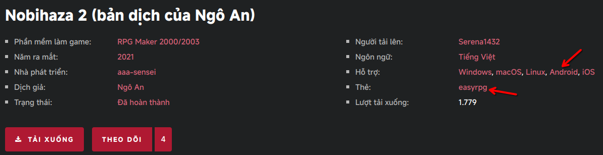

* Đối với game RPG Maker XP/VX/VX Ace:

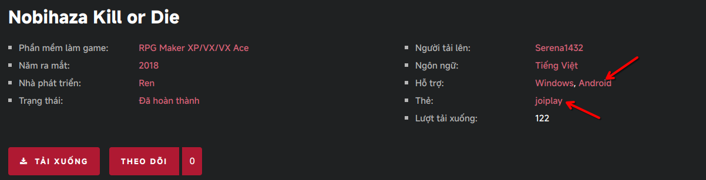

## Tải và giải nén

* Bạn hãy tải xuống bản game dành cho Android (có ghi chữ Android hoặc định dạng `.apk`) trước. Nếu không có bản game dành cho Android, hãy tải bản game dành cho Windows.

* Mở ZArchiver lên và nhấn vào tệp tin vừa mới giải nén (thường là ở thư mục `Download`).

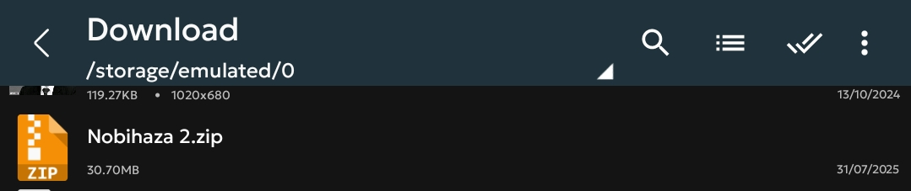

* Nhấn vào **Giải nén vào ./tên lưu trữ/** (mục thứ 3).

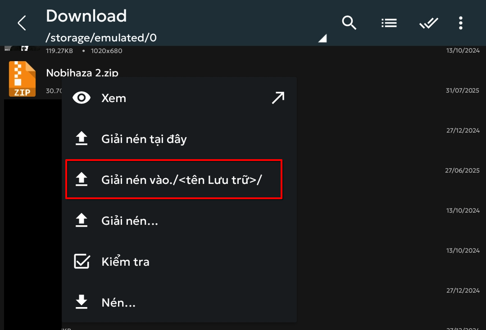

* Nhập mât khẩu của tệp tin nén nếu được yêu cầu. Đợi quá trình giải nén hoàn tất và tiếp tục.

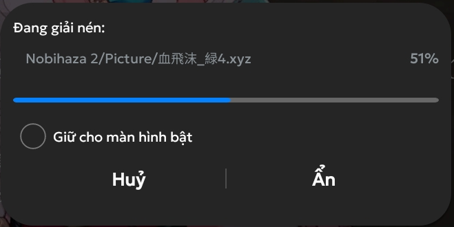

## RPG Maker 2000/2003

Bạn bắt buộc phải dùng EasyRPG nếu chơi game ở trên điện thoại.

* Di chuyển thư mục game vừa mới giải nén vào thư mục **EasyRPG/games** của bộ nhớ điện thoại.

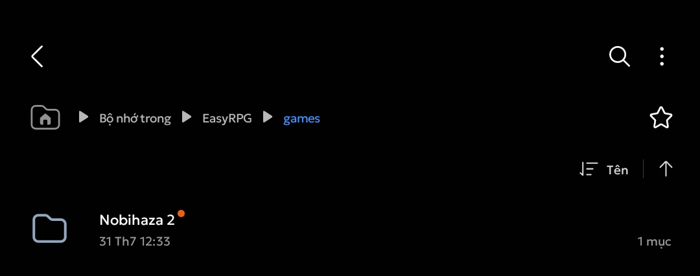

* Vào ứng dụng EasyRPG và bạn sẽ thấy game mình vừa tải ở danh sách.

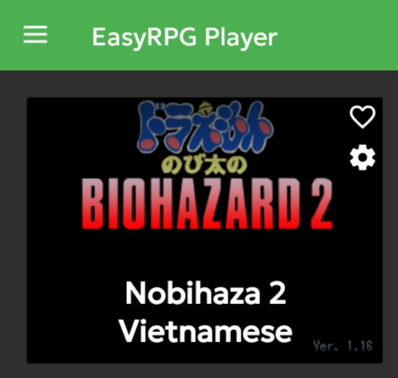

## RPG Maker XP/VX/VX Ace/MV/MZ

### Tệp tin APK

Nếu game bạn tải xuống có tệp tin `.apk`, hãy cài đặt nó như các ứng dụng khác rồi chơi như bình thường.

### Sử dụng JoiPlay

* Mở ứng dụng JoiPlay, nhấn vào dấu cộng ở góc trên bên phải và chọn **Thêm trò chơi**.

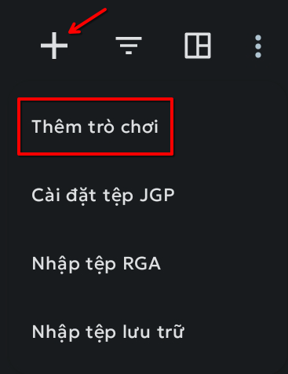

* Nhấn nút **Chọn** và đi tới thư mục game mà bạn đã giải nén trước đó. Chọn tệp tin `Game.exe` trong thư mục game rồi nhấn nút Chọn.

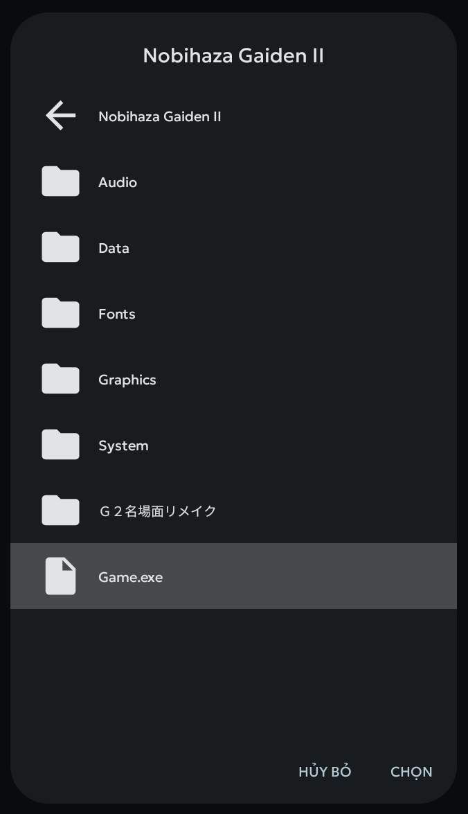

* JoiPlay sẽ đi tới phần nhập tên, phiên bản và biểu tượng của trò chơi. Bạn có thể thay đổi theo ý của bạn, hoặc nhấn **Tiếp theo** liên tục để bỏ qua (phiên bản và biểu tượng có thể để trống).

* Sau khi đã thêm xong, game sẽ xuất hiện trong danh sách. Hãy nhấn vào game để bắt đầu chơi.

{: .important }
> Khi bạn mới chạy game lần đầu tiên, JoiPlay có thể sẽ yêu cầu bạn cài đặt RTP cho game.
>
> 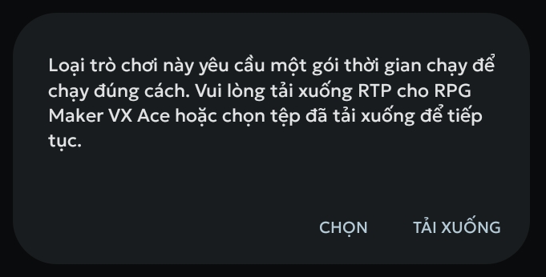
>
> * Nhấn vào nút Chọn và chuyển đến các tệp RTP bạn đã tải xuống ở phần Điều kiện cơ bản. Chọn `xp_rtp104e.exe` nếu là RPG Maker XP, `vx_rtp102e.zip` nếu là RPG Maker VX và `RPGVXAce_RTP.zip` nếu là RPG Maker VX Ace.
>
> 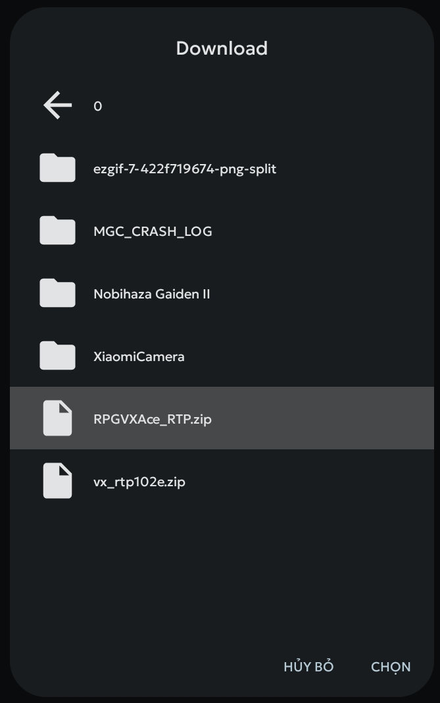
>
> * Đợi cho quá trình giải nén và cài đặt được hoàn tất (có thông báo **Gói khởi chạy được giải nén thành công**). Sau đó hãy khởi động lại game.
>
> Bạn cũng sẽ cần cấp quyền truy cập tất cả các tệp cho **RPG Maker Plugin for JoiPlay** (bảng cấp quyền sẽ được mở khi mới chạy game).