# Packaging your own APK file
{: .no_toc }

This page will provide an advanced guide for those who have some understanding of RPG Maker, computers, and Android, to build an `.apk` file that can be installed directly without supporting software.

Currently, this guide only supports RPG Maker MV/MZ. Other engines may be included in the future.

{: .important }
> Please follow the entire guide in order.

## Table of Contents
{: .no_toc }

1. TOC
{:toc}

## Initial Preparation

{: .note }
> You will only need to do these steps the first time.

### Install Java JDK

{: .important }
> OpenJDK is recommended instead of Oracle JDK! Oracle JDK will have certain licensing restrictions and may cause your application to have trouble in the future.

#### Choosing a version

* Go to the [Cordova guide for Android](https://cordova.apache.org/docs/en/12.x-2025.01/guide/platforms/android/index.html#android-api-level-support) to see the list of `cordova-android` versions.

* Choose the `cordova-android` version you want to install. I recommend using the latest version (`14.0.x` as of August 1, 2025) if you don't care about supporting lower Android versions, or version `11.0.x` if you want the game to support Android 5.1 as well.

* After choosing the Android version, switch to the **Library & Tooling Version** column. You will see the JDK version required for the `cordova-android` version you have chosen.

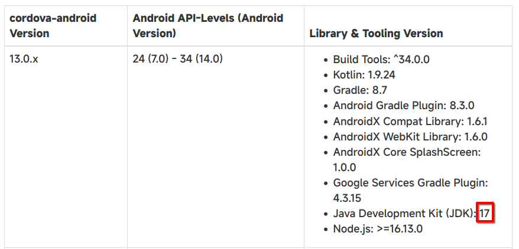

#### Download and Install

<details>
<summary>Windows and macOS</summary>

<ul>
<li><p>Go to the <a href="https://www.openlogic.com/openjdk-downloads">OpenJDK download website</a>.</p>
</li>
<li><p>Select the OpenJDK version you want to download:</p>
<ul>
<li>Choose the <strong>Java Version</strong> that matches the JDK version you selected in the Choosing a version section. For the latest <code>cordova-android</code> version, we will use version 17.</li>
<li>Choose the <strong>Operating System</strong> that you are currently using.</li>
<li>Choose the <strong>Architecture</strong> of your computer's CPU (x86 or ARM).</li>
<li>Choose the <strong>Java Package</strong> as JDK.</li>
</ul>
</li>
</ul>
<p>After you have made your selections, the list of versions will look like this:</p>
<p>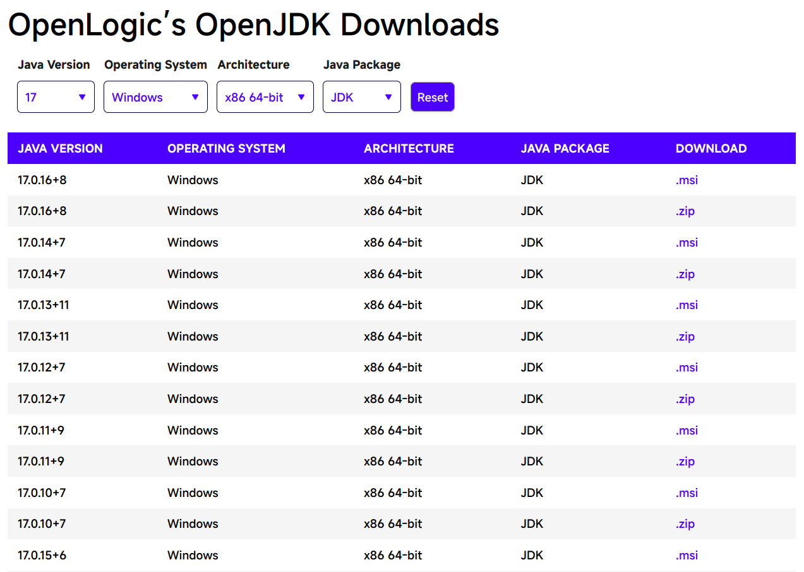</p>
<ul>
<li><p>Click on the first <code>.msi</code> (or <code>.pkg</code> for macOS) link in the list (in the image above, it would be version <code>17.0.16+8</code>). If a newer version is available in the future, you should choose that newer version.</p>
</li>
<li><p>After downloading, double-click the downloaded <code>.msi</code> or <code>.pkg</code> file and proceed with the installation.</p>
</li>
</ul>

</details>

<details>
<summary>Linux</summary>

Please refer to the OpenJDK installation guide specific to your distro. Each distro will have a different installation method.
</details>

### Install Android Studio and Android SDK

* Go to the [official Android Studio website](https://developer.android.com/studio). Click the Download button right at the top of the website, agree to the terms of use, and the website will automatically download the version for your operating system.

* After downloading, proceed with the installation as usual.

* Open the Android Studio application. Click on **More Actions** in the middle of the window and select **SDK Manager**.

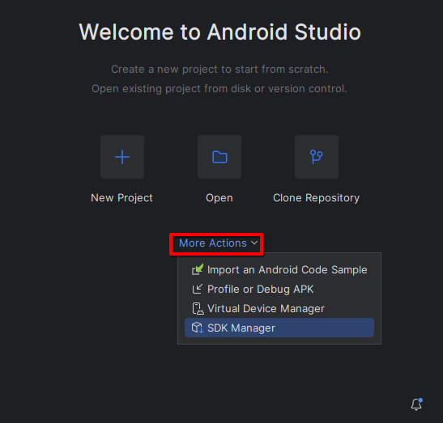

* In the **SDK Platforms** tab, select the Android SDK version according to the `cordova-android` version you chose in the Choosing a version section. Pay attention to the **Android API Levels** section; for the latest `cordova-android` version, you will choose an Android SDK version from 24 (Android 7.0) to 34 (Android 14.0).

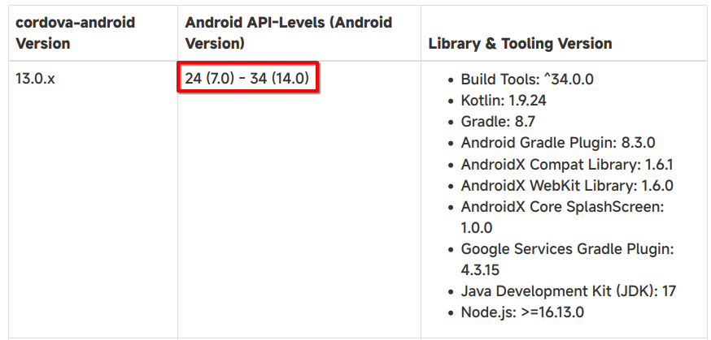

Here I will choose the highest supported Android SDK version, which is **Android 14** (API Level 34).

* Click on the **SDK Tools** tab, and select the **Show Package Details** option. Then, in the **Android SDK Build Tools** section, select the version that matches the API Level you just chose.

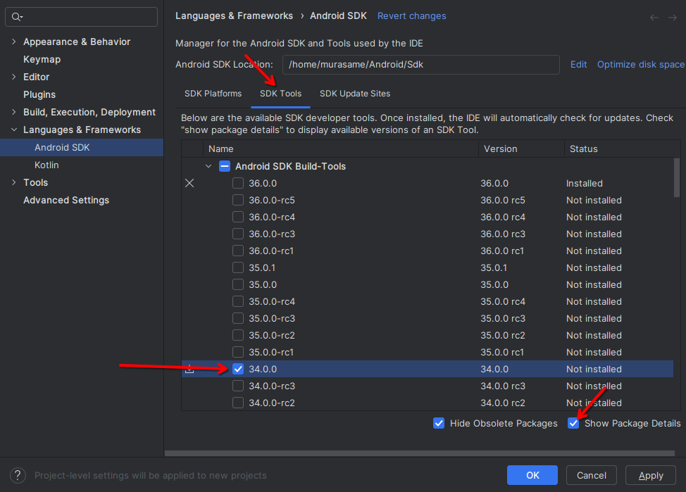

* In the **Android Command Line Tools** section, select the latest version.

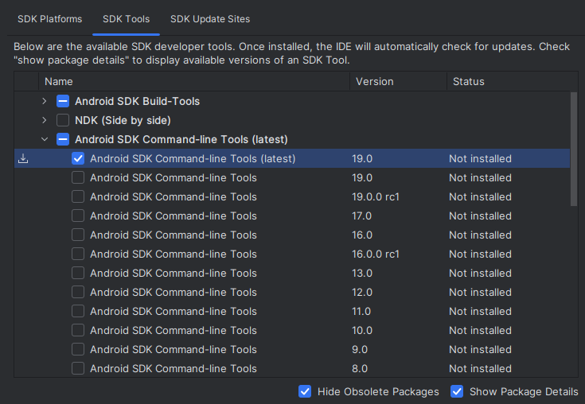

* Check the **Android SDK Platform-Tools** box.

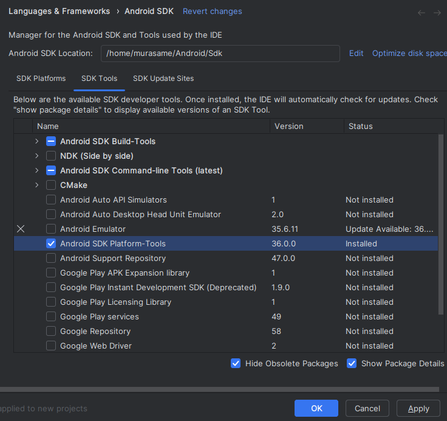

* Click **OK** to proceed with installing all selected libraries. Click **OK** again to confirm the libraries that will be installed.

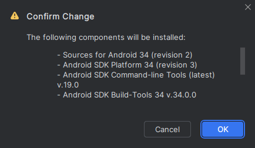

* Wait for the installation process to complete (it will show the word **Done** and a **Finish** button will appear). Click the **Finish** button to complete the installation.

### Install Gradle

* Go to the [Gradle download website](https://gradle.org/releases/).

* Click on the words **binary-only** for the latest version.

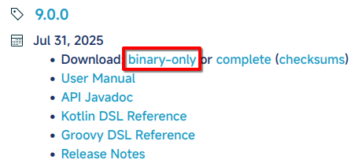

* Extract the downloaded `.zip` file to any folder.

### Install FFmpeg

<details>
<summary>Windows and macOS</summary>

<ul>
<li><p>Go to the <a href="https://ffmpeg.org/download.html">ffmpeg download website</a>.</p>
</li>
<li><p>Download FFmpeg for your operating system. Then double-click the downloaded file to run and proceed with the installation.</p>
</li>
</ul>
</details>

<details>
<summary>Linux</summary>

FFmpeg is usually available in the software repository of your distro. Please install it according to the instructions specific to your distro.
</details>

### Check environment variables

#### Get the path information for the libraries

<details>
<summary>Android SDK</summary>

<ul>
<li><p>In the <strong>Android Studio</strong> application, select <strong>More Actions</strong>, then select <strong>SDK Manager</strong>.</p>
</li>
<li><p>The path for the Android SDK will be in the Android SDK Location box. For me, it will be <code>/home/murasame/Android/Sdk</code>.</p>
</li>
</ul>
<p>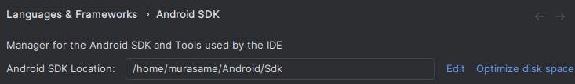</p>
</details>

<details>
<summary>Java JDK</summary>

<ul>
<li><p>For Windows and macOS, the JDK path will be noted during the installation process, for example, <code>C:\Program Files\OpenJDK\17</code>.</p>
</li>
<li><p>For Linux, use the command <code>where javac</code>, then take the path that is not <code>/usr/bin</code> (for me, it's the second line) and remove the <code>/bin/javac</code> part. For me, it will be <code>/usr/lib/jvm/default</code>.</p>
</li>
</ul>
<p>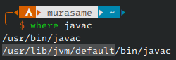</p>
</details>

<details>
<summary>Gradle</summary>

<p>This is the path of the folder you extracted from the <code>gradle-*.zip</code> file.</p>
</details>

#### Set environment variables

<details>
<summary>Windows</summary>

<ul>
<li>Press the <code>Windows + S</code> key combination to open the search tool and search for <code>environment variables</code>. Click on the first item, <strong>Edit the system environment variables</strong>.</li>
</ul>
<p>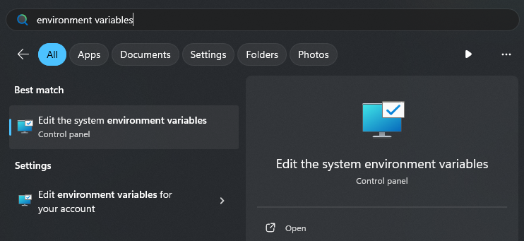</p>
<ul>
<li>Click the <strong>Environment Variables</strong> button.</li>
</ul>
<p>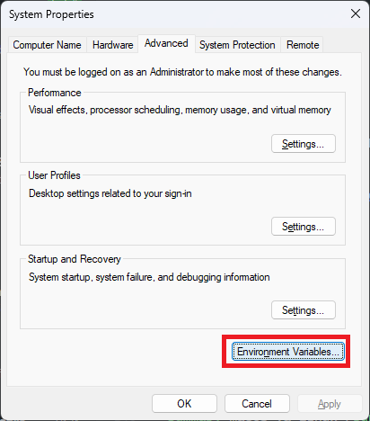</p>
<ul>
<li>Select the <strong>Path</strong> item in the <strong>User variables</strong> section and click the <strong>Edit</strong> button.</li>
</ul>
<p>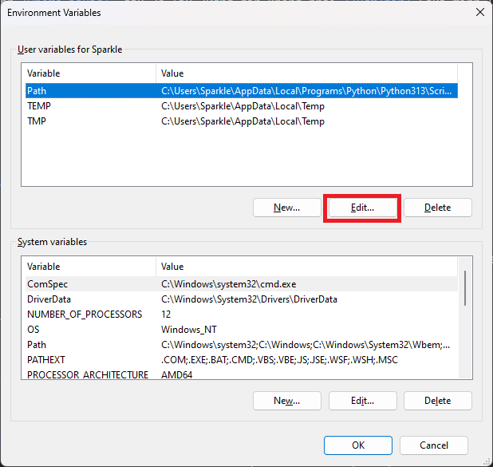</p>
<ul>
<li><p>Replace the following words in the paths below with the paths you have found:</p>
<ul>
<li><code>sdkPath</code>: The path of the Android SDK</li>
<li><code>jdkPath</code>: The path of the Java JDK</li>
<li><code>gradlePath</code>: The path of the extracted Gradle folder</li>
</ul>
</li>
<li><p>Click the <strong>New</strong> button and add the following paths one by one (each path is one New button click):</p>
<pre><code>  sdkPath\tools
  sdkPath\cmdline-tools\latest\bin
  sdkPath\platform-tools
  sdkPath\emulator
  sdkPath\build-tools
  jdkPath\bin
  gradlePath\bin
</code></pre><p>  For example, see the image below:</p>
<p>  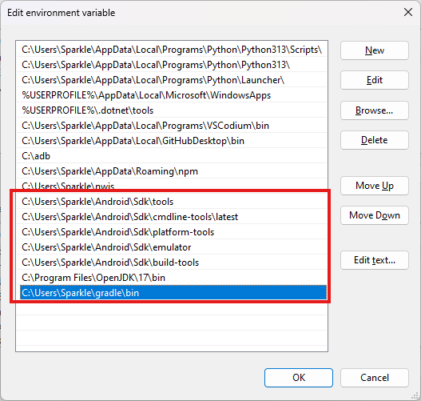</p>
</li>
<li><p>Click <strong>OK</strong> to save.</p>
</li>
<li><p>Click the <strong>New</strong> button to the left of the <strong>Edit</strong> button you just used.</p>
</li>
</ul>
<p>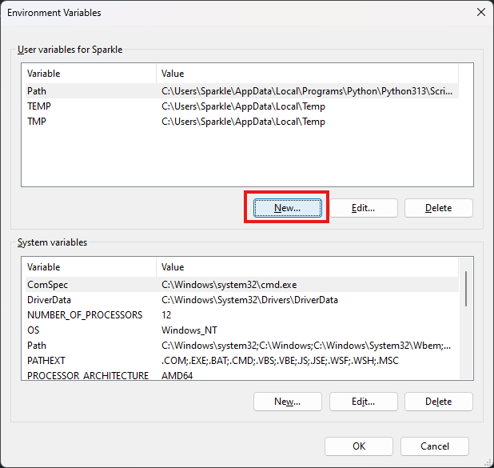</p>
<ul>
<li>Enter the Variable name as <code>JAVA_HOME</code> and the Variable value as the path of the Java JDK.</li>
</ul>
<p>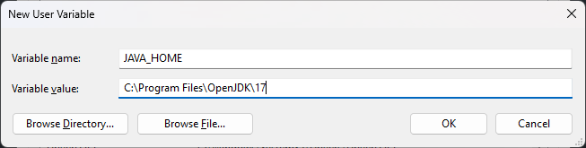</p>
<ul>
<li>Click <strong>OK</strong> to save. Continue by clicking the <strong>New</strong> button to create two more new variables, <code>ANDROID_HOME</code> and <code>ANDROID_SDK_ROOT</code>, with the same value: the path of the Android SDK.</li>
</ul>
<p>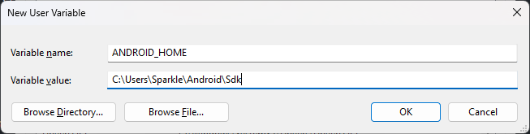</p>
<p>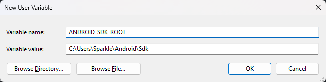</p>
<ul>
<li>Finally, click <strong>OK</strong> twice to save the settings.</li>
</ul>
</details>

<details>
<summary>macOS and Linux</summary>

<ul>
<li><p>Open the <code>/Users/$USER/.profile</code> file (or <code>/home/$USER/.profile</code> for Linux) with any text editor.</p>
</li>
<li><p>Add the following lines to the end of that file:</p>
</li>
</ul>
<pre><code class="lang-sh"><span class="hljs-built_in">export</span> ANDROID_HOME=<span class="hljs-string">"/home/murasame/Android/Sdk"</span> <span class="hljs-comment"># Change to the Android SDK path you found</span>
<span class="hljs-built_in">export</span> ANDROID_SDK_ROOT=<span class="hljs-string">"<span class="hljs-variable">$ANDROID_HOME</span>"</span>
<span class="hljs-built_in">export</span> JAVA_HOME=<span class="hljs-string">"/usr/lib/jvm/default"</span> <span class="hljs-comment"># Change to the Java JDK path you found</span>
<span class="hljs-built_in">export</span> GRADLE_PATH=<span class="hljs-string">"/home/murasame/gradle"</span> <span class="hljs-comment"># Change to the Gradle path you found</span>
<span class="hljs-built_in">export</span> PATH=<span class="hljs-string">"<span class="hljs-variable">$ANDROID_HOME</span>/tools:<span class="hljs-variable">$ANDROID_HOME</span>/cmdline-tools/latest/bin:<span class="hljs-variable">$ANDROID_HOME</span>/platform-tools:<span class="hljs-variable">$ANDROID_HOME</span>/emulator:<span class="hljs-variable">$ANDROID_HOME</span>/build-tools:<span class="hljs-variable">$JAVA_HOME</span>/bin:<span class="hljs-variable">$GRADLE_PATH</span>/bin:<span class="hljs-variable">$PATH</span>"</span>
</code></pre>
<ul>
<li>Log off from your computer's account and then log back in to apply the changes.</li>
</ul>
</details>

#### Check libraries

Open a command-line window and check the libraries below:

<details>
<summary>Android SDK</summary>

<pre><code class="lang-sh"><span class="hljs-built_in">echo</span> <span class="hljs-variable">$ANDROID_HOME</span>
</code></pre>
<p>If it prints the path you obtained earlier, you have succeeded.</p>
</details>

<details>
<summary>Java JDK</summary>

<pre><code class="lang-sh">java <span class="hljs-comment">--version</span>
</code></pre>
<p>If it prints <code>openjdk 17</code>, you have succeeded.</p>
</details>

<details>
<summary>Gradle</summary>

<pre><code class="lang-sh">gradle <span class="hljs-comment">--version</span>
</code></pre>
<p>If it prints the message <strong>Welcome to Gradle</strong>, you have succeeded.</p>
</details>

If a library still reports an error, try the steps above again.

### Install KeyStore Explorer

This application will be used to create keys and sign your Android application.

* Go to the [KeyStore Explorer download website](https://keystore-explorer.org/downloads.html).

* Select the file to download based on the operating system you are using, and also read the notes in the **Details** section carefully.

* Double-click the downloaded file to install KeyStore Explorer.

{: .important }
> For Linux distros that do not support `.deb` and `.rpm` files (Arch Linux, Gentoo, etc.), please refer to the installation guide specific to your distro.

## Create a new keystore to sign the APK file

{: .note }
> If you have created a keystore before, you can reuse it instead of creating a new one.

To prevent Android from warning that the application is unsafe, we need to sign our APK file with a keystore file.

* Open the **KeyStore Explorer** application.

* Click **File** -> **New** or the combination `Ctrl + N` to create a new keystore. Select **PKCS #12** and click **OK**.

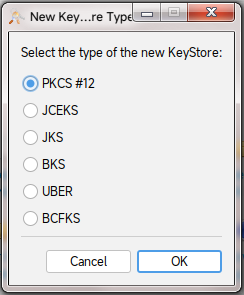

* Click **Tools** -> **Generate Key Pair** or the combination `Ctrl + G`. A **Generate Key Pair** dialog box will appear; leave it as default and click **OK**.

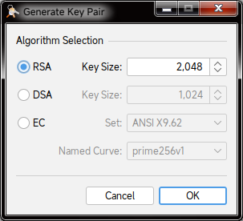

* Adjust the **Validity Period** to the amount of time you want your certificate to last. When the certificate expires, you must create a new key by following these steps again. Then click the **Apply** button.

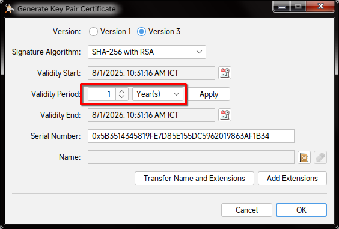

* Click the address book icon to the right of the **Name** section.

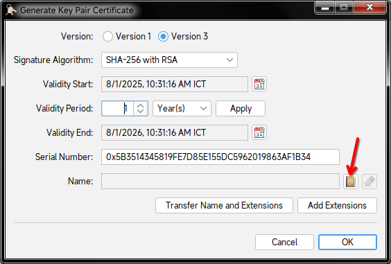

* A name entry form will appear; please fill it out according to the template below:

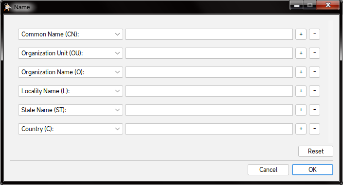

| Information | Description |
| --- | --- |
| Common Name (CN) | Your common individual or organization name; can be your real name or a nickname of your choice |
| Organization Unit (OU) | Sub-organization name, or can be another name of your choice |
| Organization Name (O) | Your organization's name |
| Locality Name (L) | The city/province of the organization |
| State Name (ST) | The state/province you live in |
| Country (C) | Your country, written in 2-character ISO code (for example, Vietnam would be `VN`) |

If you do not have an organization, you can enter your personal information (or any information) in place of the organization name.

* Click **OK** to confirm. Review the information and click **OK** again to create the certificate.

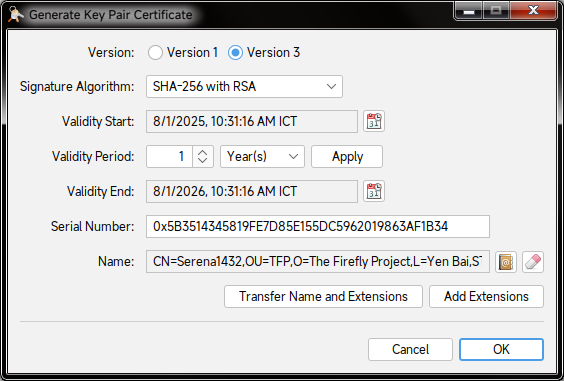

* Enter an alias for the newly created key. You can leave it as default and click **OK**.

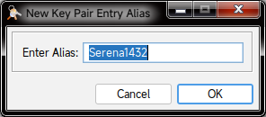

* Enter the password you want for your keystore, then click **OK**.

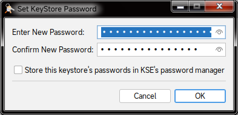

* Right-click on the Key Pair name on the **KeyStore Explorer** screen and select **Set Password**. Enter a new password for the Key Pair and click **OK**.<br>The keystore password and the Key Pair password can be different.

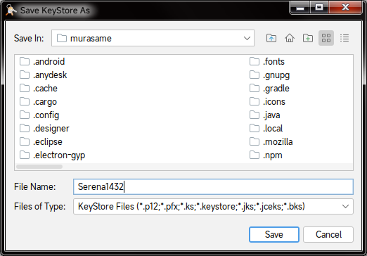

* Finally, click **File** -> **Save** or the combination `Ctrl + S` to save the key as a file with the `.p12` format.

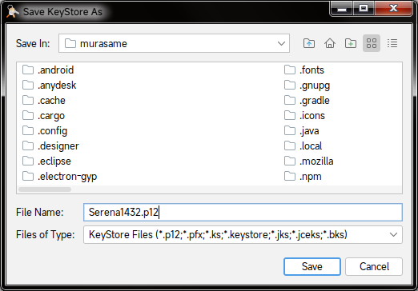

{: .important }
> After you have finished creating it, remember:
>
> * The path of the newly created key file
> * The Alias of the key
> * The password for the Key Pair and the password for the keystore (the two passwords can be different)
>
> You will need to use this information later.

## RPG Maker MV/MZ

### Test the game on the web

Since the `.apk` version on Android will use Android WebView (a browser embedded in the application), you should test it in a browser to check for errors before proceeding to package it for the phone.

You can see the **Run RPG Maker MV games in a browser** section in the Troubleshooting and Tips part of this guide for your operating system.

If an error occurs when playing on the web, you need to fix it yourself until it runs.

### Preparation

{: .note }
> You will only need to do these steps the first time.

#### Install Node.js

<details>
<summary>Windows and macOS</summary>

<ul>
<li><p>Go to the <a href="https://nodejs.org/en/download">Node.js download page</a>.</p>
</li>
<li><p>In the <strong>Or get a prebuilt Node.js® for</strong> section, select the operating system and OS type (x86, x64, or ARM64) that your machine is using. For example, the one below is for Windows 64-bit (x64):</p>
</li>
</ul>
<p>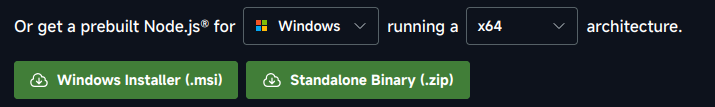</p>
<ul>
<li>Double-click to run the newly downloaded file (Windows will be <code>.exe</code>, while macOS will be <code>.pkg</code>). Then proceed to follow the instructions to install Node.js.</li>
</ul>
</details>

<details>
<summary>Linux</summary>

<ul>
<li>First, install <code>nvm</code> (Node Version Manager) for Linux:</li>
</ul>
<pre><code class="lang-sh">curl -<span class="hljs-keyword">o</span>- http<span class="hljs-variable">s:</span>//raw.githubusercontent.<span class="hljs-keyword">com</span>/nvm-<span class="hljs-keyword">sh</span>/nvm/v0.<span class="hljs-number">40.3</span>/install.<span class="hljs-keyword">sh</span> | bash
</code></pre>
<blockquote>
<p>If nvm has a newer version later on, please change <code>0.40.3</code> to that version, or you can read the guide on the <a href="https://github.com/nvm-sh/nvm">official nvm GitHub page</a>.</p>
</blockquote>
<ul>
<li>After a successful installation, continue to install Node.js:</li>
</ul>
<pre><code class="lang-sh">nvm install <span class="hljs-keyword">node</span><span class="hljs-title"></span>
</code></pre>
</details>

#### Install Git

<details>
<summary>Windows</summary>

<ul>
<li><p>Go to the <a href="https://git-scm.com/downloads/win">Git download page for Windows</a>.</p>
</li>
<li><p>Select the version for your operating system architecture (x64 or ARM64) in the Standalone Installer section. For example, if you are using Windows 64-bit, choose <strong>Git for Windows/x64 Setup</strong>.</p>
</li>
<li><p>After downloading, double-click to run the newly downloaded <code>.exe</code> file and follow the instructions to complete the installation.</p>
</li>
</ul>
</details>

<details>
<summary>macOS</summary>

<p>If you have installed Xcode, it already includes Git by default. If you don't have it yet, you can install Git through MacPorts:</p>
<pre><code class="lang-sh">sudo port <span class="hljs-keyword">install</span> git
</code></pre>
</details>

<details>
<summary>Linux</summary>

<p>Git can be installed on all distros. Please install the <code>git</code> package according to the command for your Package Manager. For example, for Pacman on Arch Linux, it would be <code>pacman -S git</code>.</p>
</details>

#### Install Cordova

* Run the following command line to install Cordova:

```sh
npm install -g cordova
```

* After the installation is complete, check the Cordova version:

```sh
cordova --version
```

It will output the Cordova version information (e.g., `12.0.0 (cordova-lib@12.0.2)`).

### Create a new Cordova project

* Open a command-line window and use the `cd` command to move to the folder where you want to create the project, for example:

```sh
cd /home/$USER/Documents/Output/android
```

* Use the following command to create a new project:

```sh
cordova create "folder" "identifier" "name"
```

| Replace | With |
| --- | --- |
| `folder` | The project's folder, e.g., `IDRemake` |
| `identifier` | The project's Android package identifier, usually in the format `xxxx.xxxx.xxxx`. E.g., `vn.serena1432.idremake` |
| `name` | The project name, which is also the application's name; e.g., `Nobihaza ID Remake` |

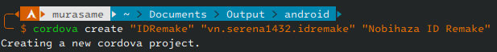

* `cd` to the project folder you just created:

```sh
cd "IDRemake" # Replace IDRemake with the project folder you just created
```

* Add Android to the project's list of platforms:

```sh
cordova platform add android@^13.0.0
```

{: .note }
> If you chose an older Cordova version (to support older Android versions) when installing the libraries, replace it with the command `cordova platform add android@^11.0.0` (or replace 11.0.0 with the version you chose).

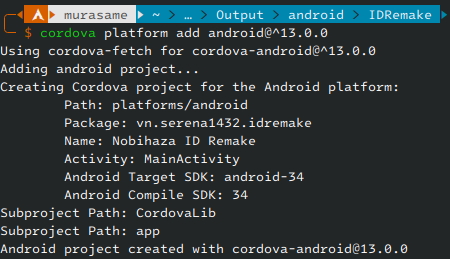

* Use the `cordova requirements` command to check the libraries again:

```sh
cordova requirements
```

If there are no more yellow text lines as shown in the image below, you can continue. If not, you need to check the libraries in the **Initial Preparation** section again.

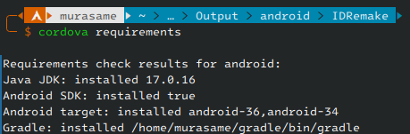

### Add a virtual keyboard to the game

By default, the `.apk` version will not support a virtual keyboard, so you need to proactively add a virtual keyboard to the game project before packaging.

{: .note }
> You can use any available plugin on the internet. However, in this guide, I will use my `Kiyoko_JoystickHandler` plugin to install the virtual keyboard.
>
> This is also the plugin I used to create the virtual keyboard for **Doraemon: Nobita's Resident Evil 2 (Vietnamese Version)**.

{: .note }
> A full guide for this plugin will be available in the future. However, I have still included a short explanation for each setting in the plugin's settings section.

* Download the [**Kiyoko_JoystickHandler**](https://github.com/Serena1432/Kiyoko_JoystickHandler/blob/main/Kiyoko_JoystickHandler.js) plugin file.

* Add the images containing the keys you want to add into the `img/JoyStick` folder in `.png` format. If you want to use the default keys I created instead, you can download [this file](https://github.com/Serena1432/Kiyoko_JoystickHandler/raw/refs/heads/main/JoyStick.zip) and extract it into the `img/JoyStick` folder.

* Add the newly downloaded plugin to the project's `js/plugins` folder, and open the project's **Plugin Manager** in RPG Maker MV/MZ. Add the **Kiyoko_JoystickHandler** plugin to the plugin list.

* On the right side of the plugin (Parameters) will be the list of settings. Double-click on each setting to view information and edit it.

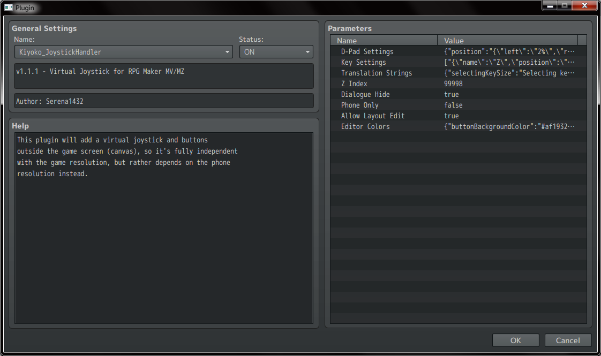

* The settings for each section have been opened; please double-click to edit them as you wish.

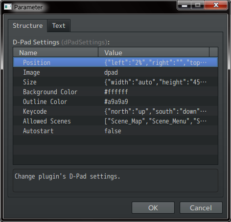

* While editing information, the plugin will also briefly explain this setting in the small dialog box below.

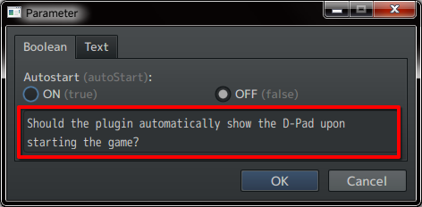

* Start editing all settings until you are satisfied. Then click **OK** repeatedly until the Plugin Manager window is closed, and save the project.

{: .tip }
> You should turn off the **Phone Only** option to be able to test the virtual keyboard on the computer. After you have finished testing, turn this option back on to hide the virtual keyboard when players are playing the game on a computer.

### Add game data to the project

* Access the game folder and copy all the files in the game's `www` folder.

{: .note }
> Some games will not have a `www` folder. In this case, copy the `audio`, `data`, `fonts`, `icon`, `img`, `js`, `movies` folders and the `index.html` file from the game folder.

* Paste the copied files into the project's `www` folder.

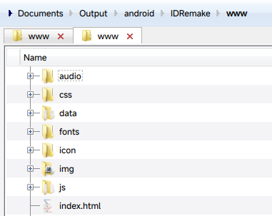

### Convert audio from `.ogg` to `.m4a`

For mobile phones, the game will use `.m4a` audio files instead of `.ogg` like on a computer, so you need to convert all audio files:

{: .note }
> This command line will first convert all `.ogg` files to `.m4a`, and then delete the original `.ogg` files to save space.

<details>
<summary>Windows</summary>

<p>Open <strong>PowerShell</strong>, use the <code>cd</code> command to navigate to the project's <code>www</code> folder and use the following command:</p>
<pre><code class="lang-powershell"><span class="hljs-built_in">Get-ChildItem</span> -Recurse -Filter *.ogg | <span class="hljs-built_in">ForEach-Object</span> { ffmpeg -i <span class="hljs-variable">$_</span>.FullName -c:a aac -b:a <span class="hljs-number">96</span>k -ar <span class="hljs-number">44100</span> -map_metadata <span class="hljs-number">0</span> (<span class="hljs-variable">$_</span>.FullName <span class="hljs-nomarkup">-replace</span> <span class="hljs-string">'\.ogg$'</span>, <span class="hljs-string">'.m4a'</span>); <span class="hljs-keyword">if</span> ($?) { <span class="hljs-built_in">Remove-Item</span> <span class="hljs-variable">$_</span>.FullName } }
</code></pre>
</details>

<details>
<summary>macOS and Linux</summary>

<p>Open <strong>Terminal</strong>, use the <code>cd</code> command to navigate to the project's <code>www</code> folder and use the following command:</p>
<pre><code class="lang-sh">find . -<span class="hljs-keyword">type</span> <span class="hljs-type">f </span>-name <span class="hljs-string">"*.ogg"</span> -exec sh -c <span class="hljs-symbol">'ffmpeg</span> -i <span class="hljs-string">"$0"</span> -c:a aac -b:a <span class="hljs-number">96</span>k -ar <span class="hljs-number">44100</span> -map_metadata <span class="hljs-number">0</span> <span class="hljs-string">"${0%.ogg}.m4a"</span> &amp;&amp; rm <span class="hljs-string">"$0"</span>' {} \;
</code></pre>
</details>

Wait until the conversion process is complete (no more lines are printed).

### Edit the `config.xml` file

#### Initial edits

* Open the `config.xml` file in the project folder with any text editor.

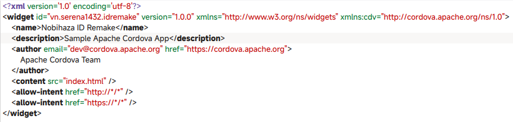

* Replace `Sample Apache Cordova App` in the `description` section with the game description you want.

* Replace the email `dev@cordova.apache.org` and website `https://cordova.apache.org` in the `author` section with your email and website. Replace `Apache Cordova Team` with your name.

#### Hide the notification bar and navigation buttons when playing

Add a new line before `</widget>` and paste the following line into that line:

```xml
<preference name="Fullscreen" value="true" />
```

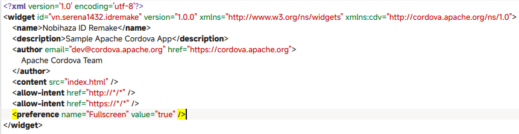

#### Change the APK file's icon

Add a new line before `</widget>` and paste the following line into that line:

```xml
<icon src="www/icon/icon.png" />
```

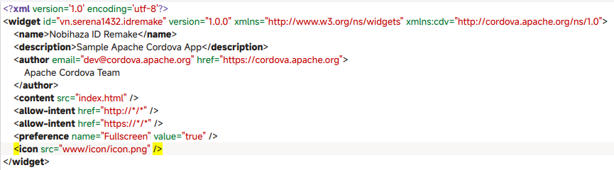

At this point, the APK file's icon will be the same as the game's icon in RPG Maker MV. If you want to change the game's icon, change the `www/icon/icon.png` file to another file (but keep the name the same).

#### Change the game's version

Change `1.0.0` (or the current version in the `<widget ... version="">` section of `config.xml`) to the game version you want, for example, from `1.0.0` to `1.0.1`:

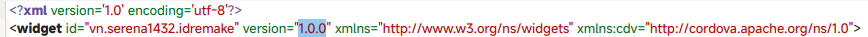

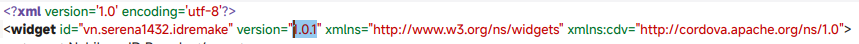

Then save the file.

#### Force landscape screen orientation

If not done, the game will default to starting in portrait mode.

Add a new line before `</widget>` and paste the following line into that line:

```xml
<preference name="orientation" value="landscape" />
```

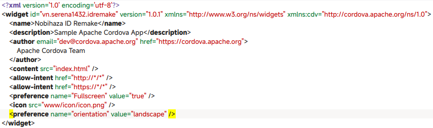

Then save the file.

### Set up APK file signing

To prevent Android from warning that the application is unsafe, we need to sign our APK file with a keystore file.

* Open any text editor you want, and copy the following text block:

```json
{
    "android": {
        "debug": {
            "keystore": "android_debug.p12",
            "storePassword": "storepassword",
            "alias": "android",
            "password" : "keypairpassword",
            "keystoreType": "pkcs12",
            "packageType": "apk"
        },
        "release": {
            "keystore": "android_release.p12",
            "storePassword": "storepassword",
            "alias": "android",
            "password" : "keypairpassword",
            "keystoreType": "pkcs12",
            "packageType": "apk"
        }
    }
}
```

* Change the information in the `debug` and `release` sections to the information of 2 keystores (or you can use 1 keystore for both sections):

| Information | Description |
| --- | --- |
| `keystore` | The path of the keystore file (in `.p12` format) |
| `storePassword` | The password of the keystore you set during creation |
| `alias` | The alias of the Key Pair in the keystore |
| `password` | The password of the Key Pair in the keystore |
| `keystoreType` | Write `pkcs12`. Can be left blank and the system will auto-detect based on the file extension |
| `packageType` | Write `apk` to create an `.apk` file |

* Save the edited text block as a `build.json` file and place it in the project's folder.

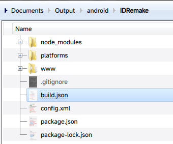

### Package the application

Now comes the most important part: packaging the application!

* Open a command-line window and `cd` to the project folder if you haven't already.

* Start packaging the application:

```sh
cordova build --release android
```

Replace `--release` with `--debug` if you want your `.apk` file to support debugging tools.

* Please wait until you see the **BUILD SUCCEEDED** message as shown in the image below. If there is an error, try checking the error and proceed to build again.

{: .note }
> The first time packaging may take a very long time, but that is normal. Subsequent packaging will be faster.

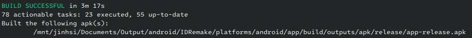

The `.apk` file will be in one of the following two paths:

* `projectfolder/platforms/android/app/build/outputs/apk/debug/app-debug.apk` if built as `debug`.
* `projectfolder/platforms/android/app/build/outputs/apk/release/app-release.apk` if built as `release`.

### Update the application

{: .important }
> Please ensure you are using one keystore for all updates. If the keystore is different, players will not be able to update your application!

Please follow these steps sequentially when updating to a new version of the game:

* [Copy data from the game folder to the project's `www` folder](#add-game-data-to-the-project).
* [Convert `.ogg` files to `.m4a`](#convert-audio-from-ogg-to-m4a).
* [Change the application's version](#change-the-games-version).
* [Package the application](#package-the-application).