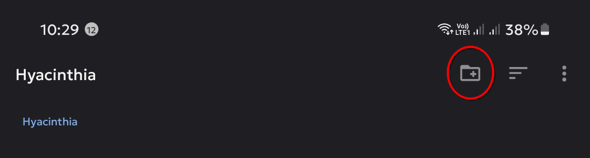

# Prerequisites
{: .no_toc }

Below are the things you need to prepare to play Nobihaza games on an Android phone.

I will be using a Samsung Galaxy A71 with One UI 5.1 (Android 13). However, the method will be similar for other phones.

## Table of Contents
{: .no_toc }

1. TOC
{:toc}

## Decompression software

All phones will need to have third-party decompression software installed. I don't trust the device's default software at all.

{: .note }
> You can install any decompression software you like, but here I will only guide you through using the ZArchiver application.

* Go to the Play Store and search for the **ZArchiver** application. Press the **Install** button to begin installing the app.

* Open the ZArchiver application for the first time. A permission request notification will appear; press OK, and a permission panel will open. Press the toggle button for the ZArchiver app to grant all file access permission to this application.

## EasyRPG (RPG Maker 2000/2003)

{: .note }
> EasyRPG is also available on [Google Play Store](https://play.google.com/store/apps/details?id=org.easyrpg.player), although it may have some limitations.

* Download the [EasyRPG for Android](https://easyrpg.org/downloads/player/0.8.1.1/easyrpg-player-0.8.1.1-android.apk).

* Tap on the downloaded file to begin the installation.

{: .note }
> If you have never allowed app installations from your browser before, a request notification will appear.
>
> 
>
> Tap the **Settings** button. A permission panel will appear; allow the browser to install applications. Some devices may also open the browser's permission panel directly, where you can tap the **Allow from this source** toggle.
>
> After that, open the downloaded file again and install as usual.

* A successful installation message will appear. Open EasyRPG for the first time. Tap the **Select EasyRPG folder** button.

{: .important }
> If you have used EasyRPG before, you can also select the previously created EasyRPG folder and then tap **Use this folder**.

* A folder selection window will appear. Tap the new folder button in the top right corner.

* Enter the folder name as EasyRPG and then tap the **OK** button.

* Finally, tap the **Use this folder** button and then tap **Allow**.

## JoiPlay (RPG Maker XP/VX/VXAce/MV/MZ)

{: .important }
> The link below is for a version of JoiPlay that I have uploaded from the official website to my own site for easier downloading without too many clicks. However, if you do not trust external links, you can download it from the [official JoiPlay website](https://joiplay.cyou).

* Download the [JoiPlay application](https://nbhzvn.one/tools/JoiPlay/1.20.550/JoiPlay.apk) and the [RPG Maker Plugin for JoiPlay](https://nbhzvn.one/tools/JoiPlay/1.20.550/RPG%20Maker%20Plugin%20for%20JoiPlay.apk).

* Install both downloaded applications, then open the JoiPlay application for the first time.

* When it comes to granting permissions for JoiPlay, please grant all file access to JoiPlay just as you did for ZArchiver above.

## RPG Maker XP/VX/VX Ace RTP

Download the RTPs for the following 3 versions:
    
* [RPG Maker XP](https://dl.komodo.jp/rpgmakerweb/run-time-packages/xp_rtp104e.exe)
* [RPG Maker VX](https://dl.komodo.jp/rpgmakerweb/run-time-packages/vx_rtp102e.zip)
* [RPG Maker VX Ace](https://dl.komodo.jp/rpgmakerweb/run-time-packages/RPGVXAce_RTP.zip)

You will need to use these later during gameplay.

## Android System WebView

This will be necessary for some RPG Maker MV/MZ games.

[Click here](https://play.google.com/store/apps/details?id=com.google.android.webview) to open Android WebView on the Play Store, as searching for it will not yield results. Then, if there is an update, please update Android System WebView to the latest version.

# After you have finished, proceed to the [Downloading and Running Games](./installation) section
{: .no_toc }