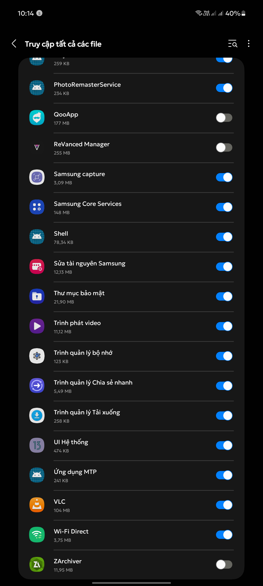
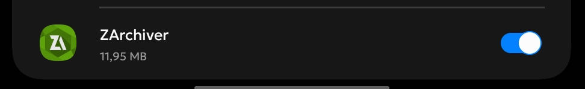
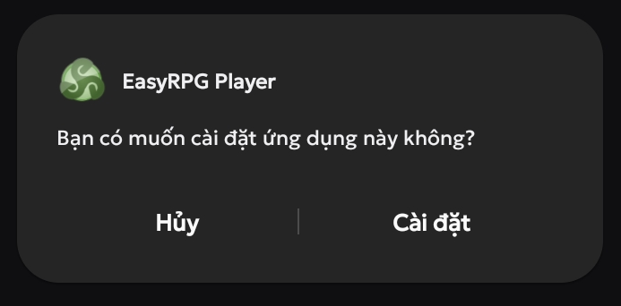
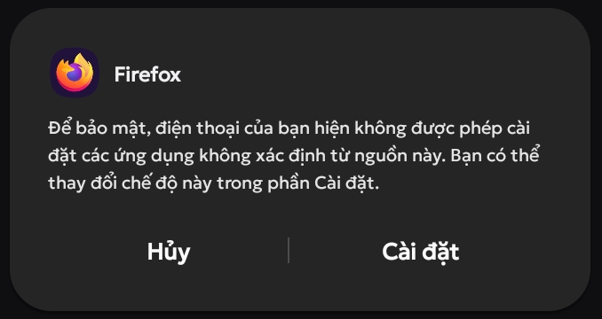
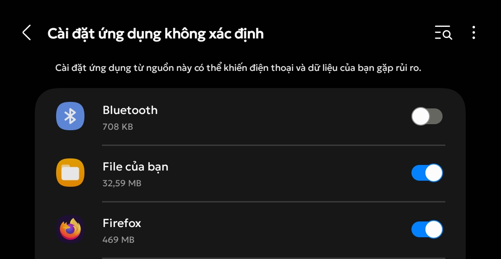
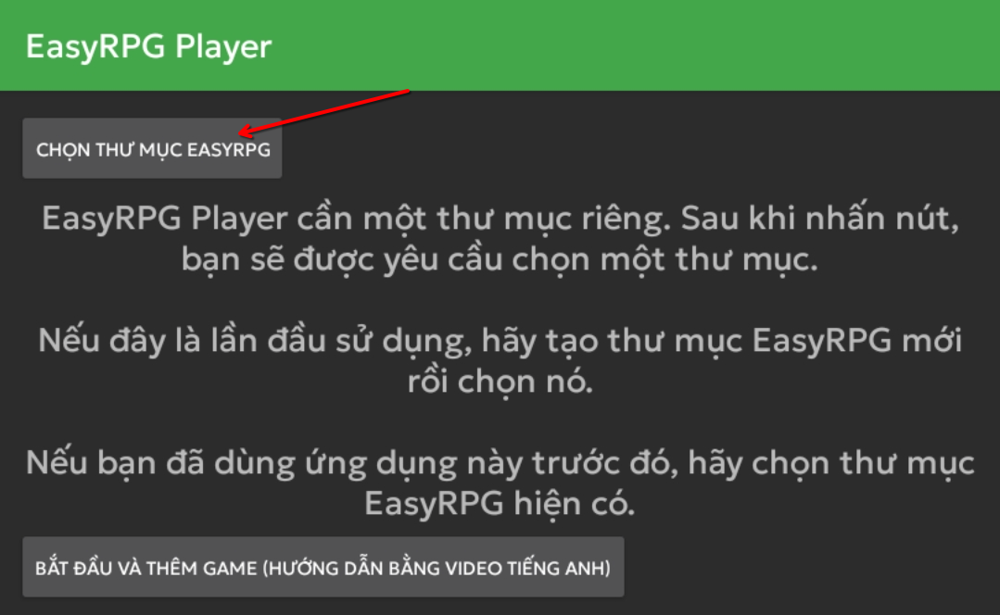
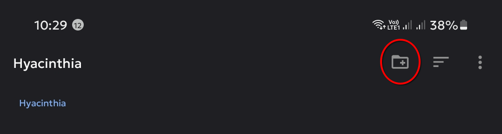
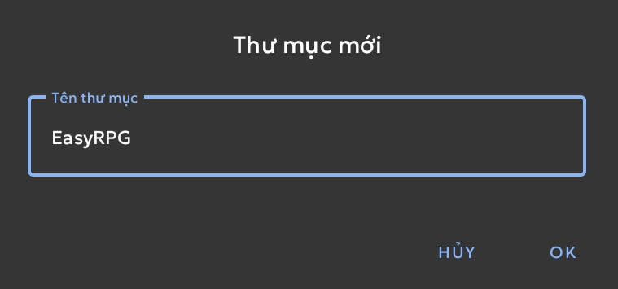

# Điều kiện cơ bản
{: .no_toc }

Dưới đây sẽ là những thứ bạn cần chuẩn bị để chơi game Nobihaza trên điện thoại Android.

Mình sẽ sử dụng máy Samsung Galaxy A71 với One UI 5.1 (Android 13). Tuy nhiên những điện thoại khác cũng sẽ có cách làm tương tự.

## Mục lục
{: .no_toc }

1. TOC
{:toc}

## Phần mềm giải nén

Tất cả điện thoại đều sẽ phải cài phần mềm giải nén bên ngoài. Mình không tin tưởng phần mềm mặc định của máy một tí nào.

{: .note }
> Bạn có thể cài bất kì phần mềm giải nén nào cũng được, tuy nhiên ở đây mình sẽ chỉ hướng dẫn ứng dụng ZArchiver.

* Truy cập vào Cửa hàng Play và tìm kiếm ứng dụng **ZArchiver**. Nhấn nút **Cài đặt** để bắt đầu cài đặt ứng dụng đó.

* Mở ứng dụng ZArchiver lần đầu tiên. Một thông báo yêu cầu cấp quyền sẽ xuất hiện thì nhấn OK, và một bảng cấp quyền sẽ được mở như hình bên dưới.

* Nhấn vào nút Bật ở ứng dụng ZArchiver để cấp quyền truy cập tất cả tệp tin cho ứng dụng này.

## EasyRPG (RPG Maker 2000/2003)

{: .important }
> Đối với người chơi Việt Nam, bạn nên tải bản EasyRPG đã chỉnh sửa để hỗ trợ ngôn ngữ tiếng Việt.
> Sử dụng bản EasyRPG trên Cửa hàng Play sẽ bị lỗi hiển thị.

* Tải bản [EasyRPG Tiếng Việt dành cho Android](https://github.com/The-Firefly-Project/EasyRPGPlayer-Vietnamese/releases/download/0.8.1.1/android.apk).

* Nhấn vào tệp tin đã tải xuống để bắt đầu cài đặt.

{: .note }
> Nếu bạn chưa từng cho phép cài đặt ứng dụng từ trình duyệt, một thông báo yêu cầu cho phép sẽ xuất hiện.
>
> 
>
> Nhấn vào nút **Cài đặt**. Một bảng cấp quyền sẽ hiện ra, hãy cho phép trình duyệt cài đặt ứng dụng. Một số máy cũng có thể mở luôn bảng cấp quyền của trình duyệt và nhấn vào nút **Cho phép cài đặt từ nguồn này**.
>
> 
>
> Sau đó tiến hành mở lại tệp vừa tải xuống và cài đặt như bình thường.

* Thông báo cài đặt thành công sẽ xuất hiện, hãy mở EasyRPG lần đầu tiên. Nhấn nút **Chọn thư mục EasyRPG**.

{: .important }
> Nếu bạn đã từng sử dụng EasyRPG trước đây, bạn cũng có thể chọn thư mục EasyRPG đã tạo trước đó rồi nhấn **Sử dụng thư mục này**.

* Một cửa sổ chọn thư mục sẽ xuất hiện. Nhấn vào nút tạo thư mục ở góc trên bên phải.

* Nhập tên thư mục là EasyRPG rồi nhấn nút **OK**.

* Cuối cùng là nhấn vào nút **Sử dụng thư mục này** rồi nhấn **Cho phép**.

## JoiPlay (RPG Maker XP/VX/VXAce/MV/MZ)

{: .important }
> Liên kết bên dưới sẽ là bản JoiPlay do mình tải từ trang chủ lên website của mình để tiện tải xuống mà không cần nhấn quá nhiều nút. Tuy nhiên nếu bạn không tin tưởng liên kết ngoài thì bạn có thể tải ở [trang chủ của JoiPlay](https://joiplay.cyou).

* Tải [ứng dụng JoiPlay](https://nbhzvn.one/tools/JoiPlay/1.20.550/JoiPlay.apk) và [RPG Maker Plugin for JoiPlay](https://nbhzvn.one/tools/JoiPlay/1.20.550/RPG%20Maker%20Plugin%20for%20JoiPlay.apk).

* Cài đặt cả 2 ứng dụng đã tải xuống, sau đó mở ứng dụng JoiPlay lần đầu tiên.

* Đến phần cấp quyền cho JoiPlay thì bạn hãy cấp quyền truy cập tất cả các tệp cho JoiPlay giống như bạn đã làm với ZArchiver bên trên.

## RPG Maker XP/VX/VX Ace RTP

Tải RTP của 3 bản sau:
    
* [RPG Maker XP](https://dl.komodo.jp/rpgmakerweb/run-time-packages/xp_rtp104e.exe)
* [RPG Maker VX](https://dl.komodo.jp/rpgmakerweb/run-time-packages/vx_rtp102e.zip)
* [RPG Maker VX Ace](https://dl.komodo.jp/rpgmakerweb/run-time-packages/RPGVXAce_RTP.zip)

Bạn sẽ cần sử dụng nó về sau này trong quá trình chơi game.

## Android System WebView

Cái này sẽ cần thiết cho một số game RPG Maker MV/MZ.

[Nhấn vào đây](https://play.google.com/store/apps/details?id=com.google.android.webview) để mở Android WebView trên Cửa hàng Play, vì khi tìm kiếm sẽ không có. Sau đó nếu có bản cập nhật, hãy cập nhật Android System WebView lên phiên bản mới nhất.

# Sau khi đã hoàn tất, hãy tới phần [Tải và chạy game](./installation)
{: .no_toc }