# Troubleshooting and Tips
{: .no_toc }

Below are fixes for common errors encountered on Android devices.

{: .important }
> Not all games will be compatible with Android. If you cannot run a game after reading this guide, please report the error to the developer.

{: .important }
> Before you begin, ensure you have downloaded the latest versions of the supporting software (EasyRPG, JoiPlay, and Android WebView).

## Table of Contents
{: .no_toc }

1. TOC
{:toc}

## General

### App not installed

* If you are updating from an old version, the new version may not be compatible with the old one. Please back up your data from the old version, uninstall the application, and then install the new version.

* Your device may also be out of storage space.

* The `.apk` file you downloaded may also be corrupted; please try downloading it again.

* The application may not be compatible with your Android version or your phone.
    * Some devices using Android Go or older models might be using the `armeabi-v7a` (32-bit) architecture, but the application only supports `arm64-v8a` or `armv9` (64-bit). This is similar to on a computer, where a 64-bit application cannot run on a 32-bit machine.

### Cannot save game progress

This applies to both basic cases: the game reports an error when saving, and the game does not display the saved file upon restarting.

Please try all the methods below:

#### Allow "all files access" permission

The supporting software will request permission to access all files upon first launch. However, if you accidentally dismiss that notification, you can go into Settings to grant the permission again.

{: .note }
> The screenshot below is from One UI 5.1. The interface on other phone brands may be slightly different.

* Go to the **Settings** app and tap on the **Apps** section.

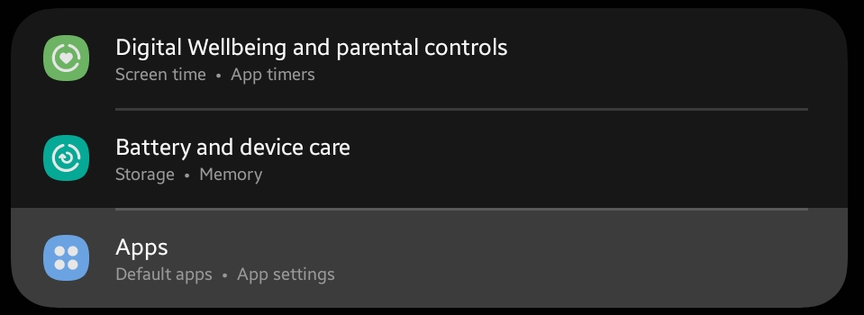

* Tap the Menu button in the top right corner and select **Special access**. Some devices may have a **Permission manager** option in the list below without needing to tap the Menu button.

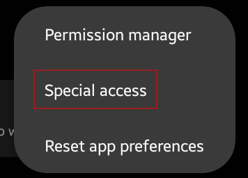

* Select the **All files access** option.

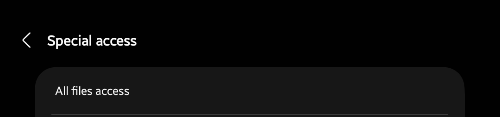

* Enable the permission for the **JoiPlay** and **RPG Maker Plugin for JoiPlay** applications.

#### Other

* Try creating a separate folder in your phone's storage and moving the game folder into it. Some devices may restrict permissions for special folders like `Android` or `Download`.

* Some devices may not support saving games on an SD card. Try moving the game to the phone's internal storage.

### Game images appear in the phone's Gallery

After you extract a game, you might see the game's resource images appearing in your phone's Gallery:

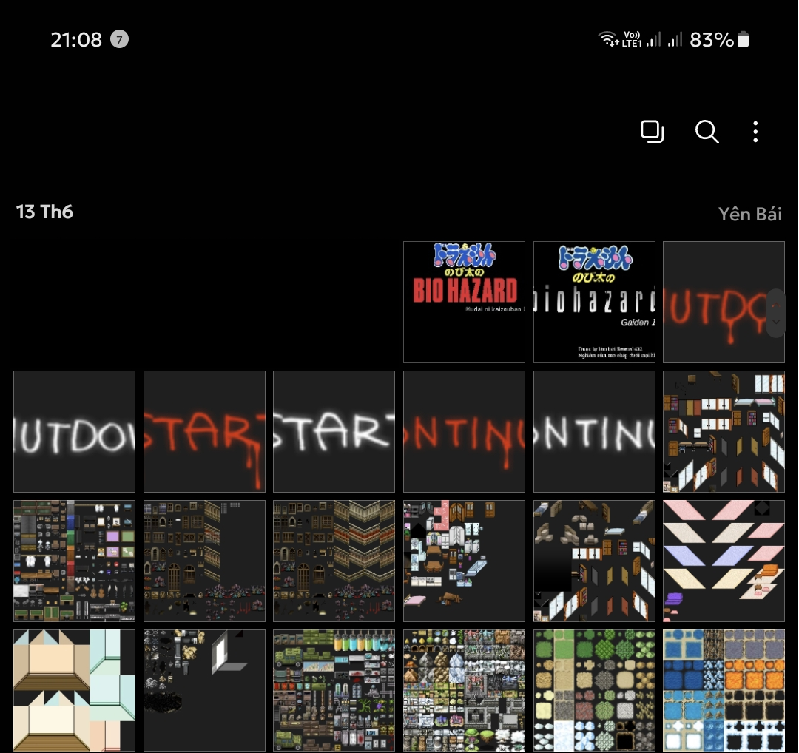

* Create two empty files named `.nomedia` and `.nosearch` (or take any two files and rename them to those names), then move these two files into the game folder (or the folder containing all your games).

{: .important }
> Most file managers will hide files that start with a dot by default, including the two newly created files. However, you only need to create them once (if you try again, you will get a notification that the file already exists).
>
> If you want, you can also enable the **Show hidden system files** option in your file manager.

{: .tip }
> ZArchiver also has an option to create an empty file by tapping the plus (+) sign in the bottom right corner of the app, then tapping the 3rd option (the file icon) and entering the filename.
>
> 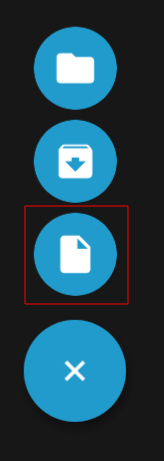

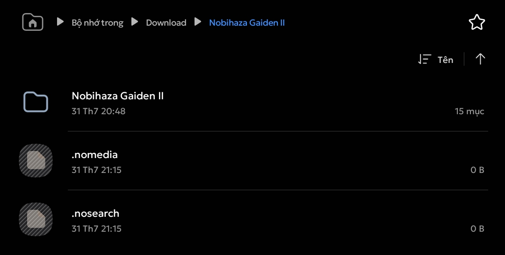

* You should no longer see the game's images in the Gallery. If you still do, restart your phone to fully apply the settings.

### Game lags despite using a high-spec phone

* Turn off power-saving mode on your phone (and enable high-performance mode/Game Turbo if available) before playing.

* Close any background applications.

* If you are using a Custom ROM, ensure the ROM you are using has adequate kernel and driver support for gaming.

* It's also possible that your device is not actually as high-spec as you think. There are many cases of scams selling low-spec devices at high prices out there; I hope you don't fall into that situation. Please find out if your device is genuine.

## RPG Maker 2000/2003 (EasyRPG)

### SDL Error

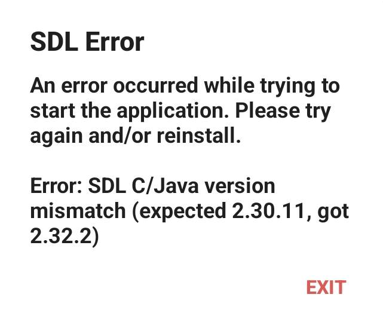

Please re-download a stable version of EasyRPG. You should not use a Nightly build as it may cause similar errors.

### Other errors

See the [EasyRPG](../../miscellaneous/easyrpg) section.

## RPG Maker XP/VX/VX Ace/MV/MZ (JoiPlay)

### JoiPlay reports it cannot find the RPG Maker Plugin even though it's installed

* Try uninstalling the application and installing it again.

* Make sure that both JoiPlay and the RPG Maker Plugin are on the latest version.

* Some devices (especially Xiaomi devices using MIUI/HyperOS) do not allow JoiPlay to read the list of applications on the phone, so it cannot find the installed RPG Maker Plugin.
    * Go to your phone's **Settings** and tap on the **Apps** section. Select the **JoiPlay** application from the list.
    * Tap on the **Permissions** section.

    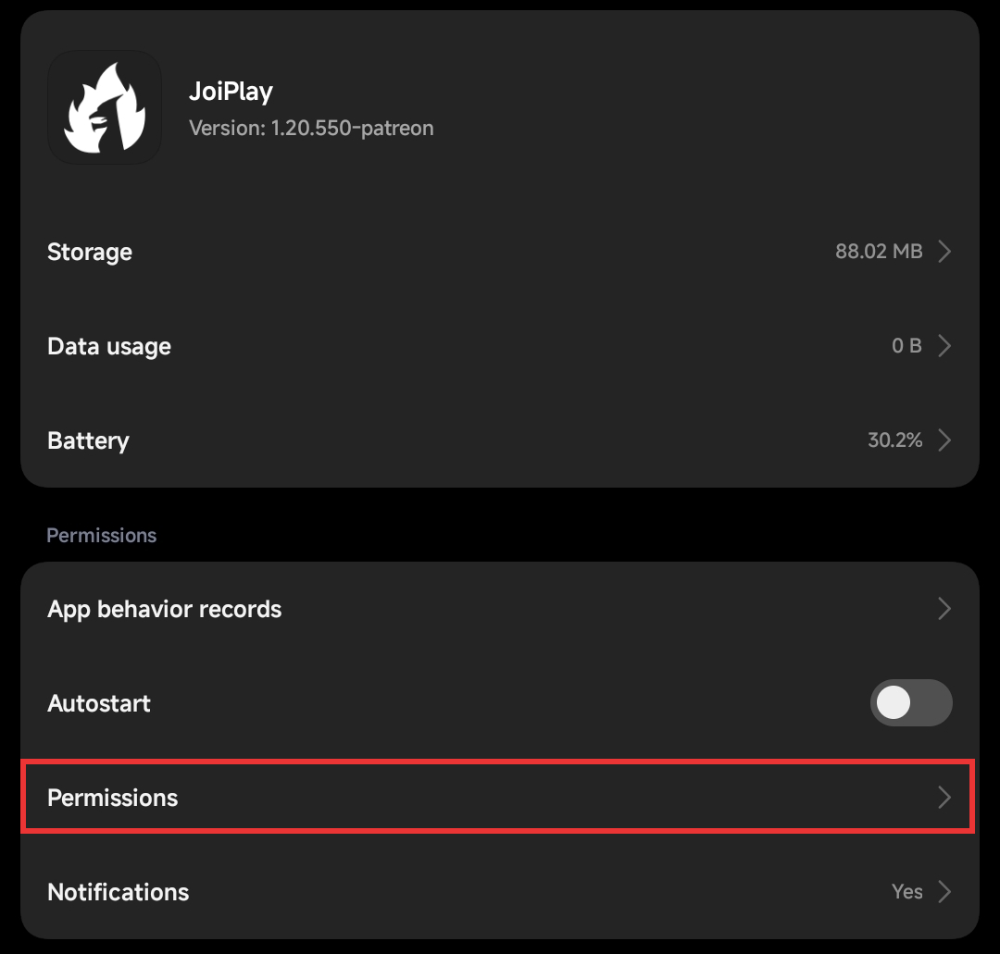

    * Find the **Access list of installed apps** permission and change it to **Always allow**. Then restart JoiPlay.

    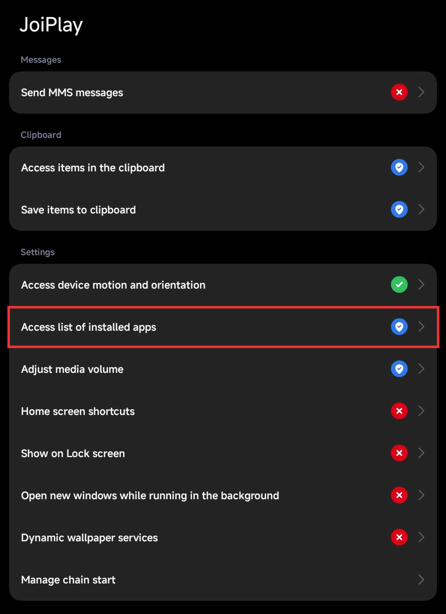

    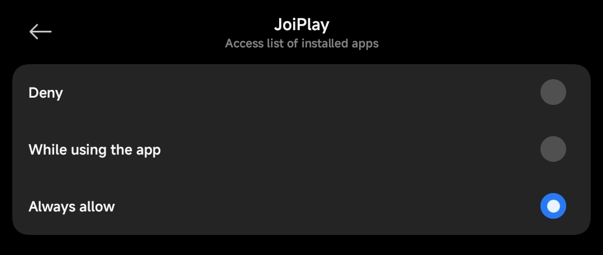

> [!NOTE]
> With HyperOS, you need to also click **Other permissions** when going to the **Permissions** section.

### Cannot extract runtime package

* Please select the correct `.zip` file for the RTP that you downloaded in the Prerequisites section (do not extract it first).

* If you have selected the correct one but it still reports an error, try re-downloading the RTP.

### You are using a device running Android 11 or higher

This is just a notification that the gaming experience might be slower due to limitations in Android 11 and above, and you can ignore this message.

### Could not access game files

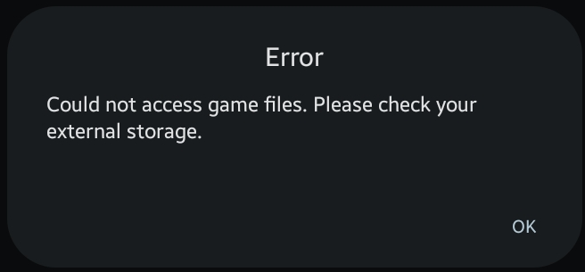

* You may have accidentally deleted the game folder. Please check the game folder and re-download it if you deleted it by mistake.

* If you saved the game to an SD card, check if your phone can still detect the SD card.

### `解決?` / `解?`


Some people say that this error often occurs on Xiaomi phones, but I don't yet know how to completely fix it.

Try re-extracting the game and trying again. If it still doesn't work, the game version you are playing may not be compatible with JoiPlay; please try a different game version.

### `No game scripts specified (missing Game.ini?)`

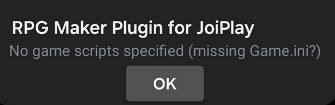

You have accidentally deleted the `Game.ini` file on your device (or it was not there from the beginning).

* Try re-extracting the game again.

* If you are sure the error is because the developer did not include this file in the compressed archive, please report the error to the developer.

{: .tip }
> You can also create your own `Game.ini` file and place it in the game folder, although it may not be fully compatible with the original `Game.ini`.
>
> ```ini
> [Game]
> Library=RGSS202E.dll
> Scripts=Data\Scripts.rvdata
> Title=Nobita's Resident Evil Z 640x480
> ```
>
> Note:
> * Replace `RGSS202E.dll` in the `Library` section with the name of the `RGSS****.dll` file you find in the game folder. For example, with RPG Maker VX Ace, it could be `RGSS300.dll` or `RGSS301.dll` if you see it in the game folder.
> * Replace `Data\Scripts.rvdata` in the `Scripts` section with:
>   * `Data\Scripts.rxdata` if it's an RPG Maker XP game.
>   * `Data\Scripts.rvdata2` if it's an RPG Maker VX Ace game.
> * Replace the game name in the `Title` section with the name of the game you are playing.

### `Failed to read script data`


* You may have accidentally deleted the game's `Game.rgssad` / `Game.rgss2a` / `Game.rgss3a` file. Try re-extracting the game.

* If the above file is still in the game folder but you still can't run it, the game may have been encrypted using a special method and cannot be run on JoiPlay.

### Script error

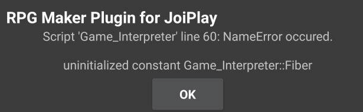

The game may contain scripts that are not compatible with JoiPlay, or it was already bugged in the computer version.

You must contact the developer about this error.

### Read-only file system

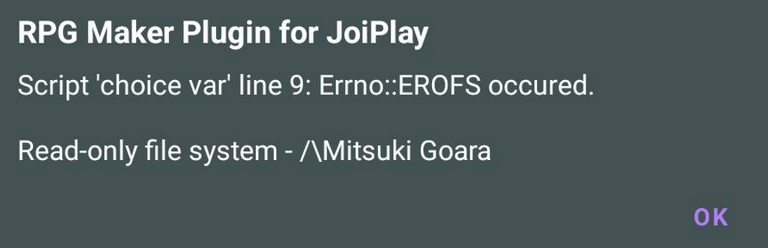

The fix is the same as for the [Cannot save game progress](#cannot-save-game-progress) section.

### The webpage at ... could not be loaded


* You may have accidentally deleted the game's `index.html` file from the game folder (or the game's `www` folder). Try re-extracting the game.
    * If you see the `index.html` file in the game folder but do not see a `www` folder, you can also create a new `www` folder and move the `audio`, `fonts`, `icon`, `img`, `js`, `movies`, and `index.html` folders into the newly created `www` folder.
* If you are using a VPN or Private DNS, try turning it off.
* Try [updating Android System WebView](./prerequisities#android-system-webview).
* Go to JoiPlay's settings -> **HTML Settings** -> turn off the **Use HTTP Server** option. However, this may cause errors in other games, so consider this as a last resort.

### Your browser does not support WebGL


Go to JoiPlay's settings (menu button in the top right corner -> **Settings**) -> HTML Settings and turn on the WebGL option.

### Loading Error (`Failed to load`) / File not found

Some files in the game have not yet been extracted. Please re-download, re-extract the game, and try again.

If you have re-downloaded many times and the error still occurs, please report it to the game's developer.

### (Script) Error


You must contact the developer about this error.

### `require is not defined`


Try turning on the **NWJSAPI** option in JoiPlay's Settings (menu button in the top right corner -> **Settings**) -> HTML Settings.

## Tips for Android

### Change the key layout when playing games

Both EasyRPG and JoiPlay support changing the key layout.

#### EasyRPG

* Tap the settings button in the top right corner of the app and select the **Input** section.

* You can change the settings and layout of the keyboard in this section. Tap the settings button next to the two options **Horizontal (Landscape) Input Layout** and **Vertical (Portrait) Input Layout** to edit them for when you are playing in landscape and portrait mode.

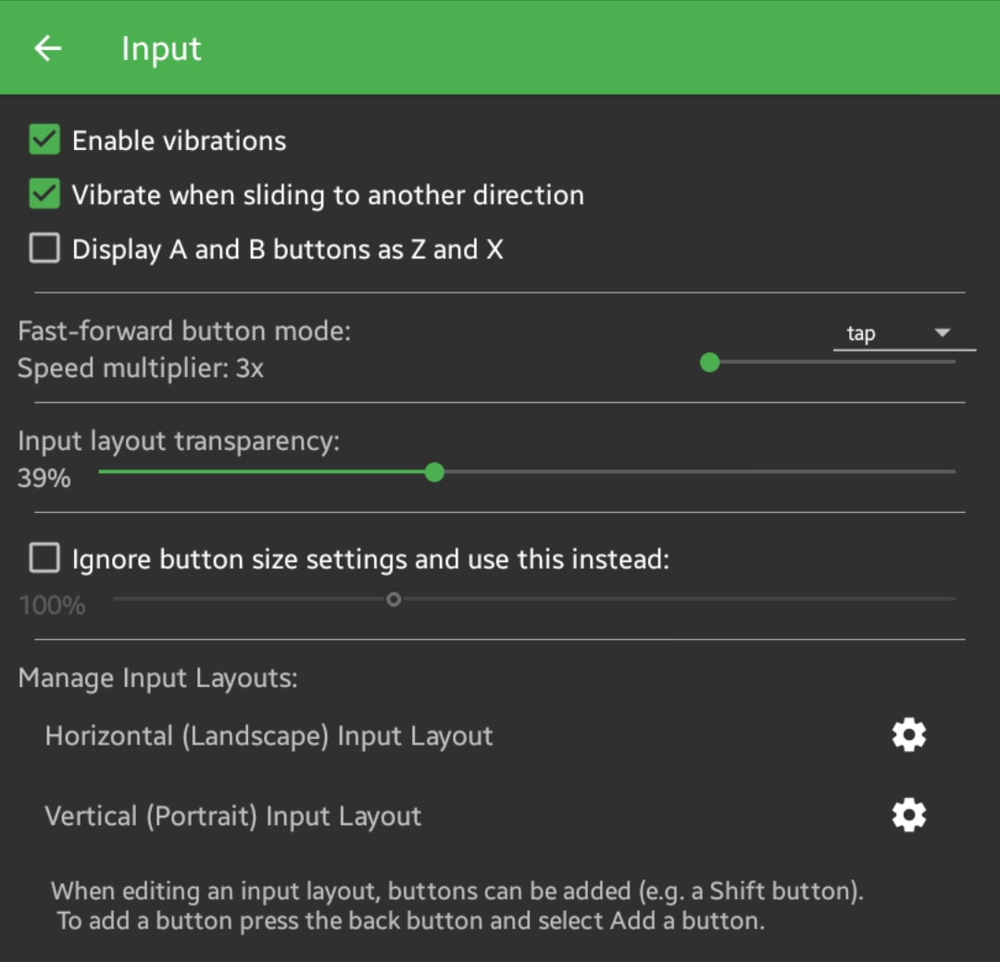

* In the layout editing interface, press your phone's back button to open the menu for saving settings or adding new buttons.

#### JoiPlay

* Tap the menu in the top right corner of JoiPlay and select Settings, then select the **Gamepad Settings** section.

* Below will be options to change the key settings. Although you can't adjust the key positions like in EasyRPG, you can still change the function of one button to another.

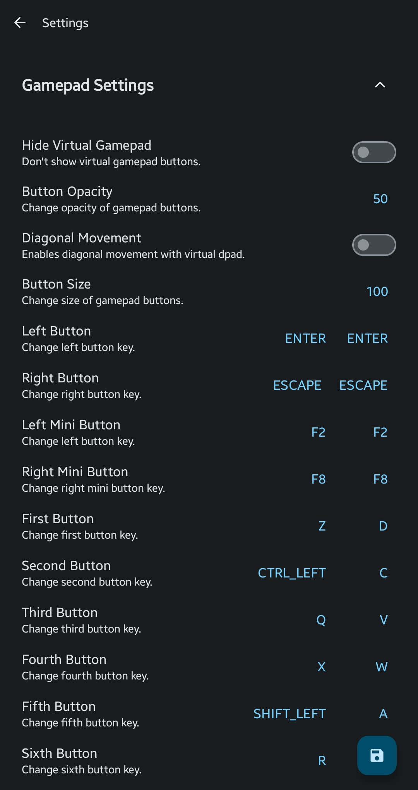

* Then save the settings.

### Transfer games from computer to phone

There are two ways to transfer: via MTP or via ADB.

* MTP is easier to set up, but has lower speed and is more prone to errors.
* ADB is the opposite, harder to set up but has higher speed.

{: .important }
> Before you begin, install your phone's driver if you are using Windows.

#### Via MTP

{: .important }
> For Windows and Linux, the phone will be recognized by default upon plugging it into the USB. However, for macOS, you need to install **OpenMTP** and use MTP within that application itself.

* Connect your phone to the computer via a USB cable (you can use your charging cable if your charger has a USB port to plug into the computer).

* Some devices will display a notification immediately; otherwise, you can pull down and tap on the **Charging this device via USB** notification.

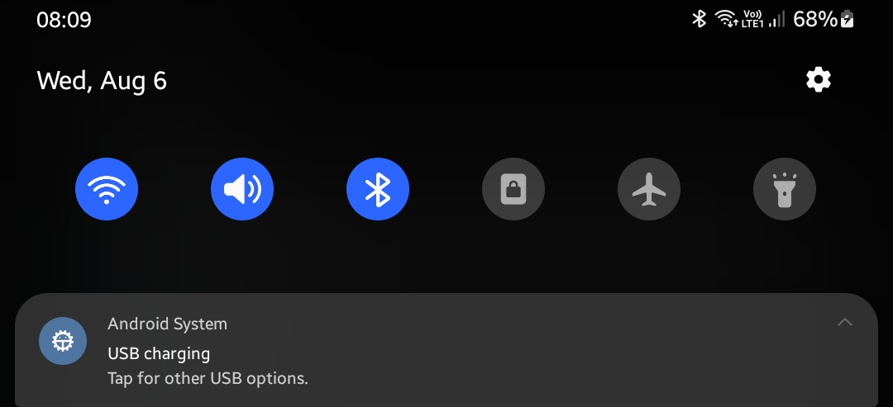

* Switch to **File transfer** mode.

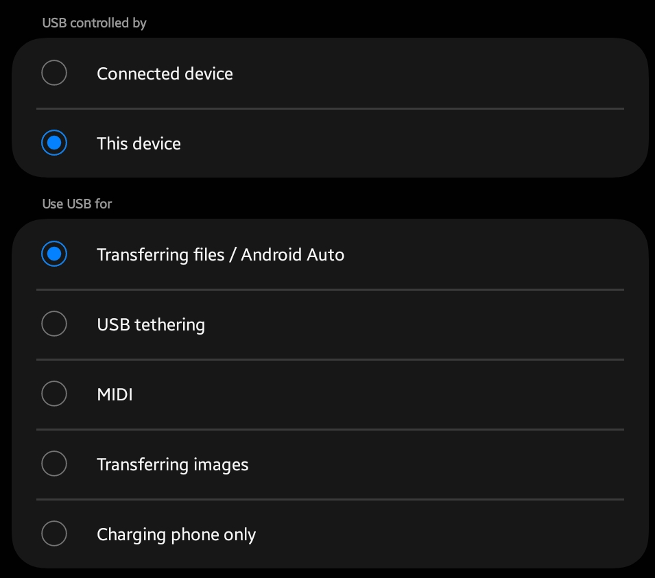

* Your device's name will appear on the computer. Click on that device and you will see the **Internal storage** section (and also **SD card** if you have one installed).

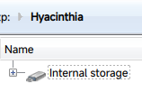

* Click on either of the two sections and you will see folders just like on your phone.

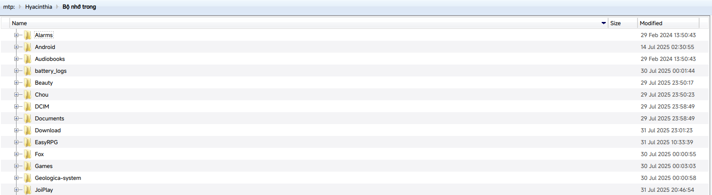

* Proceed to copy the game into the folder you want, just like you normally would with your computer's hard drive.

#### Via ADB

##### Enable USB debugging on the phone

* Go to your phone's **Settings** and tap on the **About phone** section. Find the **Build number** section (on some devices, it will be in the Software information section).

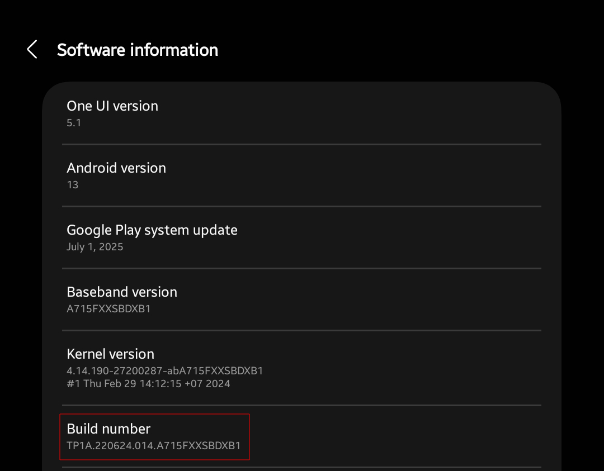

* Tap the **Build number** section 7 times consecutively, until a message **Developer mode has been turned on** appears. Some devices may ask for your phone's password at this step.

* Go to the **Developer options** section (on some devices it will appear directly in Settings, while on others it will be in the System section). Find the **USB debugging** option and turn it on.

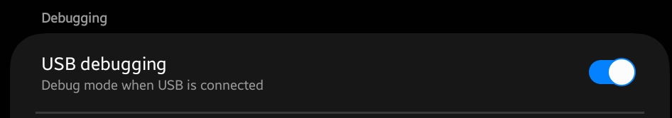

##### Install ADB

First, you need to install ADB on your computer.

* Visit the [official Google SDK Platform Tools download page](https://developer.android.com/studio/releases/platform-tools).

* Click the **Download SDK Platform-Tools for XXX** button (XXX is the operating system you are using) and accept the terms of use.

* Extract the downloaded `.zip` file to any folder.

##### Connect the phone

{: .important }
> For macOS and Linux, add `./` before the word `adb` in all commands below this notification, for example, `./adb devices` instead of `adb devices`.

* Open Command Prompt (or Terminal with macOS and Linux) and use the `cd` command to navigate to the newly extracted folder:

```sh
cd "/path/to/adb"
```

Replace `/path/to/adb` with the path of `adb`.

* Start ADB on the computer with the `adb start-server` command, then plug the phone into the computer. A notification asking for permission to allow the computer to debug will appear; please tap **Allow**.

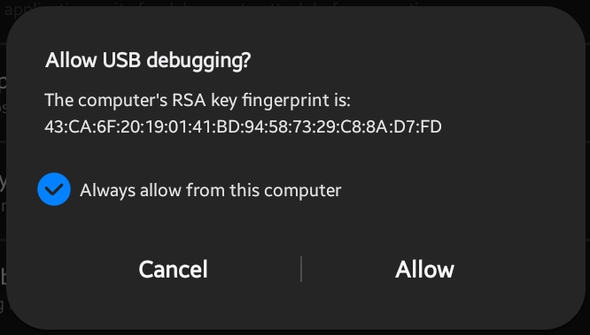

* Run the `adb devices` command to see the connected device. If it says `device` instead of being empty or `unauthorized`, it means you have succeeded. If it still doesn't work, try unplugging and plugging the cable back in.

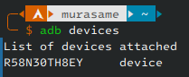

##### Transfer data to the phone

Use the following command to copy a folder from the computer to the phone:

```sh
adb push -a "/path/from/pc" "/path/to/phone"
```

* Replace `/path/from/pc` with the path of the game folder **on the computer**.
* Replace `/path/to/phone` with the destination game folder path **on the phone**.

For example, if I want to copy a game from the `/home/hyacine/Nobihaza/Nobihaza 2` folder to the `Download` folder on the phone:

```sh
adb push -a "/home/hyacine/Nobihaza/Nobihaza 2" "/sdcard/Download"
```

{: .tip }
> The main path of the phone's storage will be `/sdcard`. However, if you want to copy to an SD card:
>
> * Use the `adb shell ls /storage` command to get the ID of the SD card partition first.
>
> ```
> $ adb shell ls /storage
> CF22-9997
> emulated
> self
> ```
>
> The ID of the SD card partition will have the format `XXXX-XXXX`. For my SD card, it would be `CF22-9997`.
>
> * Replace `/sdcard` in the path with `/storage/CF22-9997` (replace `CF22-9997` with the ID you just found).

##### Install APK directly from the computer

Most phones will allow installing an APK file directly from the computer without needing to transfer the file to the phone, using the command:

```sh
adb install /path/to/apk.apk
```

Replace `/path/to/apk.apk` with the path to the APK file.

{: .important }
> Some phones (especially Xiaomi phones running MIUI/HyperOS) will require you to enable the **Install via USB** option in the Developer options.

### Package APK for Android

See the [Packaging your own APK file](./package) section.