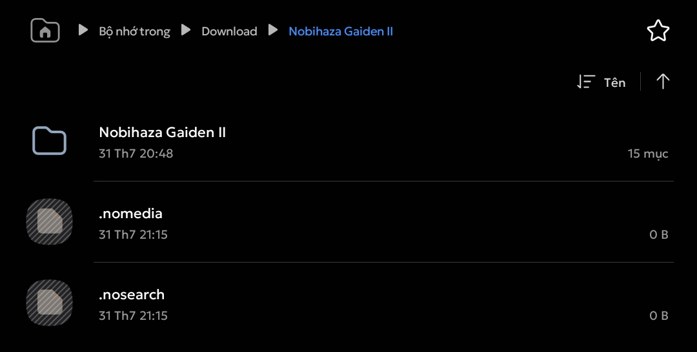
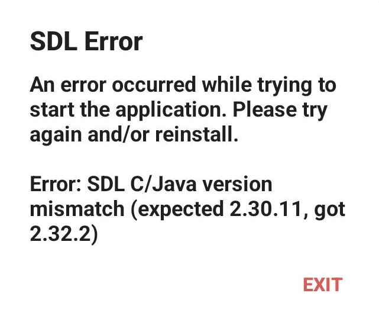
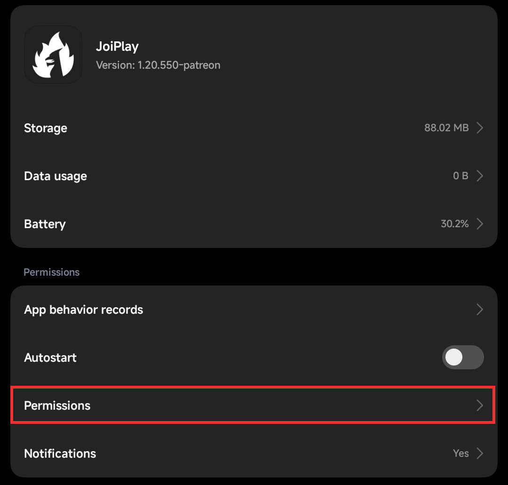
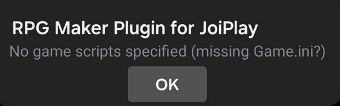
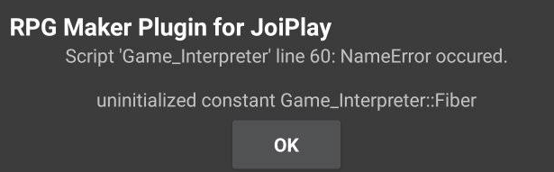
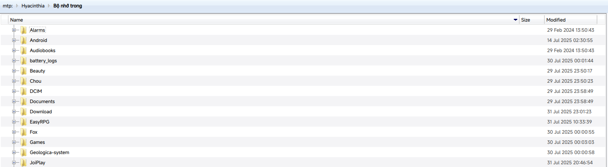
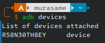

# Sửa lỗi và mẹo
{: .no_toc }

Dưới đây sẽ là cách sửa các lỗi thường gặp trên thiết bị Android.

{: .important }
> Không phải game nào cũng sẽ tương thích với Android. Nếu bạn không thể chạy game sau khi đọc hướng dẫn này, vui lòng báo lỗi cho nhà phát triển.

{: .important }
> Trước khi bắt đầu, hãy đảm bảo bạn đã tải bản mới nhất của các phần mềm hỗ trợ (EasyRPG, JoiPlay và Android WebView).

## Mục lục
{: .no_toc }

1. TOC
{:toc}

## Chung

### Ứng dụng chưa được cài đặt


* Nếu bạn đang cập nhật từ bản cũ thì bản mới có thể không tương thích với bản cũ đó. Hãy sao lưu các dữ liệu trong bản cũ và gỡ bỏ ứng dụng, sau đó cài lại bản mới.

* Máy của bạn cũng có thể đã hết dung lượng.

* Tệp tin `.apk` bạn tải xuống cũng có thể đã bị hỏng, hãy thử tải lại một lần nữa.

* Ứng dụng có thể không tương thích với bản Android hoặc điện thoại của bạn.
    * Một số máy sử dụng Android Go hoặc các máy đời cũ có thể đang sử dụng cấu trúc `armeabi-v7a` (32-bit) nhưng ứng dụng lại chỉ hỗ trợ `arm64-v8a` hoặc `armv9` (64-bit). Cái này cũng giống với trên máy tính, khi ứng dụng 64-bit không thể chạy được trên máy 32-bit.

### Không thể lưu được tiến trình của game

Áp dụng cho cả 2 trường hợp cơ bản: game báo lỗi khi lưu game và game không hiển thị tệp đã lưu khi khởi động lại game.

Bạn hãy thử tất cả cách bên dưới:

#### Cho phép quyền truy cập tất cả các tệp

Các phần mềm hỗ trợ sẽ yêu cầu cấp quyền truy cập tất cả các tệp khi khởi động lần đầu tiên, tuy nhiên nếu bạn lỡ bỏ qua thông báo đó thì bạn có thể vào Cài đặt để cấp quyền lại.

{: .note }
> Ảnh chụp bên dưới sẽ là của One UI 5.1. Giao diện của các hãng điện thoại khác có thể sẽ khác đi một chút.

* Vào ứng dụng **Cài đặt** và nhấn vào mục **Ứng dụng**.


* Nhấn vào nút Menu ở góc trên bên phải và chọn **Truy cập đặc biệt**. Một số máy sẽ có thể có mục **Quản lý quyền hạn** ở danh sách bên dưới mà không cần nhấn nút Menu.


* Chọn mục **Truy cập tất cả các file**.


* Bật quyền cho ứng dụng **JoiPlay** và **RPG Maker Plugin for JoiPlay**.

#### Khác

* Thử tạo một thư mục riêng ở bộ nhớ điện thoại và di chuyển thư mục game vào thư mục đó. Một số máy có thể sẽ hạn chế quyền cho các thư mục đặc biệt như `Android` hoặc `Download`.

* Một số máy có thể sẽ không hỗ trợ lưu game trên thẻ nhớ, hãy thử chuyển game vào bộ nhớ trong của điện thoại.

### Ảnh trong game xuất hiện trên Bộ sưu tập của điện thoại

Sau khi bạn giải nén game ra ngoài, bạn có thể sẽ thấy ảnh tài nguyên của game xuất hiện trong Bộ sưu tập của điện thoại:


* Hãy tạo 2 tệp tin trống có tên là `.nomedia` và `.nosearch` (hoặc lấy 2 tệp tin bất kì và đổi thành 2 cái tên đó), sau đó di chuyển 2 tệp tin vào thư mục game (hoặc thư mục chứa tất cả các game).

{: .important }
> Các trình quản lý tệp mặc định sẽ ẩn các tệp tin bắt đầu bằng dấu chấm, bao gồm cả 2 tệp tin vừa mới tạo. Tuy nhiên thì bạn chỉ cần tạo 1 lần (nếu thử lại thì sẽ có thông báo tệp tin đã tồn tại).
>
> Nếu bạn muốn, bạn cũng có thể bật tùy chọn **Hiển thị tệp tin hệ thống ẩn** (Show hidden files) trên trình quản lý tệp của bạn.

{: .tip }
> ZArchiver cũng có tùy chọn tạo tệp tin trống bằng cách nhấn vào dấu cộng (+) ở góc dưới bên phải ứng dụng, sau đó nhấn vào mục thứ 3 (biểu tượng tệp tin) và nhập tên tệp tin.
>
> 



* Bạn sẽ không còn thấy ảnh của game xuất hiện trên Bộ sưu tập nữa. Nếu vẫn còn thì hãy khởi động lại điện thoại để áp dụng hoàn toàn cài đặt.

### Game giật lag mặc dù đang sử dụng điện thoại có cấu hình cao

* Tắt chế độ tiết kiệm pin ở trên điện thoại (và bật chế độ hiệu năng cao/Game Turbo nếu có) trước khi chơi.

* Tắt bớt các ứng dụng chạy ngầm.

* Nếu bạn đang sử dụng Custom ROM, hãy đảm bảo ROM bạn đang sử dụng có hỗ trợ kernel và driver đủ tốt để có thể chơi game.

* Cũng có thể là máy bạn thực sự không có cấu hình cao như bạn nghĩ, khi ở bên ngoài kia có rất nhiều trường hợp lừa đảo bán máy cấu hình thấp với giá cao; và mình mong bạn sẽ không gặp phải trường hợp đó. Hãy tìm hiểu xem máy của bạn có phải là máy chính hãng không.

## RPG Maker 2000/2003 (EasyRPG)

### SDL Error



Hãy tải lại EasyRPG bản ổn định (Stable/Release), ví dụ như bản EasyRPG tiếng Việt mình đã dẫn link ở phần Điều kiện cơ bản. Không nên sử dụng bản Nightly vì có thể sẽ xảy ra lỗi tương tự như thế này.

### Các lỗi khác

Xem tại mục [EasyRPG](../../miscellaneous/easyrpg).

## RPG Maker XP/VX/VX Ace/MV/MZ (JoiPlay)

### JoiPlay báo lỗi không thể tìm thấy RPG Maker Plugin mặc dù đã cài đặt

* Hãy thử gỡ ứng dụng ra và cài đặt lại một lần nữa.

* Bạn hãy đảm bảo là cả JoiPlay và RPG Maker Plugin đều đang ở phiên bản mới nhất.

* Có một số máy (đặc biệt là Xiaomi đang sử dụng MIUI/HyperOS) không cho phép JoiPlay đọc danh sách ứng dụng trên điện thoại, nên nó không thể tìm thấy được RPG Maker Plugin đã cài đặt.
    * Vào **Cài đặt** của điện thoại và nhấn vào mục **Ứng dụng**. Chọn ứng dụng **JoiPlay** trong danh sách.
    * Nhấn vào mục **Quyền hạn**.

    

    * Tìm mục **Truy cập danh sách ứng dụng đã cài đặt** và thay đổi thành **Luôn cho phép**. Sau đó khởi động lại JoiPlay.

    

    

### Không thể giải nén gói thời gian chạy


* Hãy chọn đúng tệp tin `.zip` của RTP mà bạn đã tải ở phần Điều kiện cơ bản (không giải nén trước).

* Nếu đã chọn đúng nhưng vẫn báo lỗi, hãy thử tải lại RTP.

### Bạn đang sử dụng thiết bị chạy Android 11 trở lên


Đây chỉ là một thông báo trải nghiệm chơi có thể sẽ chậm hơn do hạn chế của Android 11 trở lên, và bạn có thể bỏ qua thông báo này.

### Không thể truy cập tệp trò chơi


* Bạn có thể đã xóa nhầm thư mục game. Hãy kiểm tra lại thư mục game và tải lại nếu bạn xóa nhầm.

* Nếu bạn lưu game vào thẻ nhớ, hãy kiểm tra xem điện thoại của bạn còn nhận diện được thẻ nhớ không.

### `解決?` / `解?`


Có một số người nói rằng lỗi này thường xảy ra ở các máy điện thoại Xiaomi, nhưng mình chưa biết sửa triệt để lỗi này như thế nào.

Hãy thử giải nén lại game và thử lại. Nếu vẫn không được thì có thể bản game bạn đang chơi không tương thích với JoiPlay, hãy thử với một bản game khác.

### `No game scripts specified (missing Game.ini?)



Bạn đã xóa nhầm tệp tin `Game.ini` trên máy (hoặc nó không có ở đó ngay từ ban đầu).

* Thử giải nén lại game một lần nữa.

* Nếu bạn chắc chắn lỗi là do nhà phát triển không để tệp tin này vào trong tệp tin nén, hãy báo cáo lỗi cho nhà phát triển.

{: .tip }
> Bạn cũng có thể tự tạo một tệp tin `Game.ini` riêng và cho nó vào thư mục game, mặc dù nó có thể không tương thích hoàn toàn với `Game.ini` gốc.
>
> ```ini
> [Game]
> Library=RGSS202E.dll
> Scripts=Data\Scripts.rvdata
> Title=Nobita's Resident Evil Z 640x480
> ```
>
> Lưu ý:
> * Thay thế `RGSS202E.dll` trong phần `Library` bằng tên tệp tin `RGSS****.dll` bạn tìm thấy trong thư mục game. Ví dụ như với RPG Maker VX Ace thì nó có thể là `RGSS300.dll` hoặc `RGSS301.dll` nếu bạn thấy nó ở thư mục game.
> * Thay thế `Data\Scripts.rvdata` ở mục `Scripts` thành:
>   * `Data\Scripts.rxdata` nếu là game RPG Maker XP.
>   * `Data\Scripts.rvdata2` nếu là game RPG Maker VX Ace.
> * Thay thế tên game ở phần `Title` thành tên game bạn đang chơi.

### `Failed to read script data`


* Bạn có thể đã xóa nhầm tệp tin `Game.rgssad` / `Game.rgss2a` / `Game.rgss3a` của game. Hãy thử giải nén lại game.

* Nếu tệp tin trên vẫn còn ở thư mục game nhưng vẫn không thể chạy được thì game có thể đã được mã hóa bằng phương thức đặc biệt, và không thể chạy được trên JoiPlay.

### Script error



Game có thể chứa các câu lệnh không tương thích với JoiPlay, hoặc nó đã bị lỗi ngay từ bản trên máy tính.

Bạn bắt buộc phải liên hệ với nhà phát triển về lỗi này.

### Read-only file system


Cách sửa sẽ giống với mục [Không thể lưu được tiến trình của game](#không-thể-lưu-được-tiến-trình-của-game).

### Trang web hiện không khả dụng


* Bạn có thể đã xóa nhầm tệp tin `index.html` của game trong thư mục game (hoặc thư mục `www` của game). Hãy thử giải nén lại game.
    * Nếu bạn thấy tệp `index.html` trong thư mục game nhưng lại không thấy thư mục `www`, bạn cũng có thể tạo thư mục `www` mới và di chuyển thư mục `audio`, `fonts`, `icon`, `img`, `js`, `movies` và `index.html` vào trong thư mục `www` vừa tạo đó.
* Nếu bạn đang bật VPN hoặc Private DNS, hãy thử tắt nó đi.
* Bạn hãy thử [cập nhật Android System WebView](./prerequisities#android-system-webview).
* Vào cài đặt của JoiPlay -> **Cài đặt HTML** -> tắt tùy chọn **Sử dụng máy chủ HTTP**. Tuy nhiên nó có thể gây ra lỗi cho các game khác nên bạn hãy coi cách này như là ưu tiên cuối cùng.

### Your browser does not support WebGL


Vào phần cài đặt của JoiPlay (nút menu ở góc trên bên phải -> **Cài đặt**) -> Cài đặt HTML và bật tùy chọn WebGL lên.

### Loading Error (`Failed to load`) / File not found

Có một số tệp tin trong game vẫn chưa thể giải nén được. Hãy tải lại, giải nén lại game và thử lại.

Nếu bạn đã tải lại nhiều lần mà vẫn xảy ra lỗi, hãy báo cáo cho nhà phát triển của game.

### (Script) Error


Bạn bắt buộc phải liên hệ với nhà phát triển về lỗi này.

### `require is not defined`


Thử bật tùy chọn **NWJSAPI** trong mục Cài đặt JoiPlay (nút menu ở góc trên bên phải -> **Cài đặt**) -> Cài đặt HTML.

## Mẹo dành cho Android

### Thay đổi bố cục các phím khi chơi game

Cả EasyRPG và JoiPlay đều sẽ hỗ trợ thay đổi bố cục của các phím.

#### EasyRPG

* Nhấn vào nút cài đặt ở góc trên bên phải ứng dụng và chọn mục **Điều khiển**.

* Bạn có thể thay đổi cài đặt và bố cục của bàn phím ở mục này. Nhấn vào nút cài đặt bên cạnh phải hai tùy chọn **Bố cục điều khiển ngang** và **Bố cục điều khiển dọc** khi đang chơi ở màn hình ngang và màn hình dọc.


* Ở trong giao diện chỉnh sửa bố cục, nhấn nút trở về (Back) của điện thoại để mở menu lưu cài đặt hoặc thêm nút mới.

#### JoiPlay

* Nhấn vào menu góc trên bên phải của JoiPlay và chọn Cài đặt, sau đó chọn mục **Cài đặt Gamepad**.

* Bên dưới sẽ hiển thị các tùy chọn để thay đổi cài đặt phím. Mặc dù không thể chỉnh vị trí phím giống EasyRPG, nhưng bạn vẫn có thể thay đổi chức năng của một nút thành một nút khác.


* Sau đó lưu lại cài đặt.

### Chuyển game từ máy tính qua điện thoại

Có 2 cách chuyển: thông qua MTP hoặc thông qua ADB.

* MTP sẽ dễ cài đặt hơn, nhưng có tốc độ thấp hơn và dễ bị lỗi hơn.
* ADB sẽ ngược lại, khó cài đặt hơn nhưng tốc độ sẽ cao hơn.

{: .important }
> Trước khi bắt đầu, hãy cài đặt driver của điện thoại nếu bạn đang sử dụng Windows.

#### Thông qua MTP

{: .important }
> Đối với Windows và Linux thì mặc định sẽ nhận luôn điện thoại khi mới cắm vào USB. Tuy nhiên với macOS, bạn cần cài đặt **OpenMTP** và sử dụng MTP ở chính ứng dụng đó.

* Kết nối điện thoại với máy tính thông qua dây cáp USB (có thể dùng dây sạc nếu sạc của bạn có cổng USB cắm vào máy tính).

* Có máy sẽ hiển thị thông báo luôn, còn không thì bạn có thể kéo xuống và nhấn vào thông báo **Sạc qua USB**.


* Chuyển sang chế độ **Truyền tệp** (truyền file).


* Trên máy tính sẽ xuất hiện tên thiết bị của bạn. Nhấn vào thiết bị đó và bạn sẽ thấy mục **Bộ nhớ trong** (và có cả **Thẻ SD** nếu bạn có lắp thẻ nhớ).


* Nhấn vào một trong hai mục và bạn sẽ thấy các thư mục giống như ở trên điện thoại.



* Tiến hành copy game vào thư mục bạn muốn giống như bạn thường làm với ổ cứng của máy tính.

#### Thông qua ADB

##### Bật gỡ lỗi qua USB trên điện thoại

* Vào mục **Cài đặt** của điện thoại và nhấn vào phần **Thông tin điện thoại** (một số máy sẽ ghi là **Giới thiệu về điện thoại**). Tìm đến phần **Số hiệu bản tạo** (một số máy sẽ nằm ở phần Thông tin phần mềm).


* Nhấn liên tục 7 lần vào mục **Số hiệu bản tạo** đó, cho đến khi có thông báo **Đã bật chế độ nhà phát triển**. Một số máy có thể sẽ yêu cầu nhập mật khẩu điện thoại ở bước này.

* Vào phần **Tùy chọn nhà phát triển** (một số máy sẽ hiển thị luôn ở phần Cài đặt, còn một số máy sẽ nằm trong mục Hệ thống). Tìm tùy chọn **Gỡ lỗi qua USB** và bật tùy chọn đó lên.


##### Cài đặt ADB

Trước tiên, bạn cần cài đặt ADB trên máy tính.

* Truy cập [trang tải SDK Platform Tools chính thức của Google](https://developer.android.com/studio/releases/platform-tools).

* Nhấn vào nút **Download SDK Platform-Tools for XXX** (XXX là hệ điều hành bạn đang sử dụng) và chấp nhận điều khoản sử dụng.

* Giải nén tệp tin `.zip` vừa tải xuống vào một thư mục bất kì.

##### Kết nối điện thoại

{: .important }
> Đối với macOS và Linux, hãy thêm `./` vào trước từ `adb` trong mọi câu lệnh bên dưới thông báo này, ví dụ như `./adb devices` thay vì `adb devices`.

* Mở Command Prompt (hoặc Terminal với macOS và Linux) và dùng lệnh `cd` trỏ tới thư mục vừa giải nén:

```sh
cd "/path/to/adb"
```

Thay `/path/to/adb` thành đường dẫn của `adb`.

* Khởi động ADB trên máy tính bằng lệnh `adb start-server`, sau đó cắm điện thoại vào máy tính. Một thông báo yêu cầu cho phép máy tính gỡ lỗi sẽ xuất hiện thì bạn hãy nhấn **Cho phép**.


* Chạy lệnh `adb devices` để xem thiết bị đã kết nối. Nếu nó ghi chữ `device` thay vì trống không hoặc `unauthorized` thì có nghĩa là bạn đã thành công. Nếu vẫn chưa được thì thử rút ra cắm lại dây cáp.



##### Chuyển dữ liệu sang điện thoại

Sử dụng lệnh sau để sao chép một thư mục từ máy tính qua điện thoại:

```sh
adb push -a "/path/from/pc" "/path/to/phone"
```

* Thay `/path/from/pc` thành đường dẫn thư mục game **trên máy tính**.
* Thay `/path/to/phone` thành đường dẫn thư mục game đích **trên điện thoại**.

Ví dụ như mình muốn copy game từ thư mục `/home/hyacine/Nobihaza/Nobihaza 2` sang thư mục `Download` của điện thoại:

```sh
adb push -a "/home/hyacine/Nobihaza/Nobihaza 2" "/sdcard/Download"
```

{: .tip }
> Đường dẫn chính của bộ nhớ điện thoại sẽ là `/sdcard`. Tuy nhiên nếu bạn muốn copy vào thẻ nhớ thì:
>
> * Dùng lệnh `adb shell ls /storage` để lấy ID của phân vùng thẻ nhớ trước.
>
> ```
> $ adb shell ls /storage
> CF22-9997
> emulated
> self
> ```
>
> ID của phân vùng thẻ nhớ sẽ có dạng `XXXX-XXXX`. Với thẻ nhớ của mình thì sẽ là `CF22-9997`.
>
> * Thay `/sdcard` trong đường dẫn thành `/storage/CF22-9997` (thay `CF22-9997` thành ID bạn vừa tìm được).

##### Cài đặt APK trực tiếp từ máy tính

Đa số điện thoại sẽ cho phép cài đặt tệp tin APK trực tiếp từ máy tính mà không cần chuyển tệp sang điện thoại bằng lệnh:

```sh
adb install /path/to/apk.apk
```

Thay `/path/to/apk.apk` thành đường dẫn tới tệp tin APK.

{: .important }
> Một số điện thoại (nhất là của Xiaomi đang chạy MIUI/HyperOS) sẽ yêu cầu bạn phải bật tùy chọn **Cài đặt ứng dụng bằng USB** trong phần Tùy chọn nhà phát triển.

### Đóng gói APK dành cho Android

Xem tại mục [Tự đóng gói tệp APK](./package).