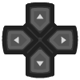
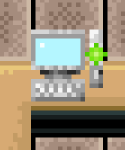
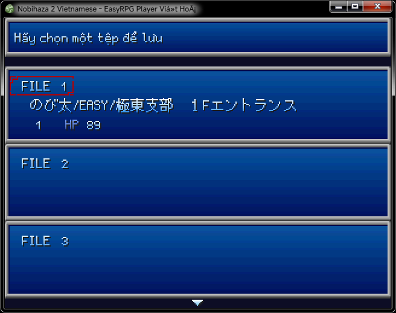
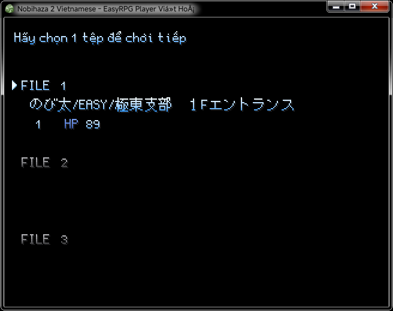

# Basic gameplay guide
{: .no_toc }

This will be a basic guide to playing Nobihaza games for beginners.

Most Nobihaza games will have the general controls as described below. However, if you notice the controls are different, please refer to that game's specific guide (in the game description, the `README` file, or the **Items** -> **Gameplay Guide** item).

## Table of Contents
{: .no_toc }

1. TOC
{:toc}

## Basic Controls

### Computer

| Keys | Action |
| --- | --- |
| Arrow keys (up, down, left, right) or WASD in some games | Move character or change selection |
| **Z / Enter / Space** | Shoot/use knife if a weapon is drawn, or confirm selection/interact with object |
| X / Esc | Open menu or cancel selection |
| Shift | Draw primary weapon |
| S | Walk slowly (or use a special skill in some games) |
| C | Reload or change ammo type |
| Q | Draw secondary weapon in some games |
| Number keys (1, 2, 3, 4, etc.) | Change currently held weapon / item (in some games) |
| F1 | Open engine settings |
| F2 | Show / Hide FPS |
| F4 / Alt + Enter | Toggle fullscreen mode |
| F12 | Force restart the game (only some games support this key) |
| F | Increase game speed x3 (EasyRPG only) |
| G | Increase game speed x10 (EasyRPG only) |

### Phone

#### EasyRPG

For EasyRPG, the Z and X keys have been changed to the A and B keys. The rest are the same as on the computer.

#### RetroArch

| Button | Action |
| --- | --- |
|  | Move character or change selection |
|  | Shoot/use knife if a weapon is drawn, or confirm selection/interact with object |
|  | Open menu or cancel selection |
|  | Open menu or cancel selection |
|  | Draw primary weapon |
|  | Open engine settings |
|  | Force restart the game |
|  | Increase game speed x3 (EasyRPG only) |
|  | Increase game speed x10 (EasyRPG only) |

#### JoiPlay

The keys will be similar to on the computer.

## Start Screen

* **New Game**: Start a new game progress.
* **Continue**: Continue a previously saved game progress.
* **Language**: Select the game's language (only appears in some games).
* **Settings/Options**: Game settings (audio, video, and more if available). Only appears in some games.
* **Exit/Quit**: As the name suggests.

## Menu

* **Items**: A list of items you have received in the game (weapons, medicine, key items, keys).
* **Skills**: A list of the characters' skills.
* **Equip**: Opens the equipment screen for primary/secondary weapons, armor, and other accessories.
* **Formation**: Only for some games. Edits the order of characters in the party.
* **Save**: Some games will have a save option here.
* **Settings/Options**: Game settings (audio, video, and more if available). Only appears in some games.
* **Exit/Quit**: Returns to the start screen.

## Items

Some games will also have categories (Weapons, key items, etc.).

* Press the arrow keys to move between selections.
* Press **Z / Enter / Space** to use an item.

## Skills

* Press the arrow keys to move between selections.
* Press **Z / Enter / Space** to use a skill.

Some skills will consume the character's TP.

## Equipment

* Move and select a slot you need to change equipment for (primary/secondary weapon, clothing, or accessory).
* Press **Z / Enter / Space**, then move and select the replacement item.

You will also see the character's stats in this window.

## Settings

This section will contain game-related settings.

## Basic stats

A character in the game will have at least the following basic stats:

* **HP:** The character's health bar. When HP reaches 0, the game will end.
* **TP:** Some games will label this as MP; this is the character's skill points. Each time a skill is used, it will consume a certain amount of skill points.
* **Attack:** The character's attack power, directly affecting the damage dealt to an enemy's HP.
* **Defense:** The character's damage resistance level.

## Basic combat

### Attacking an enemy

* First, equip a weapon, then return to the game screen and press the **Shift** key to draw the weapon.
* Aim at the enemy and press **Z / Enter / Space** to attack.

### Escaping from an enemy

Some games may have enemies that grab the character; in that case, you need to try to escape by repeatedly pressing the arrow keys.

## Interacting with items/map

Get close to the item you want to interact with (or an area you want to move to) and press **Z / Enter / Space**.

## Using an item on another object

Some games will require an item to interact with another object (for example, needing a key to open a door). The games will use one of the two (or both) of the following methods:

### Direct interaction

* Get close to the object / door and press **Z / Enter / Space**.
* A prompt to select the appropriate item will appear; choose the right item to interact with that object.
* When you select the correct item, the game will continue. If not, the game will report that this item cannot be used, and you need to choose another item.

### Interaction via the Items menu

Some older games will require you to interact via the Items section in the menu.

* Get close to the object / door that requires an item.
* Press **Esc / X** to open the game menu, and go to the **Items** section.
* Choose to use an appropriate item. When you select the correct item, the game will continue. If not, the game will report that this item cannot be used, and you need to choose another item.

## Saving game progress

Most Nobihaza games will have computers (or another object) that act as a checkpoint to save game progress.

* Get close to the computer and press the **Z / Enter / Space** button.
* A **Do you want to save the game** confirmation will appear, and you should choose **Yes**.
* Select a file to save the progress, then press **Z / Enter / Space**.

{: .note }
> * Some games will have an auto-save feature throughout the gameplay (or automatically display the save file selection screen).
> * Some games will allow you to save directly from the game's menu at any time without needing a checkpoint.

## Continuing game progress

* When you re-enter the game, click on the **Continue** button.
* Select a file you have previously saved to continue the saved progress.

## Sharing progress

Most games will save your progress files in the game folder (or the `save` folder within the game folder), with the files usually starting with the word `Save`.

* **RPG Maker 2000/2003:** Progress files will be in the format `SaveXX.lsd` inside the game folder.
* **RPG Maker XP/VX/VX Ace:** Progress files will be in the format `SaveXX.rvdata(2)` inside the game folder.
* **RPG Maker MV/MZ:** Progress files will be in the format `fileXX.rpgsave` inside the `save` folder of the game directory.

To share your progress, share those files, and the recipient will download this file and place it in the correct folder, just like on your machine.

{: .note }
> Some games will have specific save directory. If it's not one of the folders above, contact the developer to find out the correct directory.