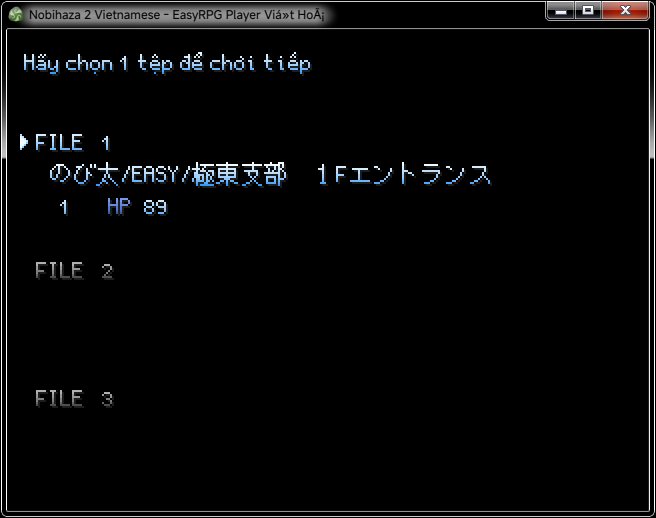

# Hướng dẫn chơi cơ bản
{: .no_toc }

Đây sẽ là hướng dẫn chơi game Nobihaza cơ bản cho những bạn mới bắt đầu chơi.

Đa số các game Nobihaza sẽ có cách điều khiển chung giống như bên dưới. Tuy nhiên nếu nhận thấy cách điều khiển có khác, thì bạn hãy tham khảo hướng dẫn chơi của game đó (trong mô tả game, tệp tin `README` hoặc mục **Bảo bối** -> **Hướng dẫn chơi**).

## Mục lục
{: .no_toc }

1. TOC
{:toc}

## Điều khiển cơ bản

### Máy tính

| Các phím | Hành động |
| --- | --- |
| Mũi tên (lên, xuống, trái, phải) hoặc WASD với một số game | Di chuyển nhân vật hoặc thay đổi lựa chọn |
| Z / Enter / Space | Bắn/chém dao nếu đang rút vũ khí, hoặc chọn lựa chọn/tương tác vật thể |
| X / Esc | Mở menu hoặc hủy bỏ lựa chọn |
| Shift | Rút vũ khí chính |
| S | Đi chậm (hoặc sử dụng kĩ năng đặc biệt ở một số game) |
| C | Nạp lại đạn hoặc đổi loại đạn |
| Q | Rút vũ khí phụ ở một số game |
| Phím số (1, 2, 3, 4, v.v) | Đổi vũ khí / vật dụng đang cầm (chỉ dành cho một số game) |
| F1 | Mở cài đặt của engine (phần mềm làm game) |
| F2 | Hiển thị / Ẩn FPS |
| F4 / Alt + Enter | Bật / Tắt chế độ toàn màn hình |
| F12 | Buộc khởi động lại game (chỉ một số game có hỗ trợ nút này) |
| F | Tăng tốc độ chơi x3 (chỉ dành cho EasyRPG) |
| G | Tăng tốc độ chơi x10 (chỉ dành cho EasyRPG) |

### Điện thoại

#### EasyRPG

Đối với EasyRPG, phím Z và phím X đã đổi thành phím A và phím B. Còn lại sẽ giống với trên máy tính.

#### RetroArch

| Phím | Hành động |
| --- | --- |
|  | Di chuyển nhân vật hoặc thay đổi lựa chọn |
|  | Bắn/chém dao nếu đang rút vũ khí, hoặc chọn lựa chọn/tương tác vật thể |
|  | Mở menu hoặc hủy bỏ lựa chọn |
|  | Mở menu hoặc hủy bỏ lựa chọn |
|  | Rút vũ khí chính |
|  | Mở cài đặt của engine (phần mềm làm game) |
|  | Buộc khởi động lại game |
|  | Tăng tốc độ chơi x3 (chỉ dành cho EasyRPG) |
|  | Tăng tốc độ chơi x10 (chỉ dành cho EasyRPG) |

#### JoiPlay

Các phím sẽ tương tự như trên máy tính.

## Màn hình bắt đầu

* **Chơi mới** (New Game): Bắt đầu một tiến trình chơi mới.
* **Tiếp tục** (Continue): Tiếp tục tiến trình chơi đã lưu trước đó.
* **Ngôn ngữ** (Language): Chọn ngôn ngữ của game (chỉ xuất hiện trên một số game).
* **Cài đặt** (Settings/Options): Cài đặt game (âm thanh, hình ảnh và nhiều thứ khác nếu có). Chỉ xuất hiện trên một số game.
* **Thoát** (Exit/Quit): Như cái tên của nó.

## Menu

* **Vật phẩm/Bảo bối** (Items): Danh sách các vật phẩm bạn đã nhận được trong game (vũ khí, thuốc, vật phẩm hỗ trợ, chìa khóa).
* **Kỹ năng** (Skills): Danh sách kĩ năng của các nhân vật.
* **Trang bị** (Equip): Mở bảng trang bị vũ khí chính / phụ, áo giáp và các phụ kiện khác.
* **Đội hình** (Formation): Chỉ dành cho một số game. Chỉnh sửa thứ tự của các nhân vật trong đội hình.
* **Lưu game** (Save): Một số game sẽ có mục lưu game ở đây.
* **Cài đặt** (Settings/Options): Cài đặt game (âm thanh, hình ảnh và nhiều thứ khác nếu có). Chỉ xuất hiện trên một số game.
* **Thoát** (Exit/Quit): Quay về màn hình bắt đầu.

## Bảo bối/Vật phẩm

Một số game sẽ có cả phân chia theo từng mục (Vũ khí, vật phẩm chính, v.v).

* Nhấn nút mũi tên để di chuyển giữa các lựa chọn.
* Nhấn nút Z / Enter / Space để sử dụng một vật phẩm.

## Kỹ năng

* Nhấn nút mũi tên để di chuyển giữa các lựa chọn.
* Nhấn nút Z / Enter / Space để sử dụng một vật phẩm.

Một số kĩ năng sẽ tiêu tốn TP của nhân vật.

## Trang bị

* Di chuyển và chọn một mục bạn cần thay đổi trang bị (vũ khí chính / phụ, quần áo hoặc phụ kiện).
* Nhấn nút Z / Enter / Space, sau đó di chuyển và chọn vật phẩm thay thế.

Bạn cũng sẽ thấy cả chỉ số của nhân vật trong cửa sổ này.

## Cài đặt

Phần này sẽ chứa các cài đặt liên quan tới game.

## Các chỉ số cơ bản

Một nhân vật trong game sẽ có ít nhất các chỉ số cơ bản sau:

* **HP:** Là thanh máu của nhân vật. Khi HP về 0 thì game sẽ kết thúc.
* **TP:** Một số game sẽ ghi là MP, đây là điểm kĩ năng của nhân vật. Mỗi lần sử dụng kĩ năng sẽ tốn một điểm kĩ năng nhất định.
* **Tấn công:** Sức tấn công của nhân vật, ảnh hưởng trực tiếp tới sát thương vào HP của kẻ địch.
* **Phòng thủ:** Mức độ chống chịu sát thương của nhân vật.

## Chiến đấu cơ bản

### Tấn công kẻ địch

* Đầu tiên hãy trang bị vũ khí trước, sau đó quay trở lại màn hình game và nhấn nút **Shift** để rút vũ khí.
* Nhắm vào kẻ địch và nhấn **Z / Enter / Space** để tấn công.

### Thoát khỏi kẻ địch

Một số game có thể sẽ có kẻ địch tóm nhân vật, lúc đó bạn cần cố gắng thoát ra bằng cách nhấn liên tục các nút mũi tên.

## Tương tác với vật phẩm/bản đồ

Lại gần vật phẩm bạn muốn tương tác (hoặc một khu vực bạn muốn dịch chuyển) và nhấn **Z / Enter / Space**.

## Tương tác vật phẩm với đồ vật khác

Có một số game sẽ yêu cầu một vật phẩm để tương tác với đồ vật khác (ví dụ như cần chìa khóa để mở cửa). Các game sẽ sử dụng một trong hai (hoặc cả hai) cách sau đây:

### Tương tác trực tiếp

* Lại gần đồ vật / cửa và nhấn **Z / Enter / Space**.
* Một bảng yêu cầu chọn vật phẩm thích hợp sẽ hiện ra, hãy chọn vật phẩm thích hợp để tương tác với đồ vật đó.
* Khi bạn chọn đúng vật phẩm, game sẽ được tiếp tục. Nếu không, game sẽ báo không thể sử dụng vật phẩm này và bạn cần chọn vật phẩm khác.

### Tương tác qua mục Bảo bối

Một số game cũ sẽ yêu cầu bạn tương tác qua mục Bảo bối trong menu.

* Lại gần đồ vật / cửa đang yêu cầu vật phẩm.
* Nhấn **Esc / X** để mở menu của game, và vào mục **Bảo bối**.
* Chọn sử dụng một vật phẩm thích hợp. Khi bạn chọn đúng vật phẩm, game sẽ được tiếp tục. Nếu không, game sẽ báo không thể sử dụng vật phẩm này và bạn cần chọn vật phẩm khác.

## Lưu tiến trình chơi

Đa số game Nobihaza sẽ có những chiếc máy tính (hoặc một đồ vật khác) đóng vai trò như một checkpoint để lưu tiến trình chơi.

* Lại gần máy tính và nhấn nút **Z / Enter / Space**.
* Sẽ có một thông báo **Bạn có muốn lưu game không**, hãy chọn **Có**.
* Chọn một tệp tin để lưu tiến trình, sau đó nhấn **Z / Enter / Space**.

{: .note }
> * Một số game sẽ có tính năng tự động lưu xuyên suốt quá trình chơi (hoặc tự động hiển thị bảng chọn tệp tin lưu trò chơi).
> * Một số game sẽ cho phép lưu trực tiếp ở menu của game bất kì lúc nào mà không phải qua checkpoint.

## Tiếp tục tiến trình chơi

* Khi vào lại game, nhấn vào nút **Tiếp tục** (Continue).
* Chọn một tệp tin bạn đã lưu trước đó để tiếp tục tiến trình đã lưu.

## Chia sẻ tiến trình

Đa số game sẽ lưu các tệp tin tiến trình của bạn vào thư mục game (hoặc thư mục `save` trong thư mục game), với các tệp tin thường bắt đầu bằng chữ `Save`.

* **RPG Maker 2000/2003:** Các tệp tin tiến trình sẽ có dạng `SaveXX.lsd` ở trong thư mục game.
* **RPG Maker XP/VX/VX Ace:** Các tệp tin tiến trình sẽ có dạng `SaveXX.rvdata(2)` ở trong thư mục game.
* **RPG Maker MV/MZ:** Các tệp tin tiến trình sẽ có dạng `fileXX.rpgsave` ở trong thư mục `save` của thư mục game.

Để chia sẻ tiến trình của bạn, hãy chia sẻ các tệp tin đó và người nhận sẽ tải tệp tin này và cho vào đúng thư mục giống như trên máy của bạn.

{: .note }
> Một số game sẽ có những thư mục lưu tiến trình riêng. Nếu không phải là các thư mục trên, hãy liên hệ với nhà phát triển để biết thư mục chính xác.