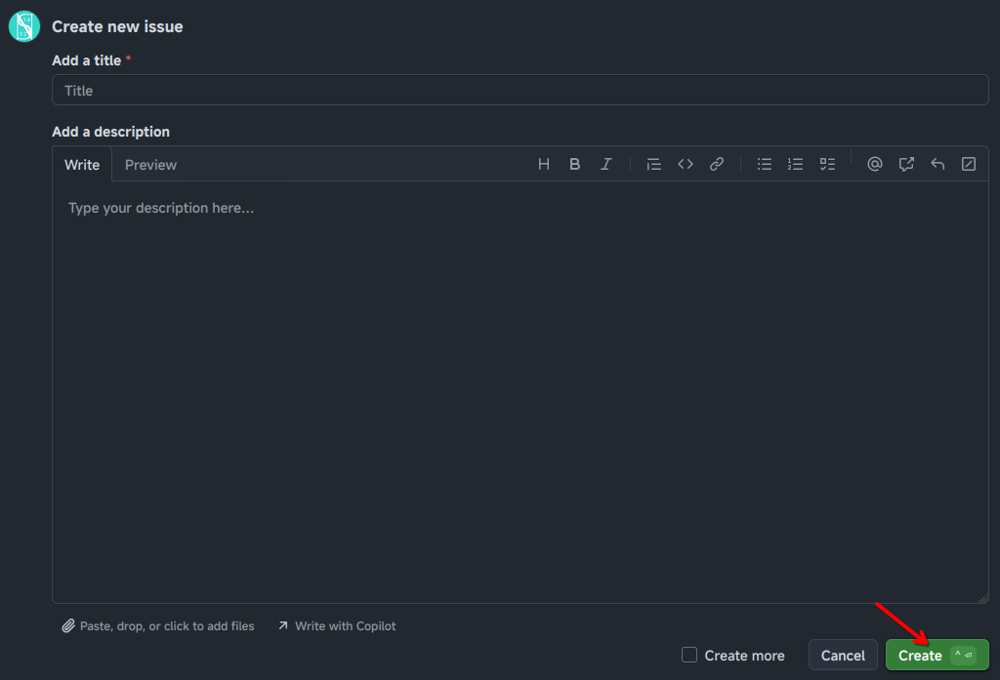

# Contribute

Since this Nobihaza Guide is open-source, you are completely welcome to contribute and change the website's content if you wish!

If you want to contribute to the guide, please do one of the following:

## Submit issues on GitHub

If you know how to use GitHub but don't want to code and just want to contribute error information, new bug fixes, or simply want to correct a mistake in my guide, you can:

* Create a [new Issue for nobihaza-guides on GitHub](https://github.com/Serena1432/nobihaza-guides/issues/new).
* Clearly write the title and description of the information you want to contribute.
* Finally, click the **Create** button.

## Create a Pull Request on GitHub

This is for those who want to edit the code directly without needing me.

* [Fork the current nobihaza-guides project into your account](https://github.com/Serena1432/nobihaza-guides/fork).
* Feel free to edit the project (configuration files, design, or guide content) in your own way.
* When you are ready, [create a new Pull Request to request merging your code into the official website](https://github.com/Serena1432/nobihaza-guides/compare).
* Wait for me to accept the request, and it will be successful. You may also be asked for some information if I don't fully understand, so please always check your notifications and emails from GitHub.

## Message directly

Or, more simply, you can send a message to me, or any Administrator in the community!

* [**Vietnamese Nobihaza Community Group**](https://www.facebook.com/groups/nobihazavietnam)
* [**NobiRE Community Discord Server**](https://discord.gg/QpMuX3gQ5u)
* [Contact Serena1432 directly](https://s1432.org/contact)