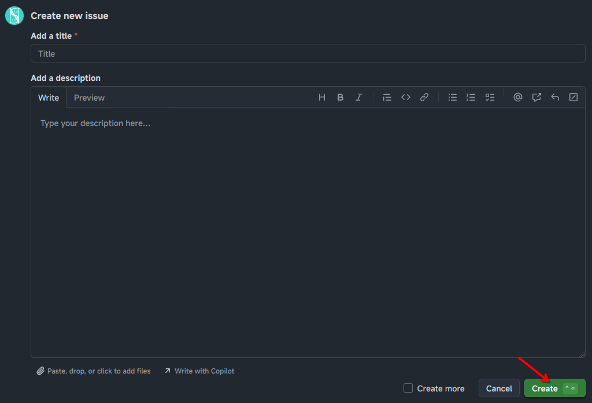

# Đóng góp

Nobihaza Guides này là một trang hướng dẫn mã nguồn mở, nên bạn hoàn toàn có thể đóng góp và thay đổi nội dung của website nếu muốn!

Nếu bạn muốn đóng góp vào hướng dẫn, hãy làm một trong các cách sau:

## Gửi issues trên GitHub

Nếu bạn biết sử dụng GitHub nhưng không muốn code và chỉ muốn đóng góp thông tin lỗi hoặc cách sửa lỗi mới, hoặc chỉ đơn giản là muốn sửa một lỗi sai trong hướng dẫn của mình, thì bạn có thể:

* Tạo một [Issue mới cho nobihaza-guides trên GitHub](https://github.com/Serena1432/nobihaza-guides/issues/new).
* Ghi rõ tiêu đề và mô tả thông tin bạn muốn đóng góp.
* Cuối cùng là nhấn vào nút **Create**.

## Tạo Pull Request trên GitHub

Cái này sẽ dành cho các bạn muốn sửa code trực tiếp mà không cần nhờ đến mình.

* [Fork dự án nobihaza-guides hiện tại vào tài khoản của bạn](https://github.com/Serena1432/nobihaza-guides/fork).
* Thoải mái chỉnh sửa dự án (các tệp tin cài đặt, thiết kế hoặc nội dung hướng dẫn) theo cách của bạn.
* Sau khi đã sẵn sàng, hãy [tạo Pull Request mới để yêu cầu nhập code của bạn vào website chính thức](https://github.com/Serena1432/nobihaza-guides/compare).
* Đợi cho mình chấp nhận yêu cầu là sẽ thành công. Bạn cũng sẽ có thể được hỏi một số thông tin nếu mình chưa hiểu kĩ, vì vậy nên hãy luôn kiểm tra phần thông báo và email từ GitHub.

## Nhắn tin trực tiếp

Hoặc có thể đơn giản hơn là bạn hãy nhắn tin cho mình, hoặc bất kì Quản trị viên nào trong cộng đồng!

* [**Nhóm Cộng đồng Nobihaza Việt Nam**](https://www.facebook.com/groups/nobihazavietnam)
* [**Máy chủ Discord NobiRE Community**](https://discord.gg/QpMuX3gQ5u)
* [Liên hệ trực tiếp với Serena1432](https://s1432.org/contact)