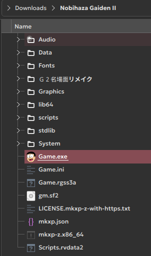
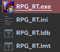
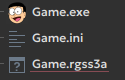
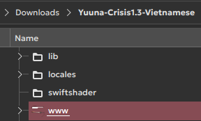
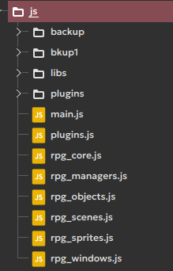

# Identifying RPG Maker games
{: .no_toc }

This guide will help you identify which engine the Nobihaza game you want to play was made with.

## Table of Contents
{: .no_toc }

1. TOC
{:toc}

## Access the game folder

First, access the game folder after you have unzipped it. The game folder will usually contain resource folders like `Audio`, `Pictures`, `System`, etc., and a file to run the game (for Windows games, it will have the `.exe` extension).

{: .note }
> Below are methods you can use to identify a game. You can choose one or more methods that you feel most comfortable with.

## RPG Maker 2000/2003

* It has an `RPG_RT` file as shown below, with the `RPG_RT.exe` file being the one to run the game.

* It has `.lmu` files, which are map data files.

* It has resource folders such as `Battle`, `CharSet`, `ChipSet`, `FaceSet`, etc.

## RPG Maker XP/VX/VX Ace

* It has a `Game.exe`, `Game.ini`, and another file corresponding to the respective engine:

| Filename | Engine |
| --- | --- |
| `Game.rgssad` | RPG Maker XP |
| `Game.rgss2a` | RPG Maker VX |
| `Game.rgss3a` | RPG Maker VX Ace |

{: .note }
> For unencrypted games, there might be a project file instead (although not all games have one).
>
> | Filename | Engine |
> | --- | --- |
> | `Game.rxproj` | RPG Maker XP |
> | `Game.rvproj` | RPG Maker VX |
> | `Game.rvproj2` | RPG Maker VX Ace |

* It has a `Data` folder with files having the following extensions:

| File extension | Engine |
| --- | --- |
| `.rxdata` | RPG Maker XP |
| `.rvdata` | RPG Maker VX |
| `.rvdata2` | RPG Maker VX Ace |

* It has a `System` folder with one of the following files:

| Filename | Engine |
| --- | --- |
| `RGSS1xx.dll` | RPG Maker XP |
| `RGSS2xx.dll` | RPG Maker VX |
| `RGSS3xx.dll` | RPG Maker VX Ace |

`xx` here can be any number.

## RPG Maker MV/MZ

* It has a `www` folder in the game directory. Some games may not use `www` and place the files directly in the game folder.

* It has an `index.html` file in the `www` folder (or the main game folder if not used).

* It has a `js` folder in the `www` folder (or the main game folder), and when you open it, there are `rpg` files with the `.js` extension:

