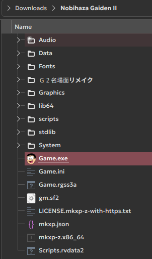
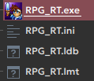
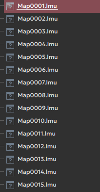
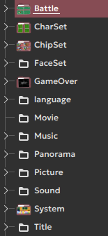
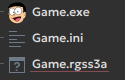
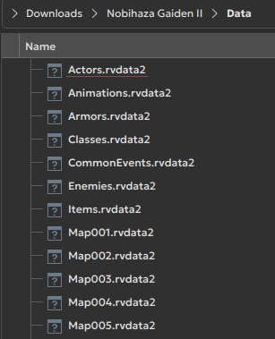
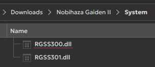
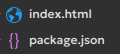
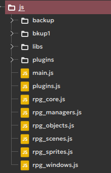

# Nhận diện game RPG Maker
{: .no_toc }

Đây sẽ là hướng dẫn để bạn nhận biết game Nobihaza bạn muốn chơi được làm bằng phần mềm làm game nào.

## Mục lục
{: .no_toc }

1. TOC
{:toc}

## Truy cập vào thư mục game

Đầu tiên là bạn hãy truy cập vào thư mục game sau khi đã giải nén. Thư mục game thường sẽ có các thư mục tài nguyên như `Audio`, `Pictures`, `System`, v.v, và một tệp tin để chạy game (đối với game dành cho Windows thì sẽ có đuôi `.exe`).

{: .note }
> Dưới đây là các cách có thể áp dụng để nhận diện một game. Bạn có thể chọn một hay nhiều cách mà bạn cảm thấy dễ chịu nhất.

## RPG Maker 2000/2003

* Có tệp tin `RPG_RT` như hình bên dưới, với tệp tin `RPG_RT.exe` sẽ là tệp tin để chạy game.

* Có các tệp tin `.lmu` là các tệp tin dữ liệu bản đồ.

* Có các thư mục tài nguyên là `Battle`, `CharSet`, `ChipSet`, `FaceSet`, v.v.

## RPG Maker XP/VX/VX Ace

* Có tệp tin `Game.exe`, `Game.ini` và một tệp tin khác ứng với phần mềm làm game tương ứng:

| Tên tệp tin | Phần mềm làm game |
| --- | --- |
| `Game.rgssad` | RPG Maker XP |
| `Game.rgss2a` | RPG Maker VX |
| `Game.rgss3a` | RPG Maker VX Ace |

{: .note }
> Đối với các game không được mã hóa thì có thể sẽ có tệp tin dự án thay vào đó (mặc dù không phải game nào cũng có).
>
> | Tên tệp tin | Phần mềm làm game |
> | --- | --- |
> | `Game.rxproj` | RPG Maker XP |
> | `Game.rvproj` | RPG Maker VX |
> | `Game.rvproj2` | RPG Maker VX Ace |

* Có thư mục `Data` với các tệp tin có đuôi sau:

| Đuôi tệp tin | Phần mềm làm game |
| --- | --- |
| `Game.rgssad` | RPG Maker XP |
| `Game.rgss2a` | RPG Maker VX |
| `Game.rgss3a` | RPG Maker VX Ace |

* Có thư mục `System` với một trong các tệp tin sau:

| Tên tệp tin | Phần mềm làm game |
| --- | --- |
| `RGSS1xx.dll` | RPG Maker XP |
| `RGSS2xx.dll` | RPG Maker VX |
| `RGSS3xx.dll` | RPG Maker VX Ace |

`xx` ở đây có thể là bất kì số nào.

## RPG Maker MV/MZ

* Có thư mục `www` ở thư mục game. Một số game có thể không dùng `www` mà cho thẳng vào thư mục game luôn.

* Có tệp `index.html` ở thư mục `www` (hoặc thư mục chính của game nếu không dùng).

* Có thư mục `js` ở thư mục `www` (hoặc thư mục chính của game), khi nhấn vào thì có các tệp tin `rpg` có đuôi là `.js`:

