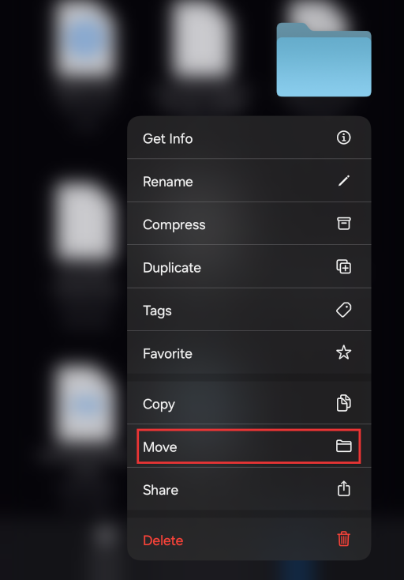

# Downloading and Running Games
{: .no_toc }

{: .important }
> Currently, only games made with RPG Maker 2000/2003 can be run on iOS. RPG Maker XP/VX/VX Ace/MV/MZ are not yet supported.

## Table of Contents
{: .no_toc }

1. TOC
{:toc}

## Downloading and extracting

* Go to the desired website and download the game version for Windows, or download the general game version (if no specific operating system is listed).

* Go to the iOS **Files** app and tap on the file you downloaded to extract it. If it asks for a password, enter the password mentioned on the website you used for the download.

* You will get a folder upon successful extraction. Please remember the path to that folder.

## RPG Maker 2000/2003 (EasyRPG + RetroArch)

* Open the **RetroArch** application for the first time if you have never opened it before.

* Go to the iOS **Files** app and navigate to the game folder you extracted earlier. Press and hold the game folder and select **Move**.

* Tap **On This iPhone**, click on the **RetroArch** application -> the **RetroArch** folder -> the **downloads** folder, then tap the **Move** button in the top right corner.

* Exit and go back to the **RetroArch** application.

* Tap the **Load Core** button and select **RPG Maker 2000/2003 (EasyRPG)**. After that, notice in the top left corner that it will display the word **EasyRPG**.

* Tap the **Load Content** button -> **Downloads** and select the game folder you moved earlier. Scroll down and select the **RPG_RT.ldb** file.

