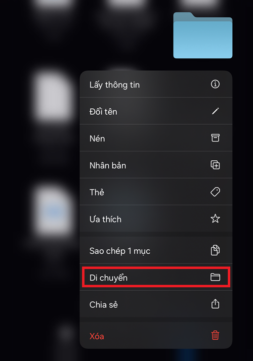
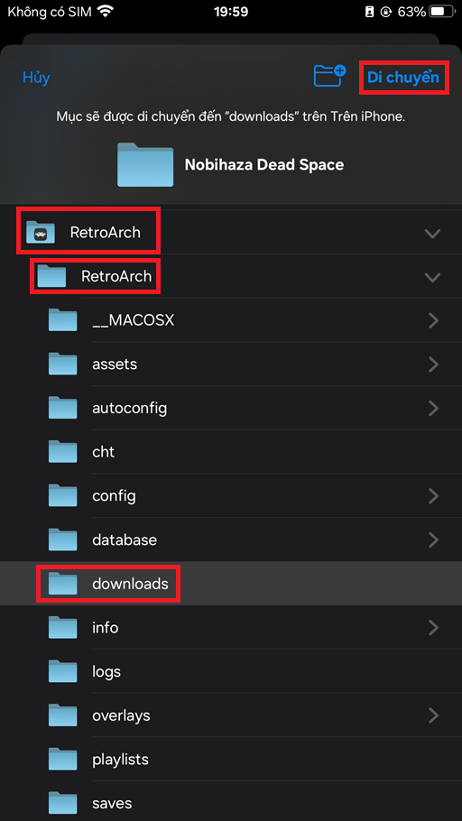
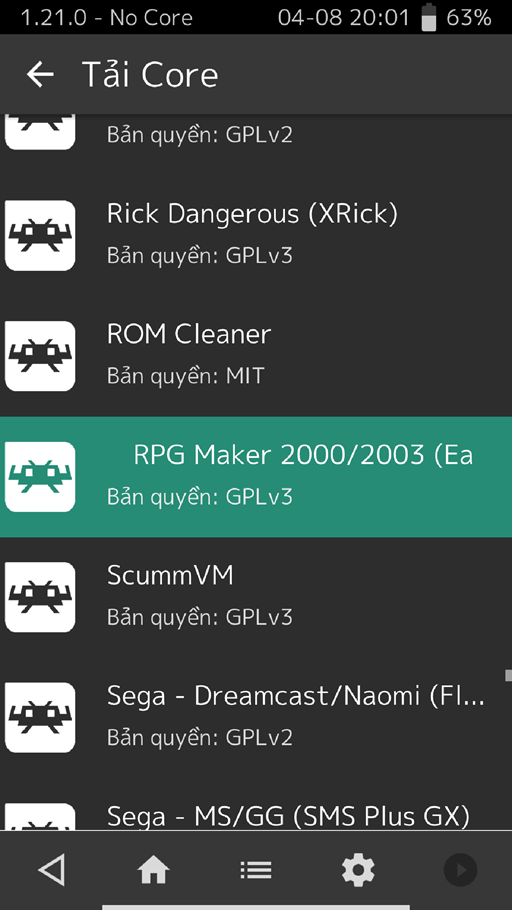
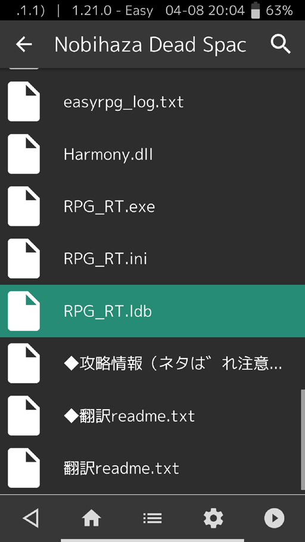

# Tải và chạy game
{: .no_toc }

{: .important }
> Hiện tại, chỉ có game được làm bằng RPG Maker 2000/2003 mới có thể chạy được trên iOS. RPG Maker XP/VX/VX Ace/MV/MZ vẫn chưa được hỗ trợ.

## Mục lục
{: .no_toc }

1. TOC
{:toc}

## Nhận diện game trên Nobihaza Vietnam Collection

Bạn có thể kiểm tra trước xem game nào chơi được trên điện thoại bằng cách kiểm tra thẻ của game đó trên Nobihaza Vietnam Collection.

Trọng khi đang xem một thông tin game, hãy kiểm tra xem game đó có ghi iOS trong mục **Hỗ trợ** không, và trong mục Thẻ có **easyrpg** không.

## Tải và giải nén

* Vào trang web bạn muốn và tải bản game dành cho Windows, hoặc tải bản game chung (không ghi rõ là hệ điều hành nào).

* Truy cập vào ứng dụng **Tệp** của iOS và nhấn vào tệp bạn đã tải xuống để giải nén nó. Nếu yêu cầu nhập mật khẩu, bạn hãy nhập mật khẩu được nhắc đến ở trang web bạn đã dùng để tải xuống.

* Bạn sẽ nhận được một thư mục khi đã giải nén thành công. Hãy ghi nhớ đường dẫn tới thư mục đó.

## RPG Maker 2000/2003 (EasyRPG + RetroArch)

* Mở ứng dụng **RetroArch** lần đầu tiên nếu như bạn chưa mở lần nào.

* Vào ứng dụng **Tệp** của iOS và di chuyển tới thư mục game bạn đã giải nén trước đó. Nhấn giữ vào thư mục game và chọn **Di chuyển**.

* Nhấn vào **Trên iPhone này**, chọn ứng dụng **RetroArch** -> thư mục **RetroArch** -> thư mục **downloads**, rồi nhấn nút **Di chuyển** ở góc trên bên phải.

* Thoát ra và quay trở lại ứng dụng **RetroArch**.

* Nhấn vào nút **Tải Core** và chọn **RPG Maker 2000/2003 (EasyRPG)**. Sau đó để ý góc trên bên trái thì sẽ thấy nó hiển thị chữ **EasyRPG**.

* Nhấn vào nút **Tải Content** -> **Mục Downloads** và chọn thư mục game bạn đã di chuyển trước đó. Kéo xuống và chọn tệp tin **RPG_RT.ldb**.

