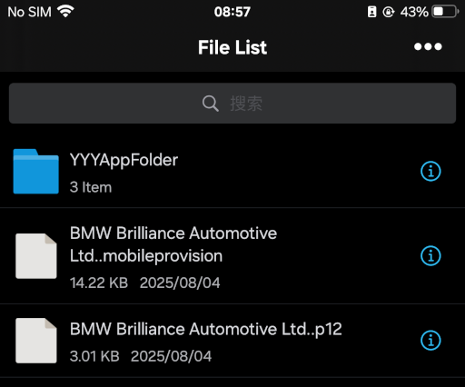

# Prerequisites
{: .no_toc }

Thank you, Apple, for making iOS the most difficult operating system for installing games, as well as the one that can play the fewest Nobihaza games among all operating systems.

{: .important }
> Currently, only **RPG Maker 2000/2003** games are supported. Other games will not run at all.

I will be using an iPhone 6s Plus with iOS 15.8.4 for this guide.

{: .important }
> The original RetroArch with EasyRPG is [available on the App Store](https://apps.apple.com/us/app/retroarch/id6499539433), and you can download it from there, skipping **all** the steps below.
>
> However, you still need to follow the guides below if you want to install external applications.

## Table of Contents
{: .no_toc }

1. TOC
{:toc}

## Allow third-party app installation

Because iOS is very restrictive about allowing the installation of third-party applications, you will need many steps to be able to allow it.

{: .important }
> With the exception of TrollStore and Jailbreaking, other methods will have a limited usage time until the certificate expires (usually 7 days), and the application will not be able to run afterward.
>
> If the application cannot run, come back here and start over from the beginning.

There are many different methods, and you should choose one of the methods below:

* No computer required:
    * [Using ESign](#using-esign)
* Computer required:
    * [Using AltStore](#using-altstore)
* Additional:
    * [Using TrollStore](#using-trollstore)
* DANGEROUS!
    * [For Jailbroken devices](#for-jailbroken-devices)

### Using ESign

#### Download the certificate file

{: .important }
> This method requires you to have Telegram installed and a Telegram account.

* Go to the [AppleP12 Telegram channel](https://t.me/AppleP12). Allow your browser to open the Telegram application if requested.

* Scroll down to the last message of the channel, and tap to download the certificate `.zip` file that is still in the green "Good" state.

{: .important }
> If there are no more certificates with a **Good** status (all are Revoked), you need to wait until a new certificate is available, or try the other installation methods below.

* Tap the share button in the top right corner of the screen and select **Save to Files**.

* Choose the save location as **On My iPhone** and tap the **Save** button.

* Return to the home screen and go into the **Files** app. Tap on **On My iPhone** and you will see the `.zip` file you just downloaded.

* Tap on that `.zip` file to extract it, and you will see a new folder with the same name as the `.zip` file.

* You can now delete the `.zip` file and prepare for the next step.

#### Download the ESign application

* [Download the ESign application `.ipa` file](https://nbhzvn.one/tools/ESign/ESign_5.0.2.ipa).

* After a successful download, go to the [AppTester online signing website](https://signer.apptesters.org). Since this website has a 200 MB limit, we will sign the ESign application so that we can install applications with a larger size.

* Tap the **Choose** button in the IPA section, tap **Choose File** and select the `ESign_5.0.2.ipa` file you downloaded earlier.

* Tap the **Choose** button in the MobileProvision section, tap **Choose File** and select the file with the `.mobileprovision` extension from the folder you extracted earlier.

* Tap the **Choose** button in the P12 section, tap **Choose File** and select the file with the `.p12` extension from the folder you extracted earlier.

* In the **Password** field, enter the password from the **Pass** section in the message on the Telegram channel, which is usually `AppleP12.com`.

* Tap the **Upload and Sign** button and wait for the website to finish processing. When the **Signing Complete** message appears, tap the **Install** button to install ESign.

* Tap the **Install** button in the installation prompt. Return to the home screen and you will see the **ESign** application.

* Go to iOS **Settings**, tap **General** -> **VPN & Device Management**. Tap on the item in the **Enterprise App** section.

* Tap the **Trust (some name)** button.

{: .note }
> For iOS 18 and later, you need to restart your device after tapping Trust.

#### Add the certificate to ESign

* Go to the **Settings** section of ESign and select **Import Resource**. Select the `.p12` and `.mobileprovision` files you downloaded earlier.

* Go to the **File** tab in the bottom left corner and you will see the `.p12` and `.mobileprovision` files you imported.

* Tap on the `.p12` file and select **Import Certificate Management** (the first option).

* You will be asked to enter the password for the `.p12` file, which is the password you entered when installing ESign in the step above.

* Do the same for the `.mobileprovision` file.

#### Install the application

* Go to the **Settings** section of ESign and select **Import Resource**. Select the `.ipa` file that you downloaded earlier.

* Go to the **Apps** tab in the bottom left corner and you will see the application you imported.

* Tap on that application and tap on the **Signature** option (the first option).

* Tap to select the **Install after signed** option. Then go to the **Select Certificate** section, tap on the certificate with the green **Good** status and tap OK.

* Tap the **Signature** button at the bottom and wait for the application signing process to complete.

* After that, a dialog box requesting installation will appear. Tap the **Install** button and wait for the installation process to complete.

* Return to the home screen. Two things can happen:
    * The application will be displayed with its own icon. At this point, you have succeeded.
    * The application will have no icon and will have a download button next to its name. Tapping on it will show a "Could not verify app integrity" message. At this point, you need to reinstall the application from the beginning.

### Using AltStore

I recommend using AltStore over Sideloadly because Sideloadly will have installation errors if the `.ipa` file contains paths that are too long.

{: .important }
> * This method requires a computer.
> * For Windows, you need to install [iTunes](https://www.apple.com/itunes/download/win64) and [iCloud](https://secure-appldnld.apple.com/windows/061-91601-20200323-974a39d0-41fc-4761-b571-318b7d9205ed/iCloudSetup.exe) before proceeding.

#### Install AltStore

* Go to the [AltStore app download website](https://altstore.io/#Downloads). Download the application for your operating system.

* Extract the downloaded `.zip` file and:
    * For Windows, run the `setup.exe` file in the extracted folder.
    * For macOS, an application named **AltServer** will appear in the same folder as the compressed file. Drag and drop it into the **Applications** section of Finder and run the application from the application list (Launchpad).

* Connect your phone to the computer via a USB cable. If a request to trust the computer appears on the phone, tap the **Trust** button.

* Click the **AltServer** icon in the Taskbar (or Menu Bar if you are using macOS) on your computer. Click on **Install AltStore** and select your phone's name.

* Enter your **Apple ID** username and password. You can use any Apple ID. Then click the **Install** button.

* Wait until the **AltStore** application appears on your phone. Tap on that application.

{: .important }
> If the **Untrusted Developer** message appears:
>
> * Go to iOS **Settings**, tap **General** -> **VPN & Device Management**. Tap on the item in the **Developer App** section.
> * Tap the **Trust (some name)** button.

* Tap **Allow** when AltStore requests access to the local network.

{: .important }
> Do not close the AltServer application on your computer during the application installation process below!

#### Install the application

* Go into the **AltStore** application and select the **My Apps** tab at the bottom. Tap the plus sign in the top right corner of the application.

* Select the `.ipa` file of the application you want to install.

* Enter your Apple ID and password if requested, and wait for the installation process to complete.

### Using TrollStore

You can use TrollStore if you want your application not to be affected by the certificate (not disabled after 7 days when the certificate expires).

{: .important }
> * Before you begin, do one of the methods above to allow iOS to install `.ipa` files first. When asked to select an `.ipa` file, select the TrollStore file you downloaded.
> * **This method only supports iOS from 14.0 beta 1 to 16.6.1.**
> * Some applications that require high security (like banking apps) may not work when TrollStore is installed.

You can [visit the guide by iOS CFW](https://ios.cfw.guide/installing-trollstore) for the most specific instructions.

If I have time, I will update this guide with proper instructions later on.

### For Jailbroken devices

{: .caution }
> Although jailbreaking can install any application without limits, but:
> * You will lose your phone's warranty **permanently**.
> * The phone's software may not work (stably) if you do not follow the instructions correctly.
> * Most applications that require high security (like banking apps) will not be able to run.
>
> This guide will only apply to devices that have been previously jailbroken. I will not provide instructions (you must find the instructions yourself), nor do I encourage jailbreaking unless the above methods do not work.
>
> I will **NOT** be responsible for your phone if it encounters problems during the jailbreaking process.

#### Install AppSync Unified

This library will help you install third-party applications via `.ipa` files.

* Go into the Package Manager you are using, and add the source `https://lukezgd.github.io/repo`.

* Search for **AppSync Unified** by Karen/Akemi and install it.

* Wait for the installation process to complete, then restart your phone and continue.

#### Install Filza File Manager

You can also install any file manager, but here I will use **Filza File Manager**.

* Add the BigBoss repository through the source `https://apt.thebigboss.org/repofiles/cydia`.

* Search for **Filza File Manager** by TIGI Software and install it.

* Wait for the installation process to complete.

#### Install the application

* Go to the phone's **Files** app, then press and hold the `.ipa` file you downloaded and tap the **Share** button.

* Scroll down and select the **Save to Filza** option. Then tap the **Save** button in the top right corner.

* Return to the home screen and go into the **Filza** app. The application will default to the `.ipa` file you transferred from the **Files** app.

* Tap on that `.ipa` file and tap the **Install** button.

* Wait for the installation process to complete. If a failed installation message appears, please check your AppSync Unified and Jailbreak system again.

# After you have finished, proceed to the [Downloading and Running Games](./installation) section
{: .no_toc }