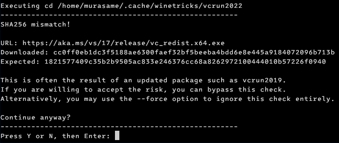

# Advanced setup
{: .no_toc }

If you don't like installing Flatpak and Bottles (like me, because Flatpak and Bottles take up too much disk space), you can also install games directly using your operating system's Wine instead of using supporting software.

This guide is for those who have some understanding of Linux and are familiar with using the command line. This is also the method I use when playing Nobihaza games.

{: .important }
> Before starting this guide, ensure you have installed Wine as described in [Prerequisites#Wine](./prerequisities#wine).
>
> Even if you use a custom Wine version, those versions still need some libraries from the system's Wine. If you skip this, it may cause errors.

{: .note }
> For convenience, you should run all commands in a single command-line window and not close that window before finishing the setup.
>
> When you restart the window, you will have to run the `export` commands again.

## Table of Contents
{: .no_toc }

1. TOC
{:toc}

## Initial Setup

### Choose a Wine version

#### wine-ge-proton version 8.26 by GloriousEggroll

I recommend using this version of Wine because it is more stable for gaming on Linux.

{: .tip }
> You can also skip this section and use your operating system's Wine version to save disk space.

* First, download wine-ge-proton version 8.26:

```sh
curl -L -OJ https://github.com/GloriousEggroll/wine-ge-custom/releases/download/GE-Proton8-26/wine-lutris-GE-Proton8-26-x86_64.tar.xz
```

* Extract the downloaded file:

```sh
tar -xf wine-lutris-GE-Proton8-26-x86_64.tar.xz
```

* Temporarily change the Wine version until the command-line window is closed. If you close the command-line window, you must run this command again when you reopen it:

```sh
export PATH="/home/$USER/lutris-GE-Proton8-26-x86_64/bin:$PATH"
```

#### System's default version

You don't need to do anything. By default, it will use the system's Wine (unless you actively change the PATH to a different Wine version).

#### Other Wine versions

If you want to choose a different Wine version according to your preference, you can go to that version's page and download it. Then, adjust the PATH variable to the `bin` folder of the Wine version you downloaded.

### Change Wine prefix

The default prefix when you don't change anything will be `/home/$USER/.wine`. However, if you want to change to a separate prefix to install Nobihaza games, you can change the prefix with the following command until the command-line window is closed. If you close the command-line window, you must run this command again when you reopen it:

{: .important }
> You should not place the WINEPREFIX on a partition with a format other than ext4 (e.g., NTFS) as it may cause errors!

```sh
export WINEPREFIX="/home/$USER/nobihaza" # Or any folder you want
```

### Install libraries with Winetricks

* First, install Winetricks according to the instructions for your distro. For example, on Arch Linux:

```sh
sudo pacman -S winetricks
```

* Then, install all necessary libraries into the WINEPREFIX:

```sh
winetricks corefonts dxvk vcrun2005 vcrun2008 vcrun2010 vcrun2012 vcrun2013 vcrun2022 dsound cjkfonts directmusic dmsynth gmdls dsdmo
```

You will need to manually interact with the installation windows.

{: .note }
> If you encounter a **SHA256 mismatch** error during installation, you can bypass it by pressing Y and then pressing Enter.
>
> This error occurs because Microsoft has changed the installer file, but Winetricks has not yet updated the checksum for that file, so it reports a code mismatch error.
>
> 

### Temporarily change the command-line window's region to Japan

You will have to run this command to temporarily change the region of the command-line window (as well as Wine) to Japan each time you restart the command-line window.

```sh
export LANG=ja_JP.SJIS; export LC_MESSAGES=ja_JP.SJIS; export LC_ALL=ja_JP
```

## Install RTPs

* Download the [Japanese RTP 2000](https://cdn.tkool.jp/updata/rtp/2000rtp.zip) and [Japanese RTP 2003](https://cdn.tkool.jp/updata/rtp/2003rtp.zip), then extract them in any way you prefer.

* Install the RPG Maker 2000/2003 RTPs first:

```sh
wine /path/to/RPG2000RTP.exe # Replace with the path to the RPG2000RTP.exe file
```

* Click the Next button (the one with the letter N) repeatedly until the installation completion message appears.

* Do the same for RPG Maker 2003:

```sh
wine /path/to/RPG2003RTP.exe # Replace with the path to the RPG2003RTP.exe file
```

* Download the Japanese RTP for:
    * [RPG Maker XP](https://cdn.tkool.jp/updata/rtp/xp_rtp103.zip)
    * [RPG Maker VX](https://cdn.tkool.jp/updata/rtp/vx_rtp202.zip)
    * [RPG Maker VX Ace](https://cdn.tkool.jp/updata/rtp/vxace_rtp100.zip)

* Download the English RTP for:
    * [RPG Maker XP](https://dl.komodo.jp/rpgmakerweb/run-time-packages/xp_rtp104e.exe)
    * [RPG Maker VX](https://dl.komodo.jp/rpgmakerweb/run-time-packages/vx_rtp102e.zip)
    * [RPG Maker VX Ace](https://dl.komodo.jp/rpgmakerweb/run-time-packages/RPGVXAce_RTP.zip)

* Then extract and run the `.exe` files via the `wine` command like the two files above.

{: .note }
> RPG Maker MV does not run through Wine, so there is no difference compared to the Prerequisites section.

## Download and Run Games

{: .note }
> For RPG Maker MV, go back to the [Downloading and Running Games#RPG Maker MV/MZ](./installation#rpg-maker-mvmz) section.

* To download, you just need to go to the website and download the game version. It could be a compressed file (`.zip`, `.rar`, `.7z`) or an `.exe` file (if it's the Windows version). Then extract the file in any way you choose.

* Use the `cd` command to access the game folder:

```sh
cd /path/to/game # Change to the Nobihaza game folder you want to play
```

* Then run the game with the `.exe` file (e.g., `RPG_RT.exe` for RPG Maker 2000/2003 games, or `Game.exe` for RPG Maker XP/VX/VX Ace games).

```sh
wine RPG_RT.exe # Or Game.exe or any other .exe file
```

All games will be run this way.

## Create a `.sh` file to quickly switch prefixes

If you don't want to use the `export` command every time you switch prefixes, you can create a script to quickly switch to the Nobihaza gaming setup:

* Open a text editor of your choice and copy the following lines:

```sh
#!/bin/bash
export PATH="/home/$USER/lutris-GE-Proton8-26-x86_64/bin:$PATH" # Omit this line if using the system's Wine version
export WINEPREFIX="/home/$USER/nobihaza" # Change to the WINEPREFIX you set during installation. Can be omitted if using the default prefix
export LANG=ja_JP.SJIS; export LC_MESSAGES=ja_JP.SJIS; export LC_ALL=ja_JP  # Mandatory when playing Japanese Nobihaza games
```

* Save it as any file, for example, `/home/$USER/nobihaza.sh`.

* Change the properties for `nobihaza.sh` to make it executable:

```sh
chmod +x /home/$USER/nobihaza.sh
```

* Now, every time you want to run the environment to play Nobihaza games, you can use the following command:

```sh
source /home/$USER/nobihaza.sh
```

## Create a shortcut to run the game from the desktop (or application list)

* Open a text editor of your choice, then copy the following lines:

```sh
#!/bin/bash
export PATH="/home/$USER/lutris-GE-Proton8-26-x86_64/bin:$PATH" # Omit this line if using the system's Wine version
export WINEPREFIX="/home/$USER/nobihaza" # Change to the WINEPREFIX you set during installation. Can be omitted if using the default prefix
export LANG=ja_JP.SJIS; export LC_MESSAGES=ja_JP.SJIS; export LC_ALL=ja_JP

cd "/path/to/game" # Change to your game folder
wine "RPG_RT.exe" # Change RPG_RT.exe to the name of the .exe file
```

* Save this file as a `.sh` file, for example, `/home/$USER/games/nobihaza2.sh`.

* Open a new window (`Ctrl + N`) in the text editor, then copy the following lines and edit them according to the template:

```ini
[Desktop Entry]
Name=Nobihaza 2
Exec=/home/$USER/games/nobihaza2.sh
Icon=/path/to/icon.png
Terminal=false
Type=Application
Categories=Gaming;
Path=
StartupNotify=false
```

| Element | Description |
| --- |  --- |
| Name | The name that will be displayed in the list (or on the desktop) |
| Exec | The path of the `.sh` file you just saved |
| Icon | The path of the image file containing the game icon if you want |

The remaining parts should be kept as they are and not deleted.

* Save this file as a `.desktop` file, for example, `/home/$USER/nobihaza2.desktop`.

* Change the properties of the two newly saved files to make them executable:

```sh
chmod +x /home/$USER/games/nobihaza2.sh
chmod +x /home/$USER/nobihaza2.desktop
```

* Copy the newly created `.desktop` file to:
    * The `/home/$USER/.local/share/applications` folder to display the game in the application list.
    * The `/home/$USER/Desktop` folder to display the game on the Desktop.

## Run games with the `.exe` file just like on Windows

{: .important }
> This method requires you to:
>
> * Use the system's default WINEPREFIX (`/home/$USER/.wine`).
> * Have already set the device's region to Japan through the settings according to the guide for your distro (not through the `export` command as it is only temporary). If you do not set this, you will not be able to play most Nobihaza games this way.

* Open a text editor of your choice and save the file below with a `.desktop` extension in the `/home/$USER/.local/share/applications` folder. For example, here it is `/home/$USER/.local/share/applications/wine.desktop`:

```ini
[Desktop Entry]
Name=Wine
Exec=/full/path/to/your/wine "%f"
Type=Application
MimeType=application/x-ms-dos-executable;
NoDisplay=true
```

* Replace `/full/path/to/your/wine` with the full path to the `wine` file in the `bin` folder of the Wine version of your choice.
    * If you choose the system's default Wine, it will usually be `/usr/bin/wine`.

* Change the properties for `wine.desktop` to make it executable:

```sh
chmod +x /home/$USER/.local/share/applications/wine.desktop
```

* Change the default application for `.exe` files to Wine:

```sh
xdg-mime default wine.desktop application/x-ms-dos-executable
```

* Use the command `xdg-mime query default application/x-ms-dos-executable` to check again. If it outputs `wine.desktop`, you can now run `.exe` files through the Wine version of your choice, just like running them on Windows.

## Force the use of the discrete GPU on a computer with 2 GPUs

If your machine has 2 or more discrete GPUs (especially with laptops), you can force the game to use the discrete GPU if your integrated GPU is not smooth.

* Use the following command to switch applications launched from the command line to the discrete GPU:

```sh
export DRI_PRIME=1
```

* If you use an NVIDIA GPU, you can also run this line:

```sh
export __NV_PRIME_RENDER_OFFLOAD=1; export __GLX_VENDOR_LIBRARY_NAME=nvidia
```

* Then proceed to run the game as usual.

{: .important }
> If you have created a `.sh` file for convenient game launching as I instructed in the sections above, you also need to add the `export` command above to those files.

## Use MangoHud to see FPS information and other game details

{: .important }
> MangoHud installed with Flatpak is different from MangoHud installed on the system! Even if you have installed the Flatpak version, you still need to install the system version using the method below.
>
> The Flatpak version of MangoHud can only run on Flatpak applications, and the same applies to the version installed on the system.

* Install `mangohud` using the instructions for your specific distro. For example, with Arch Linux:

```sh
sudo pacman -S mangohud
```

* Then, just put `mangohud` before the command you want to run. For example:

```sh
mangohud wine Game.exe
```

or:

```sh
mangohud /home/$USER/nobihaza2.sh
```

* Restart the game. You will see information about FPS, GPU usage, and more importantly, whether the game is running through DXVK or WineD3D.


{: .tip }
> You can also customize MangoHud's information to your liking according to the [official customization template](https://raw.githubusercontent.com/flightlessmango/MangoHud/master/data/MangoHud.conf).
>
> The customization file for MangoHud will be `/home/$USER/.config/MangoHud/MangoHud.conf`.