# Downloading and Running Games
{: .no_toc }

Almost no games officially support Linux (the only exception is **Doraemon: Nobita's Resident Evil 2 (Vietnamese)**).

## Table of Contents
{: .no_toc }

1. TOC
{:toc}

## Downloading the game

{: .important }
> If the game does not support Linux, you **must** download the version for the Windows 64-bit operating system and install it through Bottles (or NW.js if it's an RPG Maker MV game).

To download, you just need to go to the website and download the game version. It could be a compressed file (`.zip`, `.rar`, `.7z`) or an `.exe` file (if it's the Windows version).

## Extracting the game

* Open your compressed file with the decompression software of your choice; here I will choose KDE's **Ark**. Click the **Extract** button in the top left corner of the screen.

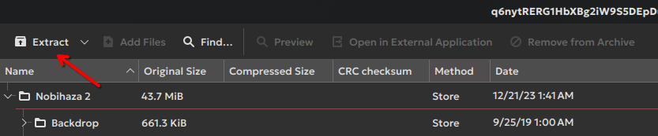

* A selection dialog will appear; choose the folder you want to extract to and then click **Extract**.

{: .tip }
> If you have selected a folder but cannot click the Extract button, enter a dot (.) in the **Name** field and then click the **Extract** button to extract to the selected folder.

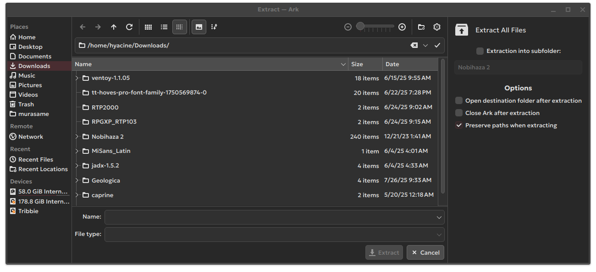

## RPG Maker 2000/2003

### Running with the `RPG_RT.exe` file

* Open the **Bottles** application and select the Bottle you installed in the Prerequisites section.

* Click on the **Add Shortcuts** section.

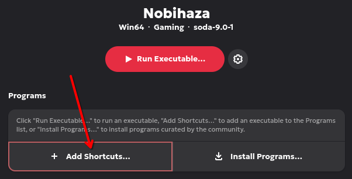

* Select the `RPG_RT.exe` file in the folder you extracted.

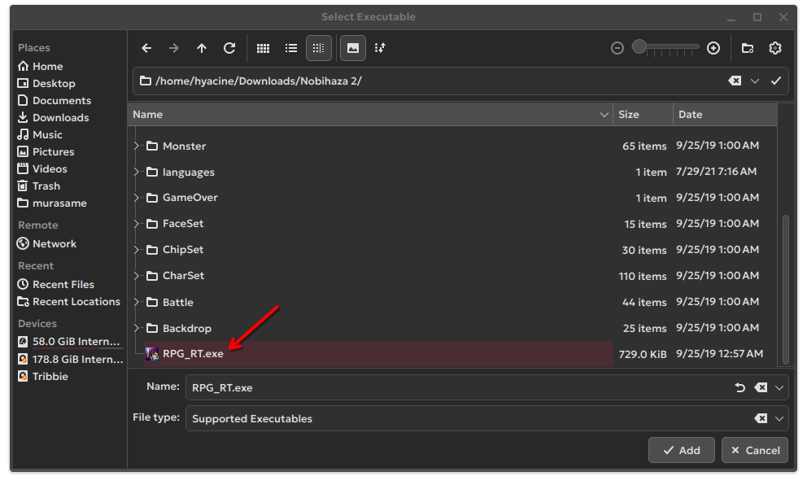

* A new item named `RPG_RT` will appear. Click the three dots on the right of that item and select **Rename**.

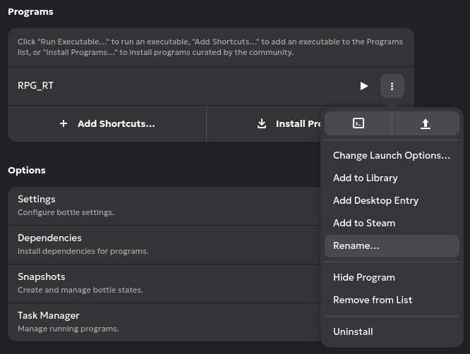

* Change the name `RPG_RT` to the name of the game or any name you choose and then click **Save**.

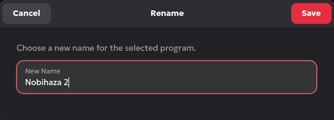

* Finally, click the button as shown in the image below to run the game.

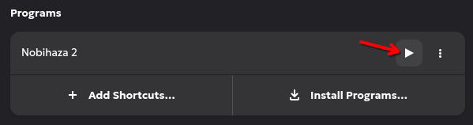

### Running with EasyRPG

* Re-open the extracted folder containing the `easyrpg-player` file that you worked with in the Prerequisites section.

* Copy that file and paste it into the game folder, or the parent folder containing your Nobihaza games. Then, double-click the `easyrpg-player` file and click **Execute** to run this file.

## RPG Maker VX/VX Ace

### Using the `Game.exe` file

Do the same as in the [**Running with the `RPG_RT.exe` file**](#running-with-the-rpg_rtexe-file) section for RPG Maker 2000/2003. However, instead of selecting `RPG_RT.exe`, you should select the `Game.exe` file instead.

### Using MKXP

{: .important }
> Very few games are compatible with MKXP, and for Linux, the compatibility is even lower. If you cannot run a game using MKXP, you need to go back to playing the game with the `Game.exe` file.

* Download [MKXP for Linux](https://nbhzvn.one/tools/MKXP/mkxp-z-linux.zip) and then extract the downloaded file.

* Copy all the files from the newly extracted folder (including the `mkxp-z.x86_64` file).

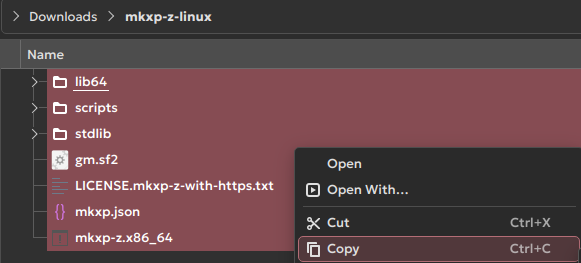

* Paste those files into the game folder and run the `mkxp-z.x86-64` file.

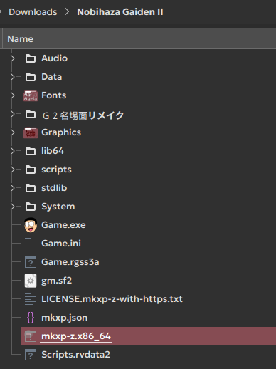

## RPG Maker MV/MZ

* Go to the `nwjs` folder you downloaded in the Prerequisites section and copy all the files from that folder.

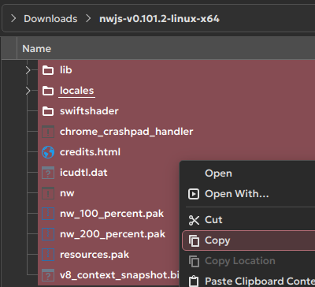

* Paste the copied files into the game folder and run the `nw` file.

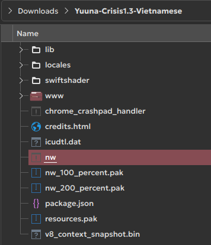

{: .tip }
> You can delete all the files and folders within, except for the `www` folder (or `audio`, `data`, `fonts`, `icon`, `img`, `js`, `movies`, and `save` if it's RPG Maker MZ), `index.html`, and `package.json` before pasting the files from the Linux version into the game folder.
>
> The files mentioned above cannot be used on Linux, so you can delete them to free up space.
>
> 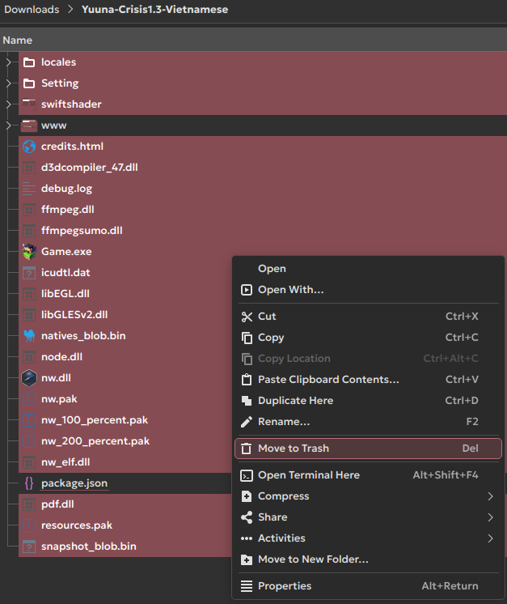

## Add the game to the desktop and application list

* First, grant shortcut creation permission to Bottles with the command:

```sh
flatpak override com.usebottles.bottles --user --filesystem=xdg-data/applications
```

* Click the Menu button next to the name of the game you want, and click **Add Desktop Entry**:

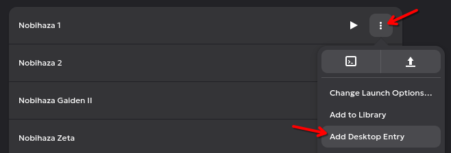

* The game will appear in the application list. To add it to the desktop, you just need to right-click and select **Add to Desktop**:

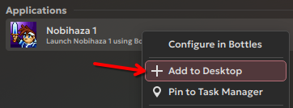

* You will see the game appear on the desktop.

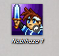