# Prerequisites
{: .no_toc }

Fortunately, installing Wine on Linux is **much** easier than on macOS, so the ability to play Nobihaza games on Linux is also higher than on macOS.

{: .important }
> Currently, only [**Doraemon: Nobita's Resident Evil 2 (Vietnamese Version)**](https://nobi2.s1432.org) officially supports Linux. You can download and play it right away without going through these complicated steps.
>
> Aside from that game, you will need support tools to be able to play other games:
> * **RPG Maker 2000/2003:** Use Wine or EasyRPG (which officially supports Linux).
> * **RPG Maker XP/VX/VX Ace:** Use Wine or MKXP (which officially supports Linux, but compatibility is very low).
> * **RPG Maker MV/MZ:** Use NW.js (most games will support running on Linux, except for a few games that will be listed below).

{: .important }
> **Not all Windows games can run on Linux**. If you encounter an error when running a game, there is no other way; you must contact the developer to request an official version for Linux (or go back to using Windows).

## Table of Contents
{: .no_toc }

1. TOC
{:toc}

## Initial setup

### Decompression software

{: .note }
> You should find specific installation instructions for your distro. Here, I will only provide a basic guide focusing mainly on Ubuntu and Arch Linux.

On Linux, there are some cases where you will need to install decompression software manually. If you cannot extract a certain file type, install the library for that file type.

#### Libraries

{: .caution }
> These libraries are **MANDATORY** to install, whether you use a decompression program with a GUI or not!

* Install the `zip` (for `.zip` files), `unrar` (for `.rar` files), and `p7zip-full` (for `.7z` compressed files) libraries:

##### Debian (or Ubuntu/Linux Mint)

```sh
sudo apt install zip unrar p7zip-full
```

##### Arch Linux (or EndeavourOS)

```sh
sudo pacman -S zip unrar p7zip
```

##### Fedora

```sh
sudo dnf install [https://download1.rpmfusion.org/free/fedora/rpmfusion-free-release-$(rpm](https://download1.rpmfusion.org/free/fedora/rpmfusion-free-release-$(rpm) -E %fedora).noarch.rpm
sudo dnf install zip unrar p7zip
```

##### openSUSE

```sh
sudo zypper install zip unrar p7zip
```

* After the installation is complete, you can now use commands in the Terminal to extract files. However, I will not provide specific instructions here; you can search on Google for how to extract the corresponding file types.

#### Decompression Software (GUI)

If you don't like using commands, you can install decompression software with a graphical user interface (GUI). I recommend using KDE's Ark software.

* If you are using a distro that comes with KDE Plasma, it is highly likely that Ark is already installed. In this case, you don't need to do anything else.

* However, if you don't have Ark, you can install it based on the instructions for your distro. For example, on Arch Linux:

```sh
sudo pacman -S ark
```

* The interface of Ark when opening a compressed file will look like this. At this point, you just need to click the **Extract** button to extract that file.

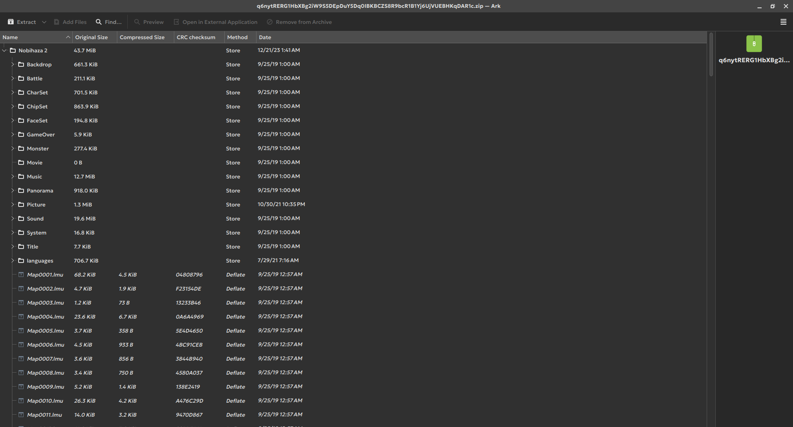

### Wine

**Wine** (an acronym for **Wine Is Not an Emulator**) is a compatibility layer for running Windows applications on other operating systems. We will use Wine to run most Nobihaza games on Linux.

{: .note }
> You should find specific installation instructions for your distro. Here, I will only provide a basic guide focusing mainly on Ubuntu and Arch Linux.

#### Debian (and its variants like Ubuntu or Linux Mint)

* Add support for 32-bit libraries:

```sh
sudo dpkg --add-architecture i386
```

* Add the WineHQ repository to `apt`:

```sh
sudo mkdir -pm755 /etc/apt/keyrings
sudo wget -O /etc/apt/keyrings/winehq-archive.key [https://dl.winehq.org/wine-builds/winehq.key](https://dl.winehq.org/wine-builds/winehq.key)
sudo wget -NP /etc/apt/sources.list.d/ [https://dl.winehq.org/wine-builds/ubuntu/dists/$(lsb_release](https://dl.winehq.org/wine-builds/ubuntu/dists/$(lsb_release) -sc)/winehq-$(lsb_release -sc).sources
```

* Update the `apt` repository again:

```sh
sudo apt update
```

* Finally, install the stable version of Wine:

```sh
sudo apt install --install-recommends winehq-stable
```

#### Arch Linux (and its variants like EndeavourOS or Manjaro Linux)

* Open the `/etc/pacman.conf` file with root privileges, then remove the `#` at the beginning of the following two lines:

```ini
#[multilib]
#Include = /etc/pacman.d/mirrorlist
```

to become:

```ini
[multilib]
Include = /etc/pacman.d/mirrorlist
```

as shown in the image below:

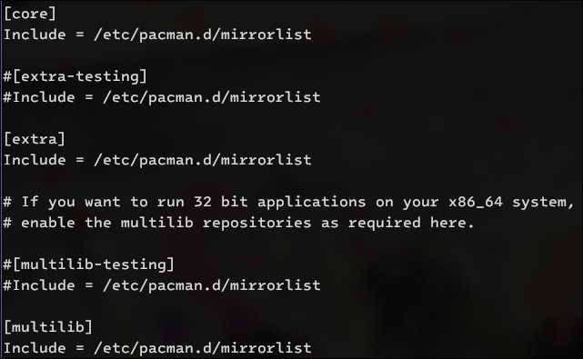

* Save the file and start installing Wine:

```sh
sudo pacman -Syu wine
```

#### Fedora

Fedora already has Wine in its repository, so you just need to install it.

```sh
sudo dnf install wine
```

#### openSUSE

* Add the Wine repository to Zypper:

```sh
sudo zypper addrepo [https://download.opensuse.org/repositories/Emulators:/Wine/openSUSE_Tumbleweed/Emulators:Wine.repo](https://download.opensuse.org/repositories/Emulators:/Wine/openSUSE_Tumbleweed/Emulators:Wine.repo)
```

* Refresh the repository:

```sh
sudo zypper refresh
```

* Proceed with installing Wine for openSUSE:

```sh
sudo zypper install wine
```

### Flatpak

{: .tip }
> If you have experience with Linux and do not want to install Flatpak with Bottles, you can go to the [Advanced Setup](advanced) section to install directly on the system without using supporting software.

Flatpak will be necessary to install Bottles and possibly some other applications later on.

* Go to the [Flatpak website](https://flatpak.org/setup) and select the distro you are using.

* Proceed to follow Flatpak's instructions for your distro. For example, here it is for Arch Linux:

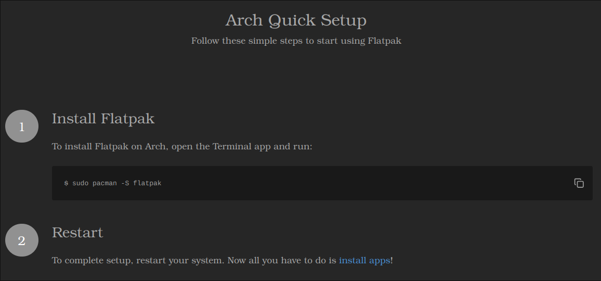

### Bottles

**Bottles** is a support application that will help you run games with Wine more easily.

* Install Bottles via Flatpak:

{: .tip }
> If your distro has a built-in app store that supports Flatpak (like KDE's Discover), you can install Bottles through that store instead of using the command line.

```sh
flatpak install com.usebottles.bottles
```

* Type `Y` and press Enter to agree to the installation of Bottles. You will need to do this step twice.

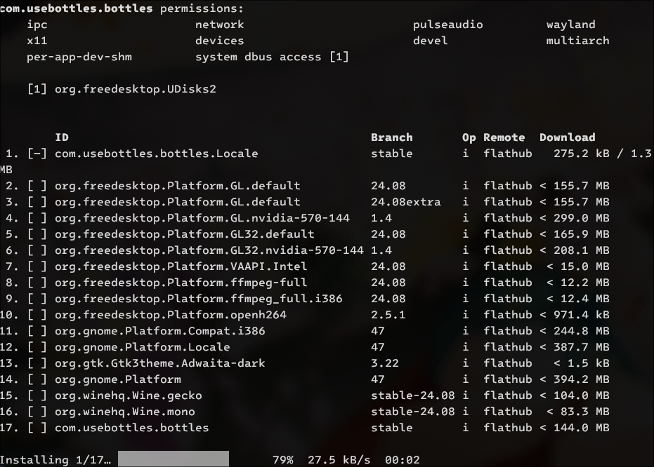

* After the installation is complete, run the Bottles software from your application list.

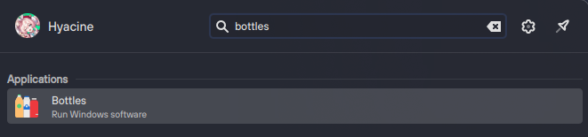

* Wait for the initial setup process to complete. Then click the plus sign in the top left corner to create a new Bottle.

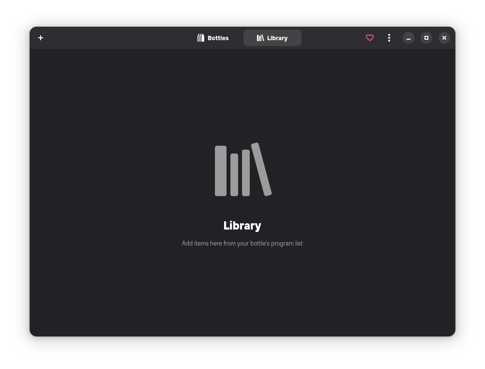

* Enter a name for the Bottle (Name) as you like (here it is **Nobihaza**) and select **Gaming** so the bottle will be optimized for games. We will keep the remaining information as is. Click the **Create** button to proceed with the creation.

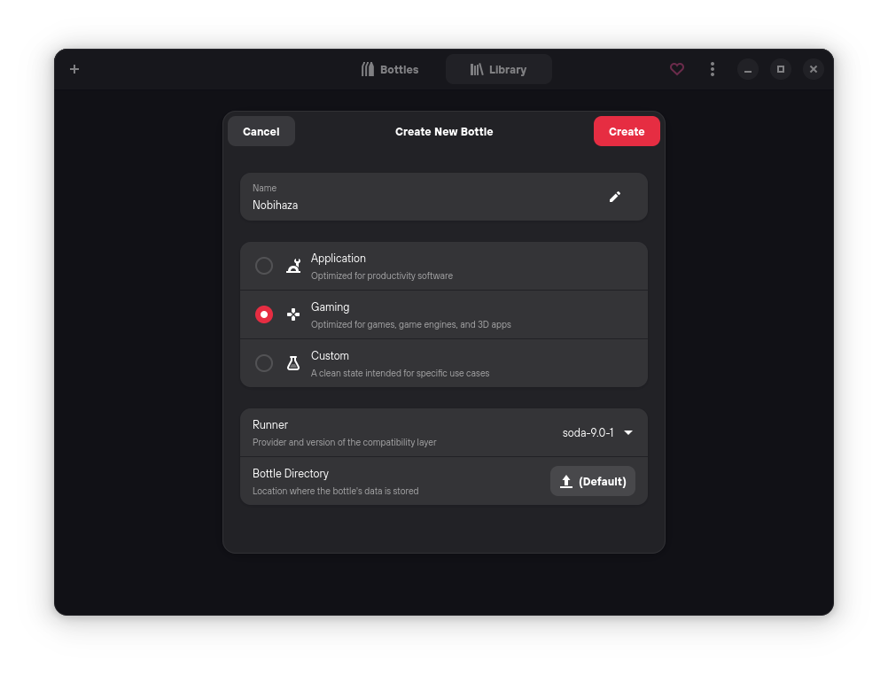

* Wait for Bottles to install the necessary libraries for the new bottle.

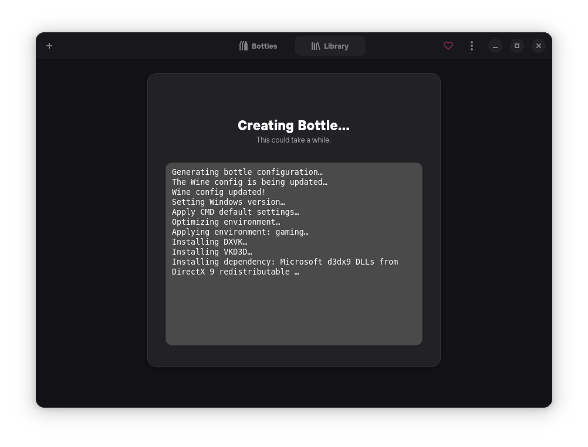

* Click **Close** when the **Bottle Created** message appears. Then switch to the **Bottles** tab and select the name of the Bottle you just created.

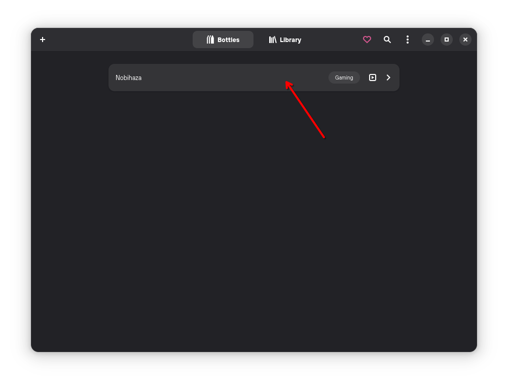

### Necessary libraries

Many games will need these libraries, so please install all of them if possible.

* Select the Bottle you created in the **Bottles** section of the Bottles application.

* Click on the **Dependencies** section.

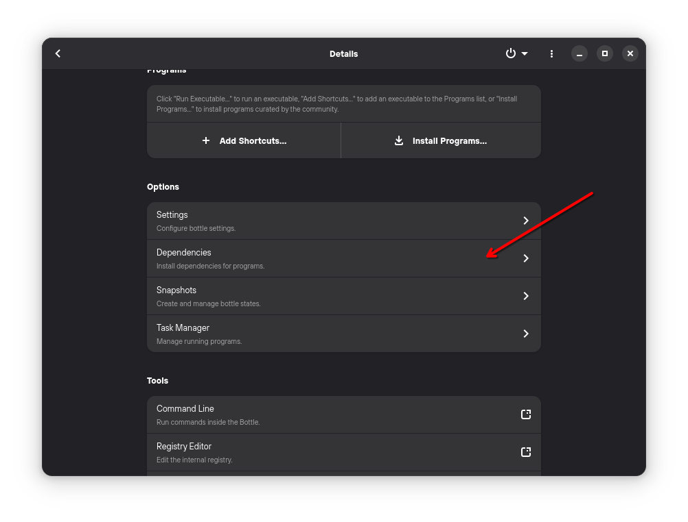

* Click the search button and search for the word `vcredist`. Then install the following libraries from the search results list below: `vcredist2005`, `vcredist2008`, `vcredist2010`, `vcredist2012`, `vcredist2013`, `vcredist2019`.

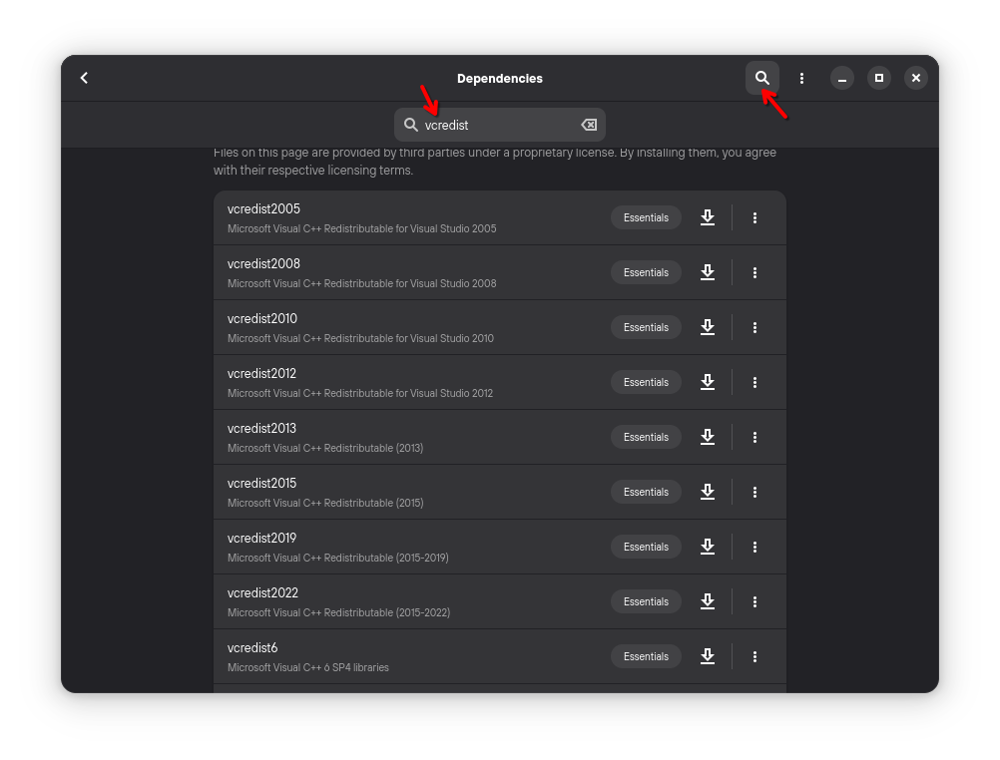

* Search for the word `dsound` and install it like the previous library.

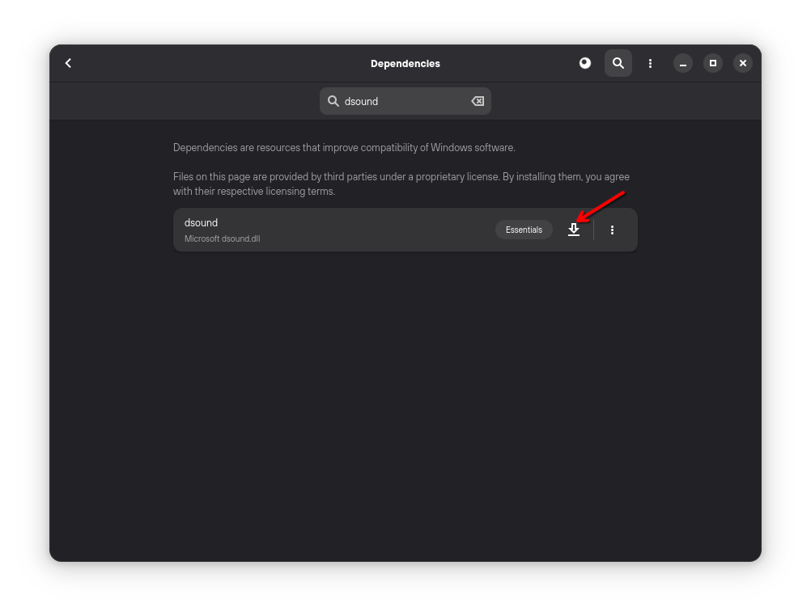

* Do the same for `cjkfonts`, `directmusic`, `dmsynth`, `gmdls`, and `dsdmo`.

### Change the Bottle's region to Japan

Most Nobihaza games are Japanese (or translated from Japanese), so you need to set the Bottle's region to Japan to avoid errors as much as possible.

* Select the Bottle you created in the **Bottles** section of the Bottles application.

* Click on the **Settings** section.

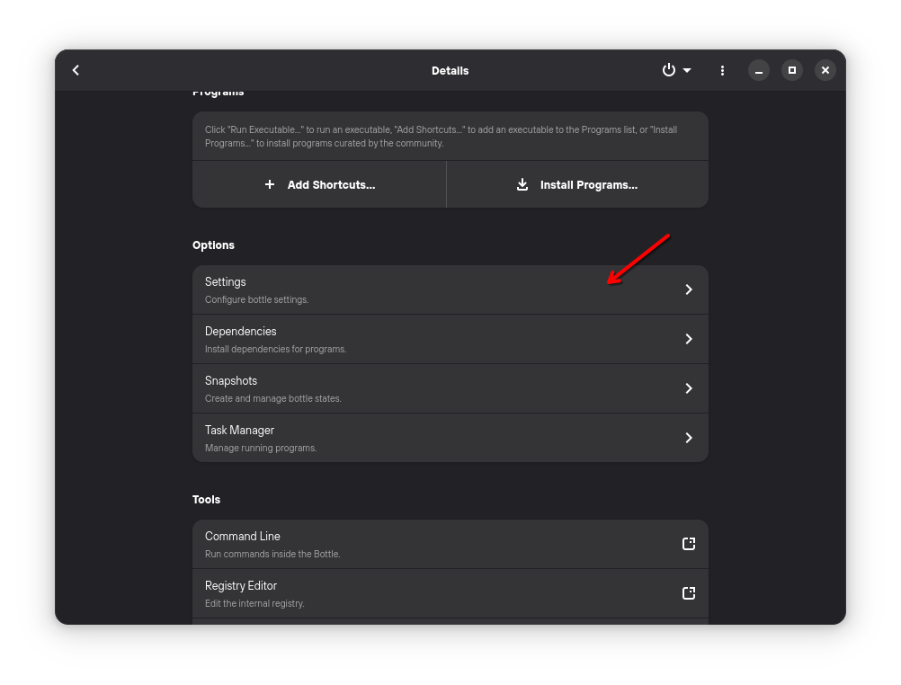

* Scroll down to the **Language** section and select **Japanese**.

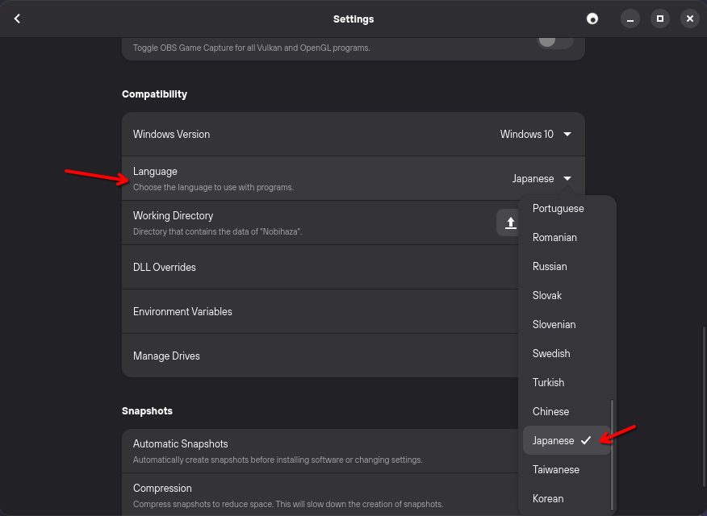

### Grant file access permission to Bottles

Since Bottles is running through Flatpak, Flatpak will initially prevent Bottles from accessing the user's other data and folders. At this point, you have two options:

#### Grant access to a specific folder containing Nobihaza games

{: .important }
> Games and libraries can only run in the folders that have been granted permission with the command below.

This is the best way to ensure security without touching other folders.

* Create a separate folder anywhere on your computer, and you will put all your Nobihaza games in this folder. For example, mine is `/home/hyacine/Nobihaza`.

* Open **Terminal** and type the following command:

```sh
sudo flatpak override com.usebottles.bottles --filesystem="/home/hyacine/Nobihaza"
```

* If no errors are printed, the permission granting process was successful.

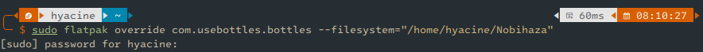

#### Grant access to the entire user folder

Doing this will give Bottles and the applications run through it access to your entire user folder.

* Open **Terminal** and type the following command:

```sh
sudo flatpak override com.usebottles.bottles --filesystem="/home/$USER"
```

* This way, Bottles will have full access to all folders in `/home/$USER`. For example, if your username is `hyacine`, it will be `/home/hyacine`, and you can then download games into any folder within `/home/hyacine`.

{: .tip }
> If you want to grant permission for games installed on a separate data partition, you can replace `/home/$USER` with the address of that partition.

## RPG Maker 2000/2003

### Japanese Runtime Package (RTP)

* Download the [Japanese RTP 2000](https://cdn.tkool.jp/updata/rtp/2000rtp.zip) and [Japanese RTP 2003](https://cdn.tkool.jp/updata/rtp/2003rtp.zip).

* Extract both the `2000rtp.zip` and `2003rtp.zip` files.

* Select the Bottle you created in the **Bottles** section of the Bottles application. Then click the **Run Executable** button at the top of the Bottles window.

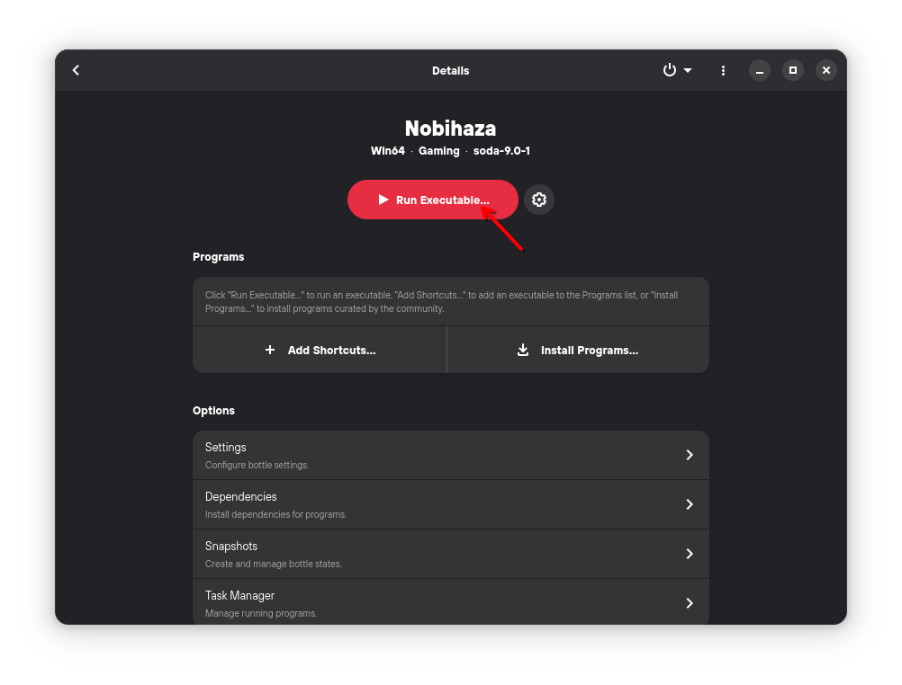

* Select the `RPG2000RTP.exe` file in the `RTPｾｯﾄｱｯﾌﾟ` folder you extracted earlier.

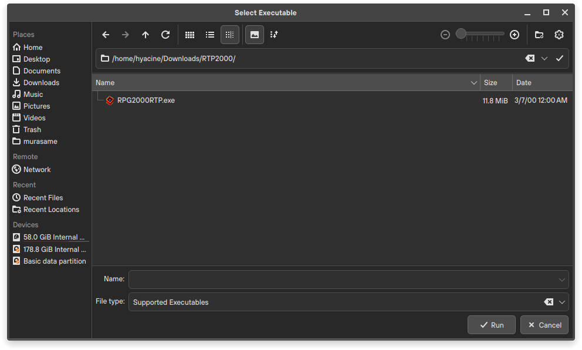

{: .tip }
> If you get an **Invalid name** error when running the `RPG2000RTP.exe` file, try moving that file to another folder that does not have special characters.

* Click the Next button (the one with the letter N) repeatedly and wait for the installation process to complete as shown in the image below.

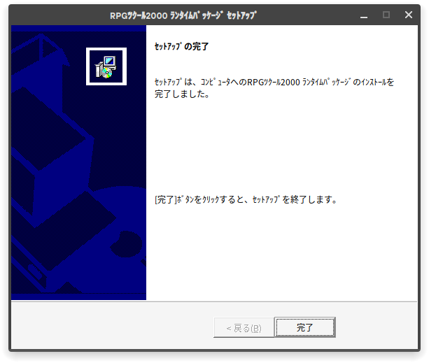

* Do the same for the `RPG2003RTP.exe` file in the `2003RTPｾｯﾄｱｯﾌﾟ` folder.

### English Runtime Package (RTP)

Some specific English Nobihaza games will also need this runtime package.

* Download the [English RTP 2000](https://dl.komodo.jp/rpgmakerweb/run-time-packages/rpg2000_rtp_installer.exe) and [English RTP 2003](https://dl.komodo.jp/rpgmakerweb/run-time-packages/rpg2003_rtp_installer.zip).

* The RTP 2000 is an `.exe` file so you don't need to extract it, but you will need to extract the RTP 2003. Then, proceed with the installation just like the Japanese version.

### EasyRPG

EasyRPG officially supports Linux, so you won't need to use Wine to install it.

* [Download the EasyRPG version for Linux](https://easyrpg.org/downloads/player/0.8.1.1/easyrpg-player-0.8.1.1-linux.tar.gz).

* Extract the downloaded `.tar.gz` file, and you will see a file named `easyrpg-player`.

* You can either:
    * Copy it into the game folder and run this application directly to play.
    * Copy it into the parent folder containing your Nobihaza games. When you run the `easyrpg-player` application, you will be able to choose which game to play each time you run it.

{: .tip }
> If you cannot run the `easyrpg-player` file, grant execute permission to this file, or run it through the Terminal.

## RPG Maker XP/VX/VX Ace

There are almost no Nobihaza games that run on RPG Maker XP, but you should still install it if you encounter a game that uses this engine. As for VX and VX Ace, there are many, so please install all of them fully.

### Japanese Runtime Package (RTP)

* Download the Japanese RTP for:
    * [RPG Maker XP](https://cdn.tkool.jp/updata/rtp/xp_rtp103.zip)
    * [RPG Maker VX](https://cdn.tkool.jp/updata/rtp/vx_rtp202.zip)
    * [RPG Maker VX Ace](https://cdn.tkool.jp/updata/rtp/vxace_rtp100.zip)

* Extract the downloaded files. You will get 3 folders containing the RTP installation files for the 3 engines.

* Click the **Run Executable** button and select the `Setup.exe` file in the `RPGXP_RTP103` folder.

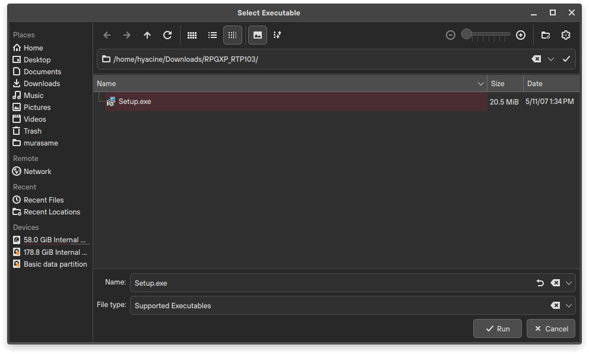

* Click Next (the first button with the letter N), until you see this screen, which means the installation was successful.

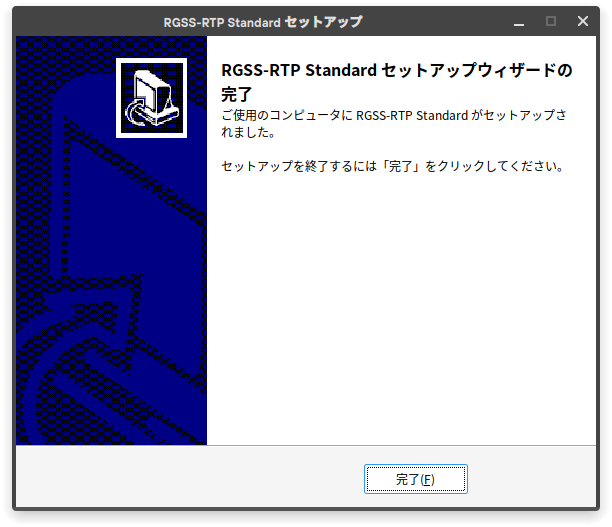

#### RPG Maker VX

After clicking the **Run Executable** button, select the `Setup.exe` file in the `RPGVX_RTP202` folder and do the same as for RPG Maker XP.

#### RPG Maker VX Ace

After clicking the **Run Executable** button, select the `Setup.exe` file in the `RPGVXAce_RTP100` folder and do the same as for the two engines above.

### English Runtime Package (RTP)

* Download the English RTP for:
    * [RPG Maker XP](https://dl.komodo.jp/rpgmakerweb/run-time-packages/xp_rtp104e.exe)
    * [RPG Maker VX](https://dl.komodo.jp/rpgmakerweb/run-time-packages/vx_rtp102e.zip)
    * [RPG Maker VX Ace](https://dl.komodo.jp/rpgmakerweb/run-time-packages/RPGVXAce_RTP.zip)

* Then extract and install similarly to the Japanese RTP.

## RPG Maker MV

{: .important }
> Some games **cannot** be run on Linux if you do not modify the game's data (requires knowledge of JavaScript programming) because these games use Windows-only libraries. See more in the [Support Status](../../status) section.

For Linux, downloading NW.js is mandatory.

* Go to the [NW.js download page](https://nwjs.io/downloads).

* Select the **NORMAL** version for your version of Linux (32-bit or 64-bit).

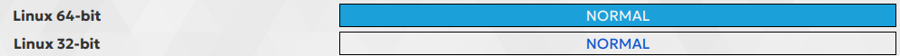

# After you have finished, proceed to the [Downloading and Running Games](./installation) section
{: .no_toc }