# Troubleshooting and Tips
{: .no_toc }

Below is a guide to fixing errors when playing Nobihaza games, along with tips for a better gaming experience on Linux.

{: .important }
> If the game still has errors after you have applied the methods below, it is highly likely that the game cannot be played (stably) on Linux, and you have no other choice but to wait for the developer to release an official version.

## Table of Contents
{: .no_toc}

1. TOC
{:toc}

## General

This section applies to all games, regardless of the engine it was made with.

### Nothing happens when running a game or installing an RTP

This is the most common error when running through Flatpak. First, close all Bottles windows, then use the following command to run Bottles through the command-line interface:

```sh
flatpak run com.usebottles.bottles
```

Then, run the game again and return to the command-line window; the error information will now be displayed. I am aware of the three cases below:

#### Error `c0000135` accompanied by `Permission denied`

You have not granted folder access permission to Bottles, and you can use the following command to grant permission:

```sh
sudo flatpak override com.usebottles.bottles --filesystem="/path/to/game" # Replace /path/to/game with the game folder
```

Alternatively, you can grant permission to a common folder containing all your Nobihaza games, for example:

```sh
sudo flatpak override com.usebottles.bottles --filesystem="/home/hyacine/Nobihaza" # Replace /home/hyacine/Nobihaza with your folder
```

#### Error `Failed to open fsync shared memory file`

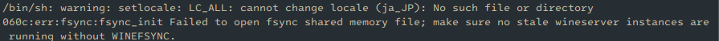

In the Bottle management window of the Bottles application, click the power button in the top right corner of the window as shown in the image and click the **Shutdown** button:

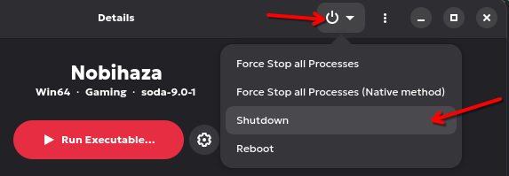

{: .note }
> This **Shutdown** button only completely shuts down the running Wine environment, not your computer, so you can rest assured.

Then restart the game.

### Cannot save game progress

This applies to both basic cases: the game reports an error when saving, and the game does not display the saved file upon restarting.

* Ensure you have [granted file access permission to Bottles](./prerequisities#grant-file-access-permission-to-bottles).

* Ensure the game's path does not contain any special characters (see the [`File corrupted! Please run a virus check / No game scripts specified`](#file-corrupted-please-run-a-virus-check--no-game-scripts-specified) section).

* Ensure you do not place the game folder in a folder/drive that cannot be written to (e.g., an SD card with write protection enabled, a drive/folder for which you do not have write permissions, or a drive with file writing errors). The best way is to try creating any file in the game folder to test its write capability, see if any error messages or permission requests appear. If not, try moving it to a different drive.

* The game will not run stably if you place the game folder in a cloud storage drive (some software like TeraBox, Google Drive, or OneDrive will display your cloud storage as a hard drive).

### Game lags despite using a high-spec computer

#### For Bottles

Bottles already installed DXVK when you first created the Bottle in the Prerequisites section, so this case is less likely to happen. However, if the Bottle still doesn't have DXVK:

* Go to the main screen of Bottles (the part where you select Bottles, including the Bottle you just created in the Prerequisites section). Then click the three dots in the top right corner and select **Preferences** (or press `Ctrl + ,` (comma)).

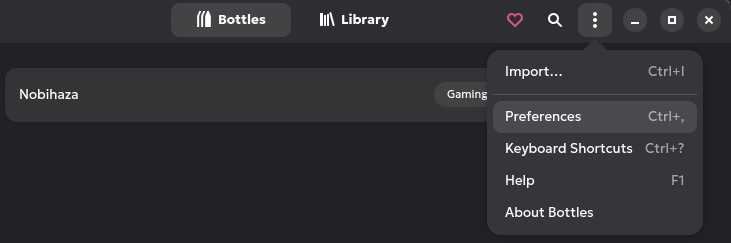

* A new window will appear; click on the **DLL Components** tab. The DXVK section will appear first; download the latest version (usually the very first item) by clicking the button as shown in the image below.

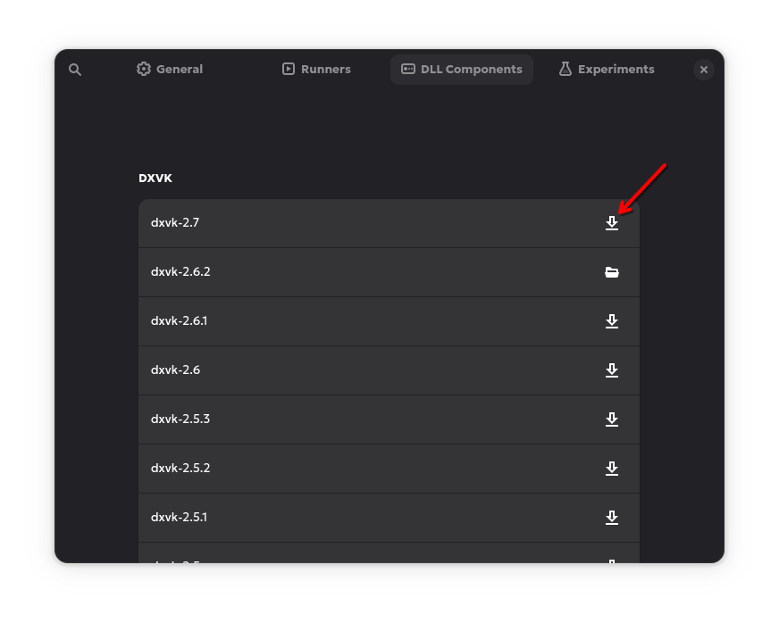

* After the download is complete, the DXVK item you just selected will display a delete icon and a folder icon as shown in the image below. Close the Preferences window.

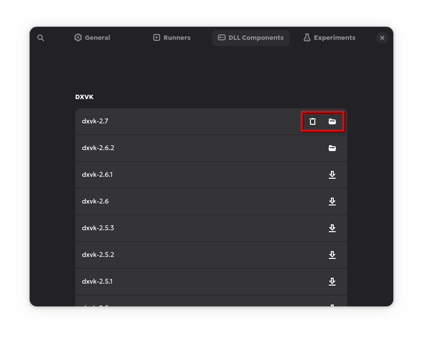

* Select the Bottle you created in the Prerequisites section again, then click on the **Settings** section.

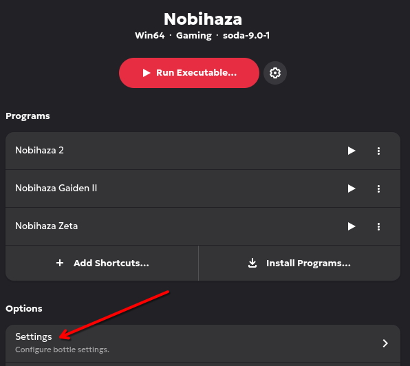

* Click on the DXVK section and select the first DXVK item in the selection panel. Now, Bottles will use the latest version of DXVK for Nobihaza games.

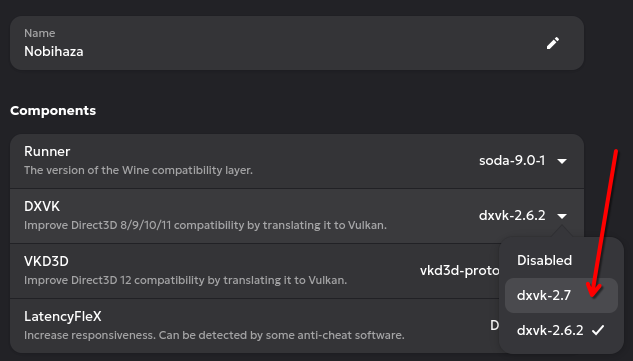

##### For computers with 2 graphics cards (especially laptops)

For computers with 2 graphics cards, you need to make games prioritize using the discrete graphics card (NVIDIA/AMD/Intel ARC).

* In the **Settings** section of the Bottle in the Bottles application, turn on the **Discrete Graphics** option.

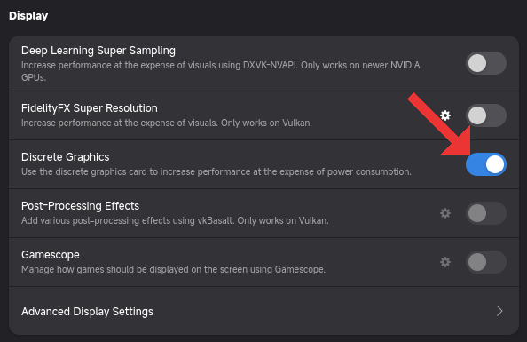

* Then run the game and run the command `nvidia-smi` (for NVIDIA GPUs) or `amdgpu_top` (for AMD GPUs). If you see the game in the process list, it means the game is running on the discrete graphics card.

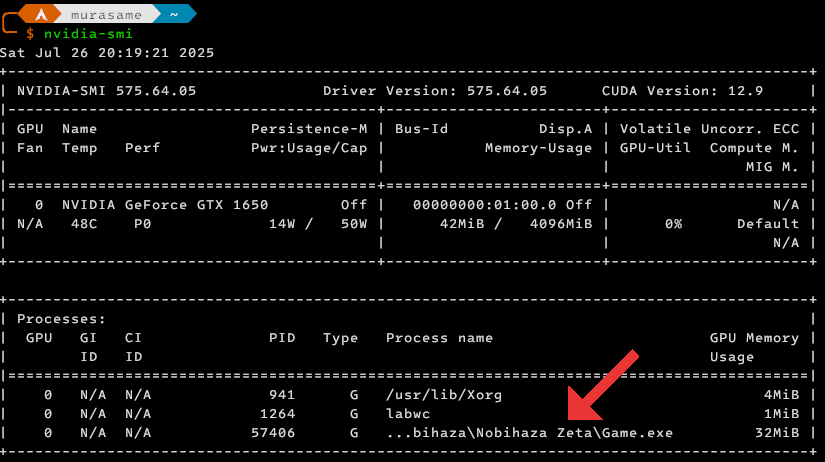

#### Other

If you are running the game not through Bottles, or have tried reinstalling DXVK and it didn't work:

* You should plug in the charger during gameplay.

* Close any running applications, including background apps. Most Desktop Environments will have a taskbar/menu bar, and background apps will be displayed there.

* You should also update both your drivers and your operating system version. Refer to the specific guide for your distro for more information.

If the game still lags after trying all the above methods:

* The game may not be running stably on Linux. You need to contact the developer (if possible) to optimize it for Linux.
    * Good luck with that, as most current Nobihaza game developers do not use Linux. This may change in the future, but for now, it is still very rare.

* It's also possible that your computer is not as high-spec as you think. There are cases of scams selling low-spec computers at high prices; I just hope you don't encounter that. In this case, there is no other way; you must upgrade or switch to a new computer.

### Game has square box/strange character display errors, or the font displays very poorly

* See [Prerequisites#Change the Bottle's region to Japan](./prerequisities#change-the-bottles-region-to-japan) and [Prerequisites#Necessary Libraries](./prerequisities#necessary-libraries).

#### For .ttf and .otf files

* Check if there are any font files (ending in `.ttf`, `.otf`) in the game folder. If so, copy all those font files into the `~/.local/share/fonts` folder:

```sh
# Replace ~/thumucgame with the path to your game folder
find ~/thumucgame -type f \( -iname "*.ttf" -o -iname "*.otf" \) -exec cp {} ~/.local/share/fonts/ \;
fc-cache -f ~/.local/share/fonts
```

Alternatively, you can open the `/home/$USER/.local/share/fonts` folder in your file manager and manually copy the `.ttf` and `.otf` files into that folder.

{: .note }
> Absolutely do not convert `.fon` files to `.ttf` or `.otf`, as it can cause display errors, and in most cases will **violate the Terms of Use** of the font itself.

#### For .fon files

* In the Bottle's interface in the Bottles application, click the Menu button in the top right corner and select **Browse Files**.

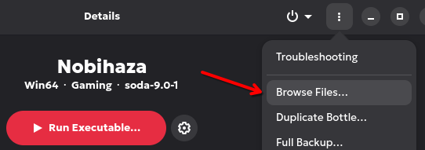

* The Bottles prefix folder will open; go to the `windows/Fonts` folder and copy all `.fon` files from the game folder into this `Fonts` folder.

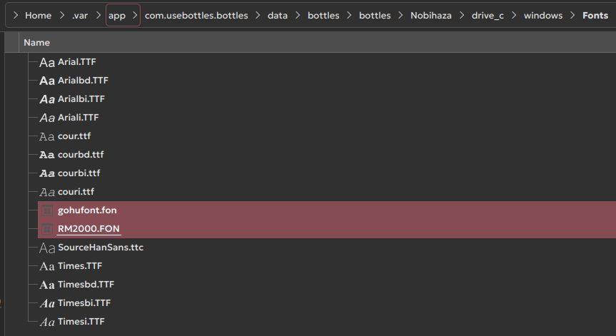

* Go back to the Bottles application, scroll down, and click **Command Line**.

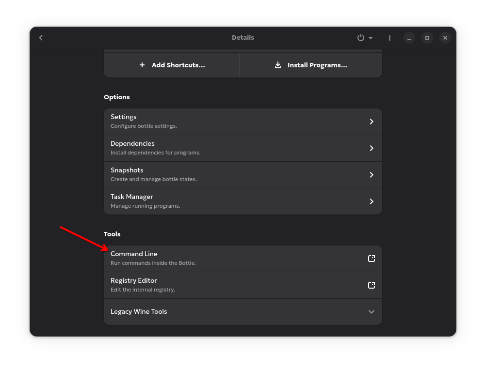

* Enter the following line into the newly opened Command Prompt window, where `RM2000` is the name of the font (usually the filename without the `.fon` extension), and `RM2000.fon` is the filename:

```bat
reg add "HKLM\Software\Microsoft\Windows NT\CurrentVersion\Fonts" /v "RM2000" /d "RM2000.fon"
```

* Press Enter and you will see the line `reg: 操作は正常に完了しました` (`reg: The operation completed successfully`).

{: .tip }
> Some machines may not be able to use the Command Line. In this case, you can click on **Explorer** in the Bottles window, then navigate to the path `C:\Windows\System32` and run the `cmd.exe` file to open Command Prompt.
>
> 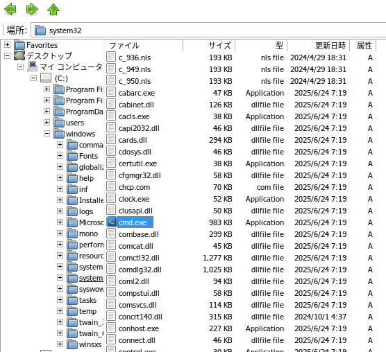

## "No remote refs found" error when installing Bottles via Flatpak

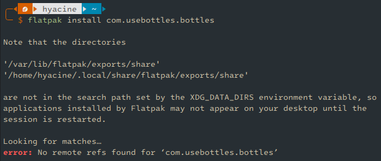

This error occurs because you have not added any application repositories to Flatpak, which often happens after installation.

Use the following command to add the Flathub application repository to Flatpak:

```sh
flatpak remote-add --if-not-exists flathub [https://dl.flathub.org/repo/flathub.flatpakrepo](https://dl.flathub.org/repo/flathub.flatpakrepo)
```

## `IKernel.exe 0x1200` error when installing RPG Maker 2000/2003 RTP

This error occurs due to a library conflict when you install **Visual C++ Redistributable** (vcredist). You can only choose one of the three libraries below, but if you accidentally install all three, a conflict will occur (because you installed three 2015 versions).

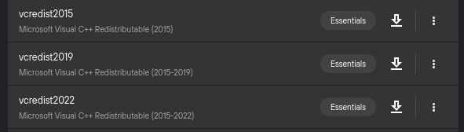

At this point, try uninstalling the other two, keeping only the 2019 version as I instructed in the Prerequisites section. However, if it still doesn't work, you need to delete that Bottle and create a new one, then install everything again from the beginning.

## RPG Maker 2000/2003 (`RPG_RT.exe`)

### `XXXX 乗り物 は開けません` (Cannot open file XXXX) / `???????????????????` (a bunch of question marks)

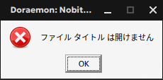

* See [Prerequisites#Change the Bottle's region to Japan](./prerequisities#change-the-bottles-region-to-japan).

* It could also be that the file is genuinely not in the game folder. Re-extract it into the game folder and try again.

{: .note }
> There is a rare case where the translator compressed the game on a computer that was not set to the Japanese region, and after compression, the names of the resource files become corrupted and contain meaningless characters (also known as Mojibake).
>
> This error will also prevent the game from finding the resource file. You can see more details about this error [here](../../miscellaneous/mojibake).

### `RPGツクール2000/2003のランタイムパッケージがセットアップされていません。` (The RPG Maker 2000/2003 Runtime Package is not installed)

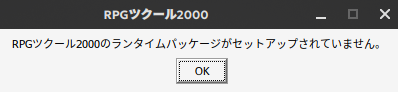

See [Prerequisites#RPG Maker 2000/2003](./prerequisities#rpg-maker-20002003).

### Error related to `RPG_RT.lmt`

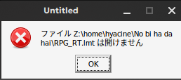

If the path in the message contains question marks (`?`), then your game folder path contains special characters (including special). See which folder(s) in the path contain the `?` and remove **all** special characters in that folder.

## RPG Maker 2000/2003 (EasyRPG)

See the [EasyRPG](../../miscellaneous/easyrpg) section.

## RPG Maker XP/VX/VX Ace

### RPGVX/RPGVXAce RTP is required to run this game

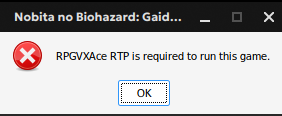

See [Prerequisites#RPG Maker XP/VX/VX Ace](./prerequisities#rpg-maker-xpvxvx-ace).

### RGSS202E.dll/RGSS202J.dll/RGSS300.dll/RGSS301.dll could not be found

* [Reinstall the entire RPG Maker VX Ace runtime package (RTP)](./prerequisities#rpg-maker-xpvxvx-ace).

* If reinstalling it doesn't work, you can also [download those .dll files directly](https://drive.google.com/file/d/1QTGjntOWisoUzk3NTfSBfk0bT2fNYBKc/view) and extract them into the game's `System` folder.

### File corrupted! Please run a virus check / No game scripts specified

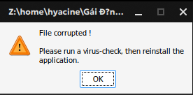

The title bar of the error message will show the path of the corrupted file.

* If the path in the message contains question marks (`?`), then your game folder path contains special characters (including special). See which folder(s) in the path contain the `?` and remove **all** special characters from that folder.

* The file may also have been corrupted during the extraction process; try re-extracting the game's compressed file.

### Unable to find VL Gothic font

* Download the font file for VL Gothic [here](https://github.com/ovate/VL-Gothic-font/raw/refs/heads/main/fonts.zip).

* Extract this file and go into the extracted `fonts` folder. You will see 2 files: `VL-Gothic-Regular.ttf` and `VL-PGothic-Regular.ttf`.

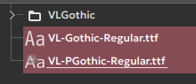

* Copy these two files into the `/home/$USER/.local/share/fonts` folder (replace `$USER` with your username).

### Script error

There is no other way; you must contact the developer to fix this error.

### Failed to load script

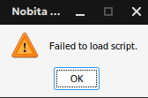

You have accidentally deleted the `Game.rgss3a` file or the `Data` folder of the game. Re-extract the game from its compressed file and try again.

### Unable to find file / No such file or directory

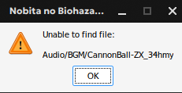

The fix is the same as for the [`XXXX 乗り物 は開けません` (Cannot open file XXXX) / `???????????????????` (a bunch of question marks) of RPG Maker 2000/2003](#xxxx-乗り物-は開けません-cannot-open-file-xxxx--a-bunch-of-question-marks) section.

### Error creating context: Could not create GL context

If this error occurs on Linux, it is 100% because you are using a very old graphics card. The only way is to buy a new computer (or a new graphics card if you are using a desktop).

### DirectX 8.0 or higher not installed

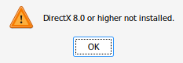

You are selecting a DXVK version that is too old. Please [reread this section](#for-bottles) to install the latest version of DXVK.

## RPG Maker MV/MZ

### Your browser does not support WebGL

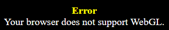

Same as above, the only way is to buy a new computer (or a new graphics card if you are using a desktop).

### Loading Error (`Failed to load`)

* Mostly the same as the [`XXXX 乗り物 は開けません` (Cannot open file XXXX) / `???????????????????` (a bunch of question marks) of RPG Maker 2000/2003](#xxxx-乗り物-は開けません-cannot-open-file-xxxx--a-bunch-of-question-marks) section.

* However, for Linux, there is another case where NW.js cannot load Japanese files when the system locale is not set to Japan.
    * Open a Terminal window and type the following command:
    ```sh
    export LANG=ja_JP.SJIS; export LC_MESSAGES=ja_JP.SJIS; export LC_ALL=ja_JP
    ```
    * Then `cd` to the game directory:
    ```sh
    cd "/path/to/game/folder" # Replace with the path to the game folder
    ```
    * And finally, run NW.js through the command line:
    ```sh
    ./nw .
    ```
    * If that fixes the **Failed to load** error, you can save this export option to a `.sh` file in the game folder, for example, `start.sh` with the following content:
    ```sh
    #!/bin/bash
    export LANG=ja_JP.SJIS; export LC_MESSAGES=ja_JP.SJIS; export LC_ALL=ja_JP
    ./nw .
    ```

### (Script) Error

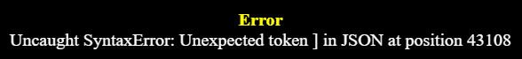

You must contact the developer about this error.

### Failed to load: `data/Actors.json`

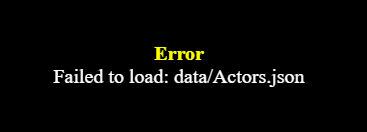

You are trying to run the game's `index.html` file in a browser.

* Run the `Game.exe` file instead.

* If you still want to run the game in a browser, use a local web server and place the game folder containing the `index.html` file in it. Then, enter the address of the `index.html` file **on the local web server** instead of running the `index.html` file directly. See the [Run RPG Maker MV games in a browser](#run-rpg-maker-mv-games-in-a-browser) section to learn more.

### Your file was not found

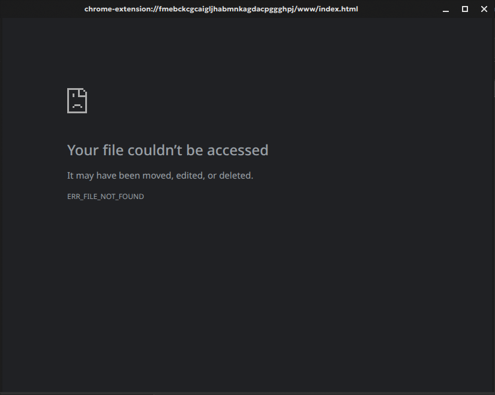

You have accidentally deleted the game's `index.html` file. Re-extract the game from its compressed file and try again.

### `Required value 'name' is missing or invalid`

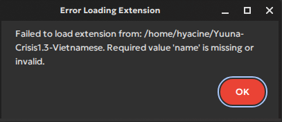

* Open the `package.json` file in the game folder with any text editor.

* Add the word `Game` inside the double quotes after the word `name` on line 2 as shown in the image below:

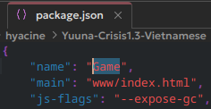

* Save the `package.json` file and restart the game.

### Failed to load extension from XXXX (different error from above)

The game's `package.json` file is corrupted. Try:

* Re-extracting the game from its compressed file and trying again.

* Fixing the error in the `package.json` file yourself if you are familiar with the JSON language and Node.js.

* Reporting this error to the developer.

### Game crashes during gameplay

There are many reasons why a game might crash during gameplay:

* The most common error is that the game uses too much RAM, exceeding the 4GB RAM limit of the `32-bit` version.
    * If you are using a `64-bit` version of the operating system, you can download the `64-bit` version of NW.js to remove the 4GB RAM limit of the `32-bit` version.
    * You can also check your computer's RAM usage. If you see the computer is consuming too much RAM while playing, consider closing background software, enabling virtual RAM, or upgrading your computer's RAM.

* The game may also be experiencing a serious programming error; you can report this incident to the game developer.

### `require is not defined`


If you are trying to play in a browser and encounter this error, there is no other way; you can only go back to playing with the `Game.exe` file.

### NW.js screen displays when running the game

When running the game, this screen appears instead of the game screen:

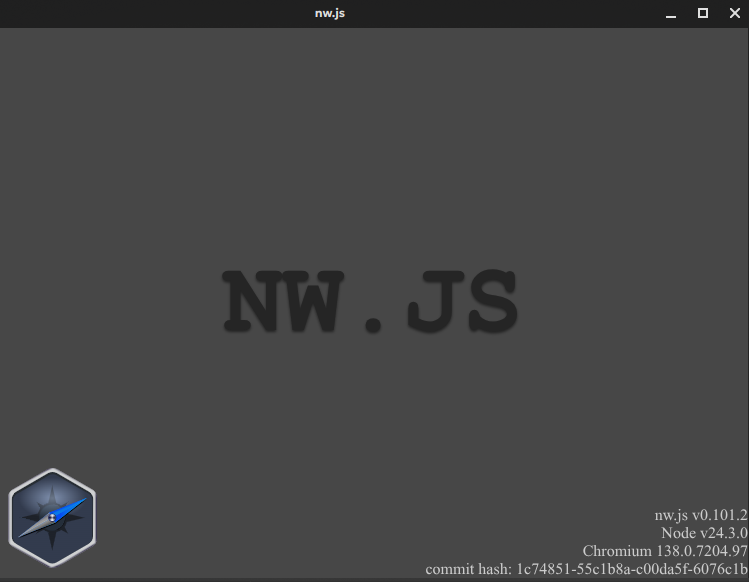

* You have placed NW.js in the wrong folder. Go back to the Downloading and Running Games section to redo this step.

* If you have placed NW.js in the correct game folder, try checking if that folder still contains the `package.json` file. If not, you need to re-extract the game or report the error to the developer.

### Game does not open when running the `nw` file

* Try re-downloading both the game folder and NW.js and redo the instructions in the Downloading and Running Games section.

* If it still doesn't work, try downloading a different version of NW.js (older or newer). It's best to download the latest version if possible.

* Make sure you have copied **all files** from the `nwjs` folder you extracted into the game folder.

* Make sure the `package.json` file is not corrupted. Some versions of NW.js, instead of reporting a `Failed to load extension` error, will simply fail to run the game. You can search on Google for **JSON Validator** and paste the content of the `package.json` file there to confirm if the error is from this file.

* The NW.js version you downloaded may not be compatible with your version of Linux (your Linux version and the NW.js version are too far apart in time). Try upgrading your Linux to the latest version according to the instructions for your distro.

## Tips for Linux

### Use MangoHud to see FPS information

Most RPG Maker engines allow you to press the F2 key to display FPS. However, if you want more in-depth information, you can also use MangoHud.

This is also the easiest way to see if DXVK is working.

{: .important }
> MangoHud will only work when running RPG Maker games from 2000 to VX Ace.

* First, install MangoHud via Flatpak:

```sh
flatpak install org.freedesktop.Platform.VulkanLayer.MangoHud 
```

* Flatpak will ask you to select a version; choose the last version (here it is number 4):

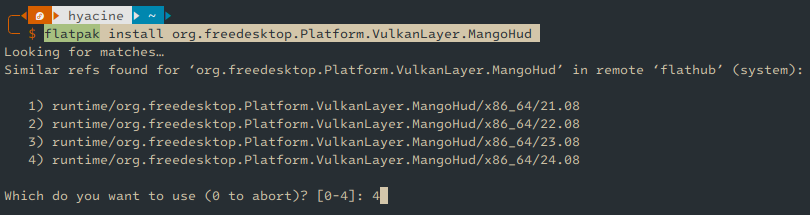

* Open the Bottle management section in the Bottles application. Click on **Settings** and enable the **Monitor Performance** option in the **Performance** section of the settings.

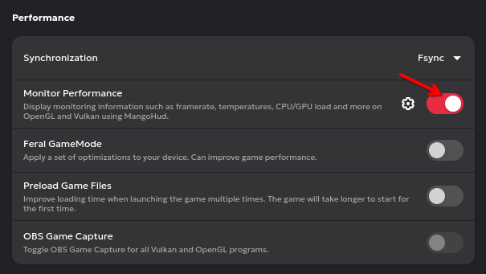

* Restart the game. You will see information about FPS, GPU usage, and more importantly, whether the game is running through DXVK or WineD3D.

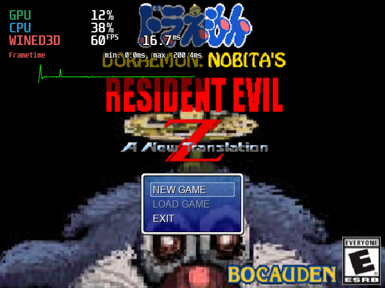

### Change the Wine version

You can change the Wine version to a newer one if you wish. However, the compatibility and playability may also differ.

* On the main screen (list of Bottles) of the Bottles application, click the Menu button in the top right corner and select **Preferences**.

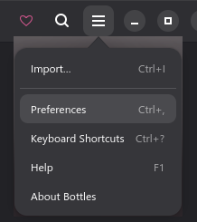

* Click on the **Runners** tab and select the version you want from the list below. Each version will have different optimizations, with Kron4ek's version having the latest releases.

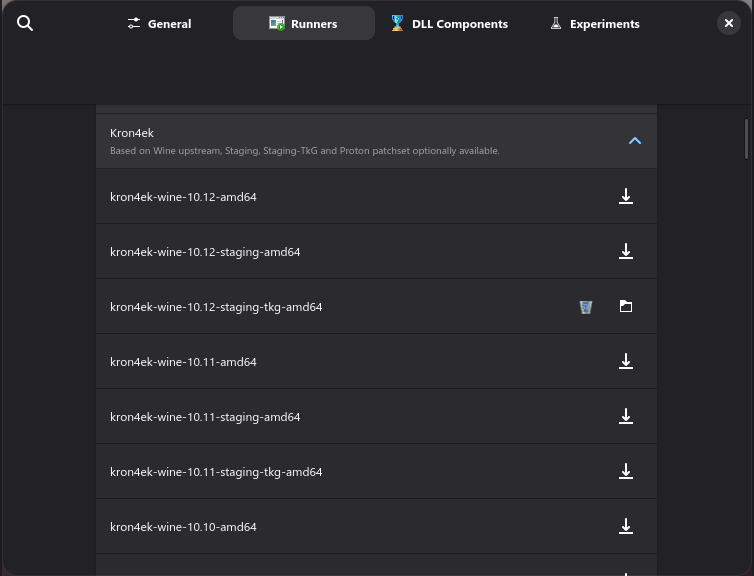

* Click the download button to the right of a version. Wait for the download process to complete, then close the settings window and select the Bottle you want to change the version for. Click the **Settings** button to open the Bottle's settings.

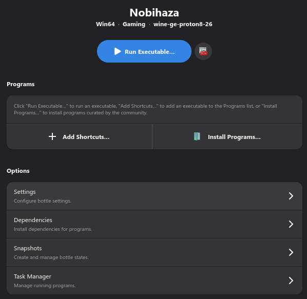

* Select the version to change to in the Runner section.

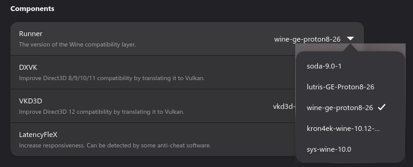

* Wait for the installation process to complete and run the game again. Your game will now run with the Wine version you selected.

### Enable high performance mode on Linux

Although it's not strictly necessary on Linux, if you want to, you can still set high performance mode on Linux.

Open your Terminal application and enter the following command:

```sh
echo performance | sudo tee /sys/devices/system/cpu/cpu*/cpufreq/scaling_governor
```

If the window prints the word `performance` without any additional error messages, the process is complete.

### Run RPG Maker MV games in a browser

{: .caution }
> Not all games will run this way. If you encounter errors when playing the browser version, you must go back to playing with NW.js.

* Go to the GitHub page to download the **Simple HTTP Server** tool [here](https://github.com/TheWaWaR/simple-http-server/releases), then select the `x86_64-unknown-linux-musl-simple-http-server` file.

{: .note }
> You can rename the `x86_64-unknown-linux-musl-simple-http-server` file to a more memorable name.

* Open the Terminal application and enter the following command:

```sh
chmod +x ~/Downloads/x86_64-unknown-linux-musl-simple-http-server
~/Downloads/x86_64-unknown-linux-musl-simple-http-server --cors --index ~/game/www
```

Where `~/Downloads/x86_64-unknown-linux-musl-simple-http-server` is the path to the file you just downloaded, and `~/game/www` is the *`www` folder of the game folder*. For example, see the image below:

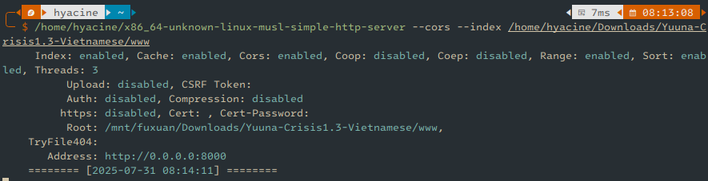

* Copy the address in the **Address** section of that window, which in the image above is `http://0.0.0.0:8000`, and paste it into your browser. The game will start, and now you just have to pray that the game's main screen will appear.<br>When you are done playing, you can close the Terminal window.

{: .caution }
> Firefox may get stuck on the Now Loading screen when playing games in this browser. You can grant Autoplay Audio permission and disable Tracking Prevention to minimize this situation (but there is no guarantee that it can be completely fixed).