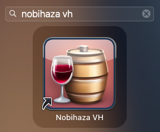

# Downloading and Running Games
{: .no_toc }

Installing games on macOS can be quite difficult as almost no games officially support macOS.

## Table of Contents
{: .no_toc }

1. TOC
{:toc}

## Downloading the game

{: .important }
> If the game does not support macOS, you **must** download the version for the Windows 64-bit operating system and install it via Kegworks (or NW.js if it's an RPG Maker MV game).

To download, you just need to go to the website and download the game version. It could be a compressed file (`.zip`, `.rar`, `.7z`) or an `.exe` file (if it's the Windows version).

## Extracting the game

{: .note }
> It is recommended to use the **The Unarchiver** software that I mentioned in [section 1](./prerequisities#the-unarchiver) to be able to extract `.rar` compressed files and some other file types.

Double-click the compressed file to extract it. Afterward, a folder with the same name as the compressed file will appear in the same directory.

## Open the Kegworks Config application

{: .note }
> If you have already purchased CrossOver and want to use it to play games instead of Kegworks, you can skip the section below and [see this guide](./troubleshooting#using-crossover-instead-of-kegworks).

With the exception of games made with RPG Maker MV and games that support EasyRPG, all other games will have to be installed through the Kegworks Config application.

* Open **Finder** on macOS. Press the key combination `Command + Shift + G` to open the navigation window and type `/Users/yourusername/Applications` (where `yourusername` is your macOS username).

* Right-click the `Nobihaza` application (or the different name you set in [section 1](./prerequisities)) and click **Show Package Contents**.

* Go into the `Contents` folder and run the `KegworksConfig` application. The `KegworksConfig` window will then appear.

## RPG Maker 2000/2003

### Running with the `RPG_RT.exe` file

* Open the **Kegworks Config** application first, then click the **Install Software** button.

* Click the **Copy a Folder Inside** button.

* Select the game folder you extracted (the one containing the `RPG_RT.exe` file or similar `.exe` files).

* Wait for the copying process to complete; it may take a significant amount of time depending on the size of the game. Then switch to the **Tools** tab of KegworksConfig and click **Custom EXE Creator**.

* Click the **Browse** button next to the **Windows EXE** field in the **Custom Executable Launcher Maker** window. The folder selection window will appear and will be selecting the `drive_c` folder. Click on the **Program Files** item to the right and you will see the game folder that was copied. Select the `RPG_RT.exe` file from that folder.

* In the **Name to use** section, enter the name of the game (or any name you choose).

{: .note }
> You can also change the game's icon by clicking **Browse** in the **Icon to use** section. I will provide detailed instructions on how to change it in a later section of the guide.

* Click the **Save** button. A **Success** message will appear.

* Go back to the **Finder** window and navigate to the `/Users/yourusername/Applications/Nobihaza.app/Contents` folder. You will see the game you just added in that folder.

* If you want to add the game to Launchpad, right-click the game's name in the **Contents** folder and click **Make Alias**. A new file with `alias` in its name will appear; remove the word alias from that name.

* Move the shortcut (alias) you just created into the main macOS `Applications` folder.

{: .important }
> **Ensure you are moving the shortcut** (which says Alias in the Kind column) and not moving the application (which says Application instead of Alias).
>
> Moving the application instead of the shortcut may cause the game not to run!

* You will now see the Nobihaza game you just added in the macOS Launchpad. You just need to click on it to run it.

### Running with EasyRPG

* Re-open the folder containing the **EasyRPG Player** application downloaded from the Prerequisites section of this guide.

* Copy that file and paste it into the game folder.
    * If you have already copied the file to the parent folder containing the game's folder, you don't need to do this step. Instead, run the **EasyRPG Player** application in that parent folder, and EasyRPG will display a selection menu for you to choose the game.

{: .caution }
> Some important macOS folders (like **Downloads** or **Applications**) may block applications from writing data to them by default, which will prevent games in those folders from being able to save. You can either move the game to another folder or see the fix in the [Troubleshooting and Tips](./troubleshooting#cannot-save-game-progress) section.

* Finally, double-click the **EasyRPG Player** application to play.

## RPG Maker XP/VX/VX Ace

### Using the `Game.exe` file

Do the same as in the [**Running with the `RPG_RT.exe` file**](#running-with-the-rpg_rtexe-file) section for RPG Maker 2000/2003. However, instead of selecting `RPG_RT.exe`, select the `Game.exe` file instead.

### Using MKXP

{: .important }
> Very few games are compatible with MKXP, and for macOS, the compatibility is even lower. If you cannot run a game using MKXP, you need to go back to playing the game with the `Game.exe` file.

* Download [MKXP for macOS](https://nbhzvn.one/tools/MKXP/mkxp-z-mac.zip) and then extract the downloaded file.

* Right-click the newly extracted `Z-universal` application and click the **Show Package Contents** button.

* Navigate to the `Contents/Game` folder of the application and copy all the files from your game folder into this directory.

* You can also rename the `Z-universal` application to any name you want, then drag and drop the application into the macOS **Applications** folder and click on the game to run it.

{: .caution }
> Some important macOS folders (like **Downloads** or **Applications**) may block applications from writing data to them by default, which will prevent games in those folders from being able to save. You can either move the game to another folder or see the fix in the [Troubleshooting and Tips](./troubleshooting#cannot-save-game-progress) section.

## RPG Maker MV/MZ

* Go to the `nwjs` folder that you downloaded and extracted in [section 1](./prerequisities#rpg-maker-mv). Copy the `nwjs` application into the game folder.

* Copy all the remaining files in the game folder, except for the `nwjs` application.

* Right-click the `nwjs` application, select **Show Package Contents**. Navigate to the `Contents/Resources` folder and create a new folder named `app.nw`.

* Press the key combination `Command + Option + V` to move all the files you just copied from the game folder into the `app.nw` folder.

* Rename the `nwjs` application to any name you want, drag and drop that application into the macOS **Applications** folder, and run that file.

{: .caution }
> Some important macOS folders (like **Downloads** or **Applications**) may block applications from writing data to them by default, which will prevent games in those folders from being able to save. You can either move the game to another folder or see the fix in the [Troubleshooting and Tips](./troubleshooting#cannot-save-game-progress) section.