# Prerequisites
{: .no_toc }

{: .important }
> Currently, only [**Doraemon: Nobita's Resident Evil 2 (Vietnamese Version)**](https://nobi2.s1432.org) officially supports macOS. You can download and play it right away without going through these complicated steps.
>
> Aside from that game, you will need support tools to be able to play other games:
> * **RPG Maker 2000/2003:** Use Wine or EasyRPG (which officially supports macOS).
> * **RPG Maker XP/VX/VX Ace:** Use Wine or MKXP (which officially supports macOS, but compatibility is very low).
> * **RPG Maker MV/MZ:** Use NW.js (most games will support running on macOS, except for a few games).

{: .important }
> **Not all Windows games can run on macOS**. If you encounter an error when running a game, there is no other way; you must contact the developer to request an official version for macOS.

{: .caution }
> These methods may not work for Mac computers running on **Apple silicon** CPUs (M1 and later). I do not have this type of Mac, so I cannot provide a detailed guide for it.

{: .note }
> You can also install a virtual machine running Windows, or use BootCamp to install Windows on your Mac; and then [apply the instructions for Windows](../../windows).<br>However, this is beyond the scope of my Nobihaza guide, so I will not provide instructions for it here.<br><br>This guide is only for those who want to run games **directly** on macOS through support tools.

## Table of Contents
{: .no_toc }

1. TOC
{:toc}

## Computer configuration

Before following this guide, ensure your device is on **macOS 10.15** (Catalina) or later. This means your Mac must be one of the following models:

* iMac 2012 or newer
* iMac Pro 2017
* MacBook 2015 or newer
* MacBook Air 2012 or newer
* MacBook Pro 2012 or newer
* Mac Mini 2012 or newer
* Mac Pro 2013 or newer

Your machine also needs to have at least 4GB of RAM or more.

## Initial setup

### Disable Gatekeeper

**Gatekeeper** is a macOS feature that helps prevent third-party applications not verified by Apple (more accurately, those that haven't purchased Apple's $99/year certificate) from running. However, some games and support tools cannot run without disabling Gatekeeper.

This does reduce the security of macOS, but there is no other way.

* Open the **Terminal** application and enter the following command:

```sh
sudo spctl --master-disable
```

* Enter your macOS password if prompted and press Enter.

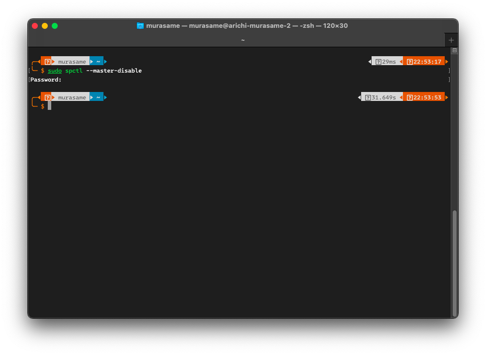

* You can go to **System Preferences** -> **Security & Privacy** -> **General**. If the **Anywhere** option has been added to the **Allow apps downloaded from** section, it means you have successfully disabled Gatekeeper.

### The Unarchiver

Although the default decompressor in macOS is much smarter than the one in Windows, it still cannot extract some compressed file formats, so you should still download third-party decompression software.

* [Download The Unarchiver](https://dl.devmate.com/com.macpaw.site.theunarchiver/TheUnarchiver.dmg), then open the downloaded `TheUnarchiver.dmg` file.

* Drag the `The Unarchiver.app` item into the `Applications` folder of macOS.

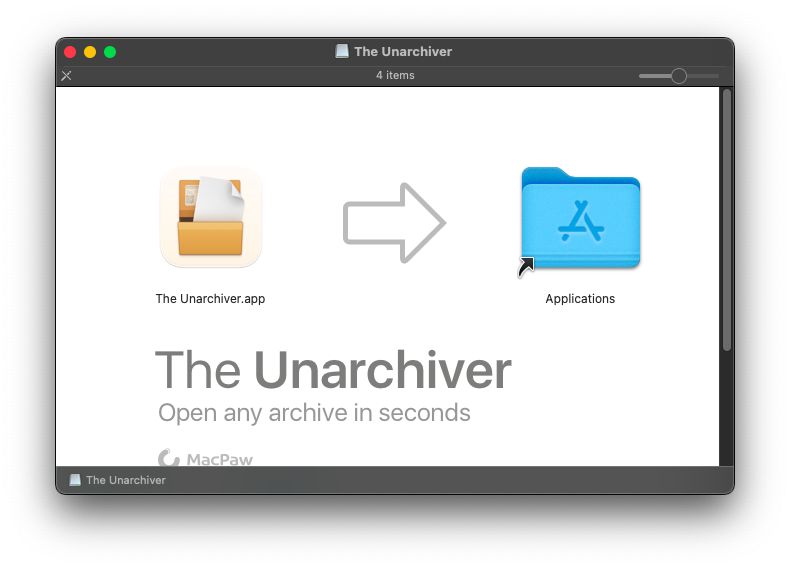

* Open **The Unarchiver** application from Launchpad or the `Applications` folder.

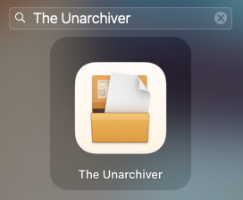

* Click the **Select All** button in The Unarchiver's window and close the window.

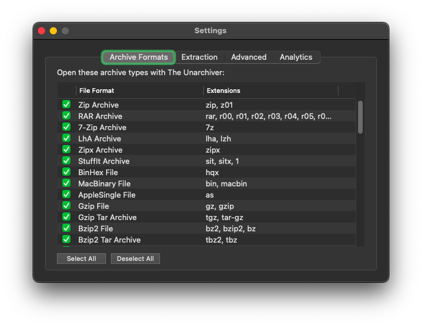

* From now on, The Unarchiver will replace the default macOS decompressor for extracting files.

### Xcode Command Line Tools

This tool will install the necessary libraries to install MacPorts below and other support tools.

* Open the macOS **Terminal** and enter the following command:

```sh
xcode-select --install
```

* A dialog box will appear; click **Install** to continue. You may be asked to enter your Mac's password.

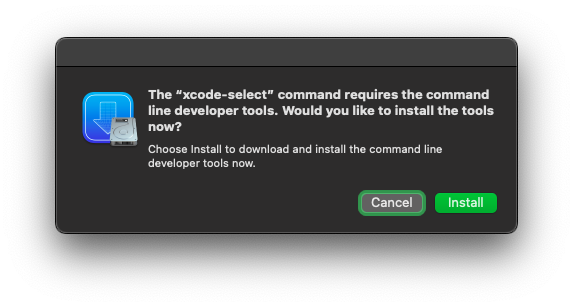

* Click the **Agree** button to agree to the Xcode Terms of Use. Then wait for the installation process to complete as shown in the image below.


### MacPorts

**MacPorts** will be necessary to install the support tools for playing games on macOS.

* Go to the [official MacPorts website](https://www.macports.org/install.php).

* Select the macOS version you are using from the list. If you are using an older version, click on **Older OS**.

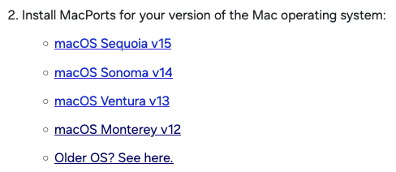

* Run the downloaded `.pkg` file. An installation window will appear; click **Continue** repeatedly and then click **Install** to begin the installation. Enter your macOS password and wait for the installation process to complete.

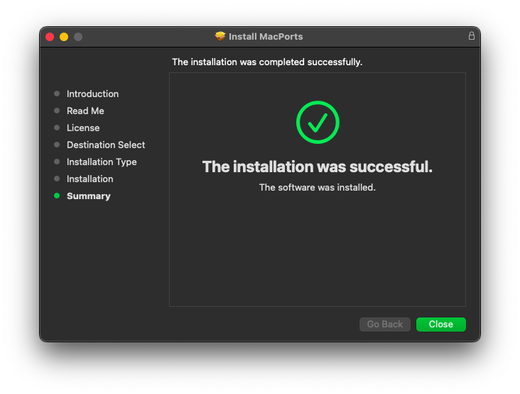

## Wine and Kegworks

{: .note }
> If you do not intend to run any games made with RPG Maker VX Ace or older on macOS, you can skip this step.

{: .note }
> If you have already purchased CrossOver and want to use it to play games instead of Kegworks, you can skip the section below and [see this guide](./troubleshooting#using-crossover-instead-of-kegworks).

**Wine** (an acronym for **Wine Is Not an Emulator**) is a compatibility layer for running Windows applications on other operating systems, and **Kegworks** is an application that makes it easier to run Wine on macOS.

### Install Kegworks

* Open the **Terminal** application and enter the following command, then press Enter and enter your macOS password.

```sh
sudo port install kegworks
```

* Wait for the installation process to complete as shown in the image below.

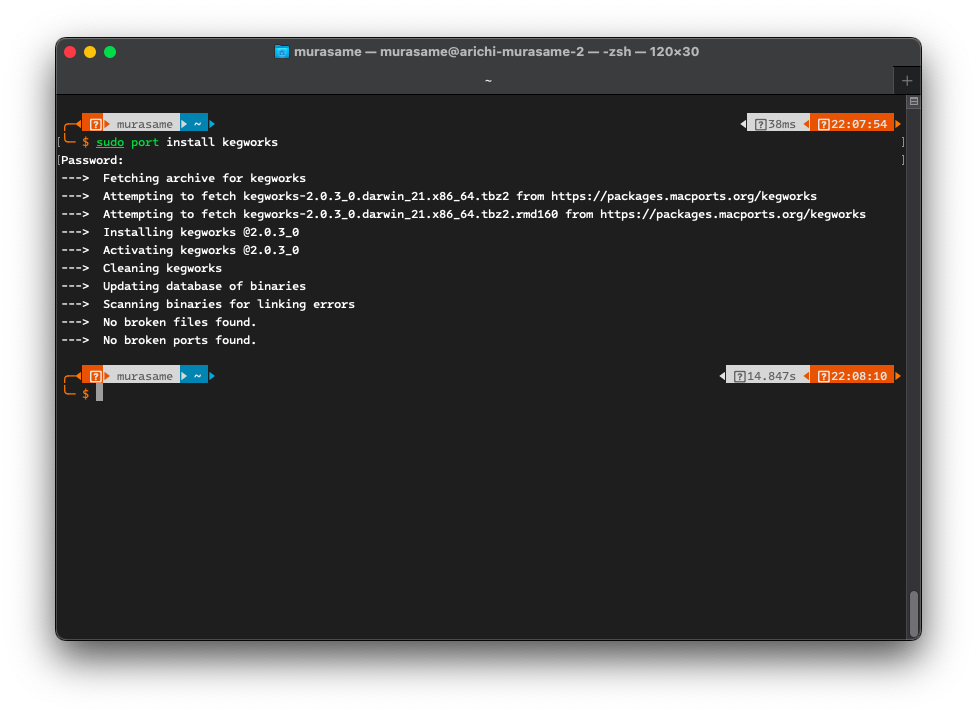

* You will now see the **Kegworks Winery** application in Launchpad or the `Applications` folder of macOS.

### Install Wine for macOS

* Open the newly installed **Kegworks Winery** application. Click the plus sign in the bottom left corner (above the text `Wrapper Version`) to add a new Wine version.

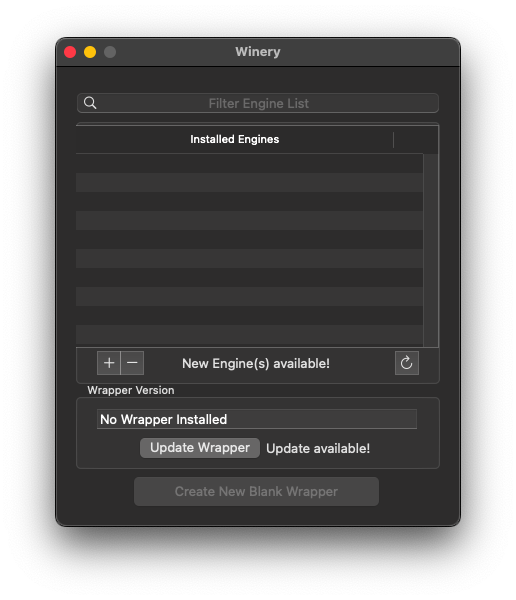

* Select the latest version of Wine (usually at the top of the list) and click the **Download and Install** button.

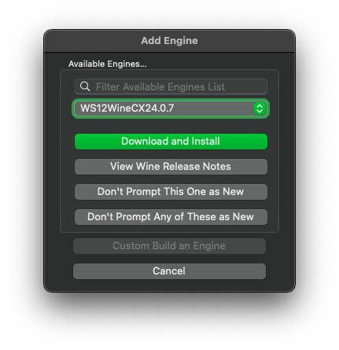

* Click OK to start the download.

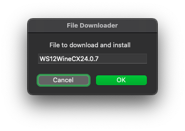

* The Installed Engines list now has the Wine version you just downloaded. Next, click the **Update Wrapper** button.

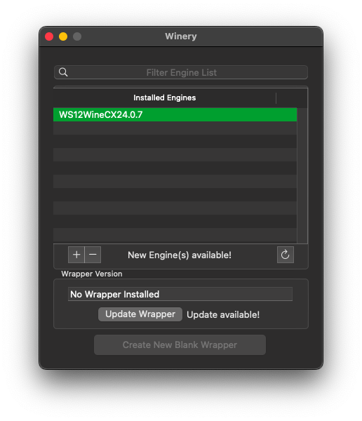

* Click OK to start the download.

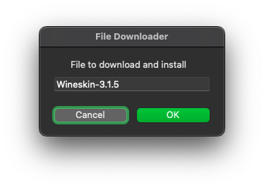

* Click the **Create New Blank Wrapper** button. You can enter any name you want; here I will enter the name `Nobihaza`.

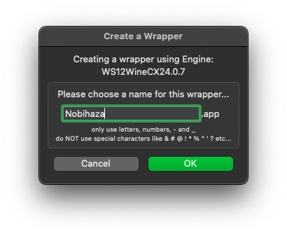

* Wait until a message indicating successful creation appears as shown below.

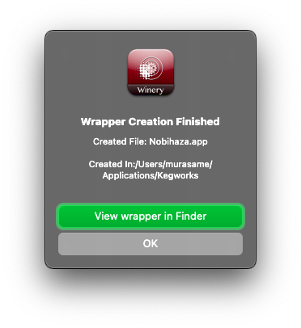

### Install necessary libraries for Wine

Some games will have font errors or will not function correctly if the necessary libraries are not installed.

* Open Launchpad and type the name of the application you entered in the step above.

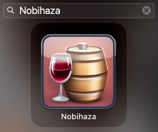

* When the **KegworksConfig** window appears, click the **Winetricks** button. First, type `wmp11` into the search bar, click the arrow button to the left of `dlls`, and check the `wmp11` item.

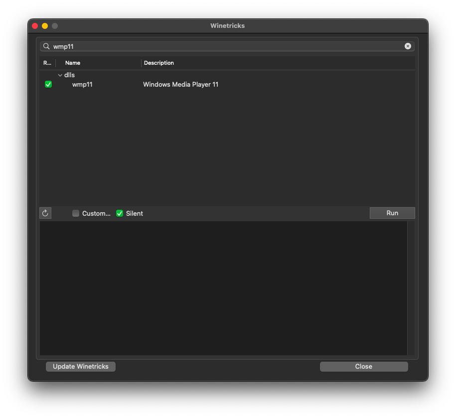

* Then, type `corefonts` into the search bar, click the arrow button to the left of `fonts`, and check the `corefonts` item.

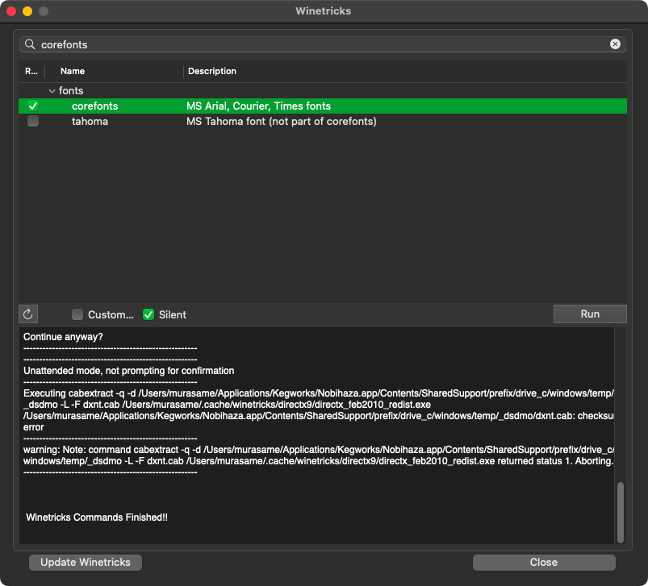

* Do the same for `dsound`, `directmusic`, `dmsynth`, `gmdls`, and `dsdmo`. Then click the **Run** button to start the installation, and click **Yes** to confirm.

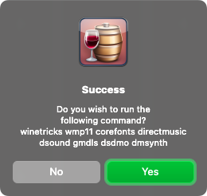

* Wait for the installation process to complete. Click the Close button to close Winetricks.

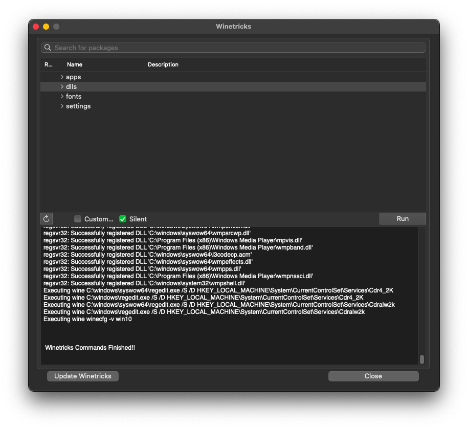

* Finally, check the **DirectX to Vulkan translation layer** item.

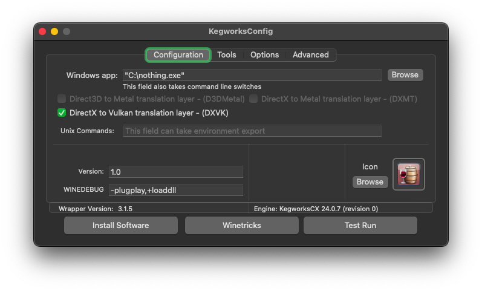

### Change region to Japan for Wine

Like with Windows, most Nobihaza games are Japanese, so you need to change the region to Japan to avoid language-related errors.

* In the **KegworksConfig** window, enter the following line into the **Unix Commands** box:

```sh
export LANG=ja_JP.SJIS; export LC_MESSAGES=ja_JP.SJIS; export LC_ALL=ja_JP
```

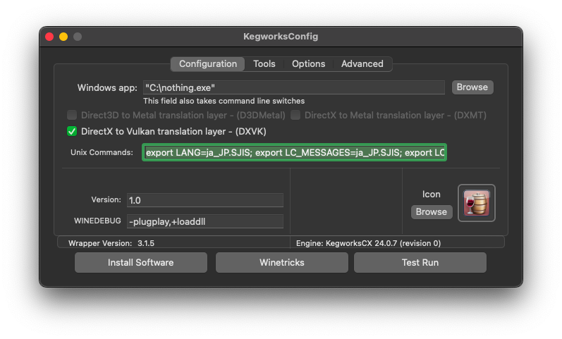

* Go to the **Tools** tab of KegworksConfig and click on **Config Utility (winecfg)**. If the Wine configuration application appears with all Japanese text as shown in the image below, it means you have successfully changed the region.

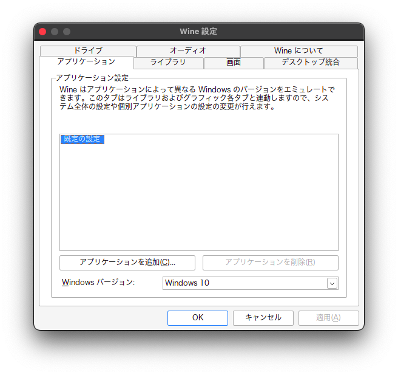

## RPG Maker 2000/2003

### Japanese Runtime Package (RTP)

* Download the [Japanese RTP 2000](https://cdn.tkool.jp/updata/rtp/2000rtp.zip) and [Japanese RTP 2003](https://cdn.tkool.jp/updata/rtp/2003rtp.zip).

* Extract both the `2000rtp.zip` and `2003rtp.zip` files.

{: .important }
> The Unarchiver may ask about the character encoding of some files when you extract them. In that case, select the Filename Encoding as **Japanese (Shift JIS)** as shown below and click **Continue**.
>
> 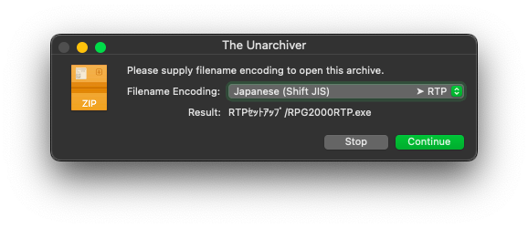

* Re-open the `Nobihaza` application (or the different name you chose). In the **KegworksConfig** window, click **Install Software**.

* Click the **Choose Setup Executable** button.

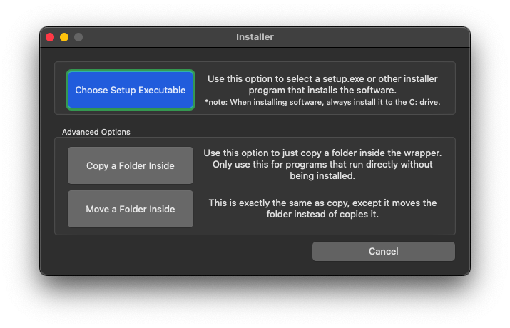

* Select the `RPG2000RTP.exe` file in the `RTPｾｯﾄｱｯﾌﾟ` folder you extracted earlier.

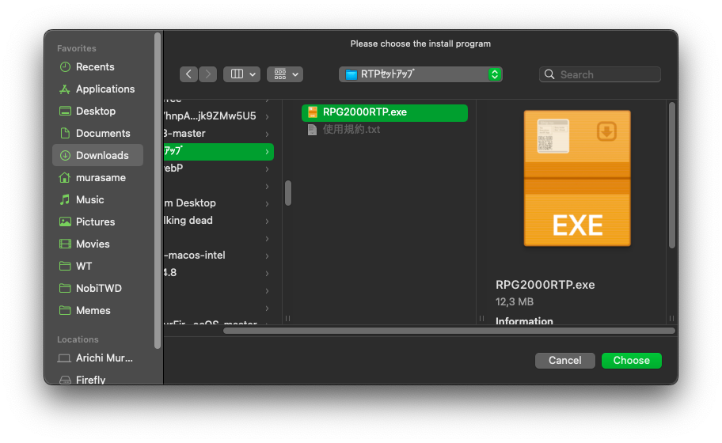

{: .tip }
> If you get an **Invalid name** error when running the `RPG2000RTP.exe` file, try moving that file to another folder that does not have special characters.

* Click the Next button (the one with the letter N) repeatedly and wait for the installation process to complete as shown in the image below.

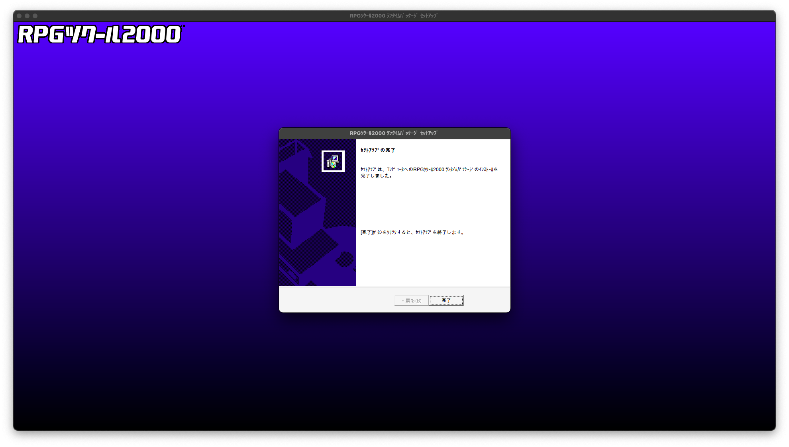

* Kegworks will ask for the "startup address" of the application, but since we are installing an RTP, you can just click OK.


* Do the same for the `RPG2003RTP.exe` file in the `2003RTPｾｯﾄｱｯﾌﾟ` folder.

{: .note }
> Kegworks may report **Installation failed** even though no error occurred during the installation process; you can completely ignore this message.

### English Runtime Package (RTP)

Some specific English Nobihaza games will also need this runtime package.

* Download the [English RTP 2000](https://dl.komodo.jp/rpgmakerweb/run-time-packages/rpg2000_rtp_installer.exe) and [English RTP 2003](https://dl.komodo.jp/rpgmakerweb/run-time-packages/rpg2003_rtp_installer.zip).

* The RTP 2000 is an `.exe` file so you don't need to extract it, but you will need to extract the RTP 2003. Then, proceed with the installation just like the Japanese version.

### EasyRPG

EasyRPG officially supports macOS, so you won't need to use Wine to install it.

* [Download the EasyRPG version for macOS](https://easyrpg.org/downloads/player/0.8.1.1/easyrpg-player-0.8.1.1-macos.app.zip).

* Extract the downloaded `.zip` file, and you will see an application named `EasyRPG Player`.

* You can either:
    * Copy it into the game folder and run this application directly to play.
    * Copy it into the parent folder containing your Nobihaza games. When you run the `EasyRPG Player` application, you will be able to choose which game to play each time.

## RPG Maker XP/VX/VX Ace

There are almost no Nobihaza games that run on RPG Maker XP, but you should still install it if you encounter a game that uses this engine. As for VX and VX Ace, there are many, so please install all of them fully.

### Japanese Runtime Package (RTP)

* Download the Japanese RTP for:
    * [RPG Maker XP](https://cdn.tkool.jp/updata/rtp/xp_rtp103.zip)
    * [RPG Maker VX](https://cdn.tkool.jp/updata/rtp/vx_rtp202.zip)
    * [RPG Maker VX Ace](https://cdn.tkool.jp/updata/rtp/vxace_rtp100.zip)

* Extract the downloaded files. You will get 3 folders containing the RTP installation files for the 3 engines.

* Click the **Install Software** button in **KegworksConfig**, click **Choose Setup Executable** and select the `Setup.exe` file in the `RPGXP_RTP103` folder.

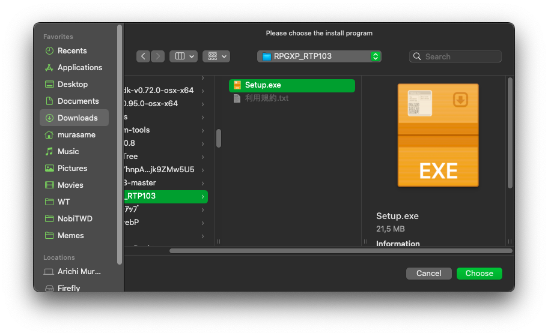

* Click Next (the first button with the letter N), until you see this screen, which means the installation was successful.

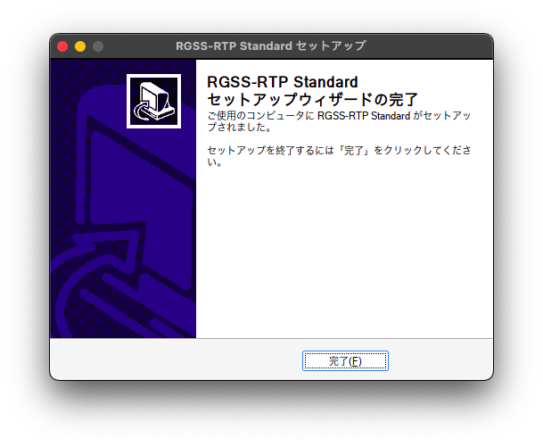

#### RPG Maker VX

After clicking the **Choose Setup Executable** button, select the `Setup.exe` file in the `RPGVX_RTP202` folder and do the same as for RPG Maker XP.

#### RPG Maker VX Ace

After clicking the **Choose Setup Executable** button, select the `Setup.exe` file in the `RPGVXAce_RTP100` folder and do the same as for the two engines above.

### English Runtime Package (RTP)

* Download the English RTP for:
    * [RPG Maker XP](https://dl.komodo.jp/rpgmakerweb/run-time-packages/xp_rtp104e.exe)
    * [RPG Maker VX](https://dl.komodo.jp/rpgmakerweb/run-time-packages/vx_rtp102e.zip)
    * [RPG Maker VX Ace](https://dl.komodo.jp/rpgmakerweb/run-time-packages/RPGVXAce_RTP.zip)

* Then extract and install similarly to the Japanese RTP.

## RPG Maker MV

{: .important }
> Some games **cannot** be run on macOS unless you modify the game's data (requires knowledge of JavaScript programming) because these games use Windows-only libraries. See more in the [Support Status](../../status) section.

For macOS, downloading NW.js is mandatory.

* Go to the [NW.js download page](https://nwjs.io/downloads).

* Select the **NORMAL** version for your type of Mac.
    * If you are using a Mac with an Intel CPU, select the **Mac OS X 64-bit** version.
    * If you are using a Mac with an Apple silicon CPU, select the **Mac OS X ARM64** version.

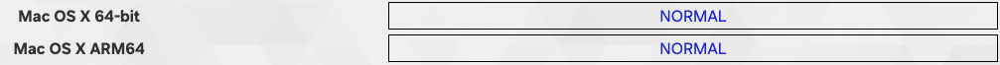

# After you have finished, proceed to the [Downloading and Running Games](./installation) section
{: .no_toc }