# Troubleshooting and Tips
{: .no_toc }

Below is a guide to fixing errors when playing Nobihaza games, along with tips for a better gaming experience on macOS.

{: .important }
> If the game still has errors after you have applied the methods below, it is highly likely that the game cannot be played (stably) on macOS, and you have no other choice but to wait for the developer to release an official version.

{: .important }
> The "game folder" mentioned in this guide refers to the game folder inside the `Program Files` directory that you created when [adding a game in section 2](./installation#running-with-the-rpg_rtexe-file), which typically looks like `/Users/username/Applications/Nobihaza.app/Contents/drive_c/Program Files/gamename`.

## Table of Contents
{: .no_toc }

1. TOC
{:toc}

## General

This section applies to all games, regardless of the engine it was made with.

### Cannot save game progress

This applies to both basic cases: the game reports an error when saving, and the game does not display the saved file upon restart. Uniquely on macOS, some games will not be able to start if they cannot write files to the game folder.

* macOS may block applications from writing to important folders (like `Documents`, `Downloads`, or `Applications`). You can either move the game to another folder or grant write permissions to the game by:
    * Opening your machine's settings (System Preferences/System Settings) and selecting the **Security & Privacy** section. Switch to the **Privacy** tab until you see a list of permissions like in the image below.<br>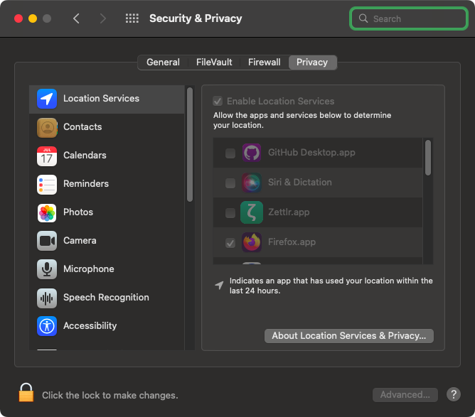
    * Click the lock icon in the bottom left corner to unlock the settings first. Enter your macOS password and click OK.
    * Click on **Full Disk Access**, then click the + sign below the application list to open the add application window.<br>
    * Select the application/game you want to grant permission to, for example, **EasyRPG Player** in the image below.<br>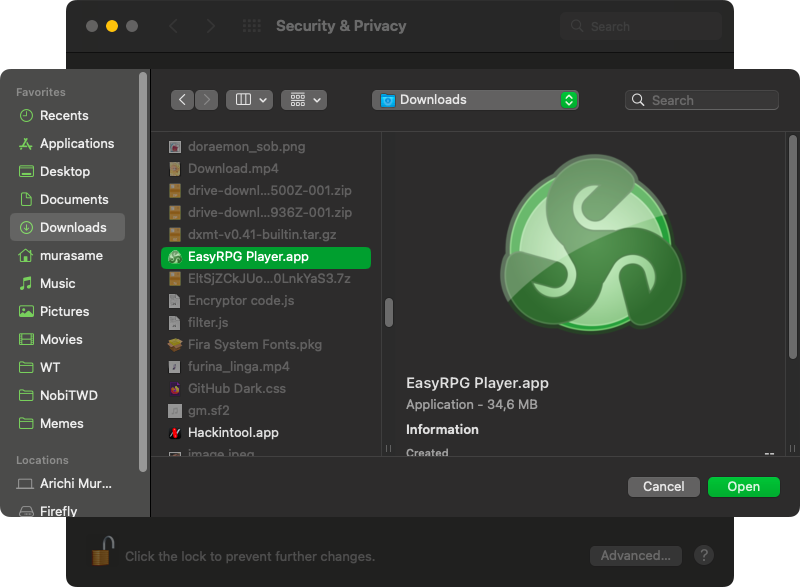
    * Ensure the application you just added has appeared and is checked in the list.<br>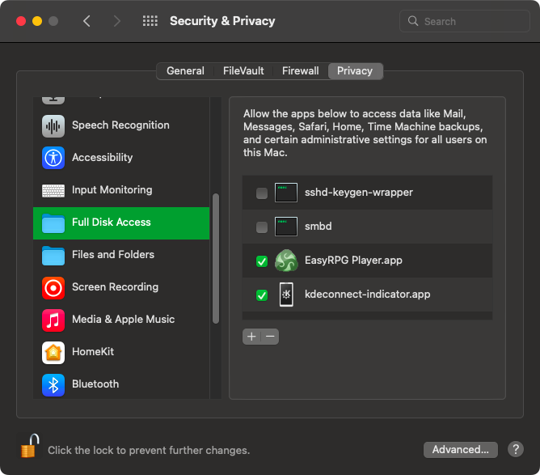

* Ensure the game's path does not contain any special characters (see the [`File corrupted! Please run a virus check / No game scripts specified`](#file-corrupted-please-run-a-virus-check--no-game-scripts-specified) section).

* Ensure you do not place the game folder in a folder/drive that cannot be written to (e.g., an SD card with write protection enabled, a drive/folder for which you do not have write permissions, or a drive with file writing errors). The best way is to try creating any file in the game folder to test its write capability, see if any error messages or permission requests appear. If not, try moving it to a different drive.

* The game will not run stably if you place the game folder in a cloud storage drive (some software like TeraBox, Google Drive, or OneDrive will display your cloud storage as a hard drive).

### Game lags despite using a high-spec computer

#### For Kegworks

If you are playing a game using Wine + Kegworks, you need to check if DXVK is working.

{: .important }
> Most RPG Maker XP/VX/VX Ace games use DirectX 9 (not DirectX 10 or 11), so the game will run very slowly because DXVK cannot operate on DirectX 9 and must use WineD3D as a replacement!
>
> Even CrossOver cannot save this situation.

* Open the **KegworksConfig** application, switch to the **Advanced** tab and check **Performance HUD** as shown below.

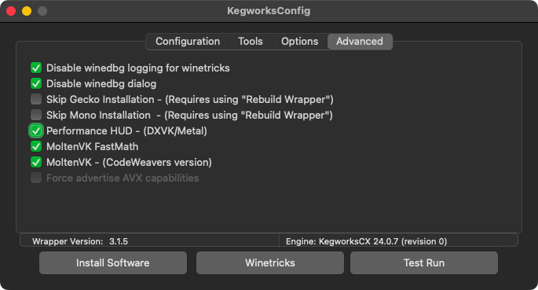

* Click the **Test Run** button to test run the most recently installed game and check if there is any information related to DXVK on the game screen. If there is only the game screen without any additional text, it means DXVK is not working, so the game will be very laggy.

{: .note }
> If nothing happens when you click the **Test Run** button, you can also run a game that you have installed through Kegworks.

#### Other

If you are running the game not through Kegworks, or have tried reinstalling DXVK and it didn't work:

* If you are using a MacBook with an Intel CPU, you should plug in the charger during gameplay.

* Close any running applications, including background apps. On the macOS Menu Bar, there are also background apps running; click on an application you are no longer using and click Exit/Quit.

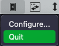

* Try checking the Dock to see if any applications have a white dot underneath them (running in the background). If so, right-click and click **Quit**/**Force Quit**.

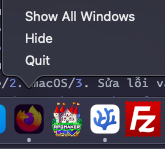

* Try turning off macOS's low power mode.

If the game still lags after trying all the above methods, there is no other way; that game cannot run stably on macOS.

### Game has square box/strange character display errors, or the font displays very poorly

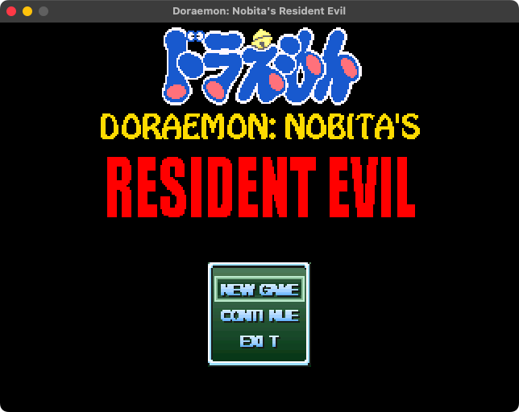

* See [Prerequisites#Change region to Japan for Wine](./prerequisities#change-region-to-japan-for-wine) and [Prerequisites#Install necessary libraries for Wine](./prerequisities#install-necessary-libraries-for-wine).

* Check if there are any font files (ending in `.ttf`, `.otf`, or `.fon`) in the game folder. If so:

#### For files with `.ttf` and `.otf` extensions

Open the **Font Book** application on macOS (can be found in Launchpad or the Applications folder), then drag the `.otf` and `.ttf` files into the Font Book window. macOS will automatically install those fonts for the entire system.

{: .note }
> Absolutely do not convert `.fon` files to `.ttf` or `.otf` just to be able to install them in Font Book, as it can cause display errors, and in most cases will **violate the Terms of Use** of the font itself.

#### For files with the `.fon` extension

* Go to the `Contents/drive_c/windows/Fonts` folder of the `Nobihaza` application, or the different name you set in section 1. See [2. Downloading and Running Games#Open the Kegworks Config application](./installation#open-the-kegworks-config-application) if you have forgotten.

The Fonts folder will look like the image below:

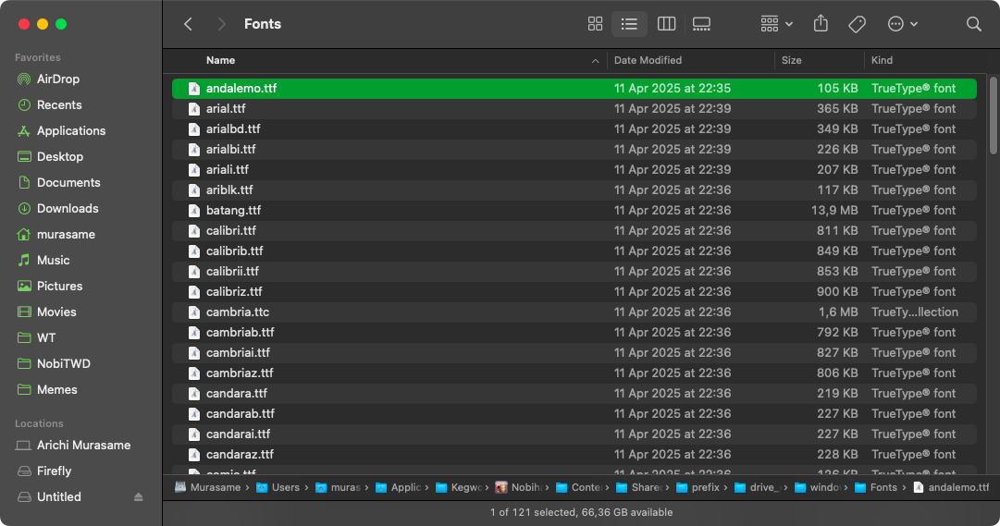

* Copy the font you found in the game folder into this `Fonts` folder.

* Open the **KegworksConfig** application, go to the **Tools** tab and click **Command Line (cmd)**. Enter the following line into the newly opened Command Prompt window, where `RM2000` is the name of the font (usually the filename without the `.fon` extension), and `RM2000.fon` is the filename:

```bat
reg add "HKLM\Software\Microsoft\Windows NT\CurrentVersion\Fonts" /v "RM2000" /d "RM2000.fon"
```

* Press Enter and you will see the line `reg: The operation completed successfully`.

### Cannot play MIDI music

Most Nobihaza games made with RPG Maker VX Ace or older use MIDI. If you notice that some music tracks cannot be played during gameplay, it could be MIDI music and your machine is having an error.

* See [Prerequisites#Install necessary libraries for Wine](./prerequisities#install-necessary-libraries-for-wine).

* Some machines may also need FluidSynth to be able to play MIDI music:

#### Install FluidSynth

* Open the **Terminal** application and enter the following command, then press Enter and enter your macOS password.

```sh
sudo port install fluidsynth
```

* Type `Y` and press `Enter` when the Terminal window displays the word Continue.

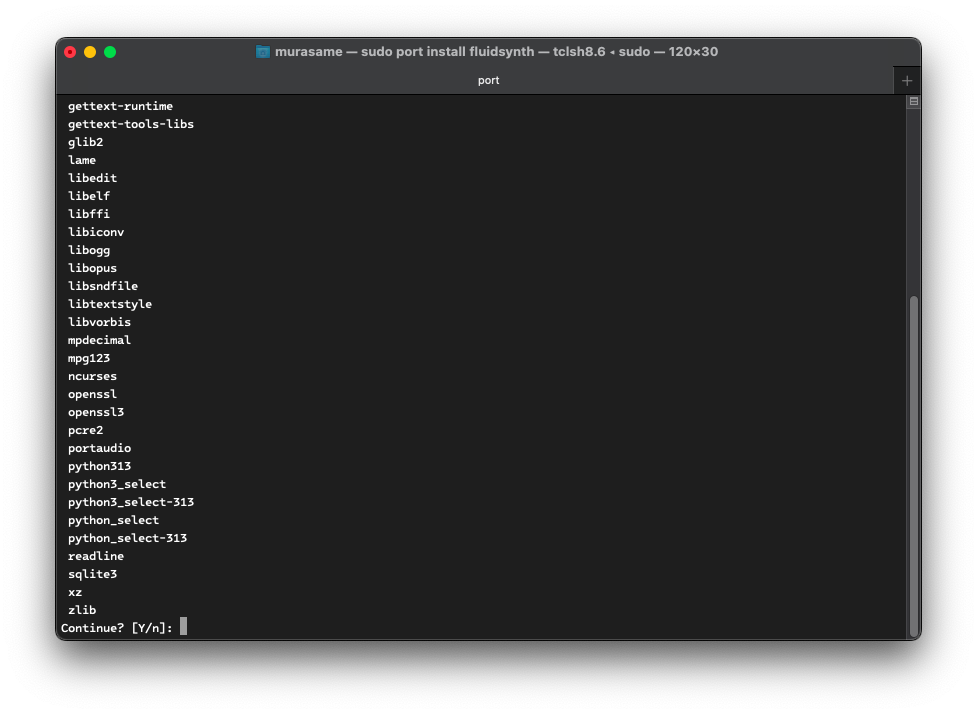

* The installation process will take quite a long time, so please be patient until it shows the line `No broken files found` as in the image below.

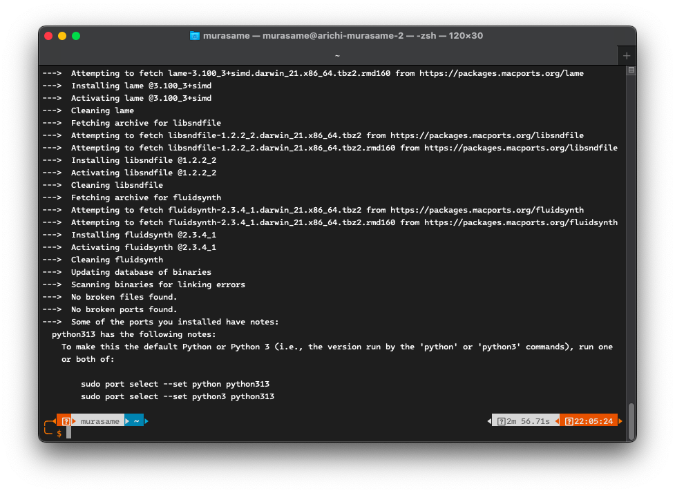

* You also need to download the [soundfont used on Windows](https://musical-artifacts.com/artifacts/713/gm.sf2) to have a listening experience most similar to Windows. Note the path of this file after downloading, as you will need to use it later.

#### Start FluidSynth

* Enter the following command in the Terminal window:

```sh
fluidsynth -a coreaudio -m coremidi ~/Downloads/gm.sf2
```

Replace the path `~/Downloads/gm.sf2` with the path of the `gm.sf2` file that you downloaded earlier.

* Press Enter to run the command and restart the game.

{: .important }
> You need to keep FluidSynth and the Terminal window running in the background during gameplay, and execute the above command each time you want to start the game.

### KegworksConfig doesn't open when running the `Nobihaza` application from Launchpad

See [Downloading and Running Games#Open the Kegworks Config application](./installation#open-the-kegworks-config-application).

## RPG Maker 2000/2003 (`RPG_RT.exe`)

### `XXXX 乗り物 は開けません` (Cannot open file XXXX) / `???????????????????` (a bunch of question marks)

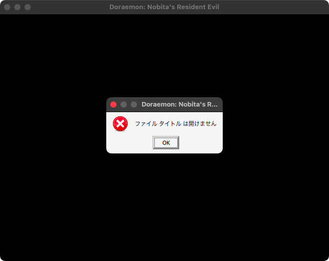

* See [Prerequisites#Change region to Japan for Wine](./prerequisities#change-region-to-japan-for-wine).

* It could also be that the file is genuinely not in the game folder. Re-extract it into the game folder and try again.

{: .note }
> There is a rare case where the translator compressed the game on a computer that was not set to the Japanese region, and after compression, the names of the resource files become corrupted and contain meaningless characters (also known as Mojibake).
>
> This error will also prevent the game from finding the resource file. You can see more details about this error [here](../../miscellaneous/mojibake).

### `RPGツクール2000/2003のランタイムパッケージがセットアップされていません。` (The RPG Maker 2000/2003 Runtime Package is not installed)

See [Prerequisites#RPG Maker 2000/2003](./prerequisities#rpg-maker-20002003).

### Error related to `RPG_RT.lmt`

If the path in the message contains question marks (`?`), then your game folder path contains special characters. See which folder(s) in the path contain the `?` and remove **all** special characters from that folder.

## RPG Maker 2000/2003 (EasyRPG)

See the [EasyRPG](../../miscellaneous/easyrpg) section.

## RPG Maker XP/VX/VX Ace

### RPGVX/RPGVXAce RTP is required to run this game

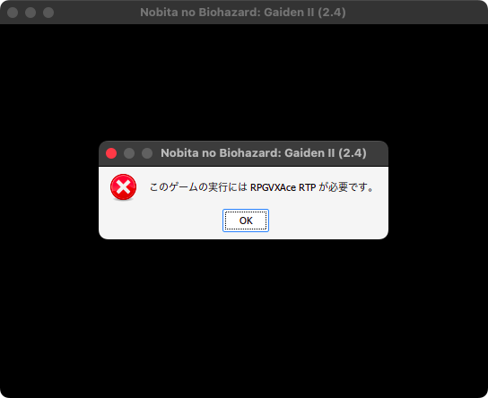

See [Prerequisites#RPG Maker XP/VX/VX Ace](./prerequisities#rpg-maker-xpvxvx-ace).

### RGSS202E.dll/RGSS202J.dll/RGSS300.dll/RGSS301.dll could not be found

* [Reinstall the entire RPG Maker VX Ace runtime package (RTP)](./prerequisities#rpg-maker-xpvxvx-ace).

* If reinstalling it doesn't work, you can also [download those .dll files directly](https://drive.google.com/file/d/1QTGjntOWisoUzk3NTfSBfk0bT2fNYBKc/view) and extract them into the game's `System` folder.

### File corrupted! Please run a virus check / No game scripts specified

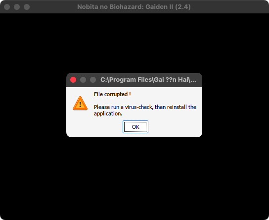

The title bar of the error message will show the path of the corrupted file.

* If the path in the message contains question marks (`?`), then your game folder path contains special characters. See which folder(s) in the path contain the `?` and remove **all** special characters from that folder.

* The file may also have been corrupted during the extraction process; try re-extracting the game's compressed file.

{: .important }
> You need to recreate the game's startup shortcut ([**Custom EXE Creator**](./installation#running-with-the-rpg_rtexe-file)) after renaming the game folder.

### Unable to find VL Gothic font

* Download the font file for VL Gothic [here](https://github.com/ovate/VL-Gothic-font/raw/refs/heads/main/fonts.zip).

* Extract this file and go into the extracted `fonts` folder. You will see 2 files: `VL-Gothic-Regular.ttf` and `VL-PGothic-Regular.ttf`.

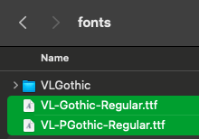

* Open the **Font Book** application on macOS, and drag those 2 files into the Font Book window.

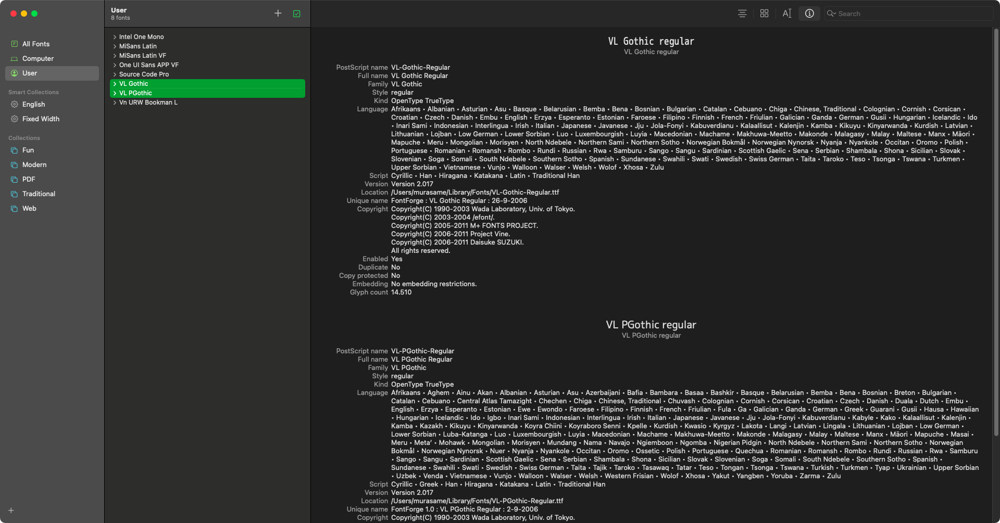

### Script error

* If you are running the game through MKXP, it is highly likely that the game you are playing is not well-supported and is very prone to **Script error** issues. You should go back to playing with Wine and run the `Game.exe` file from the Windows version.

* If you are certain this error occurs not only on macOS, you must contact the developer to fix this error.

### Failed to load script

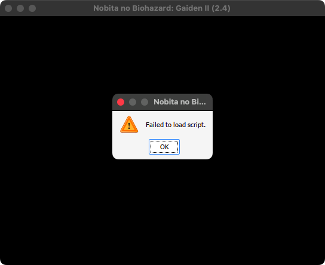

You have accidentally deleted the `Game.rgssad` / `Game.rgss2a` / `Game.rgss3a` file or the `Data` folder of the game. Re-extract the game from its compressed file and try again.

### Unable to find file / No such file or directory

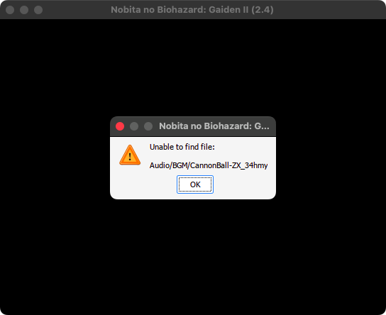

The fix is the same as for the [`XXXX 乗り物 は開けません` (Cannot open file XXXX) / `???????????????????` (a bunch of question marks) of RPG Maker 2000/2003](#xxxx-乗り物-は開けません-cannot-open-file-xxxx---a-bunch-of-question-marks) section.

### Error creating context: Could not create GL context

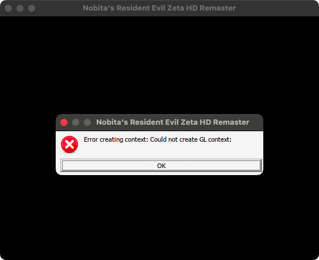

macOS does not support OpenGL, so games that use OpenGL cannot run (or it's a limitation of Wine, I'm not entirely sure about this).

I have not yet found a way to fix this error, so it can be said that these games cannot be played at this time.

## RPG Maker MV

Since they all use NW.js, the fixes on macOS will be [the same as on Windows](../../windows/troubleshooting#rpg-maker-mvmz).

Just remember that the game folder on macOS will be `Contents/Resources/app.nw` inside the game's application. If your error is not listed in that section, then unfortunately, the game cannot be played stably on macOS.

Otherwise, there is only one other macOS-specific error:

### Game displays the NW.js screen instead of the game screen

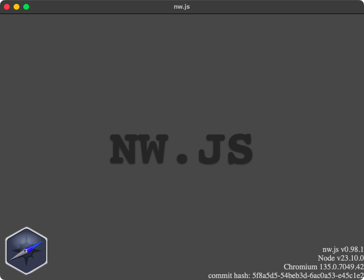

You have not set up the `Contents/Resources/app.nw` folder of NW.js. Please see [Downloading and Running Games#RPG Maker MV/MZ](./installation#rpg-maker-mvmz).

## Tips for macOS

### Upgrade Wine and Kegworks versions

Occasionally, you should still update both Wine and Kegworks, as some errors related to playing Windows games may become more stable.

* Open the **Kegworks Winery** application, and click the plus sign (+) below the list.

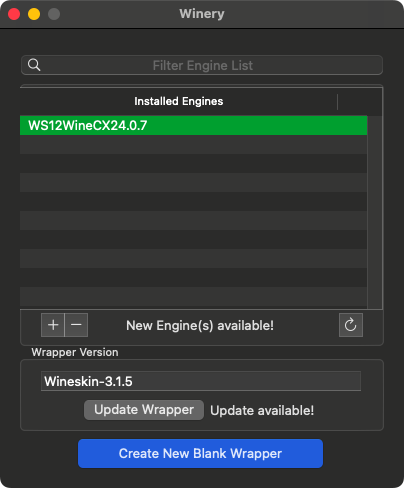

* If you see a version that is higher than the current one, select that version and click the **Download and Install** button.

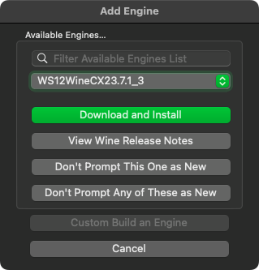

* Click the **OK** button.

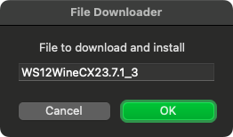

* Wait for the installation process to complete, and it will return you to the Kegworks Winery window. Next, click the **Update Wrapper** button.

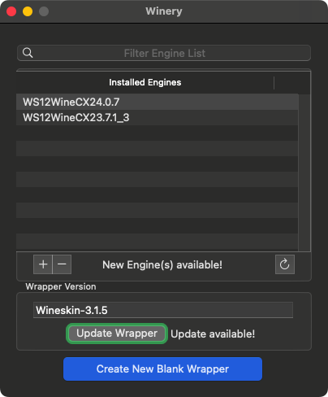

* You will see the latest version of Kegworks (Wineskin); click the **OK** button.

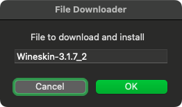

* Wait for the installation process to complete, and you will see the new version written in the **Wrapper Version** section.

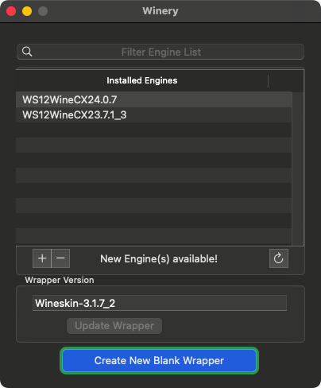

* Close the Kegworks Winery window, and open the **KegworksConfig** application within the app you created in section 1. Click the **Tools** tab and select **Update Wrapper**.

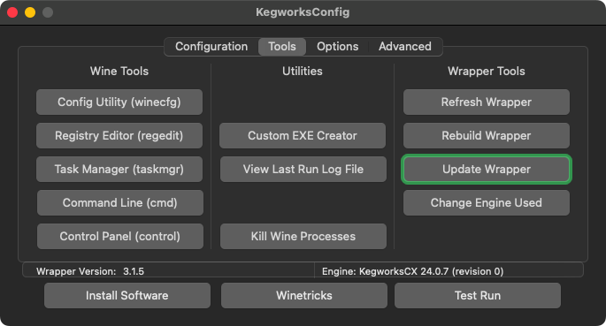

* A warning will appear; click **Yes** to continue.

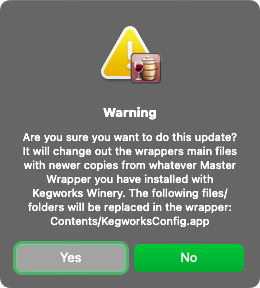

* Wait for the upgrade process to complete, and you will see the new version in the **Wrapper Version** section.

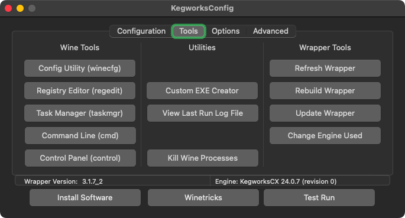

* Click the **Change Engine Used** button. Select the latest version you just downloaded from the list and click **OK**.

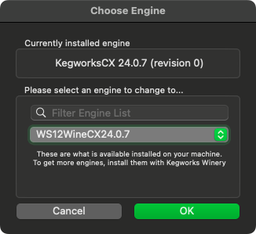

* Wait for the upgrade process to complete, and you're done.

### Using CrossOver instead of Kegworks

CrossOver is easier to use and somewhat more stable than Kegworks, but because it is a paid software, I did not make it the focus. The guide below only applies to those who have already purchased CrossOver and want to use it instead of Kegworks.

I will **never** encourage the use of pirated CrossOver, nor provide instructions on how to "crack" this software.

#### Download RTPs

* Download all the RTPs for the game engines if you haven't already:
    * **Japanese:**
        * [RPG Maker 2000](https://cdn.tkool.jp/updata/rtp/2000rtp.zip)
        * [RPG Maker 2003](https://cdn.tkool.jp/updata/rtp/2000rtp.zip)
        * [RPG Maker XP](https://cdn.tkool.jp/updata/rtp/xp_rtp103.zip)
        * [RPG Maker VX](https://cdn.tkool.jp/updata/rtp/vx_rtp202.zip)
        * [RPG Maker VX Ace](https://cdn.tkool.jp/updata/rtp/vxace_rtp100.zip)
    * **English:**
        * [RPG Maker 2000](https://dl.komodo.jp/rpgmakerweb/run-time-packages/rpg2000_rtp_installer.exe)
        * [RPG Maker 2003](https://dl.komodo.jp/rpgmakerweb/run-time-packages/rpg2003_rtp_installer.zip)
        * [RPG Maker XP](https://dl.komodo.jp/rpgmakerweb/run-time-packages/xp_rtp104e.exe)
        * [RPG Maker VX](https://dl.komodo.jp/rpgmakerweb/run-time-packages/vx_rtp102e.zip)
        * [RPG Maker VX Ace](httpshttps://dl.komodo.jp/rpgmakerweb/run-time-packages/RPGVXAce_RTP.zip)

#### Create a new bottle

* Click the **Install** button in the CrossOver window, and click the **Install an unlisted application** button in the top right corner.

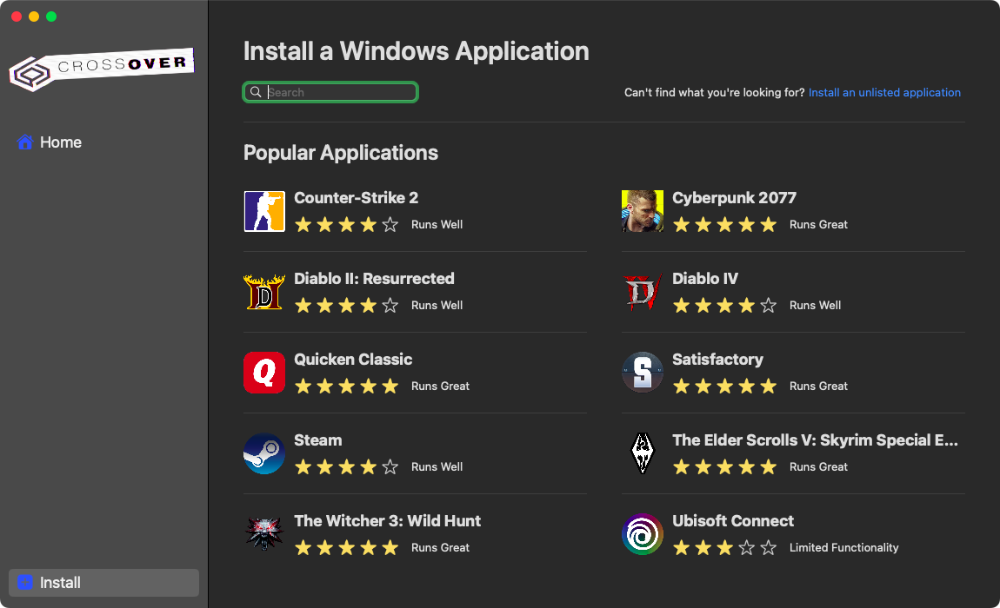

* Click the **Edit** button above (next to **You need to provide the installer file**) and select any English RTP installer file (because Japanese may cause errors if the region hasn't been changed).

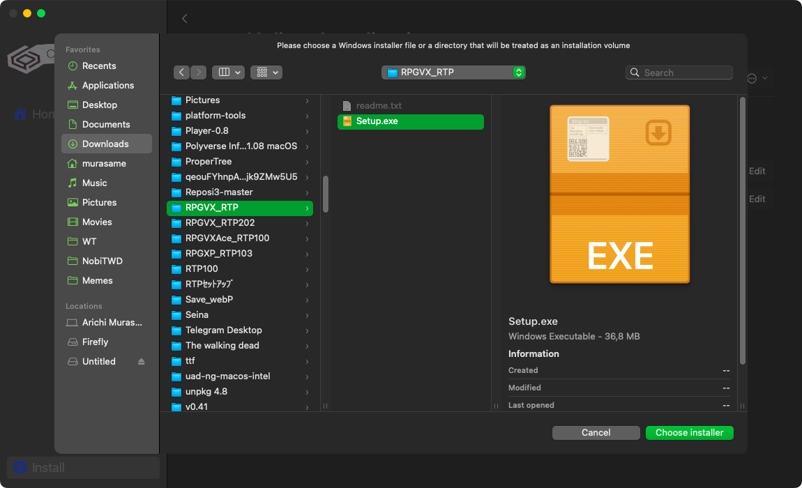

* Click the **Edit** button below (next to **You need to select the bottle**). Enter the name of the bottle in the **New Bottle Name** section and click **Done**.

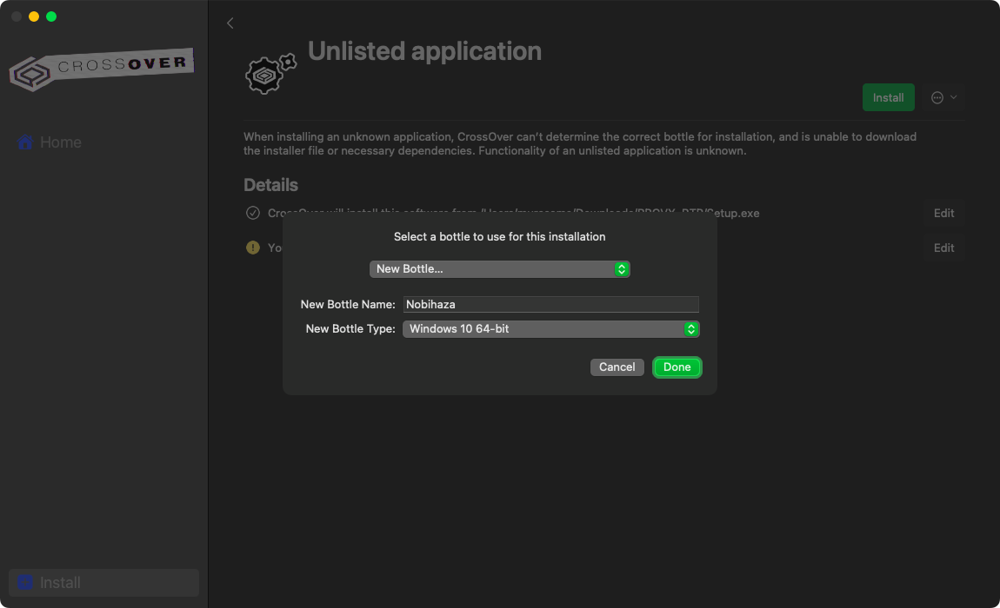

* After everything is done, click the Install button.

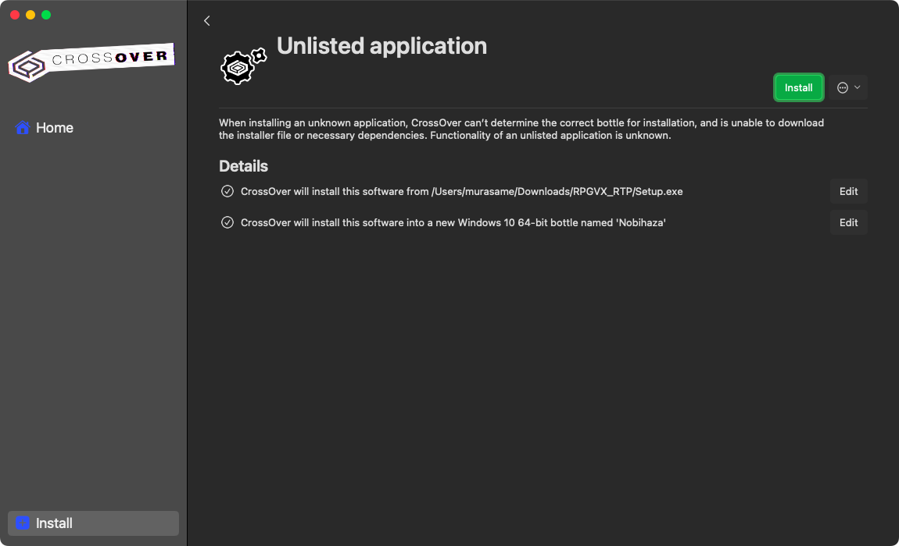

* Proceed with the RTP installation as usual.

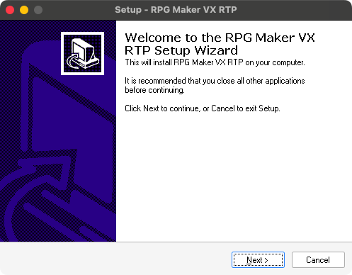

* The new bottle has been created and will look like the image below. First, enable the **DXVK** option in the Advanced Settings.

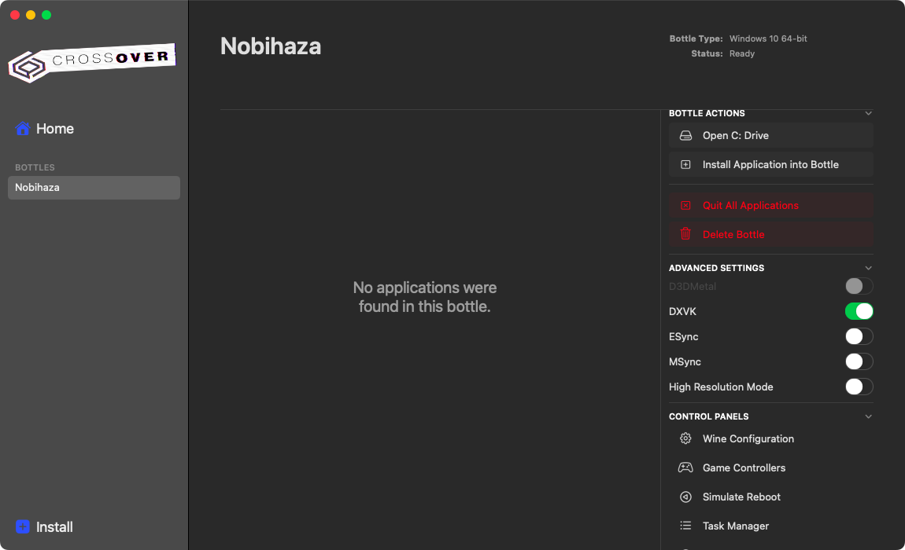

#### Change CrossOver's region to Japan

* In the macOS Finder window, press the key combination `Command + Shift + G` and enter the path `/Users/username/Library/Application Support/CrossOver/Bottles/Nobihaza`, where `username` is your macOS username, and `Nobihaza` is the name of the bottle you set above.

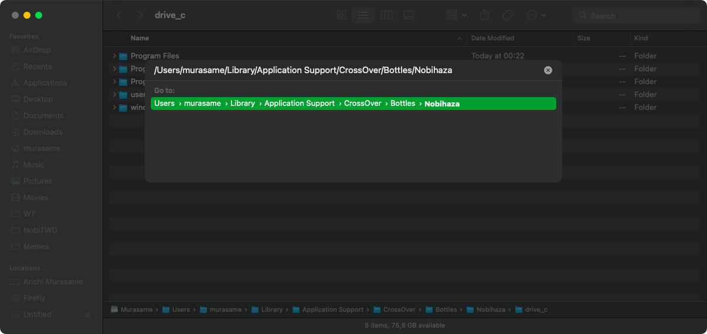

* You will see the `cxbottle.conf` file. Right-click on that file and open it with TextEdit.

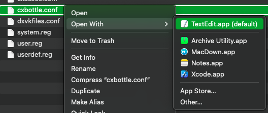

* Go to the end of the file and you will see the `[EnvironmentVariables]` section. Add the following lines at the end of the file:

```ini
"LANG" = "ja_JP.SJIS"
"LC_MESSAGES" = "ja_JP.SJIS"
"LC_ALL" = "ja_JP"
```

So that the end of the file looks like this:

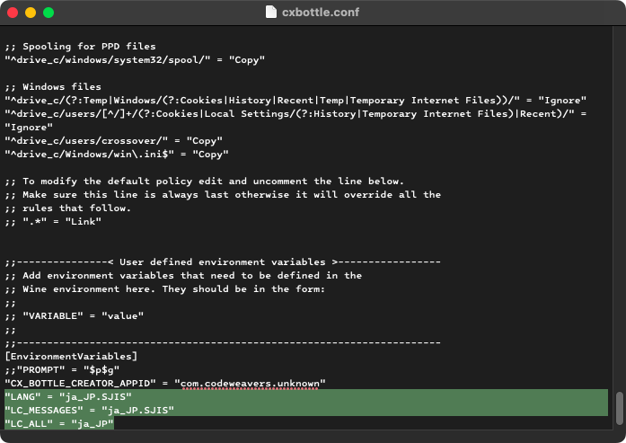

* Save the file and exit the TextEdit window.

#### Install RTPs

* In the CrossOver window, click the **Install Application into Bottle** button on the right side of the window.

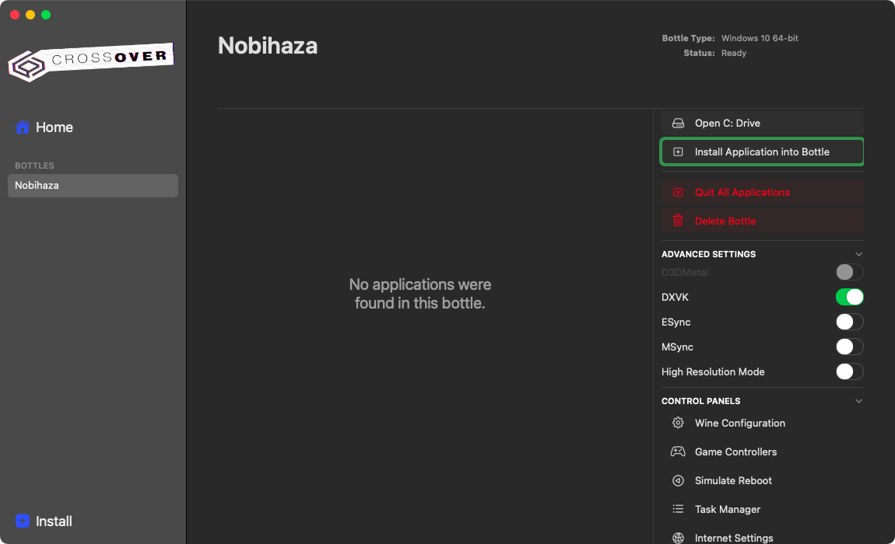

* Click the **Install an unlisted application** button in the top right corner.

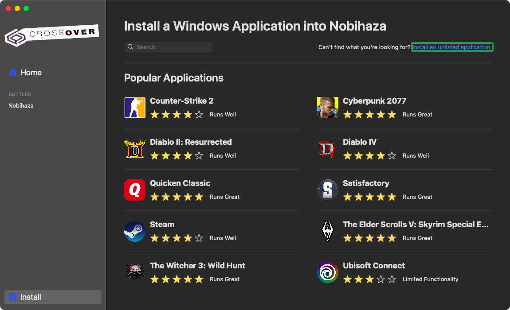

* Click the **Edit** button at the top.

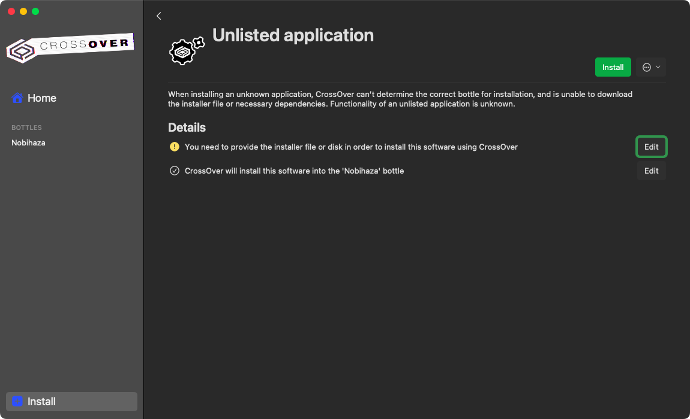

* Select the installer file of any RTP.

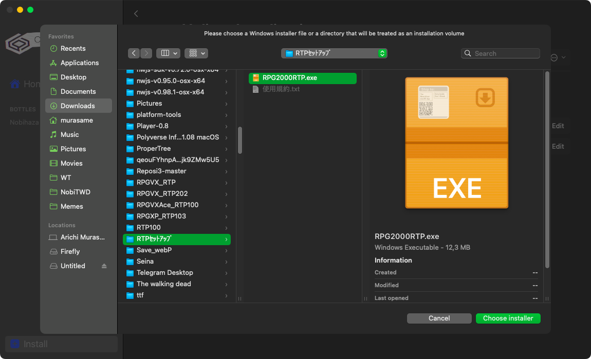

* Click the **Install** button and proceed with the installation as usual.

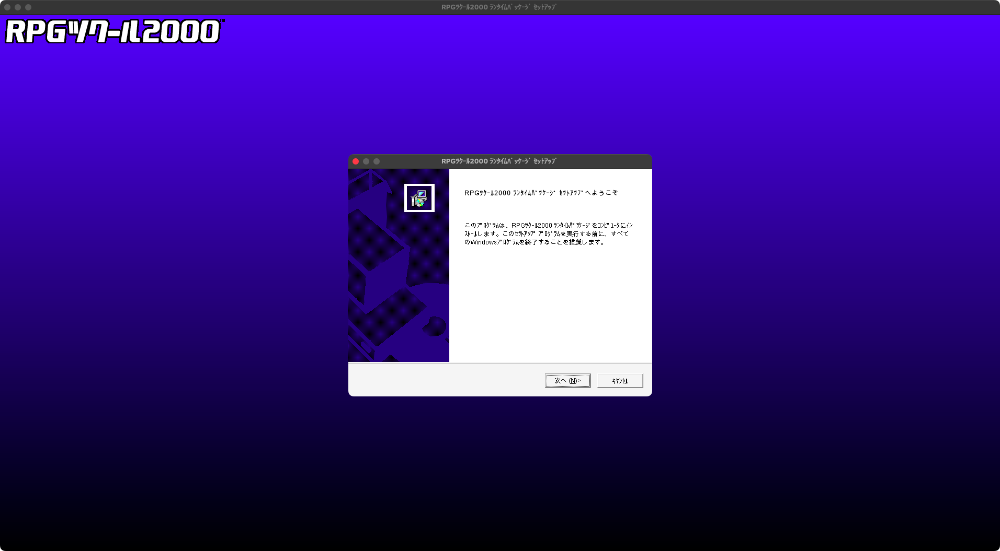

* Repeat the above steps for all remaining RTPs.

#### Run a game on CrossOver

* In the CrossOver window, click the **Run Command** button on the right side of the window.

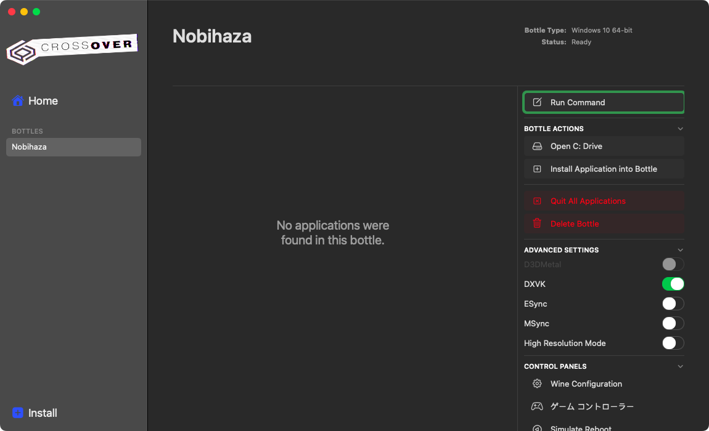

* Click the **Browse** button in the **Run Command** window and select the game's `.exe` file from the game folder.

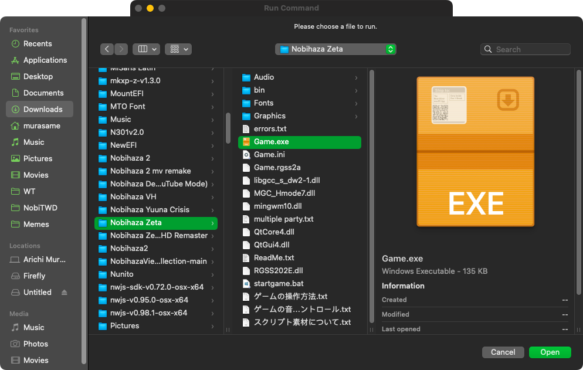

* Click the **Open** button to start the game, and you can play as usual; or click the **Save Command as a Launcher** button to add the game to CrossOver's main screen.

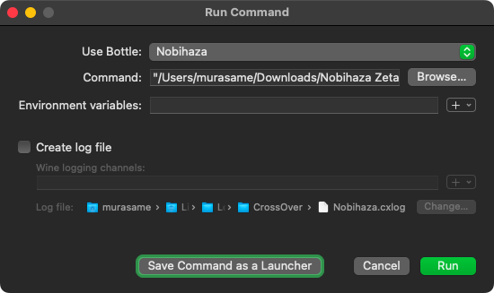

{: .note }
> If you add the game to CrossOver's main screen, the software will name the game you just added as `Game` (or `RPG_RT` if it's an RPG Maker 2000/2003 game) as shown below and will not allow you to rename it, so be careful.
>
> 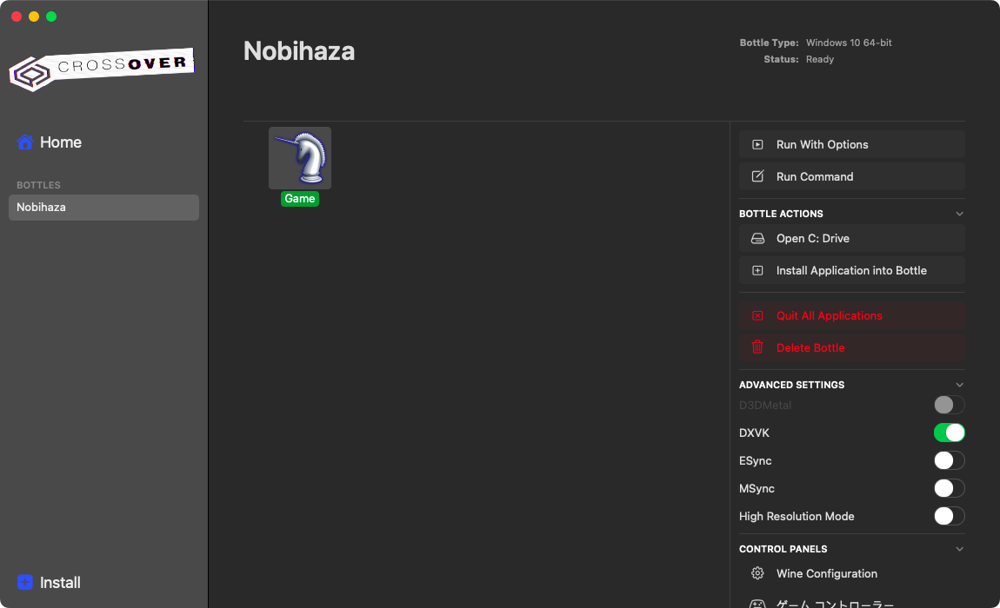

### Change the game's icon

#### Convert the icon file to `.icns`

* Go to the [website to download icns creator](https://github.com/alptugan/icns-creator/releases/latest), and download the `icns.creator.zip` file. Extract that file and you will see an application named **icns creator**.

{: .note }
> The **icns creator** application requires macOS 11.0 or later. If you are using an older version of macOS, you can also find an image to ICNS converter tool on the Internet.

* Drag the image you want to convert into the **icns creator** window, or you can also click the word **Browse** to select an image. Then click the `.icns` tab to switch to ICNS instead of IconSet.

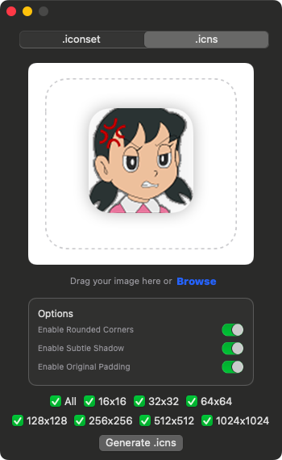

* Uncheck everything, leaving only the **1024x1024** option selected.

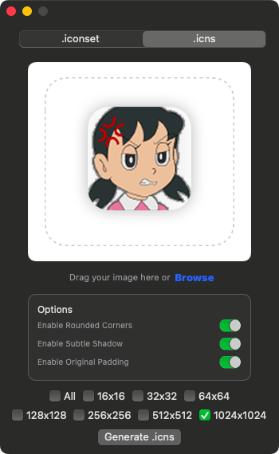

* Click the **Generate .icns** button and choose a folder to save the converted file. Go to the chosen folder and you will see a new `.icns` file with the same name as the image you selected.

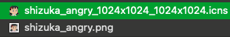

#### For Kegworks

* If you are in the **Custom Executable Launcher Maker** window, you can click the **Browse** button in the **Icon to use** section and select the newly created `.icns` file.

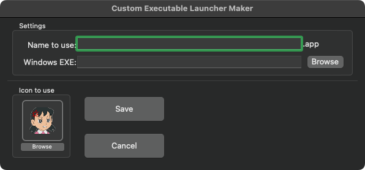

* For a game you have already created, right-click the game's name in the `Contents` folder and click **Show Package Contents**.

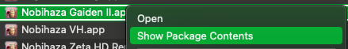

* Go to the `Contents/Resources` folder and delete the old `Kegworks.icns` file.

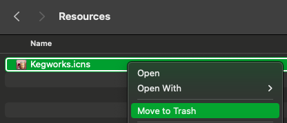

* Copy the `.icns` file you created into the `Resources` folder, and rename it to `Kegworks.icns`.

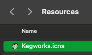

#### For NW.js

* Right-click the game's name and click **Show Package Contents**.

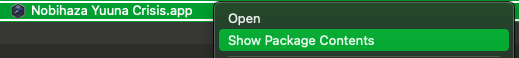

* Go to the `Contents/Resources` folder of the application. Delete the two files `app.icns` and `document.icns`.

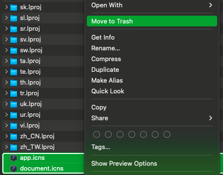

* Copy the `.icns` file you created twice and rename them to `app.icns` and `document.icns` respectively.

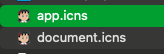

#### Clear cache

macOS caches icons, so the game's icon may not change immediately after you have changed the `.icns` file.

* Open the Terminal application and enter the following commands. You will be asked to enter your computer's password.

```sh
sudo rm -rfv /Library/Caches/com.apple.iconservices.store;
sudo find /private/var/folders/ \( -name com.apple.dock.iconcache -or -name com.apple.iconservices \) -exec rm -rfv {} \;;
sleep 3;
sudo touch /Applications/*;
killall Dock;
killall Finder
```

* Finder will restart. You can go back to the folder containing the game and you will see the game's icon has been changed.

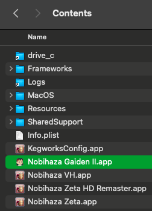

### Run RPG Maker MV games in a browser

On some Macs, using a Chromium-based browser (which includes NW.js as it is based on Chromium) will be laggier than using Firefox or Safari, so if your machine is experiencing this issue, you can try running the game on those browsers.

{: .caution }
> Not all games will run this way. If you encounter errors when playing the browser version, you must go back to playing with NW.js.

* Go to the GitHub page to download the **Simple HTTP Server** tool [here](https://github.com/TheWaWaR/simple-http-server/releases), then select the file:
    * `x86_64-apple-darwin-simple-http-server` if you are using a Mac with an Intel CPU;
    * `aarch64-apple-darwin-simple-http-server` if you are using a Mac with an Apple silicon CPU (M1 and later).

{: .note }
> You can rename the `*-apple-darwin-simple-http-server` file to a more memorable name.

* Open the Terminal application and enter the following command:

```sh
chmod +x ~/Downloads/*-apple-darwin-simple-http-server
~/Downloads/*-apple-darwin-simple-http-server --cors --index ~/game/www
```

Where `~/Downloads/*-apple-darwin-simple-http-server` is the path to the file you just downloaded, and `~/game/www` is the *`www` folder of the game folder* (`Contents/Resources/app.nw` if you use NW.js, or the game folder after you have downloaded and extracted it). For example, see the image below:

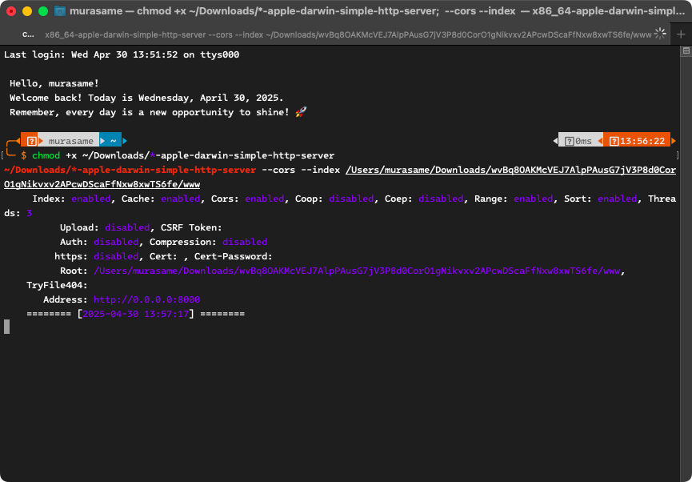

* Copy the address in the **Address** section of that window, which in the image above is `http://0.0.0.0:8000`, and paste it into your browser. The game will start, and now you just have to pray that the game's main screen will appear.<br>When you are done playing, you can close the Terminal window.

{: .caution }
> Firefox may get stuck on the Now Loading screen when playing games in this browser. You can grant Autoplay Audio permission and disable Tracking Prevention to minimize this situation (but there is no guarantee that it can be completely fixed).

### Transfer a Nobihaza game to another Mac

The `Nobihaza` application (or the different name you set in the **Prerequisites** section) already contains all the games and libraries you have installed, so you can transfer this application to another Mac (for someone else to use or if you have another Mac).

* Ensure the destination Mac has also [installed Kegworks Winery](./prerequisities#wine-and-kegworks) and has the same **Wrapper Version** as the **Engine** to avoid as many errors as possible. You can see this in the **Wrapper Version** and **Engine** sections in KegworksConfig.

* Copy the `Nobihaza` application (or other name) from the `/Users/username/Applications/Kegworks` folder, or create a compressed file if you want to upload it to the Internet.

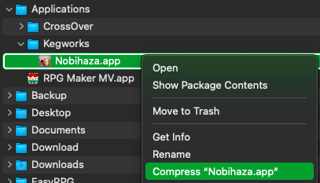

* On the destination Mac, place the application in the same `/Users/username/Applications/Kegworks` folder. After that, all the games from the other Mac can be played on the destination Mac without any further installation.