# EasyRPG
{: .no_toc }

Since EasyRPG is a cross-platform support tool for playing games, I will consolidate all errors related to EasyRPG in this separate section. The fixes will also apply to all platforms that EasyRPG supports.

## Table of Contents
{: .no_toc }

1. TOC
{:toc}

## `XXXX not found` (Cannot find file XXXX)

This error occurs mainly because EasyRPG is incorrectly identifying the game's language, so if the game's files contain special characters, they cannot be loaded.

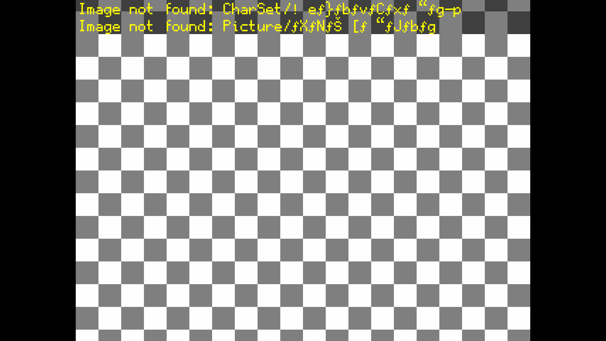

* Open the `RPG_RT.ini` file in the game folder with Notepad.

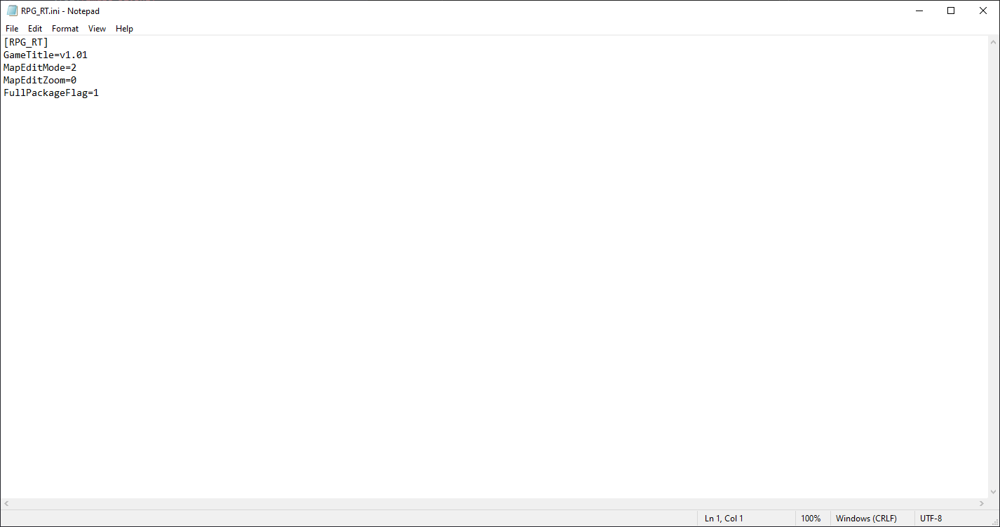

* Add the following lines to the end of that file:

```ini
[EasyRPG]
Encoding=932
```

If the game's language (or the language of the files in the game folder) is not Japanese, replace the number `932` with another number according to the following table:

| Language | Encoding Value |
| --- | --- |
| Japanese (Shift-JIS) | `932` |
| Chinese (Simplified) (GB2312) | `936` |
| Korean (Hangul) | `949` |
| Chinese (Traditional) (Big5) | `950` |
| Central European | `1250` |
| Cyrillic | `1251` |
| Western European (Latin1) | `1252` |

Ensure the Encoding line looks like the image below.

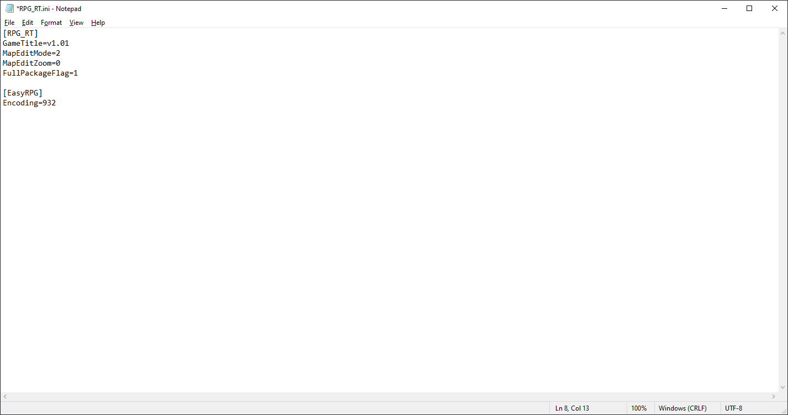

* Save the `RPG_RT.ini` file and restart the game.

If the error still occurs after making the changes, it's possible that the file is genuinely not in the game folder. Try re-extracting the game's compressed file and check for any errors during the extraction process.

## `Parse error` when changing language


This error occurs because the `.po` translation file of a map is corrupted. First, try re-extracting the game's compressed file. If that doesn't work, then report it to the developer.

You can also fix the corrupted `.po` files yourself, but you need to understand the structure of this file, and I cannot provide a full guide. However, it's roughly like this:

* First, completely close the game that has the error. Then open the `easyrpg_log.txt` file in the game folder and scroll to the last line. At this point, you will see clearly which line has the error:

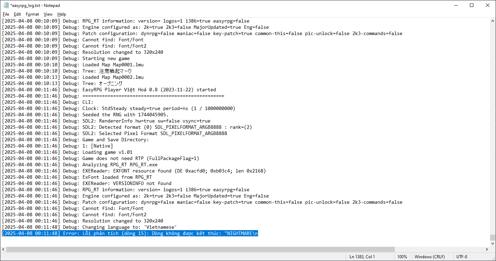

* Since EasyRPG's error log does not specify which map has the error, we must find it ourselves. Open any editor that **supports opening all files in a folder**. For example, here I will use **VSCodium**:

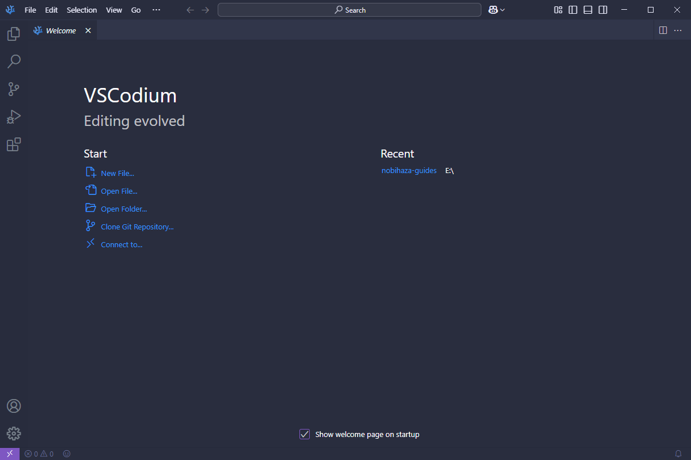

* Open the `Language\(language name)` folder within the game directory:

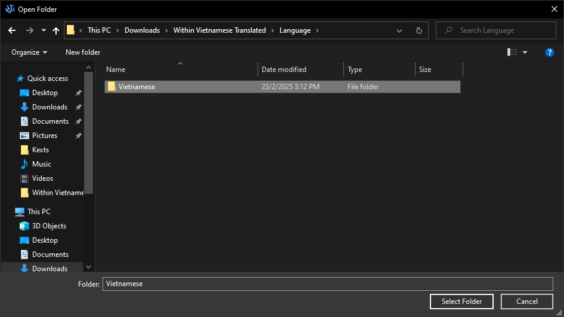

* Press the key combination `Ctrl + Shift + F` to open the search window for all files in the folder. Then go back to the `easyrpg_log.txt` file and copy the entire content after the word `ending`:

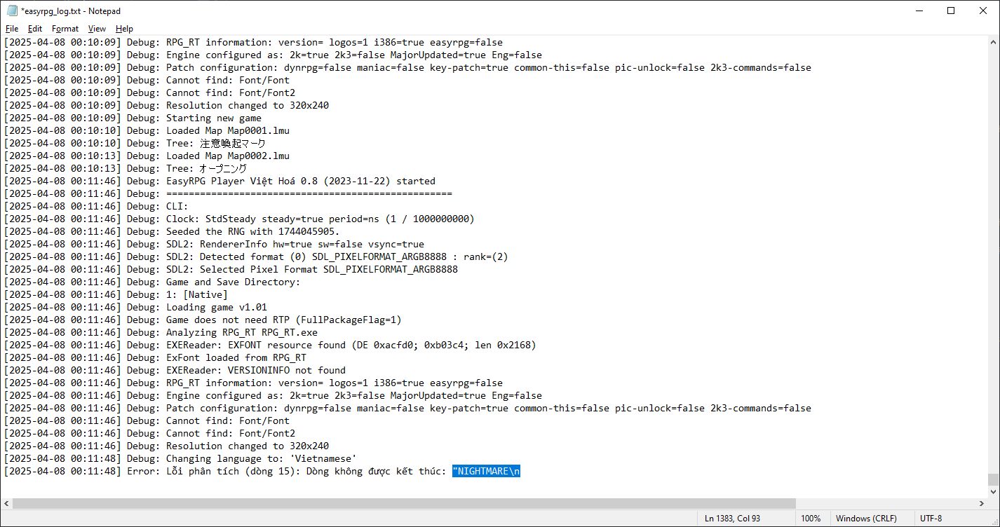

* Paste it into the Search box of the search window, and I have found that the error is in the `Map0002.po` file. When I click on the first result, I also see the error on line 15 of this file, just as recorded in EasyRPG's error log:

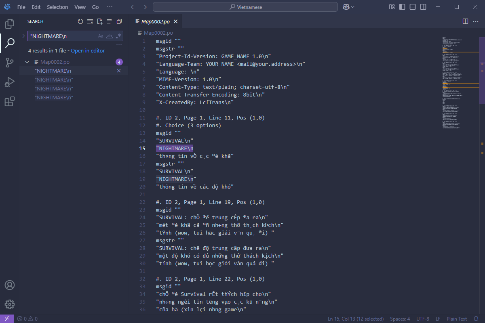

* Now, just fix the error and save the file after you're done.

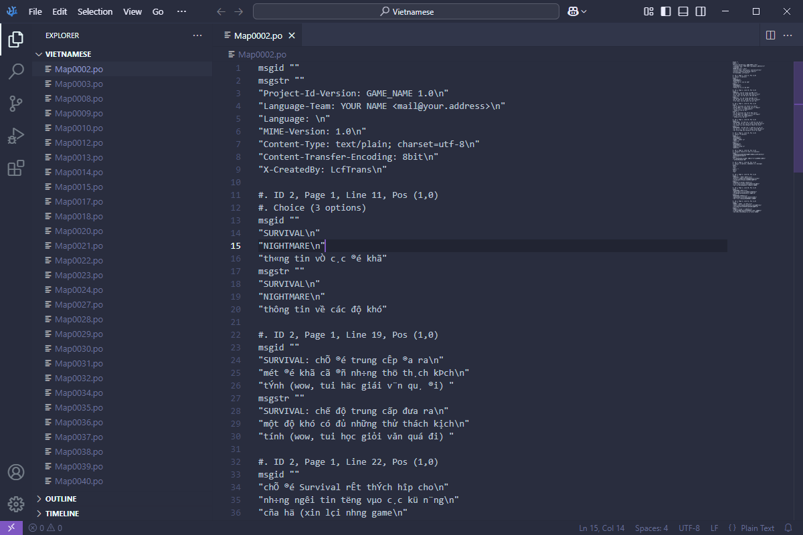

* Restart the game. If there are no more errors after changing the language, it means I have fixed all the errors related to the `.po` files.

## Error loading `RPG_RT.ldb` / Game crash while starting in RetroArch

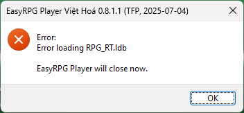

* You are playing from a password-protected compressed file. Please extract the game first and then try again.

* Your game folder path contains special characters. See each folder(s) in the path and remove **all** special characters from that folder.

## Install a custom soundfont to play MIDI music

### Find any soundfont

Please find any soundfont in `.sf2` format. For example, I often use the [Windows soundfont](https://musical-artifacts.com/artifacts/713) so that EasyRPG can play music with a sound quality similar to that on Windows.

### Install for a single game

Rename the `.sf2` file you downloaded to `easyrpg.soundfont` and place it in the game folder.

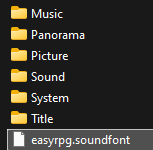

Restart the game and you will notice the sound quality of the game changes when playing MIDI music.

### Install for all games

{: .note }
> RetroArch cannot use this method.

* While running the game with EasyRPG, press the **F1** key to open the settings and go to the **Audio** -> **Soundfont** tab.


* Press the **Open soundfont folder** button. A folder containing soundfonts will be opened by your system's file manager. Copy the `.sf2` file you downloaded into that folder.

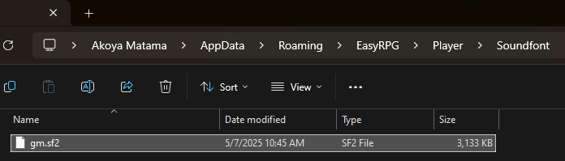

* Go back to EasyRPG, go back and select the **Soundfont** section again. You will see the `.sf2` file you copied; select that file and press Enter.

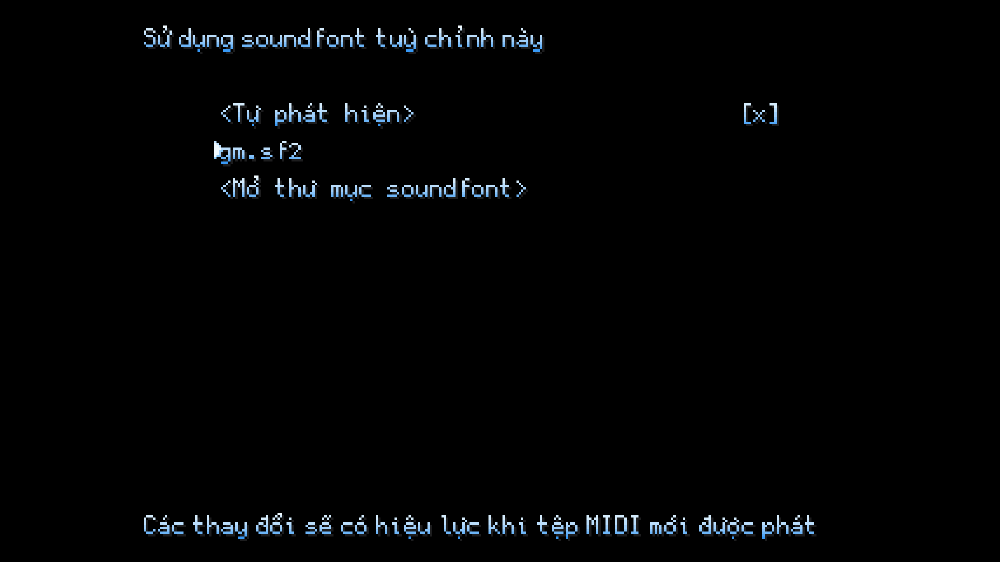

* Exit the settings interface and press the **Save settings** button, then restart the game.