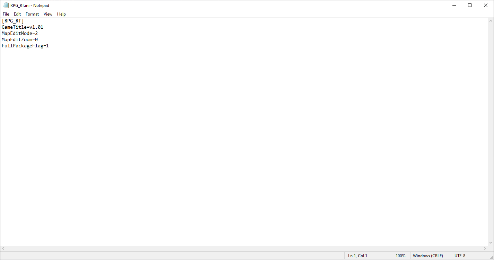
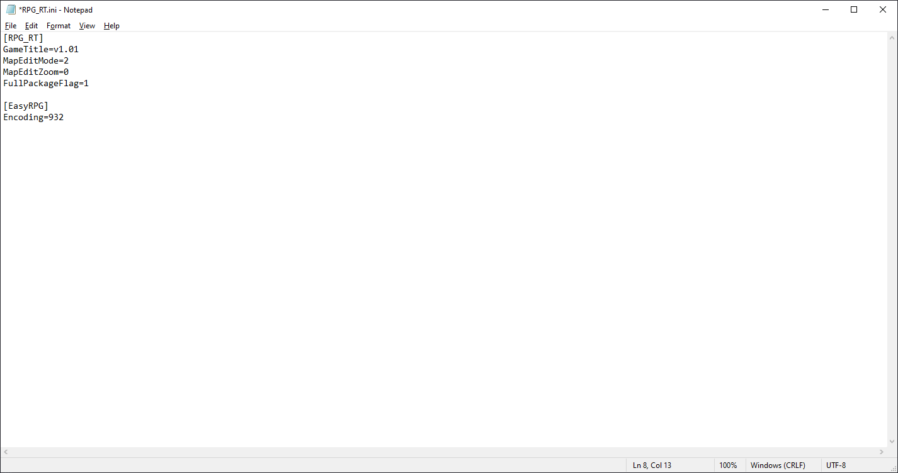
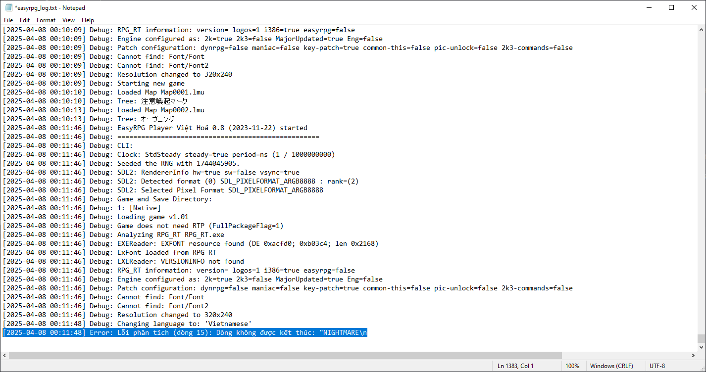
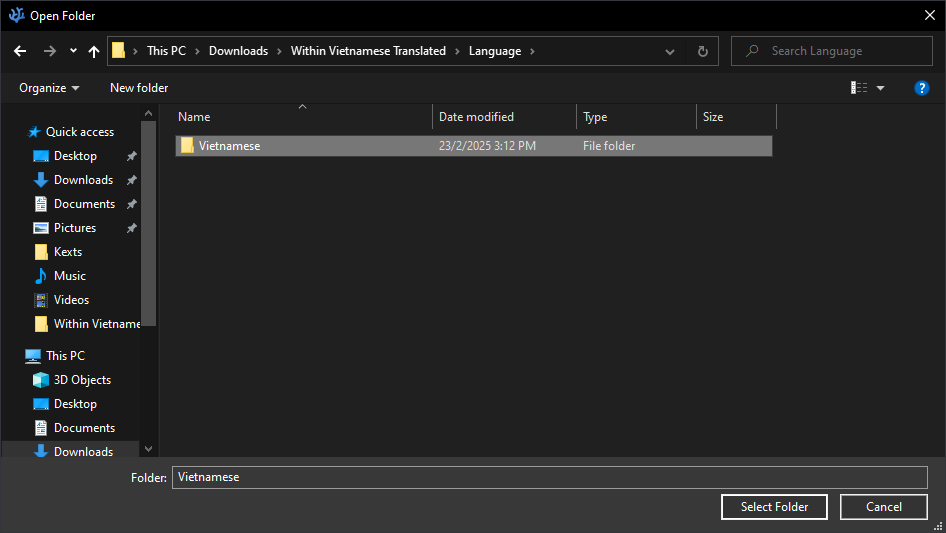
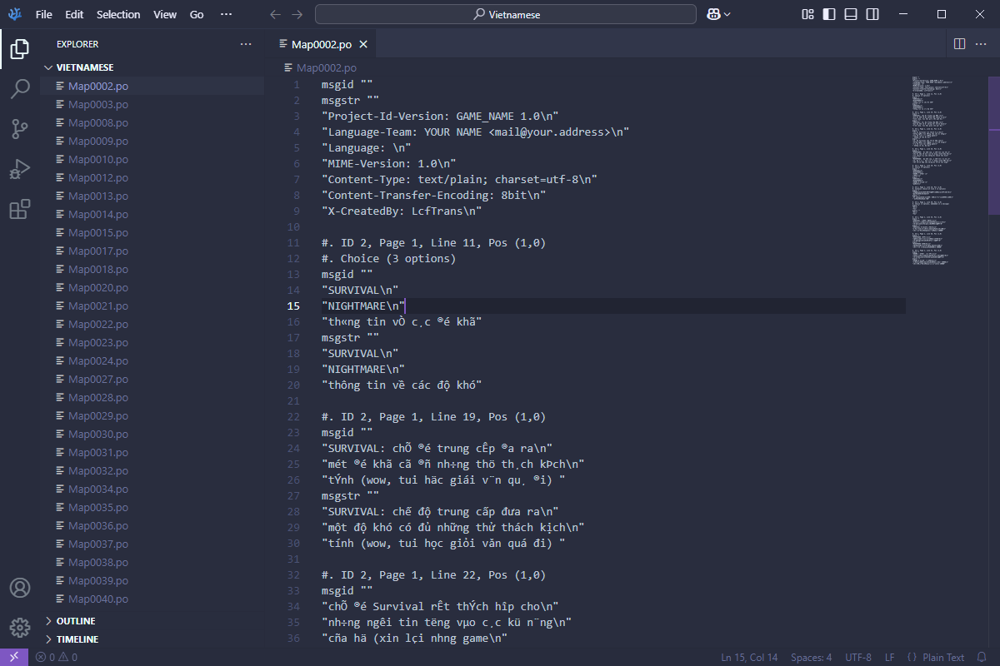
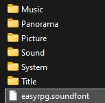
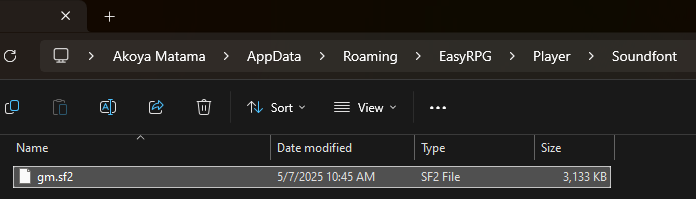

# EasyRPG
{: .no_toc }

Do EasyRPG là một công cụ hỗ trợ chơi game đa nền tảng, nên mình sẽ tổng hợp các lỗi liên quan tới EasyRPG ở riêng mục này. Cách sửa lỗi cũng sẽ áp dụng được cho tất cả nền tảng mà EasyRPG hỗ trợ.

## Mục lục
{: .no_toc }

1. TOC
{:toc}

## `XXXX not found` (Không thể tìm thấy tệp XXXX)

Lỗi này xảy ra chủ yếu là do EasyRPG đang nhận diện sai ngôn ngữ của game, nên nếu tệp tin của game có chứa kí tự đặc biệt thì sẽ không thể tải được.


* Mở tệp tin `RPG_RT.ini` trong thư mục game lên bằng Notepad.



* Thêm các dòng sau vào cuối tệp tin đó:

```ini
[EasyRPG]
Encoding=932
```

Nếu ngôn ngữ game (hoặc ngôn ngữ của các tệp tin trong thư mục game) không phải tiếng Nhật, thì thay số `932` bằng một số khác theo bảng sau:

| Ngôn ngữ | Giá trị của Encoding |
| --- | --- |
| Nhật Bản (Shift-JIS) | `932` |
| Trung Quốc (Giản thể) (GB2312) | `936` |
| Hàn Quốc (Hangul) | `949` |
| Trung Quốc (Phồn thể) (Big5) | `950` |
| Trung Âu | `1250` |
| Chữ Kyrin (Cyrillic) | `1251` |
| Tây Âu (Latin1) | `1252` |

Sao cho dòng Encoding giống như ảnh bên dưới này là được.



* Lưu lại tệp tin `RPG_RT.ini` và khởi động lại game.

Nếu sau khi sửa đổi mà vẫn xảy ra lỗi, có thể là do tệp tin đó thực sự không có trong thư mục game. Thử giải nén lại tệp tin nén của game và kiểm tra xem có lỗi nào trong quá trình giải nén không.

## `Parse error` / `Lỗi phân tích` khi chuyển đổi ngôn ngữ


Lỗi này xảy ra là do tệp tin dịch thuật `.po` của một bản đồ đang bị lỗi. Trước tiên thì bạn thử giải nén lại tệp tin nén của game, sau đó nếu không được nữa thì mới báo cáo cho nhà phát triển.

Bạn cũng có thể tự sửa các tệp tin `.po` đang bị lỗi, nhưng yêu cầu bạn phải hiểu được cấu trúc của tệp tin này, và mình cũng không thể hướng dẫn đầy đủ được. Tuy nhiên thì đại loại là như thế này:

* Đầu tiên là tắt hoàn toàn game đang bị lỗi đi. Sau đó mở tệp tin `easyrpg_log.txt` trong thư mục game lên và kéo đến dòng cuối cùng, lúc này bạn sẽ nhìn thấy rõ dòng nào đang bị lỗi:



* Do nhật ký lỗi của EasyRPG không chỉ rõ lỗi là ở bản đồ nào, nên chúng ta bắt buộc phải tự tìm. Bạn hãy mở bất kì trình sửa đổi nào **có hỗ trợ mở toàn bộ các tệp tin trong thư mục**, ví dụ như ở đây mình sẽ dùng **VSCodium**:


* Mở thư mục `Language\(tên ngôn ngữ)` trong thư mục game:



* Nhấn tổ hợp `Ctrl + Shift + F` để mở cửa sổ tìm kiếm trong toàn bộ tệp của thư mục. Sau đó qua lại tệp tin `easyrpg_log.txt` và sao chép toàn bộ nội dung sau chữ `kết thúc`:


* Dán nó vào ô Search của cửa sổ tìm kiếm, và mình đã thấy được lỗi nằm ở tệp tin `Map0002.po`. Khi nhấn vào kết quả đầu tiên, mình cũng đã thấy lỗi ở dòng 15 của tệp tin này, giống như đã ghi ở nhật ký lỗi của EasyRPG:


* Giờ thì chỉ cần sửa lỗi và lưu lại tệp tin sau khi đã sửa xong.



* Khởi động lại game, nếu không còn lỗi sau khi đã chuyển đổi ngôn ngữ thì tức là mình đã sửa xong hết tất cả các lỗi liên quan đến các tệp `.po`.

## Game bị lỗi hiển thị phông chữ


Nếu là game được dịch ra tiếng Việt, có thể là game đang sử dụng kiểu dịch cũ (thay đổi phông chữ và chạy trực tiếp bằng RPG_RT), nên nó sẽ không hỗ trợ chơi trên EasyRPG do khác phông chữ. Bạn cần chơi trực tiếp bằng tệp tin `RPG_RT.exe`.

## Error loading `RPG_RT.ldb` / Game crash trong khi khởi động ở RetroArch


* Bạn đang chơi bằng tệp tin nén có đặt mật khẩu. Hãy giải nén game ra trước sau đó thử lại.

* Đường dẫn thư mục game của bạn đang chứa kí tự đặc biệt (kể cả tiếng Việt có dấu). Xem dấu `?` nằm ở (các) thư mục nào trong đường dẫn, và xoá **tất cả** kí tự đặc biệt trong thư mục đó.

## Cài đặt soundfont tuỳ chỉnh để phát nhạc MIDI

### Tìm soundfont bất kì

Bạn hãy tìm một soundfont bất kì có định dạng là `.sf2`. Ví dụ như mình hay dùng [soundfont của Windows](https://musical-artifacts.com/artifacts/713) để cho EasyRPG có thể phát nhạc với chất âm giống như bên Windows.

### Cài đặt cho từng game

Đổi tệp tin `.sf2` bạn đã tải xuống thành `easyrpg.soundfont` và cho nó vào thư mục game.


Khởi động lại game và bạn sẽ thấy chất âm của game khi phát nhạc MIDI thay đổi.

### Game không phát nhạc MIDI hoặc chất lượng âm thanh kém

{: .note }
> RetroArch sẽ không sử dụng được cách này.

* Trong khi chạy game bằng EasyRPG, nhấn nút **F1** để mở phần cài đặt và qua mục **Âm thanh** -> **Soundfont**.



* Nhấn nút **Mở thư mục soundfont**. Một thư mục chứa soundfont sẽ được mở bằng trình quản lý tệp trên máy bạn. Sao chép tệp tin `.sf2` bạn đã tải xuống vào thư mục đó.



* Quay trở lại EasyRPG, quay về và chọn lại phần **Soundfont**. Bạn sẽ thấy tệp tin `.sf2` bạn đã sao chép, hãy chọn tệp tin đó và nhấn Enter.


* Thoát giao diện cài đặt và nhấn nút **Lưu cài đặt**, sau đó khởi động lại game.