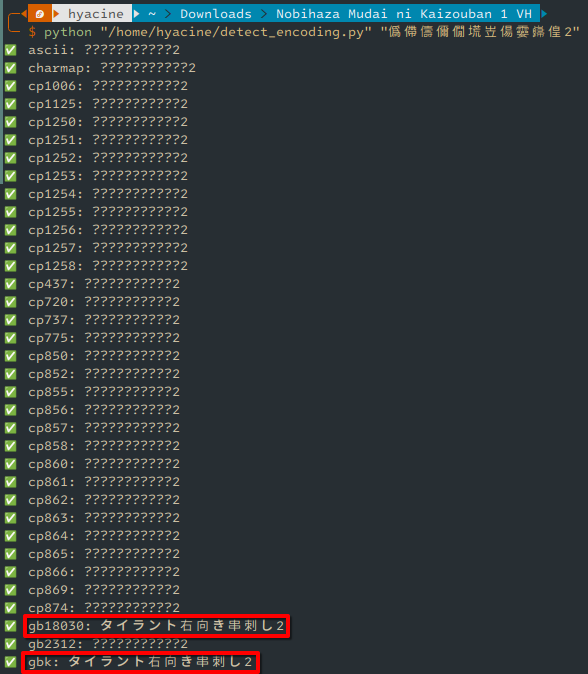

# Fixing Mojibake files
{: .no_toc }

## Table of Contents
{: .no_toc }

1. TOC
{:toc}

## Error description

There are some cases where a translator or developer compresses and extracts a game on a computer that has not yet been set to the Japanese region, and after compression/extraction, the names of the resource files become corrupted and contain meaningless characters as shown in the image below:


When you copy the file's name and put it into Google Translate, it has no meaning at all. If you encounter too many files like that, then the game has a Mojibake file error.

## Typical example

* A developer creates a game in Japanese, and it contains files with Japanese names. That developer compresses the files and uploads them to the web.<br>At this point, the names of the files in the compressed archive are still normal because their machine is already set to the Japanese region.

* A translator wants to translate the game into Vietnamese, and sets their computer's region to United States (US) or Vietnam.<br>This translator downloads the original game version and extracts it to their computer. At this point, the names of the extracted files on their machine will be corrupted due to the different encoding methods of the two regions.

* The translator finishes translating the game, re-compresses the translated folder, and uploads it to the web. At this point, the compressed file has been created with the corrupted filenames.<br>No matter which region the player of the translation sets, the names of those files cannot be restored to their original state, and a "file not found" error may occur.

## Solution

{: .important }
> This method is only supported on a computer, and you need to install [Python](https://www.python.org/downloads) before you start fixing the error.
>
> For Linux, Python may already be pre-installed; but if not, please refer to the guide for your distro.

### Detecting the mojibake's encoding format

{: .note }
> This data is based on my own research and may not be correct or complete. If you have better data, feel free to contribute it to this guide.

#### Via EasyRPG

If the game you are playing is based on RPG Maker 2000/2003, you can try running the game through EasyRPG. This software will automatically detect the encoding format of the files.

* Run the game through EasyRPG as I have instructed in the **Downloading and Running Games** section for your operating system.

* When you run the game and confirm it works, open the `easyrpg-log.txt` file in the game folder. Find the line that says **Detected encoding**, and the code after it will be the encoding format of the files in the game. Here it will be `windows-936-2000`.


* Then, referring to this table, you need to convert the encoding format that EasyRPG printed to the value below to prepare for the file renaming script:

| Value printed by EasyRPG | Value in Python |
| ---------------------- | ------------------- |
| `ibm-943_P15A-2003`    | `cp932`             |
| `windows-949-2000`     | `cp949`             |
| `windows-936-2000`     | `gbk`               |
| `ibm-5348_P100-1997`   | `cp1252`            |
| `ibm-5346_P100-1998`   | `cp1250`            |
| `ibm-5347_P100-1998`   | `cp1251`            |
| `ibm-9448_X100-2005`   | `cp1256`            |
| `ibm-5349_P100-1998`   | `cp1253`            |
| `ibm-9447_P100-2002`   | `cp1255`            |

* When comparing `windows-936-2000` with the table above, we get the value in Python as `gbk`.

#### Manually

* Copy the following script and save it with the name `detect_encoding.py`:

{: .note }
> In case the original filename before corruption was in a language other than Japanese, you need to change `shift-jis` on line 19 to the encoding format of that language, for example, `gbk` for a Chinese filename.

```python
import os
import sys
import pkgutil
import encodings

available_encodings = set(
    [modname for importer, modname, ispkg in pkgutil.iter_modules(encodings.__path__)]
)

if len(sys.argv) < 2:
    print("Usage: python detect_encoding.py <text>")
    sys.exit(1)

text = sys.argv[1]

for encoding in sorted(available_encodings):
    try:
        encoded = text.encode(encoding, errors="replace")
        decoded = encoded.decode("shift-jis")
        print(f"✅ {encoding}: {decoded}")
    except Exception:
        continue
```

* Get the corrupted name of any file in the game folder, for example, I will take the name `僞僀儔儞僩塃岦偒孁巋偟2`.

* Then run the script with the following command, paying attention to:
    * Replace `/path/to/detect_encoding.py` with the path of the `detect_encoding.py` file you just saved.
    * Replace `text` with the name of the corrupted file you copied in the previous step.

```sh
python "/path/to/detect_encoding.py" text
```

For example:

```sh
python "/home/hyacine/detect_encoding.py" "僞僀儔儞僩塃岦偒孁巋偟2"
```

* After running the script, it will print out all the encoding formats and the result after conversion.



* We can see that only `gb18030` and `gbk` have meaningful Japanese characters. You can take either of the two, but I will take `gbk`. This will be the value you need to use when running the next Python script.

### Start renaming

* Copy the following script and save it with the name `rename.py`:

{: .note }
> In case the original filename before corruption was in a language other than Japanese, you need to change `shift-jis` on line 7 to the encoding format of that language, for example, `gbk` for a Chinese filename.

```python
import os
import sys

def decode_filename(name: str, source_encoding: str) -> str | None:
    try:
        source_bytes = name.encode(source_encoding, errors="replace")
        return source_bytes.decode("shift_jis")
    except Exception:
        return None

def bulk_rename_files(root_folder: str, source_encoding: str):
    for dirpath, _, filenames in os.walk(root_folder):
        for name in filenames:
            new_name = decode_filename(name, source_encoding)
            if new_name and new_name != name:
                old_path = os.path.join(dirpath, name)
                new_path = os.path.join(dirpath, new_name)
                try:
                    os.rename(old_path, new_path)
                    print(f"✅ Renamed: {old_path} -> {new_path}")
                except Exception as e:
                    print(f"❌ Failed to rename: {old_path} ({e})")

if __name__ == "__main__":
    if len(sys.argv) != 3:
        print("Usage: python rename.py <root_folder> <source_encoding>")
        sys.exit(1)

    root = sys.argv[1]
    encoding = sys.argv[2]
    bulk_rename_files(root, encoding)
```

* Then run the script with the following command, paying attention to:
    * Replace `/path/to/rename.py` with the path of the `rename.py` file you just saved.
    * Replace `/path/to/game/folder` with the path of the game folder.
    * Replace `encoding` with the **value in Python** that you found from one of the two methods above.

```sh
python "/path/to/rename.py" "/path/to/game/folder" encoding
```

For example:

```sh
python "/home/hyacine/rename.py" "/home/hyacine/Nobihaza/MudaiNiKaizouban" gbk
```

* If the script prints the word **Renamed** with the original name, it means you have found the correct encoding format, and the script has successfully renamed the file back to normal Japanese. If the script does not print any lines (or displays a **Failed to rename** error), you need to recheck the encoding format.


* At this point, if you go back to the game folder, you will also see that the names of the resource files have been restored to their original state.

