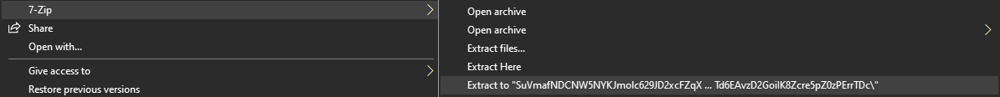
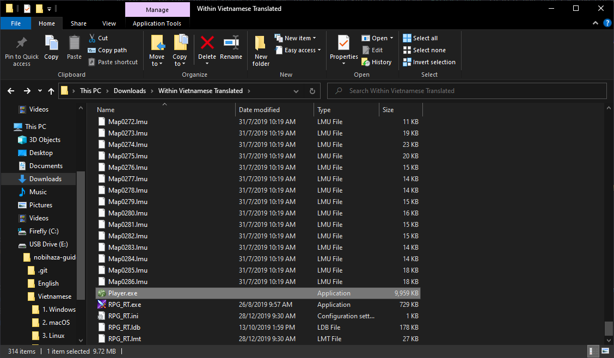

# Downloading and Running Games
{: .no_toc }

All Nobihaza games support Windows, so running them on Windows is the easiest, and you won't have to do anything extra if you have already prepared everything in the [Prerequisites](./prerequisities) section.

## Table of Contents
{: .no_toc }

1. TOC
{:toc}

## Downloading the game

To download, you just need to go to the website and download the game version. It could be a compressed file (`.zip`, `.rar`, `.7z`) or an `.exe` file.

If the game's page supports multiple operating system versions, be sure to select the version for your Windows (especially `32-bit` and `64-bit`).

## Extracting the game

It is recommended to use third-party decompression software like WinRAR or 7-Zip (mentioned in the Prerequisites section) to extract the game. You should extract using the `Extract to` command as shown in the image below instead of `Extract here`, because some compressed files do not have a nested folder, so extracting with `Extract here` will place all the files directly into the download folder, making them difficult to find.

{: .important }
> **Do not** play the game directly from the compressed file without extracting it first. If you do, there is a 99% chance that your save file will not be saved when you close the decompression software!

## Starting the game

### RPG Maker 2000/2003

For this engine, there are 2 ways to play:

#### Playing with `RPG_RT.exe`

* Open the extracted game folder and double-click the `RPG_RT.exe` file to play.

{: .note }
> If the game folder has other `.exe` startup files (like `start.exe` or `play.exe`), you should try starting the game with those files first. Read the game's `README` file (if available) for more information about the game and how to start it.

* If the game is in fullscreen mode, you can press `F4` to switch to windowed mode.

#### Playing with EasyRPG software

* Re-open the folder containing the `Player.exe` file from EasyRPG that you downloaded from the Prerequisites section of this guide.

* Copy that file and paste it into the game folder.
    * If you have already copied the file to the parent folder containing the game's folder, you don't need to do this step. Instead, run the `Player.exe` file in that parent folder, and EasyRPG will display a selection menu for you to choose the game.

* Finally, double-click the `Player.exe` file to play.

### RPG Maker XP/VX/VX Ace

#### Playing with the `Game.exe` file (RGSS Player)

You just need to double-click the `Game.exe` file (or another startup file mentioned in the game's description or `README` file, if available).

#### Playing with the MKXP tool

* Some games will come with MKXP integrated instead of using RGSS Player. If you run the `Game.exe` file and see an icon of a silhouette containing a Pokéball as shown below, it means the game is running on MKXP.

* If the game doesn't have it integrated but you still want to run it with MKXP, you can read [this guide](./troubleshooting#ch%E1%BA%A1y-game-rpg-maker-xpvxvx-ace-b%E1%BA%B1ng-mkxp). Note that not all games will be compatible.

### RPG Maker MV

There is only one way: double-click the `Game.exe` file (or another startup file mentioned in the game's description or `README` file, if available).