# Prerequisites
{: .no_toc }

Before playing any Nobihaza game, please ensure your computer has the following installed:

## Table of Contents
{: .no_toc }

1. TOC
{:toc}

## Initial setup

{: .important }
> These are necessary for almost all games!

### DirectX End-User Runtime

* Download the offline DirectX installer [here](https://download.microsoft.com/download/8/4/a/84a35bf1-dafe-4ae8-82af-ad2ae20b6b14/directx_Jun2010_redist.exe).

* Run the `directx_Jun2010_redist.exe` file. Click **Yes** when this dialog box appears.

* Enter the path to extract the DirectX installer, then click OK.

* Open the folder path you just entered. Double-click the `DXSETUP.exe` file in that folder.

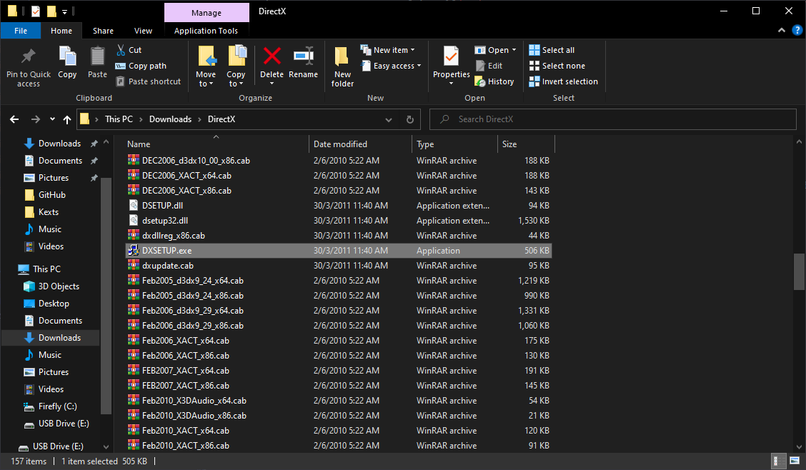

* Agree to the terms of use, then click Next and wait for the installation process to complete until you see this screen.

### Microsoft Visual C++ Redistributable

Some games will also need this library. I recommend using the AIO installer from TechPowerUp as it is the easiest to install.

* Access [this website](https://www.techpowerup.com/download/visual-c-redistributable-runtime-package-all-in-one) by TechPowerUp.

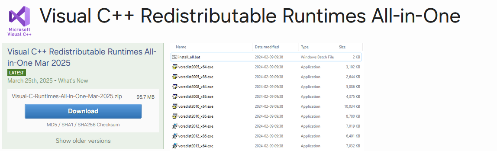

* Click the **Download** button and select the nearest server (the one with `closest to you`).

* Extract the file you just downloaded, then go into the newly extracted folder and right-click the `install_all.bat` file, then click **Run as administrator**.

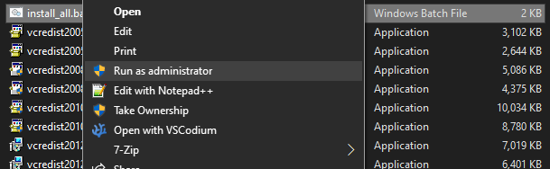

* A black command-line window will appear. Keep that window open until it closes on its own, which means the library has been successfully installed.

### Change the computer's region to Japan

Most Nobihaza games are Japanese, so you need to change your computer's region to Japan to have the most stable playing experience.

* Press `Windows + R` to open the Run window, type `control`, then click OK.

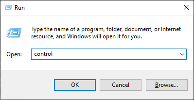

* Select the **Region** item.

* The **Region** window will appear. Switch to the **Administrative** tab and click the **Change system locale** button.

* Change the **Current system locale** to **Japanese (Japan)** then click OK.

* Restart your computer to apply the changes.

### 7-Zip decompression tool

{: .note }
> If you already have **WinRAR**, you can skip this step and use WinRAR for decompression instead.

The default Windows decompression tool can cause errors (especially with password-protected archives), so I recommend using third-party decompression software to avoid issues.

* Download the 7-Zip software [here](https://www.7-zip.org/download.html).

* You only need to pay attention to the three `.exe` items at the top of the page. Download the version suitable for your machine (`32-bit` or `64-bit`).
    * The `arm64` version is for computers running ARM CPUs, for example, the **Lenovo ThinkPad X13s** (this is just an example, not a sponsorship).

* Click on the downloaded `.exe` file. Then click the **Install** button to begin the installation.

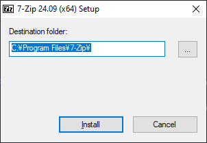

* After the installation is complete, click the **Close** button to close the installer.

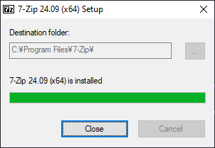

* Whenever you encounter a compressed file, right-click on it and select `7-Zip -> Extract to ...`

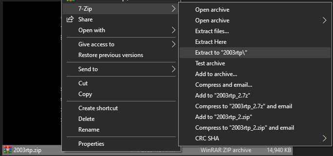

### Locale Emulator

If you don't want to change your computer's region to Japan, you can also use Locale Emulator to play. However, it will not be as stable, and the stability depends on the game you intend to play.

* Download Locale Emulator [here](https://github.com/xupefei/Locale-Emulator/releases/download/v2.5.0.1/Locale.Emulator.2.5.0.1.zip).

* Extract the `Locale.Emulator.2.5.0.1.zip` file and run the `LEInstaller.exe` file. Click the **Install for all users** button to proceed with the installation.

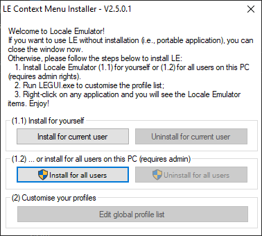

## RPG Maker 2000/2003

### Japanese Runtime Package (RTP)

* Download the [Japanese RTP 2000](https://cdn.tkool.jp/updata/rtp/2000rtp.zip) and [Japanese RTP 2003](https://cdn.tkool.jp/updata/rtp/2003rtp.zip).

* Extract both the `2000rtp.zip` and `2003rtp.zip` files.

* Go into the `2000rtp\RTPｾｯﾄｱｯﾌﾟ` folder and right-click on the `RPG2000RTP.exe` file, then select `Run as administrator`.

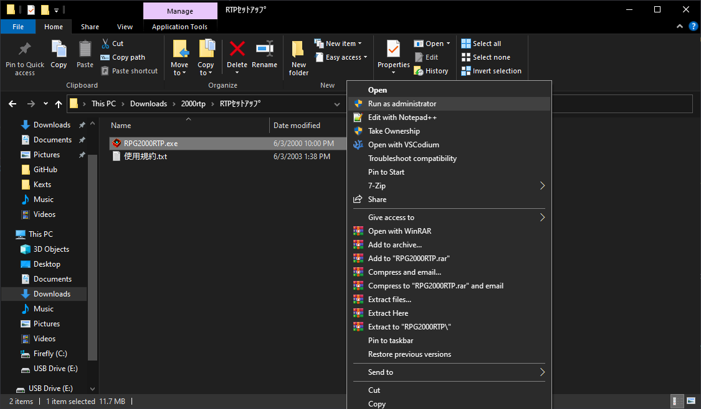

* Just click Next (the button with the N) and wait for it to install. If a screen like the one below appears, it means the installation was successful.

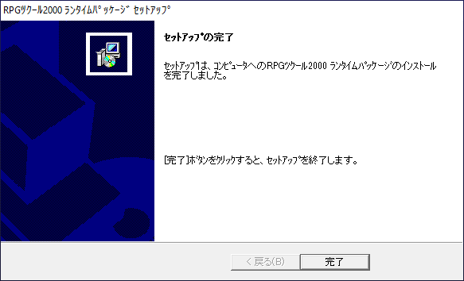

* Do the same for the `RPG2003RTP.exe` file in the `2003rtp\2003RTPｾｯﾄｱｯﾌﾟ` folder.

### English Runtime Package (RTP)

Some specific English Nobihaza games will also require this runtime package.

* Download the [English RTP 2000](https://dl.komodo.jp/rpgmakerweb/run-time-packages/rpg2000_rtp_installer.exe) and [English RTP 2003](https://dl.komodo.jp/rpgmakerweb/run-time-packages/rpg2003_rtp_installer.zip).

* The RTP 2000 is an `.exe` file so you don't need to extract it, but you will need to extract the RTP 2003.

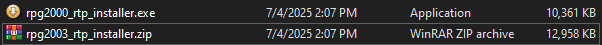

* Proceed with the installation just like the Japanese version.

### EasyRPG

Some translations will require EasyRPG to play. You can also play foreign Nobihaza games through EasyRPG without having to change your region, and it will also be more stable than Locale Emulator.

* Download the version for [Windows 32-bit](https://easyrpg.org/downloads/player/0.8.1.1/easyrpg-player-0.8.1.1-windows.zip) or [Windows 64-bit](https://easyrpg.org/downloads/player/0.8.1.1/easyrpg-player-0.8.1.1-windows-x64.zip).

* Extract the file you just downloaded, and you will see the `Player.exe` file.

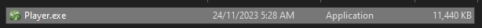

* You can either:
    * Copy it into the game folder and run this file directly to play.
    * Copy it into the parent folder containing your Nobihaza games. When you run `Player.exe`, you will be able to choose which game to play each time.

## RPG Maker XP/VX/VX Ace

There are almost no Nobihaza games that run on RPG Maker XP, but you should still install it if you encounter a game that uses this engine. As for VX and VX Ace, there are many, so please install all of them fully.

### Japanese Runtime Package (RTP)

* Download the Japanese RTP for:
    * [RPG Maker XP](https://cdn.tkool.jp/updata/rtp/xp_rtp103.zip)
    * [RPG Maker VX](https://cdn.tkool.jp/updata/rtp/vx_rtp202.zip)
    * [RPG Maker VX Ace](https://cdn.tkool.jp/updata/rtp/vxace_rtp100.zip)

* Extract the downloaded files. You will get 3 folders containing the RTP installation files for the 3 engines.

#### RPG Maker XP

* Run the `Setup.exe` file in the `xp_rtp103\RPGXP_RTP103` folder.

* Click Next (the first button with the letter N), until you see this screen, which means the installation was successful.

#### RPG Maker VX

Run the `Setup.exe` file in the `vx_rtp202\RPGVX_RTP202` folder, and do the same as for RPG Maker XP.

#### RPG Maker VX Ace

Run the `Setup.exe` file in the `vxace_rtp100\RPGVXAce_RTP100` folder, and do the same as for the two engines above.

### English Runtime Package (RTP)

* Download the English RTP for:
    * [RPG Maker XP](https://dl.komodo.jp/rpgmakerweb/run-time-packages/xp_rtp104e.exe)
    * [RPG Maker VX](https://dl.komodo.jp/rpgmakerweb/run-time-packages/vx_rtp102e.zip)
    * [RPG Maker VX Ace](https://dl.komodo.jp/rpgmakerweb/run-time-packages/RPGVXAce_RTP.zip)

* Then extract and install similarly to the Japanese RTP.

### VL Gothic Font

Many games require this font. If you don't install it, you will very likely get the `Unable to find VL Gothic font` error.

Download this font [here](https://github.com/ovate/VL-Gothic-font/raw/refs/heads/main/fonts.zip).

## RPG Maker MV

RPG Maker MV is the easiest because you don't need to install any RTP at all. What you need is a machine with good specs because most games will require quite high system requirements!

# After you have finished, proceed to the [Downloading and Running Games](./installation) section
{: .no_toc }