# Điều kiện cơ bản
{: .no_toc }

Trước khi chơi bất kì game Nobihaza nào, hãy đảm bảo máy tính của bạn đã cài đặt những thứ đã được đề cập dưới đây:

## Mục lục
{: .no_toc }

1. TOC
{:toc}

## Cài đặt ban đầu

{: .important }
> Những cái này là cần thiết cho gần như tất cả các game!

### DirectX End-User Runtime

* Tải bộ cài DirectX bản offline [tại đây](https://download.microsoft.com/download/8/4/a/84a35bf1-dafe-4ae8-82af-ad2ae20b6b14/directx_Jun2010_redist.exe).

* Chạy tệp tin `directx_Jun2010_redist.exe`. Nhấn **Yes** khi hộp thoại này xuất hiện.

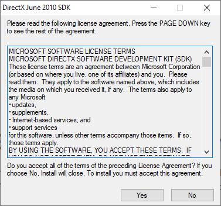

* Nhập đường dẫn để giải nén bộ cài DirectX, sau đó nhấn OK.

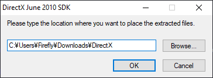

* Mở đường dẫn thư mục mà bạn vừa nhập. Nhấn đúp vào tệp tin `DXSETUP.exe` trong thư mục đó.

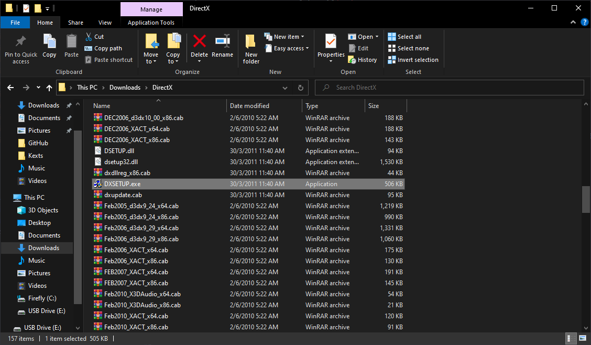

* Đồng ý với điều khoản sử dụng, sau đó nhấn Next và đợi quá trình cài đặt hoàn tất cho tới khi bạn thấy màn hình này.

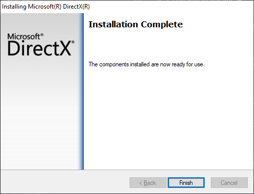

### Microsoft Visual C++ Redistributable

Một số game cũng sẽ cần thư viện này. Mình khuyên dùng bộ cài AIO của TechPowerUp vì nó dễ cài nhất.

* Truy cập vào [website này](https://www.techpowerup.com/download/visual-c-redistributable-runtime-package-all-in-one) của TechPowerUp.

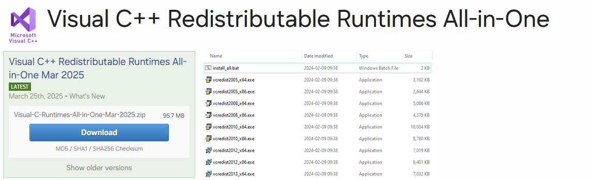

* Nhấn nút **Download** và chọn máy chủ gần nhất (có chữ `closest to you`).

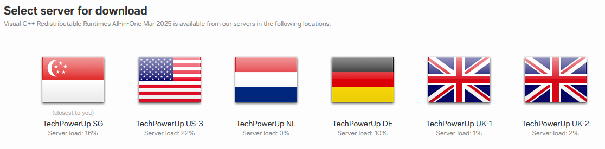

* Giải nén tệp tin bạn vừa tải xuống, sau đó vào thư mục vừa giải nén và chuột phải tệp tin `install_all.bat`, sau đó nhấn **Run as administrator**.

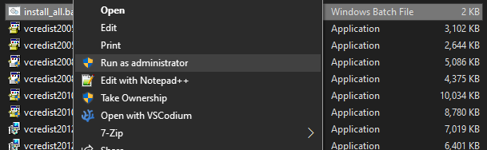

* Một cửa sổ dòng lệnh màu đen sẽ xuất hiện. Giữ nguyên cửa sổ đó cho đến khi nó tự thoát ra thì tức là thư viện đã cài đặt thành công.

### Chuyển vùng của máy thành Nhật Bản

Đa số game Nobihaza sẽ là game Nhật, nên bạn cần chuyển vùng của máy thành Nhật Bản để có thể có trải nghiệm chơi ổn định nhất.

* Nhấn tổ hợp `Windows + R` để mở cửa sổ Run, nhập `control` rồi nhấn OK.

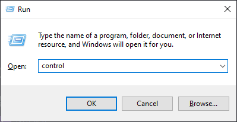

* Chọn mục **Region**.

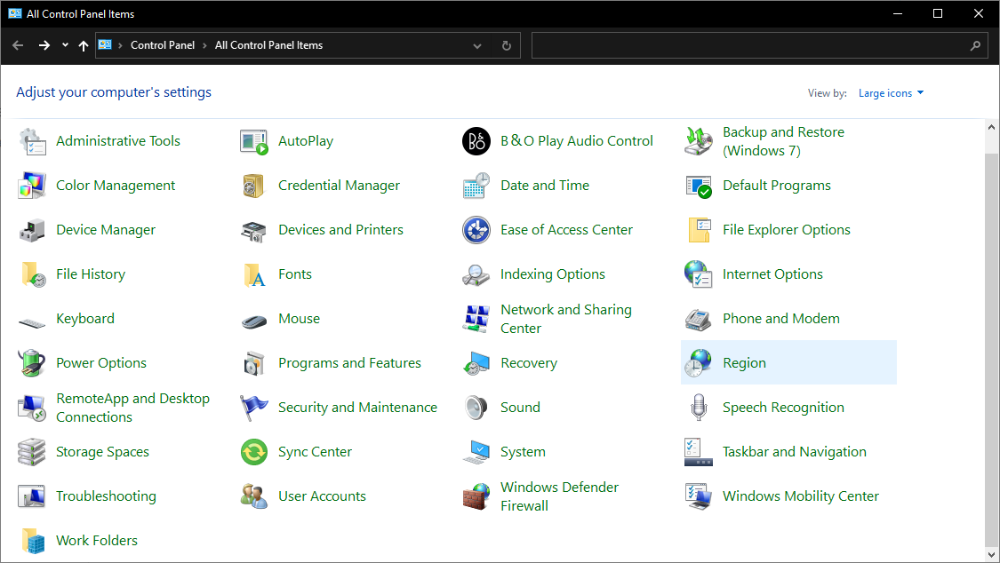

* Cửa sổ **Region** hiện ra, chuyển qua tab **Administrative** và nhấn vào nút **Change system locale**.

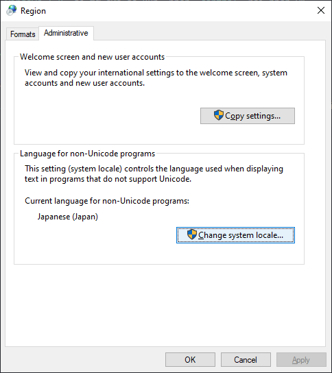

* Thay đổi **Current system locale** thành **Japanese (Japan)** rồi nhấn OK.

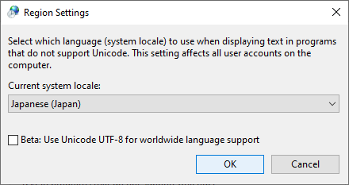

* Khởi động lại máy để áp dụng thay đổi.

### Công cụ giải nén 7-Zip

{: .note }
> Nếu bạn đã có **WinRAR** thì bạn có thể bỏ qua bước này và sử dụng WinRAR thay thế cho việc giải nén.

Công cụ giải nén mặc định của Windows có thể gây ra lỗi (đặc biệt là với các tệp tin nén có đặt mật khẩu) nên mình khuyên các bạn nên dùng phần mềm giải nén bên ngoài để đỡ phát sinh lỗi hơn.

* Tải phần mềm 7-Zip [tại đây](https://www.7-zip.org/download.html).

* Bạn chỉ cần chú ý đến 3 mục `.exe` ở đầu trang. Tải xuống bản game phù hợp với máy của bạn (`32-bit` hoặc `64-bit`).
    * Phiên bản `arm64` là phiên bản dành cho các máy tính chạy CPU ARM, ví dụ như **Lenovo ThinkPad X13s** (chỉ là ví dụ chứ không tài trợ).

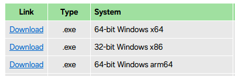

* Nhấn vào tệp tin `.exe` vừa tải xuống. Sau đó nhấn vào nút **Install** để bắt đầu cài đặt.

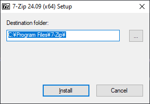

* Sau khi cài đặt xong thì nhấn nút **Close** để đóng trình cài đặt.

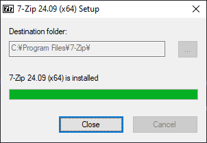

* Mỗi khi bạn gặp một tệp tin nén, hãy nhấn chuột phải vào tệp tin đó và chọn `7-Zip -> Extract to ...`

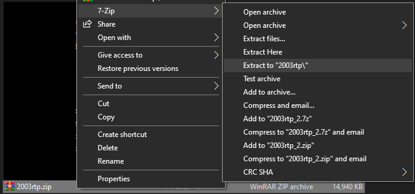

### Locale Emulator

Nếu bạn không muốn chuyển vùng máy tính sang Nhật Bản, bạn cũng có thể sử dụng Locale Emulator để chơi. Tuy nhiên nó sẽ không được ổn định bằng, và độ ổn định còn tuỳ thuộc vào game bạn định chơi.

* Tải Locale Emulator [tại đây](https://github.com/xupefei/Locale-Emulator/releases/download/v2.5.0.1/Locale.Emulator.2.5.0.1.zip).

* Giải nén tệp tin `Locale.Emulator.2.5.0.1.zip` và chạy tệp tin `LEInstaller.exe`. Nhấn vào nút **Install for all users** để tiến hành cài đặt.

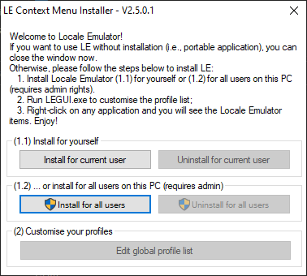

## RPG Maker 2000/2003

### Gói khởi chạy (RTP) tiếng Nhật

* Tải xuống [RTP 2000 tiếng Nhật](https://cdn.tkool.jp/updata/rtp/2000rtp.zip) và [RTP 2003 tiếng Nhật](https://cdn.tkool.jp/updata/rtp/2003rtp.zip).

* Giải nén cả hai tệp tin `2000rtp.zip` và `2003rtp.zip`.

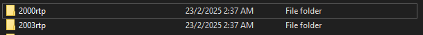

* Nhấn vào thư mục `2000rtp\RTPｾｯﾄｱｯﾌﾟ` và chuột phải vào tệp tin `RPG2000RTP.exe`, sau đó chọn `Run as administrator`.

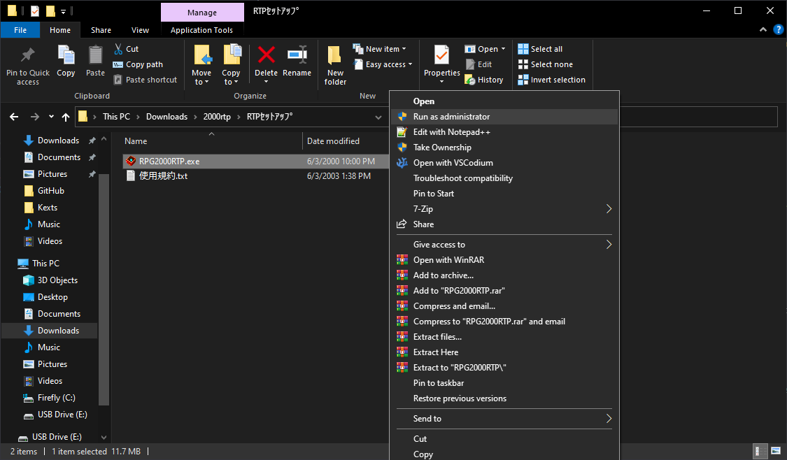

* Cứ nhấn Next (có chữ N) và đợi cho nó cài đặt. Nếu xuất hiện hình như bên dưới thì tức là đã cài đặt thành công.

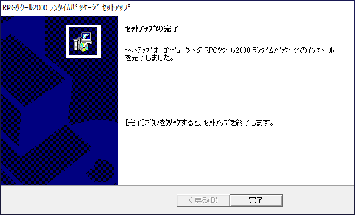

* Làm tương tự với tệp `RPG2003RTP.exe` trong thư mục `2003rtp\2003RTPｾｯﾄｱｯﾌﾟ`.

### Gói khởi chạy (RTP) tiếng Anh

Một số game Nobihaza tiếng Anh đặc thù cũng sẽ cần gói khởi chạy này.

* Tải xuống [RTP 2000 tiếng Anh](https://dl.komodo.jp/rpgmakerweb/run-time-packages/rpg2000_rtp_installer.exe) và [RTP 2003 tiếng Anh](https://dl.komodo.jp/rpgmakerweb/run-time-packages/rpg2003_rtp_installer.zip).

* RTP 2000 sẽ là tệp `.exe` nên bạn không cần giải nén, nhưng bạn sẽ cần giải nén RTP 2003.

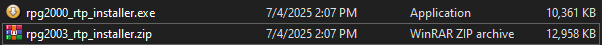

* Tiến hành cài giống như phiên bản tiếng Nhật.

### EasyRPG

Một số bản dịch sẽ yêu cầu EasyRPG để chơi. Bạn cũng có thể chơi các game Nobihaza nước ngoài thông qua EasyRPG mà không cần phải chuyển vùng, và nó cũng sẽ ổn định hơn Locale Emulator.

* Đối với người chơi Việt Nam, bạn nên tải bản EasyRPG có hỗ trợ kí tự tiếng Việt do mình sửa đổi. Tải bản dành cho [Windows 32-bit](https://github.com/The-Firefly-Project/EasyRPGPlayer-Vietnamese/releases/download/0.8.1.1/windows-x86.zip) hoặc [Windows 64-bit](https://github.com/The-Firefly-Project/EasyRPGPlayer-Vietnamese/releases/download/0.8.1.1/windows-x64.zip).

* Giải nén tệp tin bạn vừa tải, và bạn sẽ thấy tệp tin `Player.exe`.

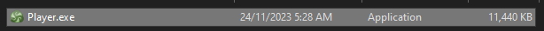

* Bạn có thể:
    * Copy vào thư mục game và chạy chính tệp tin này để chơi.
    * Copy vào thư mục mẹ chứa các game Nobihaza của bạn. Khi chạy tệp tin `Player.exe`, bạn sẽ có thể chọn game để chơi mỗi lần chạy.

## RPG Maker XP/VX/VX Ace

Gần như không có game Nobihaza nào chạy bằng RPG Maker XP, nhưng bạn vẫn nên cài nếu bạn gặp phải một game có sử dụng phần mềm làm game này. Còn VX với VX Ace thì sẽ có rất nhiều nên bạn hãy cài đầy đủ tất cả nhé.

### Gói khởi chạy (RTP) tiếng Nhật

* Tải RTP tiếng Nhật cho:
    * [RPG Maker XP](https://cdn.tkool.jp/updata/rtp/xp_rtp103.zip)
    * [RPG Maker VX](https://cdn.tkool.jp/updata/rtp/vx_rtp202.zip)
    * [RPG Maker VX Ace](https://cdn.tkool.jp/updata/rtp/vxace_rtp100.zip)

* Giải nén các tệp tin vừa tải xuống ra. Bạn sẽ nhận được 3 thư mục chứa tệp cài đặt RTP của 3 phần mềm làm game.

#### RPG Maker XP

* Chạy tệp `Setup.exe` trong thư mục `xp_rtp103\RPGXP_RTP103`.

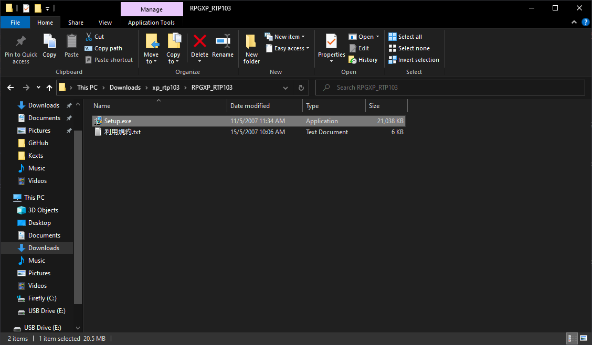

* Nhấn Next (nút đầu tiên có chữ N), cho đến khi có màn hình này thì tức là đã cài đặt thành công.

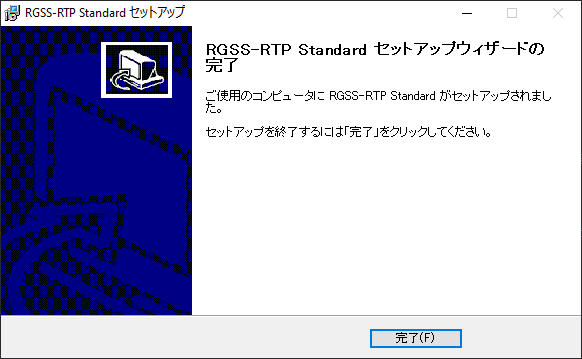

#### RPG Maker VX

Chạy tệp `Setup.exe` trong thư mục `vx_rtp202\RPGVX_RTP202`, và làm tương tự như RPG Maker XP.

#### RPG Maker VX Ace

Chạy tệp `Setup.exe` trong thư mục `vxace_rtp100\RPGVXAce_RTP100`, và làm tương tự như 2 phần mềm trên.

### Gói khởi chạy (RTP) tiếng Anh

* Tải RTP tiếng Anh cho:
    * [RPG Maker XP](https://dl.komodo.jp/rpgmakerweb/run-time-packages/xp_rtp104e.exe)
    * [RPG Maker VX](https://dl.komodo.jp/rpgmakerweb/run-time-packages/vx_rtp102e.zip)
    * [RPG Maker VX Ace](https://dl.komodo.jp/rpgmakerweb/run-time-packages/RPGVXAce_RTP.zip)

* Sau đó giải nén và cài đặt tương tự như RTP tiếng Nhật.

### Font VL Gothic

Có rất nhiều game yêu cầu font này, nếu bạn không cài đặt thì sẽ rất dễ bị lỗi `Unable to find VL Gothic font`.

Tải font này về [tại đây](https://github.com/ovate/VL-Gothic-font/raw/refs/heads/main/fonts.zip).

## RPG Maker MV

RPG Maker MV là nhàn nhất vì bạn không cần phải cài bất kì RTP nào cả. Những gì bạn cần là một máy có cấu hình tốt vì đa số game sẽ yêu cầu cấu hình khá cao!

# Sau khi đã hoàn tất, hãy tới phần [Tải và chạy game](./installation)
{: .no_toc }