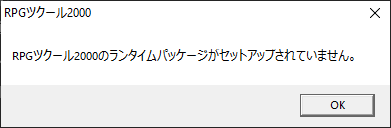
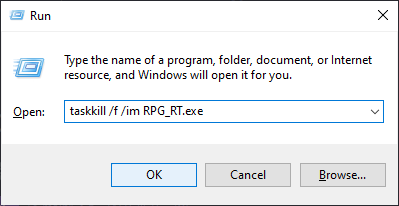
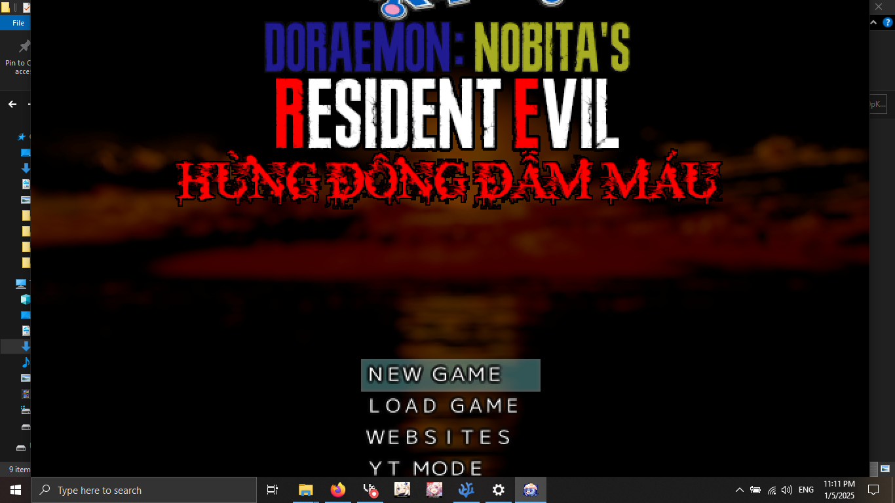
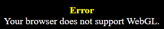
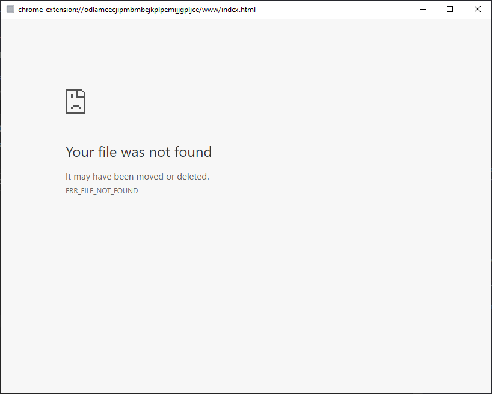
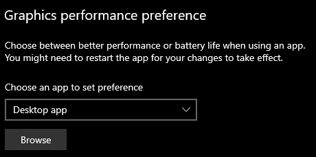
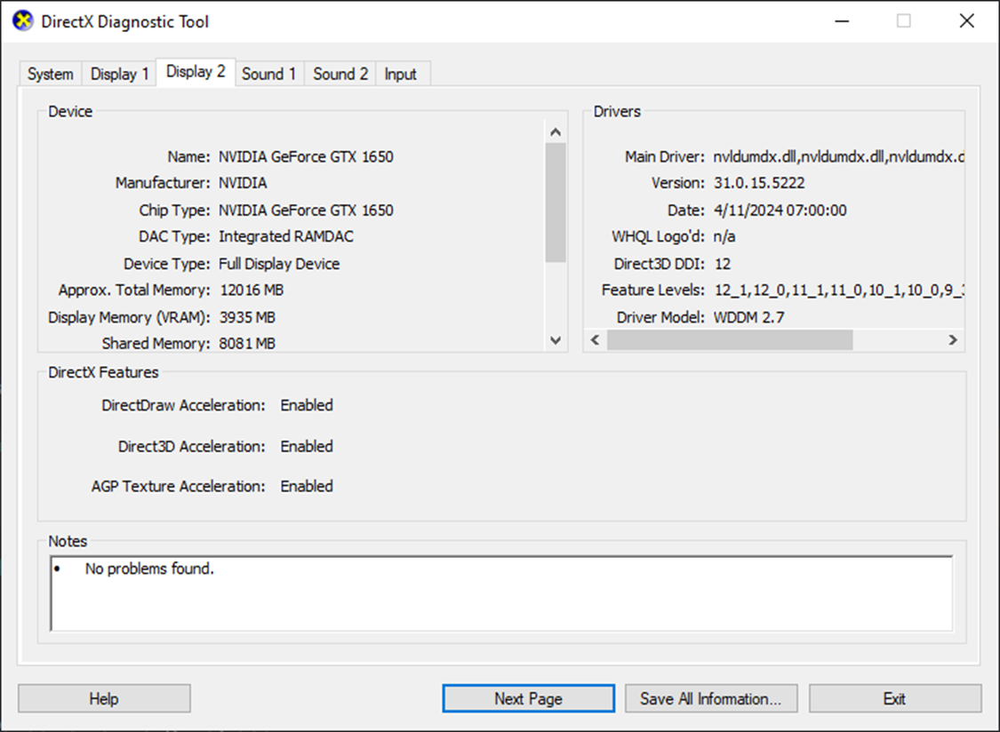

# Troubleshooting and Tips
{: .no_toc }

Below are fixes for common errors encountered when playing Nobihaza games, and some tips to optimize games on Windows.

This section reuses some images from [my old 2018 guide](https://gamerpgmakervn.blogspot.com/2018/07/huong-dan-fix-moi-loi-trong-game-rpg.html).

{: .important }
> You should only report errors to the game's developer if you have followed all the instructions below and the error still persists.

## Table of Contents
{: .no_toc }

1. TOC
{:toc}

## General

This section applies to all games, regardless of the engine it was made with.

### Cannot save game progress

This applies to both cases: the game shows an error when saving, and the game does not show the saved file upon restarting.

* If you haven't extracted the game yet, extract it to a folder.

* Ensure the game's file path does not contain any special characters (see the [`File corrupted! Please run a virus check / No game scripts specified`](#file-corrupted-please-run-a-virus-check--no-game-scripts-specified) section).

* Ensure you do not place the game folder in a folder/drive that cannot be written to (e.g., an SD card with write protection enabled, a drive/folder for which you do not have write permissions, or a drive with file writing errors). The best way is to try creating any file in the game folder to test its write capability, see if any error messages or permission requests appear. If not, try moving it to a different drive.

* The game will not run stably if you place the game folder in a cloud storage drive (some software like TeraBox, Google Drive, or OneDrive will display your cloud storage as a hard drive).

If the above methods cannot fix your error, report the error to the developer.

### Game lags despite using a high-spec computer

* If you are using a laptop, you should plug in the charger while playing.

* Close any running applications, including background apps. Click the arrow icon in the bottom right corner of the Taskbar. If you see any software you are no longer using, right-click its icon and click Exit.


{: .caution }
> You should not use **Task Manager** to close applications if you are not familiar with Windows, as the chance of you accidentally closing a system process is very high!

* Try running a full virus scan on your computer.

* [Try enabling the ultimate performance mode](#enable-ultimate-performance-mode-on-a-laptop).

* [Try updating your GPU driver to the latest version](#update-your-graphics-card-driver).

* [Try forcing the game to use the discrete GPU](#force-the-game-to-use-the-discrete-gpu-on-a-machine-with-2-gpus), if your machine has both an integrated and a discrete GPU.

If the game still lags after trying all the above methods:

* The game may not be well-optimized yet; you can contact the developer to fix the error.

* It's also possible that your computer is not as high-spec as you think. There are cases of scams selling low-spec computers at high prices; I just hope you don't encounter that. In this case, there is no other way; you must upgrade or switch to a new computer.

### Game displays square boxes/strange characters

* See [Prerequisites#Change the computer's region to Japan](./prerequisities#change-the-computers-region-to-japan).

* Check if there are any font files (ending in `.ttf`, `.otf`, or `.fon`) in the game folder. If so, install those fonts.

If the above methods cannot fix your error, report the error to the developer.

## RPG Maker 2000/2003 (`RPG_RT.exe`)

### `XXXX 乗り物 は開けません` (Cannot open file XXXX) / `???????????????????` (a bunch of question marks)


* Usually, this error is because you have not changed your computer's region to Japan, so the game cannot read files with Japanese names.<br>See [Prerequisites#Change the computer's region to Japan](./prerequisities#change-the-computers-region-to-japan).

* It could also be that the file is genuinely not in the game folder. Try re-extracting the game's compressed file and check for any errors during the extraction process.

{: .note }
> There is a rare case where the translator compressed the game on a computer that was not set to the Japanese region, and after compression, the names of the resource files become corrupted and contain meaningless characters (also known as Mojibake).
>
> This error will also prevent the game from finding the resource file. You can see more details about this error [here](../../miscellaneous/mojibake).

### `RPGツクール2000/2003のランタイムパッケージがセットアップされていません。` (The RPG Maker 2000/2003 Runtime Package is not installed)



See [Prerequisites#RPG Maker 2000/2003](./prerequisities#rpg-maker-20002003).

### Error related to `RPG_RT.lmt`


If the path in the message contains question marks (`?`), then your game folder path contains special characters. See which folder(s) in the path contain the `?` and remove **all** special characters from that folder.

### A bunch of `Not implemented` error messages


This error most often occurs when your computer has no audio device, and when you hover over the speaker icon on the Taskbar, you get a message like this:


* First, because the error message will appear many times, you need to force-close `RPG_RT.exe`. You can use **Task Manager**, or press `Windows + R`, then type `taskkill /f /im RPG_RT.exe` and press OK:



* If you are using a desktop computer, plug in any speakers or headphones first. If the red X on the speaker icon in the Taskbar is gone, then everything is fine.

* Check the audio driver on your computer. The fastest way is to search for your computer's name (if using a laptop or a pre-built PC) or the mainboard/soundcard name (if it's a desktop) to download the latest driver version.
    * For example, if my computer is an **Acer Nitro 5 AN515-57**, I would search on Google for **Acer Nitro 5 AN515-57 drivers**:<br>
    
    * Click on the manufacturer's Support page and click the **Drivers** tab. The list of drivers will then appear:<br>
    
    * Select the correct operating system you are using, find the latest Audio driver (with the most recent update date) and click the **Download** button. Then proceed with the installation like any other software.

* There are some other rare cases that are less likely to happen, but you can also check:
    * Press `Windows + R` to open the Run window, type `services.msc` and click OK.<br>
    
    * Scroll down to the **Windows Audio** section and check if it says **Running**. If not, right-click on Windows Audio and click **Start**:<br>
    
    * Press `Windows + R` again, type `devmgmt.msc` then click OK.<br>
    
    * Scroll down and expand the **Sound, video and game controllers** section. If you see any device with an arrow icon on it, right-click it and select **Enable device**:<br>
    

* After completing all the above steps, restart your computer to see if the error has been fixed.

### DirectDraw Error (`DDERR_UNSUPPORTED`)


* See [Prerequisites#DirectX End-User Runtime](./prerequisities#directx-end-user-runtime).

* Your driver version is too old, see the [Update your graphics card driver](#update-your-graphics-card-driver) section.

* Your graphics card is too old, upgrade your computer / replace the graphics card (if using a desktop).

* If it still doesn't work, try the following steps:
    * Right-click the `RPG_RT.exe` file in the game folder, and click on **Properties**.
    * Click on the **Compatibility** tab, then check the option **Run this program in compatibility mode**.
    * Select **Windows XP (Service Pack 3)** from the option box below.
    
    

* There are also some rare cases caused by your computer monitor; try replacing the monitor or the connection cable/port.

## RPG Maker 2000/2003 (EasyRPG)

See the [EasyRPG](../../miscellaneous/easyrpg) section.

## RPG Maker XP/VX/VX Ace

### RPGVX/RPGVXAce RTP is required to run this game


See [Prerequisites#RPG Maker XP/VX/VX Ace](./prerequisities#rpg-maker-xpvxvx-ace).

### RGSS202E.dll/RGSS202J.dll/RGSS300.dll/RGSS301.dll could not be found


* [Reinstall the entire RPG Maker VX Ace runtime package (RTP)](./prerequisities#rpg-maker-xpvxvx-ace).

* If reinstalling it doesn't work, you can also [download those .dll files directly](https://drive.google.com/file/d/1QTGjntOWisoUzk3NTfSBfk0bT2fNYBKc/view) and extract them into the game's `System` folder.

### Failed to initialize DirectX audio


The fix is the same as for the [Not implemented error in RPG Maker 2000/2003](#a-bunch-of-not-implemented-error-messages).

### File corrupted! Please run a virus check / No game scripts specified


The title bar of the error message will show the path of the corrupted file.

* If the path in the message contains question marks (`?`), then your game folder path contains special characters. See which folder(s) in the path contain the `?` and remove **all** special characters from that folder.

* The file may also have been corrupted during the extraction process; try re-extracting the game's compressed file.

* Your computer may actually be infected with a virus that is corrupting the aforementioned file. Run a full virus scan on your computer and download the game again.

### Unable to find VL Gothic font.


See [Prerequisites#VL Gothic Font](./prerequisities#vl-gothic-font).

### Script error


There is no other way; you must contact the developer to fix this error.

### Failed to load script


You have accidentally deleted the `Game.rgssad` / `Game.rgss2a` / `Game.rgss3a` file or the `Data` folder of the game. Re-extract the game's compressed file and try again.

### Unable to find file / No such file or directory


The fix is the same as for the [`XXXX 乗り物 は開けません` (Cannot open file XXXX) / `???????????????????` (a bunch of question marks) section for RPG Maker 2000/2003](#xxxx-乗り物-は開けません-cannot-open-file-xxxx---a-bunch-of-question-marks).

### A bunch of gibberish characters when starting the game


The fix is the same as for the [File corrupted! Please run a virus check / No game scripts specified](#file-corrupted-please-run-a-virus-check--no-game-scripts-specified) error.

### Error creating context/Failed to create GL context

{: .note }
> This error will 100% occur if you are using an old, low-spec machine (like an Intel Celeron or Intel Pentium). However, only a few games that use MKXP will have this error.

* Your operating system version is too old. Make sure you have upgraded to the latest version.

* Your driver version is too old, see the [Update your graphics card driver](#update-your-graphics-card-driver) section.

* Your graphics card is too old, upgrade your computer / replace the graphics card (if using a desktop).

### Game window is too large for the computer screen



This error is because the developer has set the game resolution higher than your computer's resolution (typical of games run with RGDirect; this compatibility layer also does not allow the player to change the game's size).

* Download the [ResizeEnable](http://www.digitallis.co.uk/pc/downloads/ResizeEnable.zip) software and extract the downloaded file. Then run the `ResizeEnableRunner.exe` file.


* You will see the ResizeEnable icon appear in the Taskbar.


* Restart the game and you can now freely resize the game window. Shrink the game window first, then click on the edge of the game window to bring down the game's title bar.

{: .important }
> You will need to do these steps every time you start the game. If you cannot resize the game window, click on the ResizeEnable icon in the Taskbar and then try changing it again.

* To close ResizeEnable, right-click the ResizeEnable icon in the Taskbar and click **Quit**.


## RPG Maker MV/MZ

### Your browser does not support WebGL



* Your operating system version is too old. Make sure you have upgraded to the latest version.

* Your driver version is too old, see the [Update your graphics card driver](#update-your-graphics-card-driver) section.

* Your graphics card is too old, upgrade your computer / replace the graphics card (if using a desktop).

### Loading Error (`Failed to load`)

The fix is the same as for the [`XXXX 乗り物 は開けません` (Cannot open file XXXX) / `???????????????????` (a bunch of question marks) section for RPG Maker 2000/2003](#xxxx-乗り物-は開けません-cannot-open-file-xxxx---a-bunch-of-question-marks).

However, there are some rare cases caused by an NW.js error; refer to the [Upgrade the NW.js version for RPG Maker MV](#upgrade-the-nwjs-version-for-rpg-maker-mv) section for more information.

### (Script) Error


You have to contact the developer about this error.

### Failed to load: `data/Actors.json`


You are trying to run the game's `index.html` file in a browser.

* Run the `Game.exe` file instead.

* If you still want to run the game in a browser, use a local web server and place the game folder containing the `index.html` file in it. Then, enter the address of the `index.html` file **on the local web server** instead of running the `index.html` file directly. See the [Run RPG Maker MV games in a browser](#run-rpg-maker-mv-games-in-a-browser) section to learn more.

### Your profile can not be used because it is from a newer version of NW.js


Some games/applications are using a newer version of NW.js, and the game you are running uses an older version of NW.js, which causes this conflict error.

You can completely ignore this error and continue playing without any further impact on your experience, but if you want to fix this error permanently:

* Upgrade **all** RPG Maker MV games (and other NW.js applications if any) on your machine to the same NW.js version. See the [Upgrade the NW.js version for RPG Maker MV](#upgrade-the-nwjs-version-for-rpg-maker-mv) section for more details.

* Press `Windows + R` to open the Run window, then type `%localappdata%` and click OK.

* Delete the `nwjs` folder in the window that just opened.


* Finally, restart the game.

### Your file was not found



You have accidentally deleted the game's `index.html` file. Re-extract the game from its compressed file and try again.

### `Required value 'name' is missing or invalid`


This error often occurs with some games that use a newer version of NW.js.

* Open the `package.json` file in the game folder with any text editor.

* Add the word `Game` inside the double quotes after the word `name` on line 2 as shown in the image below:


* Save the `package.json` file and restart the game.

### Failed to load extension from XXXX (different error from above)


The game's `package.json` file is corrupted. Try:

* Re-extracting the game from its compressed file and trying again.

* Fixing the error in the `package.json` file yourself if you are familiar with the JSON language and Node.js.

* Reporting this error to the developer.

### Game uses too much RAM (over 4 GB) right after starting

This has a more familiar name among tech folks: **memory leak**. Although this case is rare, some machines encounter it, including my own.

* Try downloading a different version of NW.js and follow the steps in the [Upgrade the NW.js version for RPG Maker MV](#upgrade-the-nwjs-version-for-rpg-maker-mv) section.

* If you are using the `32-bit` version on a `64-bit` machine, you can also download the `64-bit` version of NW.js and follow the steps in the section above.

### Game crashes during gameplay

There are many reasons why a game might crash during gameplay:

* The most common error is that the game uses too much RAM, exceeding the 4GB RAM limit of the `32-bit` version.
    * If you are using a `64-bit` version of Windows, you can download the `64-bit` version of NW.js to remove the 4GB RAM limit of the `32-bit` version.
    * You can also use **Task Manager** to check your computer's RAM usage. If you see the computer is consuming too much RAM while playing, consider closing background software, enabling virtual RAM, or upgrading your computer's RAM.

* The game is experiencing a situation similar to the **Game uses too much RAM (over 4 GB) right after starting** section above.

* The game may also be experiencing a serious programming error; you can report this incident to the game developer.

### `require is not defined`


This error usually only occurs when you play the game in a browser; otherwise, it is very rare in other cases.

* If you are trying to play in a browser and encounter this error, there is no other way; you can only go back to playing with the `Game.exe` file.

* If you are playing with the `Game.exe` file and still encounter this error (an extremely rare case), you can [upgrade the NW.js version for RPG Maker MV](#upgrade-the-nwjs-version-for-rpg-maker-mv).

## Tips for Windows

### Enable Ultimate Performance mode on a laptop

{: .note }
> This method will increase your computer's performance to some extent, but in return, your computer's battery will drain faster and the machine will also get hotter.

* Open `Command Prompt` as an administrator. You can also press `Windows + S` and type `Command Prompt`:


* On Windows 10 and above, you will see the **Run as administrator** button right away, but for Windows 7 and below, you need to right-click the Command Prompt name and select **Run as administrator**.

* Copy the following line and paste it into the newly opened Command Prompt window:

```bat
powercfg -duplicatescheme e9a42b02-d5df-448d-aa00-03f14749eb61
```

* Press the Enter key to run the command. If the screen displays like this, it was successful.


* Search for the keyword `Choose a power plan` in the Windows search bar and click on it.


* Finally, select **Ultimate Performance** from the list, and you're done.


### Force the game to use the discrete GPU on a machine with 2 GPUs

This case is most common with some older games on machines with 2 GPUs (especially laptops). "2 GPUs" here means your machine has both an integrated GPU and a discrete GPU.

Older games often have the error of using the integrated GPU instead of the discrete GPU, thus reducing the gaming experience.

* Open the Windows search bar (`Windows + S`) and type `Graphics settings`. Click on the **Graphics settings** item.


* Click the **Browse** button in the **Graphics performance preference** section.



* Navigate to the game's folder and select the `Game.exe` file.


* A new item with the game path you selected will appear. Click the **Options** button for that item.


* Select the **High performance** option and then click **Save**.


### Update your graphics card driver

#### Identify the GPU

* Press `Windows + R` to open the Run window, type `dxdiag` and click OK.


* The **DirectX Diagnostic Tool** window will appear. Then, go through each **Display** tab (or **Render** tab if available). Write down **the full name of all GPUs** in the Name section of each tab.
    * If it says **Intel(R) HD Graphics** or **Intel(R) UHD Graphics**, the machine is using the CPU's integrated graphics card.
    * If it says **NVIDIA**, the machine is using a discrete graphics card from NVIDIA.
    * If it says **AMD**, the machine is using a graphics card from AMD. An AMD card can be integrated, discrete, or both, but the installation method for both types of AMD cards is the same.



**However many graphics cards the machine has, that's how many drivers you need to update!**

#### For Intel GPUs

* First, go to the **System** tab of the **DirectX Diagnostic Tool**. The **Processor** section will be the CPU model the machine has; memorize this model number (you can shorten the CPU name instead of writing it all out, for example, the one below can be shortened to i5-11400H).


* Search for your CPU on Google, and click on the search result from the **intel.com** site.


* Switch to the **Downloads** section on the Intel website.


* Click to download the driver item that says **Graphics** for Windows.


* After downloading, run the downloaded .exe file and start updating the driver.


* In **The installer will install the following components** section, click the **Customize** button.


* Uncheck all items except **Intel(R) Graphics Driver**, then click **Start**.


* Wait for the driver to finish updating, then restart, and the Intel driver has been successfully updated.

#### For NVIDIA discrete GPUs

* Go to the [NVIDIA driver download page](https://www.nvidia.com/download/index.aspx).

* Select the driver type suitable for your graphics card.
    * **Product Type** will be the type of graphics card. If the card name has **GeForce**, select **GeForce**. If it has **RTX**, select **NVIDIA RTX / Quadro**.
    * For **Product Series**, select according to your graphics card's name (choose the item that contains the words in your card's name, and **if using a laptop, select the item that also includes the word Notebooks**). For example, mine is a GTX 1650 on a laptop, so I choose **GeForce GTX 16 Series (Notebooks)**.
    * For **Product**, select the exact name of your machine's card.
    * **Operating System** probably needs no explanation. Here, select **Windows 10 64-bit**; if you're using Windows 11, also select the **Windows 10** option.
    * For **Download Type**, you will choose based on your usage purpose. If you focus on editing software and don't play games too much, choose **Studio Driver**. If you focus on gaming, choose **Game Ready Driver (GRD)**. Some cards will only have the **Game Ready Driver** option; in that case, choose this option regardless of your usage purpose.

* After making your selections, click the **Search** item.


* Click the **Download** button to download the driver for the NVIDIA graphics card.


* After downloading, run the downloaded `.exe` file to install. Select the second option (`NVIDIA Graphics Driver`) to not install GeForce Experience/NVIDIA App.


* After the installation is complete, restart your machine, and the NVIDIA graphics card driver has been updated to the latest version.

#### For AMD GPUs

Since I don't use any machine with an AMD GPU, I cannot provide a detailed guide.

* Go to the [AMD driver download page](https://www.amd.com/en/support/download/drivers.html).

* Click the **Download Windows Drivers** button to download the driver for Windows:


* After downloading, run the `.exe` file and proceed with the installation as usual.


* After installation and restarting, the AMD graphics card driver has been updated to the latest version.

### Run RPG Maker XP/VX/VX Ace games with MKXP

{: .caution }
> - Not all games will be compatible with MKXP. Be prepared for the possibility that the game you want to play may not be playable with this software.
> - Only supports RPG Maker XP/VX/VX Ace. Other engines are not supported.

#### Latest version (using Ruby 3.1.0)

* Go to [this page](https://nbhzvn.one/tools/MKXP/mkxp-z-windows.zip) to download MKXP version 3.1.0 for Windows.

* Extract the newly downloaded `mkxp-z-windows.zip` file.

* Copy **all files** from the `mkxp-z-windows` folder into the game folder.


* Double-click the `mkxp-z.exe` file to start the game through MKXP. Do the same for other games you want to play.

#### Older version (using Ruby 1.9.2)

This version will have fewer features but will be more compatible with older games. You can also try this version if the one above doesn't work.

* Go to [this page](https://nbhzvn.one/tools/MKXP/mkxp-z-zeta-1.3.0.zip) to download MKXP version 1.3.0 (using Ruby 1.9.2) for Windows.

* Do the same as for the version above, and double-click the `Zeta.exe` file to run.

### Upgrade the NW.js version for RPG Maker MV

#### Download for Windows 10/11

* Access the [official NW.js homepage](https://nwjs.io).

* Click the **Normal** button on the left to download the normal version of NW.js.


#### Download for Windows 8.1 and below

Since the latest version no longer supports Windows 8.1 and below, you need to download an older version for these operating systems.

You can download NW.js version 0.72.0 for [Windows 32-bit](https://dl.nwjs.io/v0.72.0/nwjs-v0.72.0-win-ia32.zip) and [Windows 64-bit](https://dl.nwjs.io/v0.72.0/nwjs-v0.72.0-win-x64.zip).

#### Installation

* Extract the `.zip` file you just downloaded.

* Copy all the files (including the `nw.exe` file) into the game folder that contains the `Game.exe` file. If a **Replace and Skip Files** dialog box appears, click **Replace the files in the destination** to replace the old NW.js files.


* Delete the old `Game.exe` file, and rename the `nw.exe` file to `Game.exe`.


* If you encounter the `Required value 'name' is missing or invalid` error when running the new version of NW.js, I have already mentioned it [here](#required-value-name-is-missing-or-invalid).

### Run RPG Maker MV games in a browser

You can run the game in a browser if your `Game.exe` does not work or has poor performance.

{: .caution }
> Not all games will run this way. If you encounter errors when playing the browser version, you must go back to playing with the `Game.exe` file.

* Go to the GitHub page to download the **Simple HTTP Server** tool [here](https://github.com/TheWaWaR/simple-http-server/releases), then select the `x86_64-pc-windows-msvc-simple-http-server.exe` file.


* Copy the newly downloaded `x86_64-pc-windows-msvc-simple-http-server.exe` file into the game's `www` folder (or the main game folder if you don't see a `www` folder).

{: .note }
> You can rename that `.exe` file to a more memorable name.


* Run the newly copied file until it shows a window like this. Do not close this window during gameplay.


* If a message asking for access permission appears as shown below, click **Allow access**.


* Copy the address in the **Address** section of that window, which in the image above is `http://0.0.0.0:8000`, and paste it into your browser. An interface like this will appear, then you click on the `index.html` file.


* The game will start, and now you just have to pray that the game's main screen will appear. When you are done playing, you can close the window.

{: .caution }
> Firefox may get stuck on the Now Loading screen when playing games in this browser. You can grant Autoplay Audio permission and disable Tracking Prevention to minimize this situation (but there is no guarantee that it can be completely fixed).

### Change the volume for individual applications

You can change the volume for all running applications on your computer.

* Run the game you want to change the volume for.

* Right-click the speaker icon on the Taskbar and select **Open Volume mixer**.

{: .note }
> Some machines (especially Windows 11) will not display the Volume mixer option. In that case, search for the keyword **Volume mixer** in the Windows search bar.


* Adjust the game's volume slider in the Volume mixer window, and this volume setting will be applied even after you restart the game. If you want to change the volume again, you just need to adjust that volume slider again.

{: .note }
> Some games will display a different name (e.g., `Game` or `nwjs`), but you can still adjust the volume of these applications to adjust the game's volume.<br>There will also be certain games where you have to adjust two different applications.

{: .note }
> If you change the Windows listening device (from speakers to headphones, or connect Bluetooth headphones), you need to adjust this option again, because the volume settings for each device are different.

